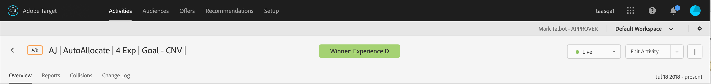

# 自動配分レポートの解釈

[!UICONTROL Adobe Target]の[!UICONTROL 自動配分]A/B アクティビティの結果を、上昇率と信頼性を含む重要な指標を確認して解釈します。

多くのマーケティング担当者は、計算結果によって明確な勝者が示される前に、勝者エクスペリエンスを早めに宣言してしまうというミスを犯します。 [!DNL Target]を使用すると、より簡単に勝者を決定できます。

勝者の宣言に関する一般的な情報については、[A/B テストによくある 10 の落とし穴とその回避方法](/help/main/c-activities/t-test-ab/common-ab-testing-pitfalls.md)を参照してください。

## 勝者エクスペリエンスの特定 {#section_24007470CF5B4D30A06610CE8DD23CE3}

[!UICONTROL 自動割り当て]機能を使用する場合、[!DNL Target]は、アクティビティが十分な信頼性を持ってコンバージョンの最小数に達するまで、「勝者なし」を示すバッジをアクティビティのページの上部に表示します。

明確な勝者が宣言されると、[!DNL Target]には「勝者：エクスペリエンス *X*」と表示されます。

>[!NOTE]
>
>自動配分アクティビティは、コントロールの一対比較だけでなく、すべてのオプションの中で最高のエクスペリエンスを見つけるように設計されています。

## 自動配分の統計的保証 {#section_7AF3B93E90BA4B80BC9FC4783B6A389C}

A/B アクティビティの終了時に、[!UICONTROL 自動配分]は、決定された勝者の実効偽陽性率が5%であることを保証します。 これはその時点のみの 5 ％を意味し、決定された勝者が実際にアクティビティのすべてのエクスペリエンスの中で最高のエクスペリエンスというわけではありません。 [A/A テスト ](/help/main/c-activities/t-test-ab/aa-testing.md) （同じエクスペリエンスを使用）の場合、[!DNL Target]は5%未満の確率でテストを終了します。 （同一のエクスペリエンスでの）A/A テストに対して期待される動作は無期限に実行されることであるので、勝者バッジは決して表示されません。

[!DNL Target]は、[!UICONTROL 自動配分]に対してp値ベースの信頼性を使用しません。

[!UICONTROL 自動配分] アクティビティの[!UICONTROL Confidence]列（下図）には、エクスペリエンスが勝者になる確率が1%の許容誤差で表示されます。 このアルゴリズムでは、最適なコンバージョン率と2番目に高いコンバージョン率の間に、1%の最小検出可能な効果を使用します。 アルゴリズムは[Bernstein Inequality](https://en.wikipedia.org/wiki/Bernstein_inequalities_%28probability_theory%29)を使用して、この確率を計算します。

通常の A/B テストは、p 値に基づいて信頼性を計算します。 [!UICONTROL 自動割り当て]はp値を使用しません。 p 値は、特定のエクスペリエンスが対照と異なる確率を「おおまかに」計算します。 これらの p 値は、エクスペリエンスが対照と異なるかどうかを判定するためにのみ使用できます。 これらの値は、エクスペリエンスが（対照ではない）他のエクスペリエンスと異なるかどうかを判定するためには使用できません。

>[!IMPORTANT]
>
>[!DNL Target]は、事前に定義された最小コンバージョン数の後に勝者を表示します。ただし、勝者を選択する最終的な決定は、常に[!DNL Adobe Target] サンプルサイズ計算ツールの結果に基づいて行う必要があります。 [!DNL Target] では、アクティビティの期間を決定するために、サイトのベースコンバージョン率や、計算ツールに入力されるその他の重要な側面は考慮しません。 その結果、[!DNL Target]は、コンバージョンの最小数に基づいて、保証よりも早い方で勝者を表示する場合があります。 詳しくは、[サンプルサイズ計算ツール](/help/main/c-activities/t-test-ab/sample-size-determination.md#section_6B8725BD704C4AFE939EF2A6B6E834E6)を参照してください。

## [!UICONTROL 自動配分] アクティビティでの上昇率と信頼性のレポートについて {#lift-confidence}

[!UICONTROL 自動割り当て] アクティビティでは、最初のエクスペリエンス（デフォルトではエクスペリエンス A）は常に「[!UICONTROL  レポート ]」タブの「コントロール」エクスペリエンスとして定義されます。 このエクスペリエンスは、エクスペリエンスのパフォーマンスを決定するために使用されるモデリングでは真の統計的コントロールとして扱われませんが、レポート内の一部の図に対する参照またはベースラインとして扱われます。

「上昇率」の数値と各エクスペリエンスの 95％範囲は、常に定義された「コントロール」エクスペリエンスを参照して計算されます。 定義された「コントロール」エクスペリエンスには、それ自体を基準とした上昇率を設定できないので、このエクスペリエンスに対して空の「---」値がレポートされます。 A/B テストとは異なり、[!UICONTROL 自動配分] テストでは、エクスペリエンスが定義されたコントロールよりも悪いパフォーマンスを示した場合、負の上昇率はレポートされません。代わりに、「 – 」が表示されます。

表示される[!UICONTROL 信頼区間] バーは、エクスペリエンスのコンバージョン率の平均推定値に関する95%の信頼区間を表しています。 これらのバーも、定義された「コントロール」エクスペリエンスに関して色分けされています。 「コントロール」エクスペリエンスのバーは、常に灰色で表示されます。 「コントロール」エクスペリエンスの信頼区間の下の信頼区間の部分は赤で色付けされ、「コントロール」エクスペリエンスの上の信頼区間の部分は緑で色付けされます。

勝者は、リーディングエクスペリエンスの95%の[!UICONTROL 信頼区間]が他のエクスペリエンスと重複していない場合に見つかります。 勝者エクスペリエンスには、エクスペリエンス名の左側に緑色の星印が付き、「勝者」のバナーに表示されます。 星が表示されていない場合、バナーには「まだ勝者がありません」と表示され、勝者が見つかっていない状態です。

現在リードしているエクスペリエンス、もしくは勝者のエクスペリエンスの横には「信頼性」の数値もレポートされます。 この数値は、最初のエクスペリエンスの[!UICONTROL Confidence]が60%以上に達するまで報告されません。 [!UICONTROL 自動配分] アクティビティに2つのエクスペリエンスが存在する場合、この数値は、エクスペリエンスが他のエクスペリエンスよりもパフォーマンスが高いという信頼性レベルを表します。 [!UICONTROL 自動配分] アクティビティに2つ以上のエクスペリエンスが存在する場合、この数値は、エクスペリエンスが定義された「コントロール」エクスペリエンスよりも優れたパフォーマンスを発揮しているという信頼性レベルを表します。 「コントロール」エクスペリエンスが勝者である場合、「信頼性」の数値はレポートされません。

## よくある質問 {#section_C8E068512A93458D8C006760B1C0B6A2}

よくある質問に対して、次の回答を検討します。

### アクティビティに入って数日が経過しました。 すべての信頼性の値が 0％のままなのはなぜですか。

レポートですべてのアクティビティの[!UICONTROL 信頼性]列に 0％と表示される理由は、次のうちのいずれかです。

* 手動A/B テストと[!UICONTROL 自動割り当て]では、異なる統計を使用して[!UICONTROL 信頼性]値を表示します。

  手動の A/B テストは、[Welch の t 検定](https://en.wikipedia.org/wiki/Welch%27s_t-test)に基づく p 値を使用します。 p 値は、実際にはそのような違いはないと仮定すると、エクスペリエンスと対照の観測された（またはより極端な）違いの確率です。 これらの p 値は、観測データが、同じ特定のエクスペリエンスおよび対照と一致するかどうかを判定するためにのみ使用できます。 これらの値は、エクスペリエンスが（対照ではない）他のエクスペリエンスと異なるかどうかを判定するためには使用できません。

  [!UICONTROL 自動割り当て]は、特定のエクスペリエンスがアクティビティ内のすべてのエクスペリエンスで真の勝者になる可能性を示します。 勝者エクスペリエンス（勝者になる可能性が最も高い）のみが、ゼロ以外の信頼値を持ちます。 その他の人は敗者になる可能性が最も高く、0%を表示します。

* [!UICONTROL 自動割り当て]は、勝者エクスペリエンスが60%の信頼性を集めた後にのみ、信頼性を示し始めます。 これらの信頼性レベルは通常、通常のA/B テストが完了するまでに要する時間の約半分の時間で表示されます（ただし、この時間枠は保証されません）。 通常のA/B テストを実行する時間を決定するには、[!DNL Adobe Target] [ サンプルサイズ計算](/help/main/c-activities/t-test-ab/sample-size-determination.md#section_6B8725BD704C4AFE939EF2A6B6E834E6)を使用します。プラグコントロールのコンバージョン率は、「ベースラインのコンバージョン率」、「上昇率」は「5%」、「信頼性」は「95%」です。 通常、信頼性は、各エクスペリエンスがエクスペリエンスごとに必要なサンプルの少なくとも 50％ を蓄積した後に表示し始めます。 これは、信頼がいつ現れるかについてのアイデアを提供します。

* レポートがボード全体で 0％を表示している場合、アクティビティに入るのが早すぎた可能性があります。

### [!UICONTROL Analyticsをレポートソース ] （A4T）として使用する[!UICONTROL 自動配分] アクティビティで、「勝者なし」、「勝者」および「スター」バッジを使用できますか？

現在、[!DNL Analysis Workspace]の[!UICONTROL A4T] パネルでは、「まだ勝者なし」および「勝者」バッジは使用できません。 これらのバッジは、同じレポートを [!DNL Target] で表示した場合にも利用できません。 A4Tを使用する[!UICONTROL 自動配分] アクティビティの[!DNL Target] レポートに表示される勝者「星」バッジは無視する必要があります。

この制限と他の注意事項について詳しくは、[!UICONTROL 自動配分]および[!UICONTROL 自動ターゲット ] アクティビティ *の* A4T サポートの[自動配分](/help/main/c-integrating-target-with-mac/a4t/a4t-at-aa.md#aa)を参照してください。

