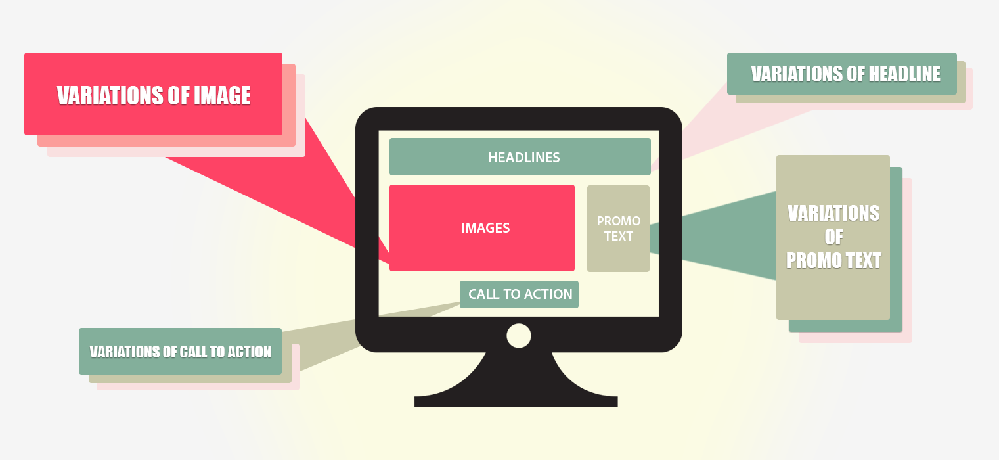

# [!UICONTROL Multivariate Test] の概要

[!DNL Adobe Target]の[!UICONTROL Multivariate Test] （MVT）アクティビティは、ページ上の要素のオファーの組み合わせを比較し、特定のオーディエンスに対してどの組み合わせが最も効果的かを判断します。 [!UICONTROL Multivariate Test] アクティビティは、どの要素がアクティビティの成功に最も影響を与えているかを特定するのにも役立ちます。

多変量テストは、特定の要素がコンバージョンに与える相対的な影響を、ページ上の他の要素と比較して明らかにするのに役立ちます。 多変量テストは、効果的であることが示されている要素の組み合わせを改善するのにも役立ちます。

A/B テストと比較して、[!UICONTROL Multivariate Test]が提供する1つの利点は、ページ上のどの要素がコンバージョンに最も大きな影響を与えているかを示すことができることです。 このメリットは「主効果」とも呼ばれます。 この情報は、例えば、最も注目を集めるコンテンツをどこに配置するかを決定するのに役立ちます。

[!UICONTROL Multivariate Test]のアクティビティは、ページ上の2つ以上の要素の間の複合効果を見つけるのにも役立ちます。 例えば、特定の広告は、特定のバナーやメイン画像と組み合わせると、より多くのコンバージョンを生み出す場合があります。 これは、「交互作用効果」とも呼ばれます。

[!DNL Target] では、コンテンツの最適化に役立つように、全因子多変量分析テストが使用されます。 完全実施要因による多変量分析テストでは、同じ確率でコンテンツのあらゆる可能な組み合わせを調べます。 例えば、それぞれ 3 つのオファーが組み込まれたページ要素が 2 つある場合は、9 つの組み合わせ（3 x 3）になります。 3 つの要素があり、そのうちの 2 つの要素に 3 つのオファーが、1 つの要素に 2 つのオファーが組み込まれている場合は、組み合わせは 18（3 x 3 x 2）になります。

[!DNL Target]では、それぞれの組み合わせが1つのエクスペリエンスです。 [!UICONTROL Multivariate Test]は各エクスペリエンスを比較するので、どの組み合わせが最も効果的かを学習できます。 同時に、データを収集および分析して、各場所およびオファーが成功指標にどのような影響を与えているかを把握できます。

生成できる組み合わせの数が多いため、[!UICONTROL Multivariate Test]はA/B テストよりも多くの時間とトラフィックを必要とします。 各エクスペリエンスに対して統計的に有意な結果を得るためには、ページに十分なトラフィックが必要です。 有益な結果を得るには、ページが受信するトラフィック量を把握し、必要な結果を得るために適切な時間に最適な組み合わせ数をテストする必要があります。

Targetの[Traffic Estimator](/help/main/c-activities/c-multivariate-testing/t-create-multivariate-test/traffic-estimator.md#task_71AA6922AFD447EA8C5E610A78ABA714)は、トラフィックに合ったテストを設計するのに役立ちます。 トラフィック見積もりを使用する前に、サイトで通常発生するインプレッションおよびコンバージョンの数を示す、優れた統計が必要です。 1 日あたりのトラフィックレベルを考慮します。 アクティビティ内のエクスペリエンスが多ければ多いほど、アクティビティに含めるトラフィックが増えるか、アクティビティを実行する時間が長くなります。 トラフィック量が多くない場合は、いくつかの組み合わせをテストする必要があります。そうでない場合、有意義なテスト結果を生成するために必要な時間が長すぎて役に立たない可能性があります。

## MVTの用語 {#section_DF475CA7F34B4CFDB7BE7363761D64AE}

いくつかの基本的な用語を理解しておくと、多変量分析テストを設定する場合に役立ちます。

業界全体で様々な意味で使用されている用語がいくつかあります。 ここでは、[!DNL Target] で使用される用語を定義します。

**組み合わせ：**&#x200B;複数の場所で複数のコンテンツオプションをテストする場合に作成するコンテンツのバリエーション。 例えば、3 つの場所でそれぞれ 3 つのコンテンツオプションをテストする場合、可能な組み合わせは 27（3 x 3 x 3）になります。 サイト訪問者には、ひとつの組み合わせが表示されます。これはエクスペリエンスとも呼ばれます。

**コンテンツ：**&#x200B;ある場所でのテストのバリエーションを構成するテキストまたは画像。 多変量分析テストでは、複数の場所にあるいくつかのコンテンツオプションを比較します。 MVT 手法では、コンテンツは「*レベル*」と呼ばれる場合があります。

**要素：** MVT テストでテストするコンテンツのバリエーションを含む DOM 要素。 *場所*&#x200B;も参照してください。

**場所：**&#x200B;ページ上の特定のコンテンツ領域。多くの場合、単一の DOM 要素に含まれています。 MVT の方法論においては、場所は「*因子*」と呼ばれることもあります。 全因子多変量分析テストでは、場所におけるすべての可能なオファーの組み合わせが比較されます。

## [!UICONTROL Multivariate Test]とA/Bの使用例 {#section_3D2B966B6671406C861A1843EA41D28C}

多変量分析テストは、A/B テストと併用して、ページを最適化することができます。 これらのテストは、次のような場合に併用します。

* ページレイアウトを最適化するにはA/B テストを実施し、その後、MVT テストを実施して、ページの各要素で最適なコンテンツを特定します。

  A/B テストでは、レイアウトについての重要なフィードバックが提供されます。他方、MVT テストは、ページデザインの要素内のコンテンツのテストに優れています。 複数のコンテンツオプションをテストする前に、レイアウトでA/B テストを実行することで、最適なレイアウトと最も効果的なコンテンツを決定できます。

* MVT テストを使用してどの要素が最も重要かを判断し、その後その要素に絞って A/B テストを実行します。

  エクスペリエンスの数が5を超え、2つ以上の要素にまたがる場合は、A/B テストを実行する前にMVT テストを検討することをお勧めします。 MVT テストによって、コンバージョンが向上する可能性が最も高そうなページ領域を判定できます。 マーケティング担当者は、これらの要素に重点を置いてテストをおこなうことができます。 例えば、MVT テストによって、目標を達成するための最も重要な要素がコールトゥアクションであることがわかります。 目標を達成するのに最も役立つ要素とコンテンツを決定したら、A/B テストを実施して、結果をさらに絞り込むことができます。 例えば、2つの特定の画像を比較したり、call to actionの文言や色を比較したりできます。 MVT テストの後に 1 つ以上の A/B テストをおこなうことで、目的の結果を得るための最良のコンテンツを判断できます。

## 注意点 {#section_979FE3F398654C1EA1C86E7DBC9A8DAD}

* MVT テストは、テストする要素が 3 つ以上ある場合に使用します。 3 つ未満の場合は、一連の A/B テストを実行します。
* 結果に最も大きな影響を与えると思われるページ要素を選択します。
* 1 つのテストに組み込む要素や場所の数が多くなりすぎないようにします。 数値が大きいほど、テスト期間が長くなります。
* 事前にテスト設計を計画しておきます。 本番稼働後にデータの収集と分析が開始された場合は、テストを編集しないでください。
* 要素は互いに独立している必要があります。

  例えば、同じテスト内でレイアウトとコンテンツをテストしないでください。

* エクスペリエンスの数が多くなるので、計画段階でテストに十分な時間を割り当て、品質を確保します。 多変量分析テストで必要なトラフィック量を減らすために、一部要因テストを使用することもできます。 詳しくは、以下の部分的要因テストを参照してください。

## 部分的階乗テスト

[!DNL Target] では、全因子多変量分析テストがビルトインアクティビティオプションとして用意されています。 統計では，
「実験の設計」は、どの要因が結果に影響を与えるかを決定するために、多くのアプローチや設計を提供します。 そのようなアプローチの1つが、部分的要因テスト用の[Taguchi Method](https://en.wikipedia.org/wiki/Taguchi_methods)です。 Taguchiを使用すると、マーケターはテストが必要なエクスペリエンスの順列数を減らし、多変量テストのトラフィック要件を減らす一連の仮定を作成できます。 この機能とテストのアプローチは、この[ オフラインスプレッドシート ](/help/main/assets/MVT-Taguchi-Partial-Factorial-Design-02102017.xlsx)を使用して[!DNL Target]に適用できます。

チームで他の実験計画法アプローチを使用している場合は、この計算スプレッドシートをカスタム実験デザインのリファレンス実装として使用できます。

オフライン計算スプレッドシートを使用する際は、次のヒントを考慮してください。

* 変更するエレメントと、各エレメントのバージョン数（3x2、4x3など）を選択します。
* 番号付けの方法には一貫性を持たせます。 例えば、ボタンが要素 1 で、オプションが青、緑、黄の場合、青色のボタンを 1-1、緑色のボタンを 1-2、黄色のボタンを 1-3 とします。
* オフラインスプレッドシートには、必要になるエクスペリエンスの数が示されています（例えば、3x2 の場合は 4 つ、4x3 の場合は 9 つ）。
* [Visual Experience Composer（VEC）](/help/main/c-experiences/experiences.md)を使用して A/B ワークフローのエクスペリエンスを構築します。 カスタムコードの使用、HTML の編集、WYSIWYG または任意の組み合わせを使用できます。
* アクティビティが終了したら（サンプルサイズ計算ツールに基づいて）、スプレッドシートを通じて結果を実行し、他の詳細を確認します。

その他の考慮事項およびベストプラクティスについては [、多変量分析テストのベストプラクティス](/help/main/c-activities/c-multivariate-testing/best-practices.md#reference_53635817FFB741EF8C4E56CC70688EDD) を参照してください。

## トレーニングビデオ

以下のビデオは、この記事で説明した概念についてさらに詳しく説明しています。

### アクティビティの種類（9:03） 

この概要ビデオでは、[!DNL Target]で使用可能なアクティビティの種類について説明します。 多変量テストについては、4:20から説明します。

* [!DNL Adobe Target] に含まれるアクティビティタイプの説明
* 目標達成に適したアクティビティタイプの選択
* すべてのアクティビティタイプを対象とする、ガイド付き 3 ステップワークフローの説明

>[!VIDEO](https://video.tv.adobe.com/v/17386)

### 多変量テストの作成（9:25） 

このビデオでは、[!DNL]Targetの3段階のガイド付きワークフローを使用して、多変量テストを理解、計画、作成する方法を説明します。

* 多変量分析テストの定義と設計
* 多変量分析テストの作成

>[!VIDEO](https://video.tv.adobe.com/v/17395)
