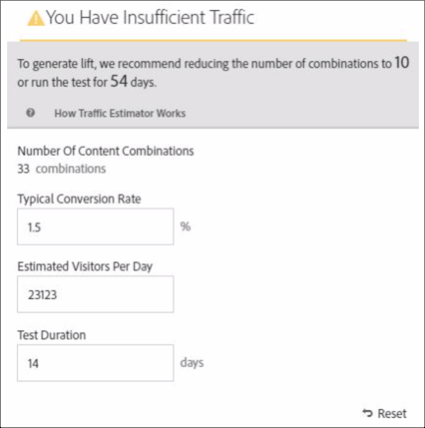
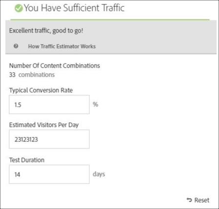

# 多変量分析テストの作成

[!DNL Adobe Target]の[!UICONTROL Visual Experience Composer] （VEC）を使用すると、[!UICONTROL 多変量テスト &#x200B;]を簡単に作成し、[!DNL Target]内のページの一部を変更できます。

[!DNL Target]のポイント&amp;クリック エディターを使用すると、任意の場所を選択して複数のオファーを追加できます。

[!UICONTROL 多変量テスト &#x200B;] （MVT）は、ページファースト レポートを受け取ります。 つまり、テストは特定の URL に対して実行され、そのページに対して設計されたエクスペリエンスが表示されます。

1. 「**[!UICONTROL アクティビティを作成]**」 > 「**[!UICONTROL 多変量テスト]**」をクリックします。

   

   >[!NOTE]
   >
   >[!DNL Target] で使用できる様々なアクティビティタイプおよびその違いについて詳しくは、[アクティビティ](/help/main/c-activities/activities.md#concept_D317A95A1AB54674BA7AB65C7985BA03)を参照してください。 ニーズに最も適したアクティビティタイプを決定するのに役立つ情報については、[Target アクティビティタイプ](/help/main/c-activities/target-activities-guide.md)を参照してください。

1. （条件付き）配信タイプを選択：[!UICONTROL Web]、[!UICONTROL Mobile]、[!UICONTROL Email]、または[!UICONTROL Other/API]。

1. （条件付き）お客様が[Target Premium](/help/main/c-intro/intro.md#premium)のお客様の場合は、[&#x200B; ワークスペースを選択してください](/help/main/administrating-target/c-user-management/property-channel/property-channel.md)。

1. [&#x200B; テストするページのURL &#x200B;](/help/main/c-activities/c-multivariate-testing/t-create-multivariate-test/url.md#concept_C12E4A85FF3B4E518E3110F6CF1AF9C0)を指定し、**[!UICONTROL 次へ]**&#x200B;をクリックします。

   >[!NOTE]
   >
   >最初に、HTTPまたはHTTPSを含む完全なURLを使用します。

   ブラウザーで混合コンテンツを有効にするように求めるメッセージが表示された場合は、メッセージの指示に従います。 ブラウザーで混合コンテンツを有効にした後、再度手順 1 から開始します。

   [!UICONTROL Visual Experience Composer]が開きます。

1. アクティビティ名を入力します。

   

   アクティビティ名の先頭に次の文字を使用することはできません：

   | 文字 | 説明 |
   |--- |--- |
   | `=` | イコール |
   | `+` | プラス |
   | `-` | マイナス |
   | `@` | アットマーク |

   アクティビティ名に次の文字シーケンスを含めることはできません。

   | 文字シーケンス | 説明 |
   |--- |--- |
   | ;= | セミコロン、次に等しい |
   | ;+ | セミコロン、プラス |
   | ;- | セミコロン、マイナス |
   | ;@ | セミコロン、記号 |
   | ,= | コンマ、次に等しい |
   | ,+ | コンマ、プラス |
   | ,- | コンマ、マイナス |
   | ,@ | コンマ、記号 |
   | `[`&quot; | 角括弧を開く、二重引用符 |
   | &quot;`]` | 二重引用符、角括弧を閉じる |

1. [それぞれの場所でオファーを作成します](/help/main/c-activities/c-multivariate-testing/t-create-multivariate-test/add-offers.md#concept_DCE6B45C30F7419B8EC17AFDEE8D8AA6)。

   

   以下の種類のオファーを追加できます。

   * HTML
   * 画像
   * テキスト

1. **[!UICONTROL プレビュー]**&#x200B;をクリックして[体験をプレビュー](/help/main/c-activities/c-multivariate-testing/t-create-multivariate-test/preview-experiences.md)します。

   

   各エクスペリエンスを表示し、テストに組み込まないエクスペリエンスを除外できます。 1つ以上のエクスペリエンスを除外するには、目的のチェックボックスを選択し、**[!UICONTROL 除外]**&#x200B;をクリックします。

   

1. [トラフィック見積もりを使用](/help/main/c-activities/c-multivariate-testing/t-create-multivariate-test/traffic-estimator.md#task_71AA6922AFD447EA8C5E610A78ABA714)して、テスト計画の実行可能性をテストします。

   

   以下の図は、アクティビティに十分なトラフィックがないことを示しています。

   

   以下の図は、アクティビティに十分なトラフィックがないことを示しています。

   

1. 「**[!UICONTROL 次へ]**」をクリックして、[!UICONTROL &#x200B; ターゲティング &#x200B;] ページに進みます。

1. アクティビティに参加する資格のある訪問者のオーディエンスおよび割合を選択します。

   

   例えば、すべての訪問者の 50％に参加を制限したり、カリフォルニア州のオーディエンスの 45％に参加を制限したりできます。

   >[!NOTE]
   >
   >既存のオーディエンスの選択に加え、新規のオーディエンスを作成する代わりに、複数のオーディエンスを結合してアドホックな結合オーディエンスを作成することができます。 詳しくは、[複数のオーディエンスの結合](/help/main/c-target/combining-multiple-audiences.md#concept_A7386F1EA4394BD2AB72399C225981E5)を参照してください。

1. [&#x200B; テストの概要](/help/main/c-activities/c-multivariate-testing/t-create-multivariate-test/test-summary.md#reference_971AB225963A4DC18EEB5B0E20F0A4A7)を確認し、必要な変更を加えたら、**[!UICONTROL 次へ]**&#x200B;をクリックします。

1. [テストの目標と設定を指定](/help/main/c-activities/c-multivariate-testing/t-create-multivariate-test/goals-and-settings.md#reference_B25389FD6F3A4989801E740364B089CC)します。

1. 「**[!UICONTROL 保存して閉じる]**」をクリックして、アクティビティを作成します。

## トレーニングビデオ：多変量テストの作成（9:25） 

このビデオでは、[!DNL Target] 3段階のガイド付きワークフローを使用して、多変量テストを計画および作成する方法を説明します。

* 多変量分析テストの定義と設計
* 多変量分析テストの作成

>[!VIDEO](https://video.tv.adobe.com/v/17395)
