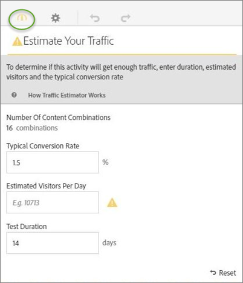
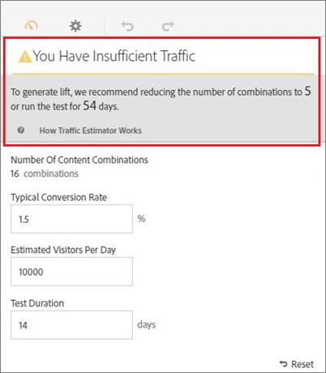
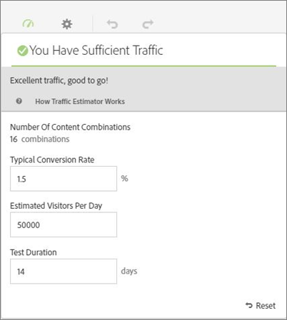

# 成功した[!UICONTROL 多変量テスト ] アクティビティに必要なトラフィックの見積もり

多変量分析テストでは複数のエクスペリエンスを比較するので、有意な結果を得るためにはどの程度のトラフィックが必要かを把握しておくことが重要です。 トラフィック見積もり機能は、ページに関する統計情報とテスト中のエクスペリエンスの数に基づいて、テストを正常に完了させるために必要なトラフィック数とテスト期間を見積もります。

トラフィック見積もりでは、次の条件を満たすために必要なサンプルのサイズを予測します。

* 95%の信頼性。 この統計は、実際の上昇率がない場合に偽陽性を報告する可能性が5% （100% – 信頼性レベル）であることを意味します。
* 統計的に80%のパワー。 この統計は、テストが25%以上の真のリフトを検出する80%の確率を持っていることを意味します。
* 25%の最低の信頼できる検出可能な上昇。 [!DNL Target]は、80%の可能性で25%以上の真のリフトを検出するために必要なトラフィック量を計算します。

このテストでは、ボンフェローニ補正を使用して、多重比較の補正をおこないます。 この方法は保守的な方法として知られていますが、確実に検出可能な最低上昇率を比較的大きく設定することで、バランスをとることができます。

また、トラフィック見積もりでは、設計したテストが成功するために十分なトラフィックがあるかどうかについてのフィードバックも提供されます。

1. [!UICONTROL Visual Experience Composer]から、**[!UICONTROL トラフィック]** アイコンをクリックします。

   トラフィック見積もりが表示されます。 「**[!UICONTROL トラフィック]**」アイコンをもう一度クリックすると、トラフィック見積もりを非表示にできます。

   

1. 「標準的なコンバージョン率」、「推定訪問者数（日単位）」、「テスト期間」を入力します。

   * **[!UICONTROL コンテンツの組み合わせ数]**：除外後にアクティビティの一部として作成されたエクスペリエンスの数に基づいて自動的に計算されます。
   * **[!UICONTROL 一般的なコンバージョン率]**: コンバージョン率は、見積もりまたは分析システムからの過去のデータに基づいて、パーセントで表されます。
   * **[!UICONTROL 1日当たりの推定訪問者数]**：これは、ターゲティング条件に基づいてこのページを表示する可能性の高い訪問者の数です。 この数値は、分析データに基づいて決定することができます。
   * **[!UICONTROL テスト期間]**: アクティビティを実行する日数。

   トラフィック見積もりでは、これらの統計情報を使用して、テストの実行を成功させるために必要な調整の内容を特定します。

   トラフィック見積もりの上部付近に、入力した値に基づく計算結果が表示されます。

   

   数値を変更すると、見積もりも変更されます。 例えば、多数のエクスペリエンスをテストしており、コンバージョン率とインプレッション数が低すぎる場合、トラフィック見積もり機能は、テストを成功させるために実行する必要がある期間を示します。 トラフィック量が非常に低い場合、トラフィック見積もりは、テストの実行期間を希望の日数に抑えるため、エクスペリエンスの数を減らすよう提案することもあります。

   十分なトラフィックがない場合は、次のいずれかまたは両方をおこなうことができます。

   * オファーの組み合わせの数、および場所の数を減らします。
   * テスト期間を長くします。

   十分なトラフィックが確保されるという評価が得られるまで数字を調整し、それに応じて、テストをデザインします。

   
