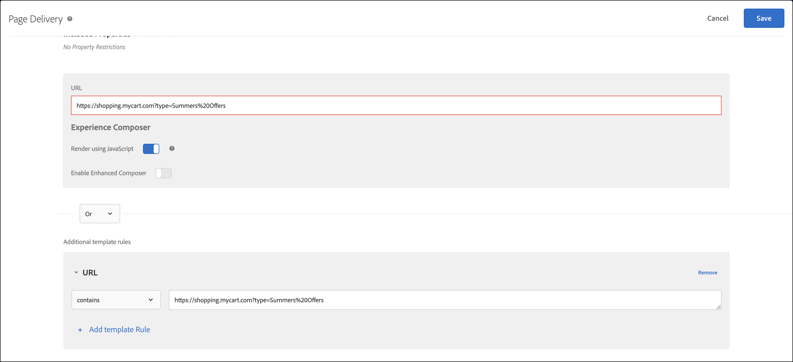

# コンテンツ配信のトラブルシューティング

ページに意図するコンテンツが表示されない場合は、コンテンツ配信をデバッグするためにいくつかの手順をおこないます。

* アクティビティやキャンペーンコードを慎重に確認します。タイポやその他のエラーがあると、意図するコンテンツが表示されない場合があります。
* [!DNL Target] リクエストのトラブルシューティングには、mboxTrace や mboxDebug を使用します。
* Adobe Experience Cloud デバッガーは mboxDebug と同じ情報を入手できる使いやすいツールです。このツールを使用して [!DNL Target] リクエストのトラブルシューティングができます。

mboxDebug は、ページで [!DNL Target] を設定して、Target リクエストが実行され Cookie が設定されたことを確認する場合に特に便利です。ただし、mboxDebug は、コンテンツ配信のデバッグに役立つ詳細までは調べません。ページにアクティビティが表示されない場合や、意図していないコンテンツが表示される場合は、mboxTrace を使用してページの調査とデバッグを詳細におこないます。

## デバッグツールで使用するための認証トークンの取得 {#section_BED130298E794D1FA229DB7C3358BA54}

mboxTrace と mboxDebug は、外部パーティにキャンペーンデータとプロファイルデータを公開するので、認証トークンが必要です。認証トークンは、[!DNL Target] UI で取得できます。トークンは 6 時間有効です。

認証トークンを生成するには、次のいずれかのユーザー権限が必要です。

* [!UICONTROL エディター]権限（または[!UICONTROL 承認者]）以上

   [!DNL Target Standard]ユーザーの詳細については、*ユーザー*&#x200B;の[役割と権限の指定](/help/main/administrating-target/c-user-management/c-user-management/user-management.md#roles-permissions)を参照してください。[!DNL Target Premium]ユーザーの詳細については、[エンタープライズ権限の設定](/help/main/administrating-target/c-user-management/property-channel/properties-overview.md)を参照してください。

* ワークスペース／製品プロファイルレベルでの管理者の役割

   Workspaces は[!DNL Target Premium]のお客様のみが利用できます。詳しくは、 [エンタープライズの権限の設定](/help/main/administrating-target/c-user-management/property-channel/properties-overview.md)を参照してください。

* [!DNL Adobe Target]製品レベルの管理者権限（Sysadmin 権限）

認証トークンを取得するには、次の手順に従います。

1. **[!UICONTROL 管理]**／**[!UICONTROL 実装]**&#x200B;をクリックします。
1. 「Debugger ツール」セクションで、「**[!UICONTROL 新しい認証トークンを生成]**」をクリックします。

   

1. 生成されたトークンをパラメーターとして URL に追加して、高度なデバッグツールの 1 つを有効にします。

   

## mboxTrace {#section_256FCF7C14BB435BA2C68049EF0BA99E}

mboxTrace を使用すると、[!DNL Target] 応答に付属する追跡情報を受信できます。トレース情報は、[!DNL Target] 呼び出し（コンバージョンやインプレッションなど）の結果と、この特定の結果の発生理由を判断するのに役立つことがある追加データ（キャンペーンで選択肢となった使用可能な分岐のセットなど）を反映します。この情報を使用してコンテンツ配信をデバッグします。

次のパラメーターを使用できます。

| mboxTrace のオプション | 結果 |
|--- |--- |
| `?mboxTrace=console` | コンソールログにオブジェクトとして出力します。<br>at.js の場合、mbox.js（現在は非推奨）のように新しいブラウザーウィンドウを開いたりコンソールに出力したりする代わりに、ネットワークリクエストを調べて、「プレビュー」（Chrome）または「レスポンス」（Firefox）を確認する必要があります。 |
| `?mboxTrace=json` | コンソールログにリテラル JSON 文字列として出力します。 |
| `?mboxTrace=window` | ポップアップウィンドウに JSON 文字列として出力します。 |
| `?mboxTrace=disable` | セッションモードのトレースをオフにします。 |

**mboxTrace 呼び出しの例**

`https://www.mysite.com/page.html?mboxTrace=window&authorization=f543abf-0111-4061-9619-d41d665c59a6`

出力には、コンテンツに関する詳細情報が表示されます。mboxTrace は、キャンペーンまたはアクティビティとプロファイルの詳細を表示します。また、実行前のプロファイルのスナップショットと、実行後に変更されたプロファイルのスナップショットも提供します。さらに、各場所で評価されたキャンペーンやアクティビティも表示します。

情報によっては、一致するセグメント、一致しないセグメントおよびターゲット ID が含まれる場合もあります。

* **SegmentId**：セグメントの ID。再利用可能なセグメントライブラリか、特定のキャンペーン用に作成された匿名セグメントのいずれかのものです。
* **TargetId**：ターゲットの ID。ターゲットエクスプレッションライブラリか、キャンペーンの任意のセグメント用の匿名ターゲットのものです。
* **Unmatched**：リクエストは、この呼び出しで、セグメントまたはターゲットに適していませんでした。
* **Matched**：リクエストは、指定されたセグメントまたはターゲットに適していました。

**レコメンデーションページでの mboxTrace の使用**：レコメンデーションを使用したページに mboxTrace をクエリーパラメーターとして追加すると、ページ上の Recommendation のデザインが、mboxTrace の詳細ウィンドウに置き換わり、以下を含むレコメンデーションに関する詳細が表示されます。

* 返されたレコメンデーションと要求されたレコメンデーション
* 使用されたキーと、それがレコメンデーションを生成するかどうか
* 条件によって生成されたレコメンデーションとバックアップレコメンデーション
* 条件の設定
* 適用される除外とインクルージョン
* 収集ルール

クエリパラメーターには、`=console`、`=json`、または `=window` を含める必要はありません。mboxTrace の詳細が完了したら、`=disable` を追加して、**[!UICONTROL Enter]** キーを押すと、通常の表示モードに戻ります。

サイトの通常の機能や外見は、mboxTrace の影響を受けません。訪問者には、通常のレコメンデーションデザインが表示されます。

## mboxDebug {#mboxdebug}

mboxDebug を使用するには、URL の末尾に mboxDebug パラメーターを追加します。[!DNL Target] 応答に関連する URL パラメーターについての情報を次の表に示します。

>[!NOTE]
>
>mboxDebug パラメーターによっては、使用するのに認証を必要とするものと、認証を必要としないものがあります。

| URL パラメーター | 目的 |
|--- |--- |
| `mboxDebug=1` | デバッガー<br>Target リクエストが定義された任意の URL にこのパラメーターを追加すると、ポップアップウィンドウが開き、有用なデバッグ詳細情報が表示されます。Cookie 情報、PCID およびセッション ID の値が記述され、 URL がすべて表示されます。Targe リクエストの URL をクリックすると、その [!DNL Target] リクエストに対する応答を表示できます。詳しくは、[mbox_debug.pdf](/help/main/assets/mbox_debug.pdf) を参照してください。 |
| `mboxDisable=1` | ページ上の mbox を無効化 |
| `mboxOverride.browserIp=<Insert IP address>` | Geotargeting のテスト<br>Geotargeting をこの URL パラメーターでテストします。この属性の値に IP アドレスを入力すると、Test&amp;Target のジオターゲティングがこの IP アドレスを評価し、キャンペーン内のジオターゲティングまたはセグメント化セットに一致させます。 |

>[!NOTE]
>
>URLフラグメントがクエリ文字列パラメーターの後にあることを確認します。最初の `#` の後はすべてフラグメント識別子となり、デバッグパラメーターが正しく機能しません。

## Adobe Experience Cloud デバッガー {#section_A2798ED3A431409690A4BE08A1BFCF17}

Adobe Experience Cloud デバッガーを使用すると、Target の実装をすばやく簡単に理解できます。ライブラリ設定をすばやく表示し、リクエストを検証してカスタムパラメーターが正しく渡されたことを確認し、コンソールのログを有効にして、Target のすべてのリクエストを無効にすることができます。Experience Cloud への認証をおこなうと、強力な MboxTrace ツールを使用して、アクティビティ、オーディエンスの資格情報、訪問者プロファイルを調査できます。

詳しくは、以下のトレーニングビデオを参照してください。

詳しくは、 [Adobe Experience Cloud Debugger を使用した at.js のデバッグ](https://experienceleague.adobe.com/docs/target-dev/developer/client-side/at-js-implementation/functions-overview/target-debugging-atjs.html){target=_blank}.

## Recommendations にトップセラーが表示されない {#section_3920C857270A406C80BE6CBAC8221ECD}

*`SiteCatalyst: purchase`* 呼び出しは、購入アルゴリズムトラフィックデータには使用できません。代わりに、*`orderConfirmPage`* 呼び出しを使用します。

## アクティビティの優先度を確認 {#section_3D0DD07240F0465BAF655D0804100AED}

 [!DNL Target Standard/Premium] で作成されたフォームベースのアクティビティは、優先度が同じで、同じ [!DNL Target] リクエスト使用している [!DNL Target Classic] UI で作成されたアクティビティと競合する場合があります。

## Internet Explorer 8 でカスタムコードが期待どおりの結果を返さない  {#section_FAC3651F19144D12A37A3E4F14C06945}

Target は、IE 8 をサポートしていません。

## Target の Cookie が設定されない {#section_77AFEB541C0B495EB67E29A4475DF960}

サイトにサブドメイン（[!DNL us.domain.com] など）がある場合で Target の cookie を（[!DNL domain.com] ではなく）[!DNL us.domain.com] に設定する必要がある場合、`cookieDomain` 設定を上書きする必要があります。詳しくは、「[targetGlobalSettings（）](https://experienceleague.adobe.com/docs/target-dev/developer/client-side/at-js-implementation/functions-overview/targetglobalsettings.html)」を参照してください。{target=_blank} を参照してください。

## 要素が Adobe Experience Manager パーソナライゼーションにも含まれていると、Target のコンテンツがちらつく、または表示されない。 {#section_9E1DABEB75AB431FB9F09887E6DD07D3}

DOM 要素が Adobe Experience Manager（AEM）パーソナライゼーションのターゲット設定と Target アクティビティの両方に含まれていると、Target コンテンツがちらついたり表示されなかったりする場合があります。

この状況を改善するには、Target が実行されているページで AEM パーソナライゼーションを無効にします。

## URL が無効なのでリダイレクトおよびリモートオファーを配信できない {#section_7D09043B687F43B39DAEDF17D00375AC}

リダイレクトまたはリモートオファーで無効な URL が使用されていると、配信できない可能性があります。

リダイレクトオファーの場合、 [!DNL Target] の応答には `/* invalid redirect offer URL */` を含めることができます

または

リモートオファーの場合、[!DNL Target] の応答には `/* invalid remote offer URL */` を含めることができます

[!DNL Target] 応答をブラウザーまたは mboxTrace で確認できます。有効な URL について詳しくは、[https://tools.ietf.org/html/std66](https://tools.ietf.org/html/std66) を参照してください。

## [!DNL Target] リクエストがサイトで実行されません。

無効な doctype を使用している場合、at.js は Target mbox を実行しません。a.js には HTML5 の doctype が必要です。

## [!DNL Target] アクティビティが、クエリ文字列パラメーターを使用して URL を正しく処理することを確認します。 {#query-strings}

[!UICONTROL アクティビティ URL] は、訪問者をアクティビティの対象に認定し、ユーザーに対するアクティビティエクスペリエンスをレンダリングするページを決定します。アクティビティの作成中にプロンプトが表示された場合、特にクエリ文字列パラメーターを含む URL の場合、完全な URL を入力してもコンテンツがそのサイトページに配信されるとは限りません。

デフォルトでは、[!UICONTROL Visual Experience Composer]（VEC）は [Visual Experience Composer 設定](/help/main/administrating-target/visual-experience-composer-set-up.md)で指定されているページを開きます。アクティビティ作成中に、別のページを指定することもできます。

VEC が開いた後に別のページを表示するには、**[!UICONTROL 歯車の設定アイコン]**&#x200B;をクリックして「**[!UICONTROL ページ配信]**」を選択し、「[!UICONTROL アクティビティ URL]」フィールドに目的の URL を指定します。


URL にクエリ文字列パラメーターが含まれている場合はどうなりますか？そのパラメーターが機能して、パーソナライズされたコンテンツが表示されますか？ このシナリオでは、ターゲットオーディエンスに関係なく、ベース URL に加えて、テンプレートルールを含めてクエリパラメーターを定義できます。

追加のテンプレートルールを含めるには、次のオプションを使用できます。

### オプション 1:URL をレプリケートし、「次を含む」オプションを使用して、テンプレートルールに保持します。

このオプションを使用すると、その URL がアクティビティに適格であることは保証できますが、ベース URL を含む URL にレコードが追加されることで、レポートデータに影響を与える可能性があるコーナーケースが伴うことに注意が必要です。

このシナリオでは、URL は `https://shopping.mycart.com?type=Summers%20Offers` であり、追加のテンプレートルールには同じ URL が含まれ（contains）、OR 演算子で区切られます。



### オプション 2:クエリ文字列のみを使用して、URL の「contains」条件を制限します。

前のオプションで説明したコーナーケースはこのオプションでも当てはまりますが、ここでは、条件付き設定はクエリ文字列にのみに限られます。

このシナリオでは、URL は `https://shopping.mycart.com?type=Summers%20Offers` であり、追加のテンプレートルールにはクエリ文字列のみが含まれ（contains）、OR 演算子で区切られます。


### オプション 3：完全な URL をターゲットにせず、URL の特定の部分を利用する。

このシナリオでは、URL を `https://shopping.mycart.com?type=Summers%20Offers`、追加のテンプレートルールで「[!UICONTROL クエリ]」を[!UICONTROL タイプ] > [!UICONTROL 次と等しい (大文字と小文字を区別)] > type=Summers%20Offers とし、OR 演算子で区切ります。


## での二重引用符のエスケープ [!DNL Target] プロファイル属性値が期待どおりに動作しません。 {#escape}

ダブルコーテーションを含む値を [!DNL Target] プロファイル属性を使用する場合は、次に示すようにダブルエスケープする必要があります。

```
adobe.target.trackEvent({
    "mbox": "data-collection",
    "params":    {
        "profile.tagLine": "Escape \\\"Double Quotes\\\" like this."
    }
});
```

## トレーニングビデオ

以下のビデオは、この記事で説明した概念についてさらに詳しく説明しています。

### 拡張機能の追加

>[!VIDEO](https://video.tv.adobe.com/v/23114t2/)

### Adobe Target の基本的なデバッグ 

>[!VIDEO](https://video.tv.adobe.com/v/23115t2/)

### Mbox Trace 

>[!VIDEO](https://video.tv.adobe.com/v/23113t2/)
