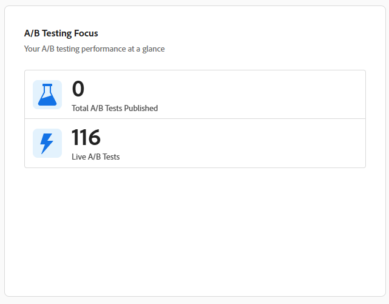

# Adobe Target インサイトダッシュボード

[!UICONTROL Adobe Target Dashboard]は、組織が時間の経過とともにどのように[!DNL Adobe Target]を使用しているかを大まかに示します。 導入、アクティビティ量、テストの使用状況を一目で把握できます。

ダッシュボードは、個々のアクティビティレポートを掘り下げることなく、[!DNL Target]の使用状況をすばやく可視化したい実務担当者と関係者の両方に向けて設計されています。

このダッシュボードを確認する際には、次の点に注意してください。

* 指標には、選択した時間範囲の前に開始したアクティビティや後に終了したアクティビティが含まれます。
* アクティビティは、ライフサイクルに応じて複数の指標でカウントできます（例：公開と完了）。
* ダッシュボードは、パフォーマンスの結果ではなく、利用と導入に焦点を当てます。

詳細な結果、上昇率、または統計的なパフォーマンスについては、[!DNL Adobe Target]内の[個別のアクティビティレポート &#x200B;](../c-reports/reports.md)を参照してください。

## [!UICONTROL Experimentation Accelerator]

ダッシュボードのバナーでは、**[!UICONTROL Experimentation Accelerator]**&#x200B;に直接アクセスできます。これは、実験ワークフローを合理化し、実験の設定、分析、意思決定を簡素化するツールへの簡単なエントリポイントです。

## 時間範囲の選択

ダッシュボードに表示されるデータの範囲を指定するには、期間（先週、昨年、すべての期間など）を選択します。 選択した時間範囲は、ダッシュボードのすべての指標とチャートに一貫して適用されます。

選択した時間範囲で指標を解釈する際には、次の点に注意してください。

* 一部の指標には、その期間の任意の時点で実行されたアクティビティが反映されています。

* また、特定の期間内に作成、公開、完了したアクティビティを反映するものもあります。

* その結果、指標の合計が正確に合計されない場合があります。 例えば、多くのアクティビティを同じ時間枠で開始および完了できます。

ダッシュボードのスナップショットを書き出すには、詳細メニューから「**[!UICONTROL Download as PNG]**」を選択します。

## 指標

ダッシュボードは、指標を4つの補完的なビューに整理し、それぞれ[!DNL Target]の使用状況に関する異なる質問に答えます。[KPI](#kpis)は、アクティビティ数の概要を一目で確認できます。[&#x200B; アクティビティタイプの内訳](#activity-type-breakdown)は、最も頼りにしている機能を示し、[A/B テスト指標](#ab-testing-metrics)は実験の使用状況を詳細に把握できます。[&#128279;](#activities-over-time)選択した時間範囲の範囲範囲の範囲範囲ををを選択範囲ををで選択選択選択選択選択をします。

### KPI

ページ上部のKPI カードを見ると、選択した時間範囲の主要なアクティビティ数をひと目でまとめることができます。 各カードは、アクティビティライフサイクルの異なるステージ、ライブ、変更、終了、公開に焦点を当てるため、全体的な利用状況と勢いを素早く評価できます。

**合計ライブアクティビティ**&#x200B;指標は、選択した時間範囲内の任意の時点でライブだったアクティビティの数を詳細に示します。 アクティビティは、選択した期間の前に開始または後に終了した場合でも、トラフィックを積極的に配信していた場合はライブと見なされます。 この指標を使用して、以下を行います。

* 期間中に[!DNL Target]がどれだけアクティブに使用されたかを理解します。
* パーソナライゼーションとテストの取り組み全体の規模を測定。

**アクティビティのライブまたは変更**&#x200B;指標は、選択した時間枠内にライブ、作成、または変更された組織内のアクティビティの合計数を表します。 この指標を使用して、以下を行います。

* [!DNL Target] アクティビティ ライブラリの全体的なサイズと、使用されているアクティビティの数を把握します。

* テストおよびパーソナライゼーションプログラムの長期的な成長を追跡します。

**終了アクティビティ**&#x200B;指標は、選択した時間範囲内に完了日または終了日に達したアクティビティの数を表します。 この指標を使用して、以下を行います。

* 期間中に完了したアクティビティの数を把握します。
* 完了数の推移を追跡。

**公開済みアクティビティ**&#x200B;指標は、選択した時間範囲内に公開されたアクティビティの数を詳細に示します。 アクティビティが初めて公開されたときに、公開されたとみなされます。 アクティビティがライブになり、停止され、その後に再度ライブになった場合、最初の発生のみが、この指標でカウントされます。 この指標を使用して、以下を行います。

* 新しいアクティビティがどれくらい開始されたかを測定します。
* アクティビティの作成と公開の速度を把握。

### アクティビティタイプの分類

[!UICONTROL Activity Type] チャートには、選択した時間範囲内のタイプ別のライブアクティビティの分布が表示されます。次の項目を含みます。

* [!UICONTROL A/B Test]
* [!UICONTROL Experience Targeting]
* [!UICONTROL Recommendations]
* [!UICONTROL Automated Personalization]
* [!UICONTROL Multivariate Test]

このグラフを使用して、組織が最も利用している[!DNL Target]機能を特定し、実行するアクティビティタイプの組み合わせを広げる機会を見つけます。

### A/B テストの指標

{align="center"}

このセクションでは、**[!UICONTROL A/B Test]** アクティビティに特に関連する使用方法について説明します。

**[!UICONTROL Total live A/B Test activities]**&#x200B;指標は、選択した時間範囲内の任意の時点でライブだった&#x200B;**[!UICONTROL A/B Test]** アクティビティの数を示します。

**[!UICONTROL Total A/B Tests published]**&#x200B;には、選択した期間に公開された&#x200B;**[!UICONTROL A/B Test]**&#x200B;件のアクティビティの数が表示されます。

これらの指標は、A/B テストの使用頻度を把握したり、長期的なテスト件数と導入状況を追跡するために使用できます。

### アクティビティの推移

{align="center"}

**[!UICONTROL Activities Over Time]** グラフは、選択した時間範囲で作成、変更、公開されたアクティビティの数を追跡し、実験プログラムの傾向、スパイク、またはサイレント期間を簡単に検出できます。

