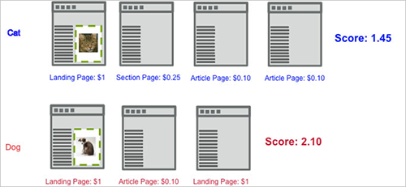
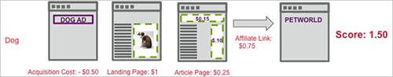

# スコアキャプチャ

[!DNL Adobe Target]のCapture Score エンゲージメント指標は、訪問者が最初にキャンペーンの最初の表示[!DNL Target] リクエストを見た時点から、サイトで訪問したページに割り当てられた値に基づいて集計スコアを計算します。

次の例は、猫の画像と犬の画像の 2 つのエクスペリエンスをテストするキャンペーンのスコアエンゲージメントの計算方法を示しています。

この例では、最初の訪問者は猫のエクスペリエンスを体験します。 グローバル [!DNL Target] リクエストがページの値に基づいてページスコアで合格するとします。 マーケターが`**any Target request**`に関連付けられた成功指標に対するページ数エンゲージメントをキャプチャした場合、訪問スコアは、cat画像の周囲で表示リクエストの後に表示されたリクエストに対して累積されます。

最初のページでは、スコアに1が加算され、2番目のページでは0.25、3番目のページでは0.10、4番目のページでは0.10が加算され、合計は1.45になります。 これは、通貨またはポイントとして解釈できます。 別の訪問では、訪問者は犬のエクスペリエンスを体験します。表示したページは猫のエクスペリエンスよりも少なかったにも関わらず、スコアは 2.10 と高くなっていますが、これは犬のエクスペリエンスの方がページの価値が高いためです。

獲得コストとアフィリエイトリンクの売上高を計算に入れるには、後続のページフローに示すように、adbox とリダイレクターを渡します。 この例では、アーティクルページの両方の[!DNL Target] リクエストでスコアが渡されます。これは、既知のCPMを表している可能性があります。

## ページスコアの割り当て

サイトのページに値を割り当てる場合、自分にとってそのページが持つ価値に基づいて割り当てることができます。 例えば、料理サイトでは、エクスペリエンスのセクションではなく、特集記事ページのほうが広告を高く売ることができるとします。 この場合、特集記事はエクスペリエンスのセクションよりも価値が高くなります。 ページにスコアを割り当てることによって、単にエクスペリエンスを閲覧するだけの訪問者よりも特集記事を読む訪問者の方が高い「ポイント」が得られるように、訪問の総合的な「価値」を作成することができます。

ページにスコアを割り当てるには次の 2 つの方法があります。

* [!DNL Target] リクエストで、`mboxPageValue`という名前のパラメーターを作成します。

  例：`('global_mbox', 'mboxPageValue=10');`

  指定された値は、その[!DNL Target] リクエストを含むページが表示されるたびにスコアに追加されます。 ページ上の複数のリクエストにスコア値が含まれる場合、ページのスコアはすべてのリクエスト値の合計になります。 `mboxPageValue`は、エンゲージメントスコアを取得するためにTarget リクエストで値を渡すために使用される予約パラメーターです。 正の値も負の値も渡される可能性があります。 各訪問者の訪問の最後に合計が計算され、その訪問の合計スコアが算出されます。

* ページの URL で `?mboxPageValue=n` パラメーターを渡します。

  例：`https://www.mydomain.com?mboxPageValue=5`

  このメソッドを使用すると、指定された値がページ上の各[!DNL Target] リクエストのスコアに追加されます。 例えば、パラメーター`?mboxPageValue=10`を渡し、ページに3つの[!DNL Target] リクエストがある場合、ページのスコアは30になります。

>[!NOTE]
>
>アクティビティの最初の表示[!DNL Target] リクエストの上にあるTarget リクエストは、スコアに含まれません。

ベストプラクティスは、[!DNL Target] リクエストで値を割り当てることです。 これにより、各リクエストの内容に応じて、測定する値を正確に把握できます。

>[!NOTE]
>
>メンテナンスを容易にするために、条件付きのJavaScript ロジックを使用して、[!DNL at.js] ファイルでサイトのページスコア値の割り当てを設定できます。 これにより、ページに多くのコードを記述しなくても済みます。 サポートが必要な場合は、担当のアカウントコンサルタントにお問い合わせください。

上記の 2 つの方法を組み合わせることもできますが、スコアは予期したよりも高くなる場合があります。 例えば、3つの[!DNL Target] リクエストのそれぞれに10の値を割り当て、4番目のリクエストにスコアを割り当てなかった場合、URL パラメーター`?mboxPageValue=5`を渡すと、割り当てられた値を持つ3つのリクエストのページスコアは50、30、ページ上の4つのリクエストのそれぞれに5になります。

カウンターは、エントリリクエストではなく、最初の表示リクエストで始まります。 例えば、表示リクエストがないホームページでアクティビティを入力し、表示リクエストを含むカタログページにリンクすると、カタログページに移動したときにカウンターが開始されます。

また、費用がかかるページや訪問者が見る価値のないページには、負の値を割り当てることができます。 負の値もまたスコアの総計に入れられます。 このテクニックを広告から訪問者が移動するページに適用して、CPC の値を判定することができます。 また、訪問者がそのページから連絡をとったり、ヘルプを要求することがわかっている連絡先ページやサポートページに、負の値を割り当てることもできます。
