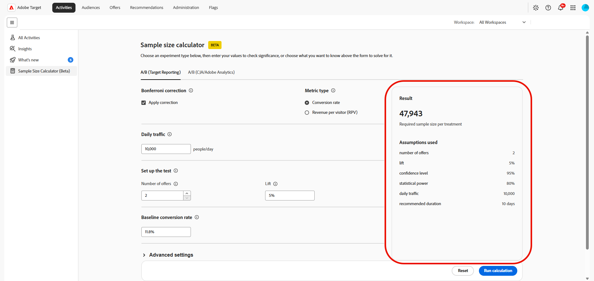

# サンプルサイズ計算ツール

>[!CONTEXTUALHELP]
>id="target_sample_size_ab_daily_traffic"
>title="毎日のトラフィック"
>abstract="1日に何人のユーザーが実験に参加しているか。 この値がわからない場合は、上記のトラフィックボリュームを選択し、計算機は他の入力を使用して解決します。"

>[!CONTEXTUALHELP]
>id="target_sample_size_confidence_level"
>title="信頼性レベル"
>abstract="結果が有意と呼ぶ前にランダムな偶然によるものではないことをどの程度確実にする必要があります。 95％の信頼性レベルとは、偽陽性となる確率が最大で 5％であることを意味します。 値を大きくすると誤検出が減少しますが、より多くのデータが必要になります。"

>[!CONTEXTUALHELP]
>id="target_sample_size_statistical_power"
>title="統計的検出力"
>abstract="ある効果が存在する場合に、実際の効果を検出する確率。 80%の電力レベルは、真の効果を検出する可能性が80%であることを意味します。 パワーを上げることで偽陰性は減りますが、より多くのトラフィックまたは長いランタイムが必要です。"

>[!CONTEXTUALHELP]
>id="target_sample_size_setup_cja"
>title="テストを設定するには："
>abstract="これらのフィールドは、実験、期待される結果、および結果の信頼閾値を定義します。 上記で選択した値に関連付けられたフィールドは自動的に解決されます。残りのフィールドには期待される値を入力します。"

>[!AVAILABILITY]
>
>このサンプルサイズ計算ツール（Beta）を使用することにより、お客様は、Betaが何らの保証もなしに「現状のまま」提供されることを了承するものとします。 Adobeは、Betaを維持、修正、更新、変更、その他の方法でサポートする義務を負いません。 このようなBetaおよび/または付随資料の正しい機能や性能に依存しないように、慎重に使用することをお勧めします。 BetaはAdobeの機密情報と見なされます。  お客様がAdobeに提供する「フィードバック」（Betaの使用中に発生した問題や欠陥、提案、改善、推奨事項を含むがこれらに限定されないBetaに関する情報）は、お客様がそれらのフィードバックに対するすべての権利、権原、利益を含め、Adobeに割り当てられます。

**[!UICONTROL サンプルサイズ計算ツール]**&#x200B;を使用すると、実験を開始する前に、実験の計画に必要な入力を見積もることができます。 計算ツールは、必要なトラフィック量、テストを実行する時間、含めるエクスペリエンス数、提供する値にもとづいて確実に検出できる最小限の効果を判断するのに役立ちます。

**[!UICONTROL サンプルサイズ計算ツール]**&#x200B;にアクセスするには、**[!UICONTROL アクティビティ]** メニューに移動します。

## A/B （ターゲットレポート）

>[!CONTEXTUALHELP]
>id="target_sample_size_bonferroni"
>title="ボンフェローニ補正"
>abstract="信頼性レベルを調整して、複数のオファーを同時にコントロールと比較することを考慮します。 これは、オファーの数が2を超える場合にのみ重要です。 これは、Adobeのパブリックターゲット計算ツールで使用されているものと同じ補正に一致します。"

>[!CONTEXTUALHELP]
>id="target_sample_size_metric_type"
>title="指標タイプ"
>abstract="測定している指標の種類。 クリック数やコンバージョン数など、各ユーザーがアクションを完了または完了しなかったバイナリの結果に対しては、「割合」を使用します。 収益やページビューなどの指標に数値を使用します。この指標では、ユーザーによって値が大きく異なる場合があります。"

>[!CONTEXTUALHELP]
>id="target_sample_size_number_offers"
>title="オファー数"
>abstract="コントロールを含む、実験でのエクスペリエンス数。 2つ以上のオファーが自動的にBonferroni補正（有効になっている場合）を適用し、すべての比較で全体的な信頼性レベルを正確に保ちます。"

>[!CONTEXTUALHELP]
>id="target_sample_size_lift"
>title="上昇率"
>abstract="検出するベースラインに対する相対的な改善。 ベースラインに対する割合として入力します。 例えば、ベースラインのコンバージョン率が11.8%増加して5%増加すると、12.39%が目標となります。"

>[!CONTEXTUALHELP]
>id="target_sample_size_baseline_conversion_rate"
>title="ベースラインコンバージョン率"
>abstract="実験開始前の現在のコンバージョン率、つまりコントロールアームの平均です。 この値は常に必要です。 パーセンテージ指標には、5%に5%などのパーセンテージを入力します。 カウント指標の場合は、小数値をそのまま入力します。"

A/B テストの計画と実行に必要な入力を推定します。 これらの値は、必要なトラフィック量、テストを実行する時間、現実的に検出できる効果サイズを決定するのに役立ちます。

1. 「**[!UICONTROL A/B （ターゲットレポート）]**」タブにアクセスして、A/B テストの計画入力を計算します。

1. **[!UICONTROL 修正を適用]** オプションを有効にして、複数のオファーを同時にコントロールと比較することを考慮して、信頼性レベルを調整します。

1. **[!UICONTROL 指標タイプ]**&#x200B;を選択します。

   * コンバージョン率：クリック数や購入数などのバイナリ結果で、各訪問者がアクションを完了するか、完了しないかの判断に使用します。
   * 訪問者あたりの売上高：この指標は、訪問者ごとに値が大きく異なる収益スタイルの指標に使用します。

     

1. 実験に参加するユーザーの数である&#x200B;**[!UICONTROL 毎日のトラフィック]**&#x200B;を指定します。

1. **[!UICONTROL テストの設定]**&#x200B;で、残りの値を入力します。

   * **[!UICONTROL オファー数]**：コントロールを含む、実験のエクスペリエンス数。 2つ以上のオファーが有効になっている場合、Bonferroni補正を適用して、全体的な信頼性レベルを維持します。

   * **[!UICONTROL 上昇率]**：検出するベースラインに対する相対的な改善率。 たとえば、ベースラインのコンバージョン率が11.8%で、目標の5%が12.39%に上昇するとします。

     

1. 実験を開始する前に、現在のエクスペリエンスの&#x200B;**[!UICONTROL ベースラインのコンバージョン率]**&#x200B;を指定します。

1. **[!UICONTROL 詳細統計設定]**&#x200B;を展開して、選択した計算に使用できる追加の統計的入力を提供できます。

   * **[!UICONTROL 信頼度]**：結果が偶然によるものではない可能性。 95%のレベルでは、偽陽性の5%の確率が可能です。

   * **[!UICONTROL 統計的検出力]**：実際の効果を検出する可能性。 80%の電力は偽陰性を減らしますが、より多くのトラフィックや時間が必要です。

1. 「**[!UICONTROL 計算を実行]**」を選択して、見積もりを生成します。 「**[!UICONTROL リセット]**」を選択して、現在の入力をクリアし、もう一度開始します。

必須フィールドを入力して計算を実行すると、**[!UICONTROL 結果]** パネルに見積もりが表示されます。 必須フィールドが不完全な場合、パネルは欠落している値の入力を求めるプロンプトを表示します。

計算機は、実験を計画するための推定値を提供します。 その結果を、実験デザイン、予想トラフィック、ベースラインパフォーマンス、統計的要件と組み合わせて、アクティビティの実行時間を決定します。

## A/B （CJA/Adobe Analytics）

>[!CONTEXTUALHELP]
>id="target_sample_size_number_experiences"
>title="エクスペリエンス数"
>abstract="コントロールを含む、実験のバリアント数。 A/B テストは 2 つのアームがあります。 5 つのバリアントにコントロールを加えて、合計 6 つとなります。 統計的検出力を維持するには、アーム数が増えるにつれて、比例してより多くのトラフィックが必要になります。"

>[!CONTEXTUALHELP]
>id="target_sample_size_duration"
>title="A/B テストの期間"
>abstract="実験を行う日数。 実験期間を長くすると、データを収集する時間が増えるので、より小さい効果を確実に検出できます。 期間が短い場合、信頼できる結果を得るには、より大きい効果や、より多くの毎日のトラフィックが必要になります。"

>[!CONTEXTUALHELP]
>id="target_sample_size_expected_improvement"
>title="期待される改善"
>abstract="検出する価値のある最小の改善点、行動する指標の最小の変化。 これは、ベースラインに対する変化率ではなく、割合ポイント単位での上昇幅です。 例えば、ベースラインが 5％で、1％ポイントの上昇率が重要な場合は、1 を入力します。"

>[!CONTEXTUALHELP]
>id="target_sample_size_variance"
>title="分散"
>abstract="平均ではなく、指標の値がどれだけ広がっているのか。 クリック率（主に0秒と1秒）などの指標は通常、バリエーションが少なく、「ユーザーあたりの売上」などの指標は、バリエーションがはるかに多い可能性があります。 わからない場合は、デフォルト値を1のままにします。"

Adobe AnalyticsまたはCustomer Journey Analytics データに依存するA/B アクティビティの計画入力を推定します。 アクティビティを開始する前に、実験サイズ、予想上昇率、テスト期間を定義できます。

1. 「**[!UICONTROL A/B （CJA/Adobe Analytics）]**」タブにアクセスして、A/B テストの計画入力を計算します。

1. **[!UICONTROL 知りたいことは何ですか？]**&#x200B;で、計算機で決定する値を選択します。

   * **[!UICONTROL 期間]**：実験を念頭に置き、実行にかかる時間と実行する価値があるかどうかを確認する必要があります。
   * **[!UICONTROL エクスペリエンスの数]**：実験を実行する場所があり、トラフィックがサポートできる処理の数を把握する必要があります。
   * **[!UICONTROL トラフィック量]**：実験を念頭に置き、統計的有意性を得るために必要な訪問者数を知りたいと考えています。
   * **[!UICONTROL 検出可能な最小の効果]**：実行する実験がありますが、統計的有意性に到達するために必要な上昇率の量を知りたいと思っています。 これにより、テストを実施する価値があるかどうか、計画する価値があるかどうかを評価できます。

   フォーム内のフィールドは、選択した値に応じて変化します。 計算機は、他の入力を使用して、選択した結果を決定します。

   

1. 実験に参加するユーザーの数である&#x200B;**[!UICONTROL 毎日のトラフィック]**&#x200B;を指定します。

1. **[!UICONTROL テストの設定]**&#x200B;で、残りの値を入力します。

   * **[!UICONTROL エクスペリエンス数]**: コントロールを含むバリエーションの数。 バリエーションを増やすとトラフィックが増加します。

   * **[!UICONTROL A/B テストの期間]**：実験を実行する日数。 長いテストは、より小さな効果を検出できます。

   * **[!UICONTROL 期待される改善点]**：実験で生成される改善点です。

   * **[!UICONTROL 分散]**：指標の値の広がり方。 一般的に、クリック率の変動は小さく、ユーザーあたりの売上ははるかに高くなります。 わからない場合は、デフォルト値を1のままにします。

     **[!UICONTROL 分散]**&#x200B;の計算方法については、[Analytics ドキュメント &#x200B;](https://experienceleague.adobe.com/en/docs/analytics/components/calculated-metrics/calcmetrics-reference/cm-functions#variance)を参照してください

     

1. **[!UICONTROL 詳細統計設定]**&#x200B;を展開して、選択した計算に使用できる追加の統計的入力を提供できます。

   * **[!UICONTROL 信頼度]**：結果が偶然によるものではない可能性。 95%のレベルでは、偽陽性の5%の確率が可能です。 信頼度が低いと、必要なトラフィックは少なくなりますが、偽陽性のリスクも高まります。

   * **[!UICONTROL 統計的検出力]**：実際の効果を検出する可能性。 80%の電力は偽陰性を減らしますが、より多くのトラフィックや時間が必要です。

1. 「**[!UICONTROL 計算を実行]**」を選択して、見積もりを生成します。 「**[!UICONTROL リセット]**」を選択して、現在の入力をクリアし、もう一度開始します。

必須フィールドを入力して計算を実行すると、**[!UICONTROL 結果]** パネルに見積もりが表示されます。 必須フィールドが不完全な場合、パネルは欠落している値の入力を求めるプロンプトを表示します。

計算機は、実験を計画するための推定値を提供します。 その結果を、実験デザイン、予想トラフィック、ベースラインパフォーマンス、統計的要件と組み合わせて、アクティビティの実行時間を決定します。
