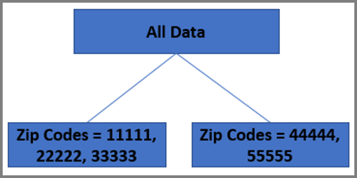
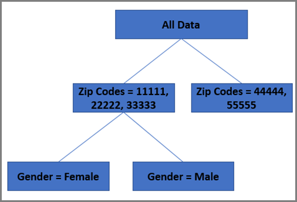
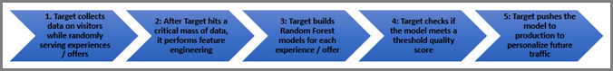

# ランダムフォレストアルゴリズム

（AP）と[!DNL Auto-Target]の両方のアクティビティで使用される主なパーソナライゼーションアルゴリズムは、ランダムフォレストです。 ランダムフォレストなどのアンサンブル手法では、複数の学習アルゴリズムを使用して、任意の構成学習アルゴリズムから得られるよりも優れた予測性能を得ることができます。 [!UICONTROL Automated Personalization]および[!UICONTROL Auto-Target]のランダム フォレスト アルゴリズムは、学習中に多数の決定木を作成することによって動作する分類または回帰方法です。

統計学の観点から見ると、結果の予測に使用される単一の回帰モデルが思い浮かぶかもしれません。 データサイエンスの最新の調査では、同一のデータセットから複数のモデルが構築され、効果的に組み合わせられる「アンサンブル手法」の方が、単一のモデルだけで予測する場合よりも結果が優れていることが示されています。

ランダムフォレスト アルゴリズムは、[!UICONTROL Automated Personalization]および[!UICONTROL Auto-Target]のアクティビティで使用されるパーソナライゼーション アルゴリズムの基礎となる鍵です。 ランダムフォレストは、何百もの決定木を組み合わせて、単一の木が単独で行うことができるよりも優れた予測に到達します。

## 決定木とは？ {#section_7F5865D8064447F4856FED426243FDAC}

ディシジョンツリーの目的は、システムが学習できるすべての利用可能な訪問データを分解し、そのデータをグループ化することです。グループ内の訪問は、目標指標に関して、可能な限り類似しています。 ただし、グループ間で、訪問数は目標指標（コンバージョン率など）に関して可能な限り異なります。 決定木は、トレーニングセットに含まれる様々な変数を調べて、この目標を最大化するために、データをMECE （相互排他的集団的網羅）方式でグループ（または「葉」）に分割する方法を決定します。

簡単な例で、次の2つの入力変数を仮定します。

* 性別（値は男性と女性の 2 つ）
* 郵便番号（小さなデータセットに5つの潜在的な値11111、22222、33333、44444、または55555）

目標指標がコンバージョンである場合、ツリーはまず、2つの変数のうち、訪問データのコンバージョン率の中で最も大きなバリエーションを説明する変数を決定します。

郵便番号が最も予測的だとします。 この変数がデシジョンツリーの最初の「ブランチ」を形成します。 続いて、訪問データをどう分割するかを判断します。各グループ内のレコードのコンバージョン率はできる限り差異が小さく、各グループ間のコンバージョン率はできる限り差異が大きくなるようにするといった具合です。 この例では、11111、22222、33333が1つの分割で、44444と55555が2番目の分割であるとします。

このアクションにより、決定ツリーの最初のレイヤーが作成されます。

決定木は、「最も予測変数は何か？」という質問を投げかけます。 この例では、変数は2つしかないため、ここで答えは明らかに性別です。 ツリーは、各ブランチ内のデータ *を分割する同様の演習を完了するようになりました*。 まず、11111、22222、33333 のブランチを見てみましょう。 これらの郵便番号で、男性と女性でコンバージョン率に差異がある場合は、リーフは男性と女性の 2 つになり、このブランチの処理はそれで完了します。 他の部門、44444と55555では、女性と男性のコンバージョン方法に統計的な違いがないと仮定しましょう。 この場合、1 つ目のブランチが最後の分割となります。

この例の結果は、以下のツリーになります。

## 決定木はランダムフォレストでどのように使用されますか？ {#section_536C105EF9F540C096D60450CAC6F627}

デシジョンツリーは効果的な統計ツールになりますが、 デメリットもあります。 最も大きなデメリットは、データの「オーバーフィッティング」が生じ、1 つのデシジョンツリーで、最初のデシジョンツリーの構築に使用されていない将来のデータの予測精度が悪くなる場合があるという点です。 これは、統計学習における[バイアス／バリアンストレードオフ](https://en.wikipedia.org/wiki/Bias%E2%80%93variance_tradeoff)と呼ばれる問題です。 ランダムな森林は、この過大な課題を克服するのに役立ちます。 ランダムフォレストは簡単に言うと、同一のデータセットを基に、わずかに違う形で構築されたデシジョンツリーの集合で、「投票」によって単一のデシジョンツリーよりも優れたモデルを生成します。 ツリーは、代わりに訪問レコードのサブセットをランダムに選択し（バギングと呼ばれます）、属性のサブセットをランダムに選択することで構築されます。これにより、フォレストは少し異なる決定木で構成されます。 この手法では、ランダムフォレストに構築されたデシジョンツリーにわずかなバリエーションが生まれます。 この適度な量のバリエーションを追加することで、アルゴリズムの予測精度が高まります。

## [!DNL Target] パーソナライゼーションアルゴリズムはランダムフォレストをどのように使用しますか？ {#section_32FB53CAD8DF40FB9C0F1217FBDBB691}

### モデルの構築方法

次の図は、[!UICONTROL Auto-Target]と[!UICONTROL Automated Personalization]のアクティビティに対してモデルがどのように構築されるかを示しています。

{width="650" zoomable="yes"}

1. Adobe Targetは、訪問者に関するデータを収集しながら、ランダムにエクスペリエンスやオファーを提供します
1. [!DNL Target]がクリティカルマスのデータに当たった後、[!DNL Target]は機能エンジニアリングを実行します
1. [!DNL Target]は、各エクスペリエンスまたはオファーに対してランダム フォレスト モデルを構築します
1. [!DNL Target]は、モデルがしきい値の品質スコアを満たしているかどうかを確認します
1. [!DNL Target]は、将来のトラフィックをパーソナライズするためにモデルを実稼動環境にプッシュします

[!DNL Target]は、自動的に収集するデータと、ユーザーから提供されたカスタム データを使用して、パーソナライゼーション アルゴリズムを構築します。 このモデルによって、訪問者に表示する最適なエクスペリエンスやオファーが予測されます。 通常、1つのモデルは、エクスペリエンスごとに（アクティビティが[!UICONTROL Auto-Target]の場合）またはオファーごとに（アクティビティが[!UICONTROL Automated Personalization]の場合）構築されます。 [!DNL Target]は、予測される成功指標が最も高いエクスペリエンスまたはオファー（コンバージョン率など）を表示します。 これらのモデルは、予測に使用する前に、ランダムに割り当てられた訪問を対象にトレーニングをおこなう必要があります。 そのため、アクティビティが開始されると、パーソナライゼーションアルゴリズムの準備が整うまで、パーソナライズ対象のグループに入っている訪問者にも複数のエクスペリエンスまたはオファーが配信されます。

各モデルは、アクティビティで使用する前に、訪問者の行動を予測するのに役立つように、検証する必要があります。 モデルは、曲線の下の領域（AUC）に基づいて検証されます。 そのため、検証が不可欠です。パーソナライズされたエクスペリエンスの提供をモデルが開始する正確な時間は、データの詳細によって異なります。 トラフィックのプランニングの観点からの目安としては、モデルが有効になるまでには、最低限のコンバージョン数が必要になるのが一般的です。

エクスペリエンスまたはオファーのモデルが有効になると、エクスペリエンスまたはオファー名の左にある時計のアイコンが緑色のチェックボックスに変わります。 少なくとも2つのエクスペリエンスやオファーに有効なモデルがあると、一部の訪問がパーソナライズされ始めます。

### 機能変換

データはパーソナライゼーションアルゴリズムに送られる前に、特徴変換がおこなわれます。特徴変換は、パーソナライゼーションモデルで使用するために、トレーニングレコードの収集データを準備する処理です。

特徴変換は属性のタイプによって異なります。 属性（データサイエンティストは「特徴」と呼ぶこともあります）は次の 2 種類に大別されます。

* **分類：**&#x200B;分類特徴はカウントできませんが、様々なグループに分類できます。 分類特徴には、国、性別、郵便番号などがあります。
* **数値：**&#x200B;数値特徴は測定やカウントが可能で、年齢や収入などがあります。

分類特徴の場合、可能なすべての特徴のセットが保持され、尤度変換を使用してデータサイズが低減されます。 数値フィーチャの場合、リスケールすると、フィーチャがボード全体で同等になります。

### マルチアームドバンディットによる、学習とパーソナライゼーションのバランス

[!DNL Target]には、トラフィックをパーソナライズするために構築されたパーソナライゼーションモデルが用意されているので、今後の訪問者に対して明確なトレードオフが発生します。 現在のモデルにもとづいてすべてのトラフィックをパーソナライズする必要があるか、ランダムなオファーを提供することで、新規訪問者から学び続ける必要があるか？ パーソナライゼーションアルゴリズムによって訪問者に関する新たなトレンドを見つけ出すための学習を常におこないながら、トラフィックの大部分をパーソナライズできれば効果的です。

マルチアームバンディットは、[!DNL Target]がこの目標を達成するのにどのように役立つかです。 マルチアームバンディットでは、モデルは常にトラフィックのごく一部を「消費」して、アクティビティ学習の全期間を通じて学習を継続し、それまでに学習したトレンドの乱用を防止します。

データサイエンスの世界では、マルチアームドバンディット問題は、それぞれ報酬の確率が未知の1つのアームドバンディットのコレクションが与えられる探査と搾取のジレンマの典型的な例です。 重要なのは、プレーの成功率が最も高く、受け取られる報酬の合計が最大となるアームを生む戦略を開発することです。 マルチアームドバンディットは、オンラインモデルの構築後、オンラインスコアリングにシステムで使用されます。 このプロセスは、探索中のオンライン学習に役立ちます。 現在のマルチアームドアルゴリズムはイプシロン（ε）の欲張りアルゴリズムである。 このアルゴリズムでは、確率 1- ε の場合に、最適なアームが選択され、 確率 ε の場合は、その他のアームがランダムに選択されます。
