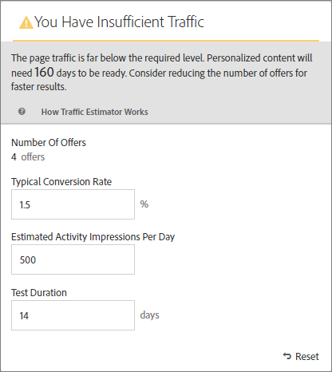
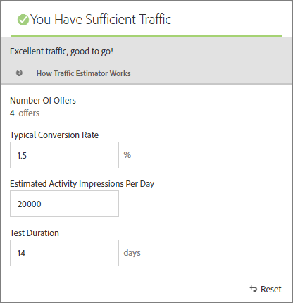

# 成功のために必要なトラフィックの見積もり

[!DNL Adobe Target] [!UICONTROL Traffic Estimator]は、[!UICONTROL Automated Personalization] （AP）アクティビティを成功させるのに十分なトラフィックがあるかどうかを確認するためのフィードバックを提供します。

[!UICONTROL Automated Personalization]のアクティビティでは、複数のオファーの組み合わせを使用するため、有意義な結果を提供するために必要なトラフィック量を把握することが重要です。 [!UICONTROL &#x200B; トラフィック見積もり]では、ページとテスト中のエクスペリエンスの数に関する統計を使用して、アクティビティを成功させるために必要なトラフィック量とテスト期間を見積もります。

[!UICONTROL Traffic Estimator]は、ページの推定ページのインプレッション数と一般的なコンバージョン率を比較することで、パーソナライズされたモデルを生成するのに十分なトラフィックがあるかどうかを判断します。 アクティビティの成功のためには、パーソナライズされたコンテンツがアクティビティ期間の 50％以内または 14 日以内（どちらか短い方）に準備されるようなサンプルサイズにするのが理想的です。 このプロセスにより、パーソナライズされたコンテンツを入手し、どのようなコンテンツを配信すべきかを学ぶのに十分な時間を確保できます。

パーソナライゼーションアルゴリズムが構築されるまで、[!DNL Target]はランダムにエクスペリエンスを提供します。 各オファーの横にあるチェックマークアイコンは、そのオファーのモデルの準備が完了し、[!DNL Target]がパーソナライズされたコンテンツの配信を開始できるタイミングを示します。 上昇率はモデルの準備が整った後にのみ予想されるため、視覚的な表示により適切な期待を設定できます。 [!UICONTROL Visual Experience Composer] （VEC）の[!UICONTROL Traffic Estimator]を使用して、モデルの準備が整ったときのガイドラインを取得します。

## Traffic Estimatorの使用

1. [!UICONTROL Automated Personalization] アクティビティの[!UICONTROL Visual Experience Composer]の[!UICONTROL Experiences] ページで、**[!UICONTROL Traffic]** アイコンをクリックします。

   

   [!UICONTROL Traffic Estimator]が開きます。 「**[!UICONTROL トラフィック]**」をもう一度クリックすると、[!UICONTROL &#x200B; トラフィック見積もり]を非表示にできます。

   

1. 一般的なコンバージョン率（またはこのアクティビティから期待されるコンバージョン率）、1日あたりの推定アクティビティインプレッション数、テスト期間を指定します。

   | 指標 | 説明 |
   | --- | --- |
   | **[!UICONTROL オファー数]** | この指標は、除外後、アクティビティの一部として作成されたエクスペリエンスの数に基づいて自動的に計算されます。 |
   | **[!UICONTROL 一般的なコンバージョン率]** | この指標は、見積もりや分析システムからの過去のデータにもとづいて、パーセントで表されます。 |
   | **[!UICONTROL 1日あたりの推定訪問者数]** | この指標は、ターゲティング条件に基づいて、アクティビティを表示できる訪問者からの1日あたりの訪問数です。 この指標は分析データにもとづいて算出することができます。 この番号はユニーク訪問者ではなく、訪問者数である必要があります。 |
   | **[!UICONTROL テスト期間]** | アクティビティを実行する日数です。 |

   [!UICONTROL Traffic Estimator]は、これらの指標を使用して、テストを成功させるために必要な調整を決定します。

   [!UICONTROL Traffic Estimator]の上部付近で、入力した値が計算され、結果が表示されます。

   

   数値を変更すると、見積もりも変更されます。 例えば、多くの組み合わせをテストしており、コンバージョン率とインプレッション率が低すぎる場合、[!UICONTROL Traffic Estimator]は、テストを成功させるために実行する必要がある期間を示します。 または、トラフィックが少ない場合は、[!UICONTROL Traffic Estimator]でオファーの組み合わせ数が少ないことが示されるので、必要な日数でテストを実行できます。

   十分なトラフィックがない場合は、次の点を考慮してください。

   * [!UICONTROL Automated Personalization]ではなく[自動ターゲット &#x200B;](/help/main/c-activities/auto-target/auto-target-to-optimize.md) アクティビティを使用して、1つのエクスペリエンスのバリエーションで複数のオファーの変更を含むエクスペリエンスを作成することを検討してください。
   * [!UICONTROL Automated Personalization] アクティビティ内のオファーの組み合わせ数を減らします。
   * アクティビティの実行期間を長くします。

   [!UICONTROL Traffic Estimator]で十分なトラフィックがあることが示されるまで数値を調整し、それに応じてテストを設計します。

   十分なトラフィック メッセージを示す

   トラフィックが十分な場合は、[!UICONTROL &#x200B; トラフィック &#x200B;] アイコンに緑色のチェックが表示されます。 トラフィックが不十分な場合は、赤の警告ラベルが表示されます。

## Traffic Estimatorに関するよくある質問

[!UICONTROL Traffic Estimator]を使用する際には、次のFAQを検討してください。

### AP アクティビティに十分なトラフィックがあるにもかかわらず、パーソナライズされたモデルが構築されないのはなぜですか？

特定の状況では、トラフィックはパーソナライズされたモデルを構築するのに十分な大きさになりますが、そのトラフィックは、パーソナライズされたモデルとランダムの間に意味のある違いがないことを[!DNL Target]に通知する可能性があります。 モデルは[!DNL Target]に組み込まれてテストされていますが、モデルがランダムよりも優れているわけではないため、デプロイされません。

モデルがランダムよりも優れていない理由として、オファーが互いに十分に異なっていないことが考えられます。 その場合は、メッセージが類似している場合は、オファーをより視覚的に異なるように設定するか、メッセージ自体を変更してみます。
