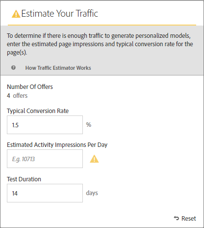

# 成功のために必要なトラフィックの見積もり

この [!DNL Adobe Target] [!UICONTROL トラフィック見積もり] は、 [!UICONTROL Automated Personalization] アクティビティが成功しました。

理由： [!UICONTROL Automated Personalization] アクティビティでは複数のオファーの組み合わせを使用します。意味のある結果を得るために必要なトラフィック量を把握することが重要です。 この [!UICONTROL トラフィック見積もり] は、ページに関する統計とテスト中のエクスペリエンスの数を使用して、アクティビティを成功させるために必要なトラフィック量とテスト期間を見積もります。

この [!UICONTROL トラフィック見積もり] は、ページの推定ページインプレッション数と通常のコンバージョン率を比較することで、パーソナライズされたモデルを生成するのに十分なトラフィックがあるかどうかを判断します。 アクティビティの成功のためには、パーソナライズされたコンテンツがアクティビティ期間の 50％以内または 14 日以内（どちらか短い方）に準備されるようなサンプルサイズにするのが理想的です。このプロセスにより、パーソナライズされたコンテンツを取得し、どのコンテンツを配信するかを学習するのに十分な時間を確保できます。

次の点に注意してください。 [!DNL Target] パーソナライゼーションアルゴリズムが構築されるまで、エクスペリエンスをランダムに提供します。 各オファーのモデルが準備でき、 [!DNL Target] は、パーソナライズされたコンテンツの配信を開始できます。 モデルが準備完了になった後にのみ指標の上昇が期待されるので、視覚的な表示によって、適切に予想を立てることができます。以下を使用： [!UICONTROL トラフィック見積もり] 内 [!UICONTROL Visual Experience Composer] (VEC) を使用して、モデルの準備が整った時点に関するガイドラインを取得できます。

## トラフィック見積もりの使用

1. 次の [!UICONTROL Visual Experience Composer]をクリックし、 **[!UICONTROL トラフィック]**.

   

   この [!UICONTROL トラフィック見積もり] が開きます。 次をクリックできます。 **[!UICONTROL トラフィック]** 再び隠す [!UICONTROL トラフィック見積もり].

   

1. 標準コンバージョン率（このアクティビティで期待できるコンバージョン率）、アクティビティの 1 日あたりの推定インプレッション数、テスト期間を指定します。

   | 指標 | 説明 |
   | --- | --- |
   | **[!UICONTROL オファー数]** | この指標は、除外後に、アクティビティの一部として作成されるエクスペリエンスの数に基づいて自動的に計算されます。 |
   | **[!UICONTROL 標準的なコンバージョン率]** | この指標は、推定または分析システムの過去のデータに基づき、パーセンテージで表されます。 |
   | **[!UICONTROL 1 日あたりの推定訪問数]** | この指標は、ターゲットの条件に基づいて、アクティビティを表示できる訪問者の 1 日あたりの訪問数を示します。 この指標は、分析データに基づいて設定できます。 この数は、個別訪問者数ではなく、訪問数にする必要があります。 |
   | **[!UICONTROL テスト期間]** | アクティビティを実行する日数です。 |

   この [!UICONTROL トラフィック見積もり] では、これらの指標を使用して、テストを正常に実行するために必要な調整を判断します。

   の上部付近 [!UICONTROL トラフィック見積もり]入力した値が計算され、結果が表示されます。

   

   数値を変更すると、見積もりも変更されます。例えば、多くの組み合わせをテストしていて、コンバージョン率とインプレッション数が低すぎる場合、 [!UICONTROL トラフィック見積もり] は、テストを正常に実行するために必要な時間を示します。 また、トラフィックが少ない場合は、 [!UICONTROL トラフィック見積もり] では、オファーの組み合わせの数を減らして、目的の日数でテストを実行できます。

   十分なトラフィックがない場合は、次の点を考慮してください。

   * 使用を検討する [自動ターゲット](/help/main/c-activities/auto-target/auto-target-to-optimize.md) の代わりのアクティビティ [!UICONTROL Automated Personalization] 1 つのエクスペリエンスのバリエーションで、複数のオファーの変更を含むエクスペリエンスを作成する場合。
   * 内でのオファーの組み合わせの数を減らす [!UICONTROL Automated Personalization] アクティビティ。
   * アクティビティの実行期間を長くします。

   数値を [!UICONTROL トラフィック見積もり] は、十分なトラフィックがあることを示し、それに応じてテストを設計します。

   

   トラフィックが十分な場合、 [!UICONTROL トラフィック] アイコンに緑のチェックマークが表示されます。 トラフィックが不十分な場合は、赤の警告ラベルが表示されます。

## トラフィック見積もりに関するよくある質問 (FAQ)

を使用する際は、次の FAQ を考慮してください。 [!UICONTROL トラフィック見積もり]:

### AP アクティビティに十分なトラフィックがあるにもかかわらず、パーソナライズされたモデルが構築されないのはなぜですか。

状況によっては、パーソナライズされたモデルを構築するのに十分なトラフィック量がありますが、そのトラフィックによって [!DNL Target] パーソナライズされたモデルとランダムの間に意味のある違いがないことを モデルは [!DNL Target] モデルはランダムとは異なるので、テスト済みではデプロイされません。

モデルがランダムよりも優れていない理由として考えられるのは、オファーが互いに十分に異なっていないことです。 その場合は、メッセージが似ている場合に、より視覚的に異なるオファーを作成したり、メッセージ自体を変更したりできます。
