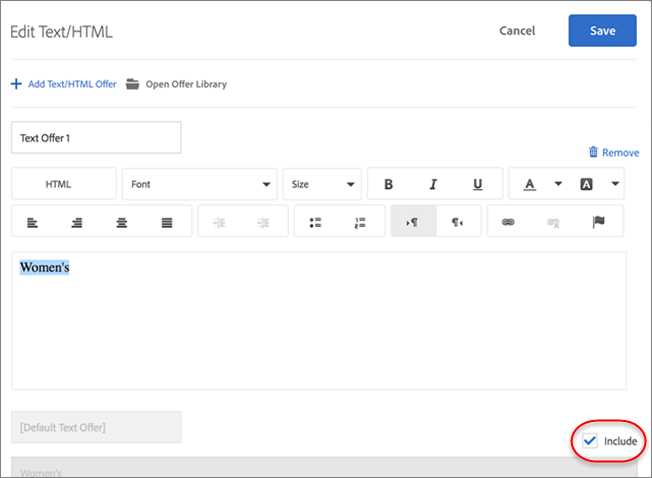

# 除外の管理

[!DNL Adobe Target] の [!UICONTROL Automated Personalization] （AP）アクティビティでの除外グループの作成、重複オファーの除外、特定のエクスペリエンスの除外、デフォルトコンテンツの除外により、除外を管理します。

## 除外グループの作成 {#task_AAAA6C7239A84F7696C8492F04B575A2}

[!UICONTROL Automated Personalization] （AP）アクティビティに除外グループを作成し、指定したオファーを含むエクスペリエンスが自動的に除外されるようにします。

除外グループは、複数の場所における同一のエクスペリエンスで、不適切なオファーが提示されないようにできる便利な機能です。例えば、2 つのオファーがあり、1 つはすべての商品の 20% 割引、もう 1 つは 15% 割引であるとします。 これら 2 つのオファーを、同じエクスペリエンスの訪問者に表示したくはありません。 これらの 2 つのオファーを除外グループに追加する場合は、このような状況が発生しないことを確認できます。

また、どのオーディエンスが AP アクティビティの特定のオファーを表示できるかを制限できます。詳しくは、[Target のAutomated Personalizationオファー](/help/main/c-activities/t-automated-personalization/ap-target-offers.md)を参照してください。

**除外グループを作成する手順は次のとおりです。**

1. [AP アクティビティの作成または編集 ](/help/main/c-activities/t-automated-personalization/create-ap-activity.md) 中に、**[!UICONTROL Manage Content]** アイコン（）をクリックします。

   [!UICONTROL Manage Content] ダイアログボックスが表示されます。

1. 「**[!UICONTROL Experiences]**」タブをクリックします。

1. [!UICONTROL Manage Content] ダイアログボックスで、「**[!UICONTROL Exclusion Groups]**」をクリックします。

   

   以前に作成した除外グループがある場合は、リスト内に表示されます。除外グループをまだ作成していない場合は、作成するよう求められます。

1. **[!UICONTROL Create Exclusion Group.]** をクリック

   

1. （必須）除外グループにわかりやすい名前を付けます。

   わかりやすい名前を付ければ、そのグループをすばやく見つけたり、用途を把握したりしやすくなります。

1. 除外グループに追加するオファーを見つけて選択します。

   除外グループでは同じ場所から複数のオファーを選択できます。

1. **[!UICONTROL Save]** をクリックします。

除外グループのオファーは、今後、同じエクスペリエンスから自動的に除外されます。

## 重複するオファーを除外 {#concept_4EF78013F80E48EFA024AE0274C9F037}

オファーライブラリからのオファーがアクティビティの複数のロケーションで使用される場合に重複 [!UICONTROL Automated Personalization] ないようにします。

例えば、ページ上で 6 つのロケーションと 12 件のオファーがあるアクティビティがあるとします。同じオファーがアクティビティ内の 1 つまたは複数のロケーションに配置される場合があります。この機能では、同一アクティビティ内の別の場所で、重複するオファーが同時に表示されるのを防ぐことができます。

**[!UICONTROL Configure]** 歯車オプション/**[!UICONTROL Duplicate Offers]** をクリックし、「**[!UICONTROL Allow Duplicates]**」または「**[!UICONTROL Disallow Duplicates]**」をクリックします。

## 特定のエクスペリエンスを除外 {#task_C17D36EF58AF4908B17A3D84CA6DE85A}

特定のオファーの組み合わせをエクスペリ [!UICONTROL Automated Personalization] ンスアクティビティから除外したい場合は、特定のエクスペリエンスを除外できます。

連携できない特定の組み合わせがあるか、テストしたエクスペリエンスの数を制限してアクティビティのトラフィック要件を減らしている可能性があります。

1. [AP アクティビティの作成または編集](/help/main/c-activities/t-automated-personalization/create-ap-activity.md)時に、ヘッダーバーの「**コンテンツを管理**」をクリックします。

   

   [!UICONTROL Experiences] のリストには、すべてのコンテンツと場所のオプションの並べ替えから生成された各エクスペリエンスが表示されます。

1. 必要に応じてエクスペリエンスを除外します。

   エクスペリエンスを除外する際は、対象のエクスペリエンスにマウスポインターを置いてから除外アイコンをクリックします。

   

   または、関連するエクスペリエンスのチェックボックスを選択し、ダイアログボックスの右上隅にある「**[!UICONTROL Exclude]**」アイコンをクリックすることで、エクスペリエンスをバッチ除外できます。 1 つ以上のエクスペリエンスがチェックされると、[!UICONTROL Exclude] のアイコンが表示されます。

   

   [!UICONTROL Status] のドロップダウンリストをクリックすると、このリスト表示をフィルタリングして、除外されたアクティビティのみを表示したり、含まれたアクティビティのみを表示したりできます。

   エクスペリエンスがアクティビティから除外され、[!UICONTROL Status] が [!UICONTROL Excluded] のように表示されるようになりました。

   

## デフォルトコンテンツを除外 {#task_DCB4528989DF4C05A3A4729E5891D18F}

デフォルトコンテンツを [!UICONTROL Automated Personalization] アクティビティの一部として含めない場合もあります。 この設定方法は、除外グループの作成方法とは異なります。この方法を使用すれば、ある場所の 1 つのオファー（デフォルトのコンテンツとは異なる）のみを AP アクティビティに含めることができます。

AP アクティビティでテストするオファーに合わせてページの他の部分のデザインを変更したい場合は、デフォルトのコンテンツを除外する方法が効果的です。例えば、テスト対象のオファーのカラーパレットを一致させたい場合は、ページの背景色を変更し、デフォルトの背景色を除外します。

**[!UICONTROL Visual Experience Composer] （VEC）を使用してデフォルトコンテンツを除外するには：**

1. [AP アクティビティの作成または編集 ](/help/main/c-activities/t-automated-personalization/create-ap-activity.md) 中に、置き換えるコンテンツを選択し、クリックして **[!UICONTROL Change Text/HTML]**、**[!UICONTROL Change Image]**、**[!UICONTROL Change Background Color]** にアクセスします。
1. ダイアログボックスで、新しいコンテンツを作成し、デフォルトコンテンツの右側にある **含める** チェックボックスをオフにします（または、[!UICONTROL Select Content] 画面でデフォルトの画像/ビデオのチェックボックスをオフにします）。

   コンテンツやオファーのタイプによって、「[!UICONTROL Include]」チェックボックスは若干異なる場所にあります。

   テキスト／HTML コンテンツの場合：

   

   画像／ビデオコンテンツの場合：

   

   背景色の場合：

   

1. **[!UICONTROL Save]** をクリックします。

   「[!UICONTROL Manage Content]」で指定したオファーから作成されたエクスペリエンスを表示できます。 除外したデフォルトのオファーを使用して、[!UICONTROL Manage Content] でエクスペリエンスが作成されないことに注意してください。

   

**[!UICONTROL Form-Based Experience Composer] を使用してデフォルトコンテンツを除外するには：**

1. AP アクティビティを作成または編集する際に、「**[!UICONTROL Content]**」の下の「**[!UICONTROL Change Text/HTML]**」または「**[!UICONTROL Change Image Offer]**」をクリックします。
1. ダイアログボックスで、新しいコンテンツを作成し、デフォルトコンテンツの右側にある **[!UICONTROL Include]** のチェックボックスをオフにします（または、[!UICONTROL Select Content] の画面でデフォルトの画像/ビデオのチェックボックスをオフにします）。

   コンテンツやオファーのタイプによって、「[!UICONTROL Include]」チェックボックスは若干異なる場所にあります。

   テキスト／HTML コンテンツの場合：

   

   画像／ビデオコンテンツの場合：

   

1. **[!UICONTROL Save]** をクリックします。

   「[!UICONTROL Manage Content]」で指定したオファーから作成されたエクスペリエンスを表示できます。 除外したデフォルトのオファーを使用して、[!UICONTROL Manage Content] でエクスペリエンスが作成されないことに注意してください。

   