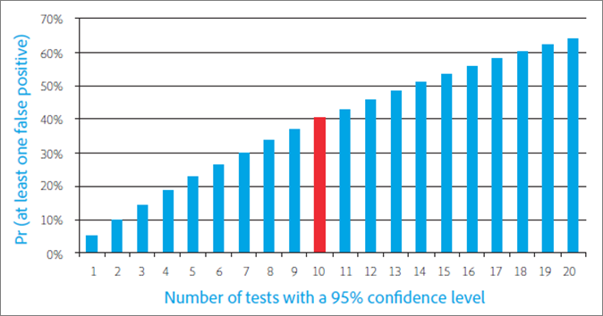

# A/B テストの一般的な 10 の落とし穴と回避方法

[!DNL Adobe Target] フォームでの A/B テストは、ほとんどのデジタルマーケティング最適化プログラムの根幹をなすもので、最適化され、ターゲット設定されたエクスペリエンスを、マーケターが訪問者および顧客に提供するのを支援します。この記事では、A/B テストを実施する際に企業が陥りがちな、最も重要な落とし穴の 10 件について説明します。 また、回避方法についても説明し、会社がテストの取り組みを通じてより優れた ROI を達成し、レポートされた A/B テストの結果の信頼性が高まります。

## 落とし穴 1：有意水準の効果を無視する {#section_55F5577A13C6470BA1417C2B735C6B1D}

2 つのオファーについて、実際にはコンバージョン率に違いがないにもかかわらず、有意な違いがあると報告される可能性はどれくらいあるでしょうか。テストの「*有意水準*」がその判定に役立ちます。このような誤解を招く結果は偽陽性と呼ばれ、統計の世界では I 型エラーと呼ばれます（誤って真の null 仮説を拒否した場合）。

A/B テストの有意水準を指定すると、あるエクスペリエンスが実際とは違い、別のエクスペリエンスよりも優れていると判断されること（第一種過誤または「偽陽性」）に対する許容度と、実際には差異があるのに、エクスペリエンス間に統計的差異がないと見なすこと（第二種過誤または「偽陰性」）に対する許容度との間で、トレードオフを行うことになります。*信頼水準*&#x200B;はテストの前に決定されます。

The *信頼区間*&#x200B;は、テストの完了後に決定され、次の 3 つの主要な要因の影響を受けます。

* テストのサンプルサイズ
* 有意水準
* 母集団の標準偏差

有意水準はマーケティング担当者がテストの作成前に決めます。母標準偏差は調整できません。そのため、「調節可能な」要素はサンプルサイズのみです。適切な信頼区間の決定に必要なサンプルサイズと、そのサンプルサイズに達するまでの時間は、マーケティング担当者がテストの作成時に決める必要がある重要な要素です。

もう 1 つの直接関係する用語、「*信頼水準*」は、より楽観的です。信頼水準は、有意水準と同じように、偽陽性になる可能性を示すのではなく、テストがその誤りを犯さない可能性を示します。

以下に示すように、信頼水準と有意水準は、直接的に関連しています。

100％ - 信頼水準 = 有意水準

A/B テストでは、マーケティング担当者は、多くの場合、95％信頼水準を使用します。前述の方程式に基づいて、5％の有意水準に対応します。95％信頼水準のテストとは、実際にはオファー間に違いがない場合でも、統計的に有意な上昇率が 5％の確率で見つかるという意味です。

次のグラフに示すように、テストを実行する数が多いほど、少なくとも 1 つのテストの結果が偽陽性になる可能性が高くなります。 例えば、95%の信頼水準を使用して 10 個のテストを実行した場合、1 つ以上の偽陽性を検出する可能性が約 40%あります ( 実際には上昇がない場合： Pr（少なくとも 1 つの偽陽性） = 1 - Pr（偽陽性なし） = 1 - 0.95^10 = 40%)。

マーケティング組織では、通常 95%が偽陽性と偽陰性のリスクの間の合理的なトレードオフを構成します。

ただし、テスト後のセグメント化と複数オファーのテストという 2 つの状況のために、有意水準とテスト結果への影響に細心の注意を払う必要があります。

* **テスト後のセグメント化：**&#x200B;マーケティング担当者は、多くの場合、A/B テストが完了した後で訪問者セグメントに基づいてテストの結果を切り刻みます。一般的なセグメントには、ブラウザータイプ、デバイスタイプ、地域、時刻、新規訪問者と再訪問者との比較が含まれます。この方法は、テスト後のセグメント化と呼ばれ、訪問者セグメントに関する優れたインサイトをもたらします。その後、マーケターは、これらのインサイトを使用して、よりターゲットを絞り込み、より関連性の高い、差別化されたコンテンツを作成できます。

  実際にはコンバージョン率に違いがない場合、セグメントをテストするたびに、偽陽性の確率が有意水準に等しくなります。前述のように、テストを実行するほど、テストの中で少なくとも 1 つの偽陽性を経験する可能性が高くなります。 要するに、各テスト後のセグメントは、個別のテストを意味します。有意水準が 5%の場合、20 個のテスト後セグメントを見るたびに、平均で 1 個の偽陽性に陥ります。 上の図には、その可能性がどのように増加するかが示されています。

  テストを実行するほど、テストの中で少なくとも 1 つの偽陽性が発生する可能性が高くなります。 要するに、各テスト後のセグメントは個別のテストを意味し、偽陽性の可能性が高まります。セグメントが相関関係にある場合は、この可能性の向上はさらに重要度が高まります。

  セグメント化のテスト後に実行しないでください。 そうではなく、テスト後のセグメントは有益です。代わりに、テスト後のセグメント化によるこの累積的な偽陽性の問題を回避するために、テスト後のセグメントを識別したら、新しいテストとして行うものと見なします。もう 1 つの方法として、次に説明する、ボンフェローニ補正を適用することもできます。

* **複数オファーのテスト：**&#x200B;マーケティング担当者は、2 つ以上のオファー（またはエクスペリエンス）を相互にテストすることがよくあります。これが、A/B/n テストと呼ばれる A/B テストソリューションを見かけることがある理由です（n は同時にテストしているオファーの数）。

  前述のとおり、テストした&#x200B;*各*&#x200B;オファーは、偽陽性率が有意水準と等しくなることに留意することが重要です。さらに、1 つのテスト環境内で複数のオファーが相互に対抗している場合、複数のテストを効率的に実行しています。例えば、A/B/C/D/E テストで 5 つのオファーを比較する場合、制御オファーと B、制御オファーと C、制御オファーと D、制御オファーと E の 4 つの比較を効率的に形成します。95％の信頼水準の場合、偽陽性の確率の 5％ではなく、実際は 18.5％になります。

  全体的な信頼水準を 95％に維持し、この問題を回避するには、ボンフェローニ補正というものを適用します。この修正を使用すると、有意水準を比較数で割るだけで、95%の信頼水準を達成する必要がある有意水準を算出できます。

  ボンフェローニ補正を前述の例に適用すると、5％/4 = 1.25％の有意水準を使用することになります。これは、個別のテストの信頼水準 98.75％と同じです（100％ - 1.25％ = 98.75％）。この調整により、説明した例のように、4 つのテストがある場合の有効信頼水準を 95％に維持します。

## 落とし穴 2：統計的に有意な違いのない複数のオファーのテストの勝者を宣言する {#section_FA83977C71DB4F69B3D438AF850EF3B6}

複数のオファーのテストでは、マーケティング担当者は、多くの場合、勝者と 2 番の間に統計的に有意な違いがないとしても、最も高い上昇率を示すオファーをテストの勝者と宣言します。この状況は、代替オファー間の違いが代替オファーと制御オファーの間の違いよりも小さい場合に発生します。下の図に、この概念を示します。黒いエラーの線は、上昇率の95％信頼区間を示します。制御オファーに対する各オファーの真の上昇率は、信頼区間（エラーの線で示される範囲）内に含まれ得る 95％です。

オファー A と B はテスト中に最も高い上昇率を観測し、C の信頼区間が A または B の信頼区間と重複しないので、オファー C が将来のテストでこれらのオファーを上回る可能性は低くなります。ただし、テスト中にオファー A の上昇率が最も高く見られたとしても、信頼区間が重なるので、将来のテストでオファー B のパフォーマンスが向上する可能性があります。

ここで覚えておくべきことは、オファー A および B の両方がテストの勝者と見なされる必要があるということです。

通常、代替オファーの真の相対的パフォーマンスを特定するのに十分な時間テストを実行することは実現不可能であり、多くの場合、代替オファー間のパフォーマンスの違いは小さすぎてコンバージョン率に十分な影響を与えられません。そのような場合、結果を同順位として解釈し、戦略やページの他の要素の配置など、他の考慮事項を用いて、実装するオファーを判定できます。複数のテストを使用する場合、複数の勝者に公開する必要があります。その結果、Web サイトの開発に伴い、方向性の可能性が大きく広がる場合があります。

コンバージョン率が最も高いオファーを識別したい場合は、他のすべてのオファーとすべてのオファーを比較します。 前述の例では、n = 5 つのオファーがあり、n（n-1）/2 回、または 5 &#42;（5-1）/2 = 10 回比較する必要があります。この場合、ボンフェローニ補正では、テストの有意水準が 5％/10 = 0.5％になることが求められます。これは 99.5％の信頼水準に対応します。ただし、このような高い信頼水準では、不当に長い期間テストを実行する必要が生じる場合があります。

## 落とし穴 3：統計的検出力の効果を無視する {#section_0D517079B7D547CCAA75F80981CBE12A}

統計的検出力とは、オファー間のコンバージョン率の実際の違いをテストで検出する確率です。 ランダムな場合、または統計学者が「確率論的」と呼ぶようなコンバージョンイベントの性質上、最終的に 2 つのオファー間のコンバージョン率に実際の違いが存在する場合でも、テストでは、統計的に有意な違いを示さない場合があります。 それを不運または偶然といいます。コンバージョン率の真の違いの検出に失敗することは、偽陰性または第二種過誤と呼ばれます。

テストの有効性を決める要素は 2 つあります。1 つ目は、サンプルサイズ、つまり、テスト対象とする訪問者数です。2 つ目は、テストで検出するコンバージョン率の違いの大きさです。 おそらくこれは直感的ですが、大きなコンバージョン率の違いのみを検出したい場合は、テストが実際にそのような大きな違いを検出する可能性が高くなります。 そうすると、検出したい違いが小さければ小さいほど、大きなサンプルサイズが必要となり、そのサンプルサイズに到達するための時間も長くなります。

今日のマーケティング担当者は、非常に多くのテストで検出力が不足しています。つまり、使用しているサンプルサイズが小さすぎます。これは、実際にコンバージョン率に大きな違いが存在する場合でさえ、真の陽性を検出する望みが薄いということを意味します。実際、検出力不足のテストを継続的に実行すると、偽陽性の数が真陽性の数に匹敵するか、または多数を占めることさえあり得ます。これは、多くの場合、サイトにどっちつかずの変更を加えたり（時間の浪費）、実際にコンバージョン率を減少させる変更を加えることにつながります。

テストが検出力不足になるのを回避するには、95％の信頼水準と 80％の統計的検出力を含んでいるのが検出力に優れたテストであるという一般的な標準を考慮します。このようなテストでは、偽陽性を回避する確率が 95%、偽陰性を回避する確率が 80%になります。

## 落とし穴 4：片側検定を使用している {#section_8BB136D1DD6341FA9772F4C31E9AA37C}

片側検定では、特定の有意水準で勝者を判定するために、オファー間のコンバージョン率のより小さい違いを観測する必要があります。このタイプのテストは、勝者が両側検定を使用する場合よりも早く、より頻繁に呼び出されることがあるので、魅力的に見えます。 しかし、「ただほど高いものはない」ということわざのとおり、片側検定は高くつきます。

片側検定では、オファー B がオファー A より優れているかどうかをテストします。テストの方向は、テストを開始する前（統計学でいうところの「アプリオリ」）に決定される必要があります。つまり、B が A よりも優れていることをテストするか、A が B よりも優れていることをテストするかを、*テストを開始する前*&#x200B;に決める必要があります。ただし、A/B テストの結果を調査して B が A よりも優れていることが&#x200B;*わかってから*、違いが統計的に有意かどうかを確認するために片側検定を行うことに決めると、統計的テストの前提に反することになります。テストの前提に反するということは、信頼区間が信頼できず、テストが予測よりも高い偽陽性率になることを意味します。

片側検定を、既に決心している裁判官によるオファーの裁判と考えることもできます。片側検定では、各エクスペリエンスに勝者として自分自身を証明する均等な機会を与えるのではなく、勝者オファーが何かを決定し、それを証明したいと考えています。 片側検定は、あるオファーが他方よりも優れているかどうかにのみ関心があり、その逆には関心がないというめったにない状況でのみ使用する必要があります。片側検定の問題を回避するには、[!DNL Adobe Target] など、常に両側検定を使用する A/B テストソリューションを使用します。

## 落とし穴 5：テストの監視 {#section_EA42F8D5967B439284D863C46706A1BA}

マーケティング担当者は、テストで有意な結果を判定するまで、A/B テストを頻繁に監視します。結局のところ、統計的優位差を獲得した後にテストする理由は何でしょうか。

残念ながら、その答えはそれほど単純ではありません。結果の監視が進行を妨げるのではなく、テストの有効な統計的優位差に悪影響を与えるということがわかっています。これにより、偽陽性の可能性が大幅に高まり、信頼区間を信頼できなくします。

これは、わかりにくく思われるかもしれません。結果の中間テストを調査するだけで、統計的有意性を失わせる原因となり得るといっているように聞こえます。それは、実際に起こっていることとは違います。以下の例で理由を説明します。

コンバージョン率が共に 10％の 2 つのオファーの 10,000 個のコンバージョンイベントをシミュレートしているとします。コンバージョン率が同じなので、2 つのオファーを相互にテストした場合、コンバージョン上昇率は検出しないはずです。95％信頼区間を使用すると、10,000 個すべての観測結果を収集した後に評価された場合、テスト結果は期待された 5％の偽陽性率になります。したがって、これらのテストを 100 回実行すると、平均で 5 つの偽陽性が得られます（実際には、2 つのオファーの間のコンバージョン率に違いがないので、実際には、すべての陽性は偽です）。 しかし、テスト中に 10 回（1,000 個の観測値ごと）テストを評価すると、偽陽性率は 16%に跳ね上がることが分かります。 テストの監視は、偽陽性のリスクを 3 倍以上にするのです。どうしてそのようなことが起こるのでしょうか。

これがなぜ起こるかを理解するには、有意な結果が検出された場合と検出されなかった場合に実行される様々なアクションを考慮する必要があります。 統計的に有意な結果が検出されると、テストは停止され、勝者が宣言されます。ただし、結果が統計的に有意でない場合は、テストの続行を許可します。この状況では、前向きな結果に大きく偏向するので、テストの有効有意水準にゆがみが生じます。

この問題を回避するには、テストを開始する前に、テストが実行されるまでの十分な時間を判断する必要があります。 テスト中のテスト結果を見て、テストが正しく実装されていることを確認するだけでかまいませんが、必要な訪問者数に達する前に結論を出したり、テストを停止したりしないでください。 要するに、のぞき見をしないということです。

## 落とし穴 6：テストを早めに停止する {#section_DF01A97275E44CA5859D825E0DE2F49F}

テストの最初の数日で、いずれかのオファーのパフォーマンスが他のオファーよりも高いか低い場合は、テストを停止しがちです。 ただし、観測結果の数が少ない場合、コンバージョン率は少ない訪問者数の平均なので、まったく偶然にプラスまたはマイナスの上昇が観測される可能性が高いです。テストでより多くのデータポイントを収集するに従って、コンバージョン率は真の長期的な値に近づきます。

以下の図に、長期間のコンバージョン率が同じ 5 つのオファーを示します。オファー B は、最初の 2,000 人の訪問者に対して低いコンバージョン率を示し、推定コンバージョン率が真の長期的な値に戻るまでに時間がかかります。

この現象は「平均への回帰」と呼ばれ、テストの初期日に効果が高かったオファーが最終的にこのレベルのパフォーマンスを維持できない場合に失望を招く可能性があります。 良いオファーが実装されていない場合、偶然にテストの初期の頃にパフォーマンスが低下していたので、売上高が減少する可能性もあります。

テスト監視の落とし穴とほぼ同じで、この問題を回避する最善の方法は、テストを実行する前に適正な訪問者数を決定し、この数の訪問者がオファーに接するまでテストを実行することです。

## 落とし穴 7：テスト期間中にトラフィック配分を変更する {#allocation}

テスト期間中はトラフィック配分の割合を変更しないことをお勧めします。変更すると、データが正規化されるまでテスト結果が偏って見える可能性があるからです。

例えば、A/B テストで、トラフィックの 80%がエクスペリエンス A（コントロール）に割り当てられ、トラフィックの 20%がエクスペリエンス B に割り当てられているとします。テスト期間中に、各エクスペリエンスの配分を 50%に変更します。 数日後、エクスペリエンス B のトラフィックの配分を 100%に変更します。

このシナリオでは、ユーザーはどのようにエクスペリエンスに割り当てられますか？

エクスペリエンス B の配分分割を手動で 100%に変更した場合、最初にエクスペリエンス A（コントロール）に配分された訪問者は、最初に割り当てられたエクスペリエンス（エクスペリエンス A）のままとなります。トラフィック配分の変更は、新規参加者にのみ影響します。

割合を変更したり、各エクスペリエンスへの訪問者のフローに大きく影響を与えたりする場合は、新しいアクティビティを作成するか、アクティビティをコピーして、トラフィック配分の割合を編集することをお勧めします。

テスト期間中に様々なエクスペリエンスの割合を変すると、特に多くの購入者が再訪問者の場合に、データが正規化されるまで数日かかります。

もう 1 つの例として、A/B テストのトラフィックの配分が50/50分割され、分割を80/20に変更した場合、変更後の最初の数日間は、結果が偏って見える場合があります。 コンバージョンまでの平均時間が長い場合、つまり、訪問者が購買するまでに数時間または数日かかる場合は、これらのコンバージョンの遅れがレポートに影響を及ぼすことがあります。そのため、数値が 50% から 80% に変更され、コンバージョンまでの平均時間が 2 日である最初のエクスペリエンスでは、テストの初日にコンバージョンされる訪問者は 50％だけですが、今日は 80％の訪問者がエクスペリエンスに入ることになります。これによりコンバージョン率が急落しますが、これら 80％の訪問者が 2 日かけてコンバージョンされた後で再び通常に戻ります。

## 落とし穴 8：新奇性効果を考えていない {#section_90F0D24C40294A8F801B1A6D6DEF9003}

テストの実行に十分な時間を与えないと、別の予期しないことが発生する可能性があります。今度の問題は、統計学の問題ではなく、単純に訪問者による変更に対する反応です。Web サイトの安定した部分を変更する場合、通常のワークフローが変更されるので、再訪問者は、最初は新しいオファーへの関与が完全に減るかもしれません。これにより、再訪問者が慣れるまで、優れた新しいオファーのパフォーマンスが一時的に低下する可能性があります。 — 優れたオファーが提供する長期的な利益を受けて、小額の支払いが必要です。

新しいオファーが新奇性の影響によってパフォーマンスが低下したか、または真に劣っているかを判断するには、訪問者を新規訪問者と再訪問者にセグメント化し、コンバージョン率を比較します。 単に新奇性の効果だけなら、新しいオファーは新しい訪問者で勝利します。 最終的に、再訪問者が新しい変更に慣れると、オファーも変更によって勝利します。

また、新奇性効果は、逆にも作用します。訪問者は、多くの場合、単に何か新しいものが導入されるという理由で、変更に対して肯定的に反応します。しばらくして、新しいコンテンツが新鮮さを失ったり、訪問者への刺激が薄れると、コンバージョン率は下がります。この効果は、特定が難しいですが、コンバージョン率の変化を慎重に監視することが、これを検出するために重要です。

## 落とし穴 9：検討期間の違いを考えていない {#section_B166731B5BEE4E578816E351ECDEA992}

検討期間は、A/B テストソリューションが訪問者にオファーを提示してから訪問者がコンバージョンを行うまでの期間です。これは、検討期間に大幅に影響を与えるオファー（「期限付きオファー」など、期限を示すオファーなど）で重要になります。 この日曜日までに買い物をしなさい。」

そうしたオファーは、訪問者により早いコンバージョンを促し、オファーの有効期限が切れるとすぐにテストが停止される場合に有利です。代替オファーは、期日がより長いか期限がなく、その結果、検討期間が長くなるためです。代替オファーでテスト終了後の期間にコンバージョンが発生しても、期日の終了時にテストを停止すると、それ以降のコンバージョンは、テストのコンバージョン率にカウントされません。

以下の図に、2 人の異なる訪問者が日曜日の午後に同時に表示した 2 つのオファーを示します。オファー A の検討期間は短く、訪問者はその日の後になってコンバージョンをおこないます。一方、オファー B は検討期間が長く、オファー B を表示した訪問者は、しばらくオファーを検討して、最終的に月曜日の朝にコンバージョンをおこないます。日曜日の夜にテストを停止すると、オファー A に関連付けられたコンバージョンは、オファー A のコンバージョン指標でカウントされるのに対して、オファー B に関連付けられたコンバージョンは、オファー B のコンバージョン指標でカウントされません。これによって、オファー B がはるかに不利になります。

この落とし穴を回避するには、テストオファーに触れた訪問者が、テストへの新規参入が停止された後にコンバージョンできるように時間を与えます。この手順により、オファーを公平に比較できます。

## 落とし穴 10：ビジネス目標を反映していない指標を使用する {#section_F0CD6DC7993B4A6F9BEEBB31CD1D9BEE}

マーケティング担当者は、テストコンバージョンの適正な数に早く到達するために、ファネルの上位では、クリックスルー率（CTR）などの高トラフィックで低分散のコンバージョン指標を使用したほうがよいという気になります。ただし、CTR が達成すべきビジネス目標の適切な代理であるかどうかを慎重に検討してください。高い CTR を持つオファーは、簡単に収益を減少させることにつながる可能性があります。これは、オファーが購入傾向の低い訪問者を引き付ける場合や、オファー自体が（例えば、割引オファーが）単に売上高を減少させる場合に発生する可能性があります。

以下のスキーオファーについて検討しましょう。サイクリングオファーよりも高い CTR を生成しますが、訪問者がサイクリングオファーに従う際に平均的により多くのお金を使用するので、特定の訪問者の前にサイクリングオファーを置く予想収益は高くなります。 したがって、CTR を指標とする A/B テストでは、基本的なビジネス目標となる可能性のある売上高を最大化しないオファーを選択します。

この問題を回避するには、ビジネス指標を慎重に監視してビジネスへのオファーの影響を特定するか、いっそのこと、可能であれば、よりビジネス目標に近い指標を使用します。

## 結論：A/B テストの成功は、落とし穴を認識し、回避することによる {#section_54D33248163A481EBD4421A786FE2B15}

一般的な A/B テストの落とし穴について学んだので、いつどこでその落とし穴に陥る可能性があるかを特定できることを期待します。また、数学の学位を持つ人々の領分のように感じることも多い、A/B テストに関する統計および確率の概念の一部について、さらなる理解で武装していることを期待します。

以下の手順は、これらの落とし穴を回避し、A/B テストからより良い結果を得ることに注力するのに役立ちます。

* 関連するビジネス目標に基づいて、テストに適した指標を慎重に検討する。
* テストを開始する前に信頼水準を決定し、テスト終了後に結果を評価する際に、このしきい値に従う。
* テストが開始される前に、サンプルサイズ（訪問者数）を計算する。
* 計算したサンプルサイズに到達するまで、テストの停止を待つ。
* 例えば、ボンフェローニ補正を使用して、テスト後のセグメント化をおこなったり、複数の代替手段を評価したりする際の信頼水準を調整します。
