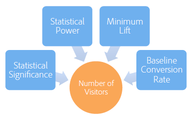
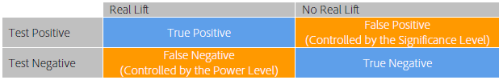
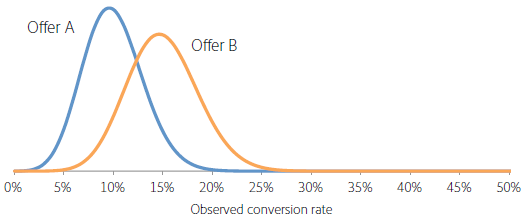
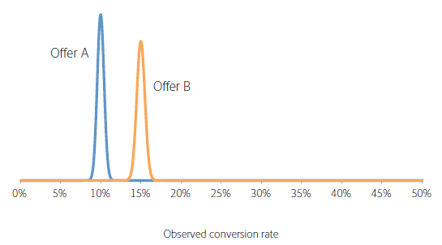
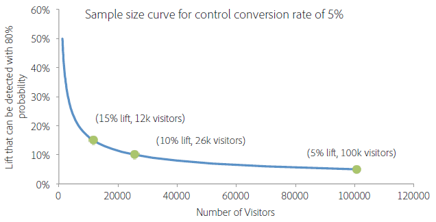

# A/B テストを実行すべき期間はどのくらいですか？

[!DNL Adobe Target]での[!UICONTROL A/B Test] アクティビティを成功させるには、コンバージョン率を向上させるのに十分な訪問者（サンプルサイズ）が必要です。 A/B テストの実施期間を把握するには、どうすればよいですか？ この記事には、[!UICONTROL Auto-Allocate]のアクティビティと[!UICONTROL Adobe Target] サンプルサイズ計算ツールに関する情報が含まれており、アクティビティに目標を達成するのに十分な訪問者が含まれていることを確認するのに役立ちます。

いずれかのオファーのパフォーマンスが、アクティビティの最初の数日間に他のオファーよりも優れているか悪い場合、アクティビティを停止したいと考えています。 ただし、観測結果の数が少ない場合、コンバージョン率は少ない訪問者数の平均なので、まったく偶然にプラスまたはマイナスの上昇が観測される可能性が高いです。 アクティビティでより多くのデータポイントを収集するに従って、コンバージョン率は真の長期的な値に近づきます。

>[!IMPORTANT]
>
>アクティビティを早期に停止することは、A/B テストを実行する際に陥りやすい10の大きな落とし穴のひとつです。 詳細については、[一般的なA/B テストの10の落とし穴と、それらを回避する方法](/help/main/c-activities/t-test-ab/common-ab-testing-pitfalls.md#concept_578A7947C9554868B30F12DFF9E3F8E3)を参照してください。

[!DNL Adobe Target]には、コンバージョン目標を達成するのに十分なサンプルサイズをアクティビティに確保するためのツールが用意されています。自動割り当て。

## 自動配分 {#auto-allocate}

[自動配分](/help/main/c-activities/automated-traffic-allocation/automated-traffic-allocation.md) アクティビティは、2つ以上のエクスペリエンスの中から勝者を特定するA/B テストの一種です。 [!UICONTROL Auto-Allocate] テストは、テストの実行と学習を続ける間に、勝者に対してより多くのトラフィックを自動的に再割り当てし、コンバージョンを増加させます。

標準的な A/B テストには、固有のコストがあります。 各エクスペリエンスのパフォーマンスを測定するためにトラフィックを費やす必要があり、分析を通じて勝者エクスペリエンスを見つけ出す必要があります。 トラフィックの配分は、一部のエクスペリエンスが他よりもパフォーマンスに優れているとわかった後でも、固定されたままです。 また、サンプルサイズの計算が複雑で、アクティビティは、勝者に対して働きかけられるようになる前に全コースを実行する必要があります。 そして、特定された勝者が真の勝者ではない可能性があります。

解決策は[!UICONTROL Auto-Allocate]です。 [!UICONTROL Auto-Allocate]は、勝者エクスペリエンスの決定にかかるコストとオーバーヘッドを削減します。 [!UICONTROL Auto-Allocate] では、すべてのエクスペリエンスの目標指標パフォーマンスを監視し、パフォーマンスの高いエクスペリエンスに、パフォーマンスの高さに応じて多くの新規参加者を送ります。 他のエクスペリエンスを調査するのに十分なトラフィックが確保されます。 アクティビティがまだ実行されている間でも、アクティビティのメリットを結果に表示できます。最適化は学習と並行して行われます。

[!UICONTROL Auto-Allocate] では、アクティビティが終了して勝者が決まるまで待たずに、訪問者を徐々に勝者エクスペリエンスへとに近づけます。 成功していないエクスペリエンスに送られるはずのアクティビティ参加者に、勝者の可能性を持つエクスペリエンスが示されるので、より迅速にメリットが得られます。

[!UICONTROL Auto-Allocate]を使用する場合、[!DNL Target]は、アクティビティのページの上部にバッジを表示します。このバッジは、アクティビティが十分な信頼性を持ってコンバージョンの最小数に達するまで、「勝者なし」を示します。 次に、[!DNL Target]は、アクティビティのページの上部にバッジを表示して、勝者エクスペリエンスを宣言します。

詳しくは、[自動配分の概要](/help/main/c-activities/automated-traffic-allocation/automated-traffic-allocation.md)を参照してください。

## Adobe [!DNL Target] サンプル サイズ計算ツール {#section_6B8725BD704C4AFE939EF2A6B6E834E6}

[!UICONTROL Auto-Allocate]ではなく手動の[!UICONTROL A/B Test] アクティビティを使用することを選択した場合、[!DNL Target] サンプルサイズ計算ツールを使用すると、テストを成功させるために必要なサンプルサイズを判断できます。 手動A/B テストは固定水平線テストなので、計算機が有効です。 [!UICONTROL Auto-Allocate] が勝者を宣言するので、[!UICONTROL Auto-Allocate] アクティビティにこの計算ツールを使用できます。 計算ツールを使用して、必要なサンプルサイズを大まかに見積もることができます。 計算ツールの使い方について詳しくは、以降の節を参照してください。

A/B テストを設定する前に、[!DNL Adobe Target] [&#x200B; サンプルサイズ計算](https://experienceleague.adobe.com/tools/calculator/testcalculator.html?lang=ja)にアクセスしてください。

A/B テストを実施する前に、適切なサンプルサイズ（訪問者数）を決定して、結果を評価する前にアクティビティを実行する時間を確立することが重要です。 統計的有意性が達成されるまで活動を監視するだけでは、信頼区間が大幅に過小評価され、テストが信頼性を失う。 この結果の背後にある直感は、統計的に有意な結果が検出された場合、テストが停止され、勝者が宣言されることです。 ただし、結果が統計的に有意でない場合は、テストを続行できます。 この方法では、前向きな結果に大きく偏向して偽陽性率が高くなるので、テストの有効有意水準にゆがみが生じます。

この手順では、多くの偽陽性が発生する可能性があり、最終的に予測された上昇率を実現しないオファーの実装につながります。 上昇率の低下そのものは満足のいかない結果ですが、さらに深刻な結果は、時間の経過とともに、上昇率を正確に予測できないことが、試験方法に対する組織の信頼を損なうことです。

この記事では、サンプルサイズを決定する際にバランスを取る必要がある要因について説明し、適切なサンプルサイズを推定するための計算機を導入します。 A/B テストを開始する前に、サンプルサイズ計算機（上記のリンク）を使用してサンプルサイズを計算することで、統計的標準に準拠した高品質なA/B テストを常に実行することができます。

A/B テストを定義する 5 つのユーザー定義パラメーターがあります。 これらのパラメーターは関連しているので、4 つが定まると、5 つ目のパラメーターを計算できます。

* 統計的有意性
* 統計的検出力
* 最小信頼検出可能上昇率
* ベースラインコンバージョン率
* 訪問者数

>[!IMPORTANT]
>
>正確な結果を得るには、パラメーター番号を変更する前にページをリロードする必要があります。 パラメーター番号を変更するたびに、このプロセスを繰り返します。

A/B テストの場合、統計的有意性、統計的検出力、最小信頼検出可能上昇率およびベースラインコンバージョン率は、アナリストが設定し、必要な訪問者数は、これらの数字から計算されます。 この記事では、これらの要素について説明し、特定のテストでこれらの指標を決定する方法に関するガイドラインを示します。

下の図に、A/B テストの考えられる 4 つの結果を示します。

偽陽性または偽陰性はないのが望ましいです。 しかし、偽陽性ゼロを得ることは、統計的なテストでは決して保証できません。 観察傾向が基本的なコンバージョン率を表していない可能性は常にあります。 例えば、コインの裏返しの頭や尾が可能性が高いかどうかを調べるためのテストでは、公正なコインでも、偶然に10回の投げで10回の頭を得ることができます。 統計的有意性と統計的検出力によって、偽陽性率と偽陰性率を定量化して、特定のテストでこれらの率を適度なレベルに維持することができます。

### 統計的有意性 {#section_8230FB9C6D1241D8B1786B72B379C3CD}

テストの有意性レベルは、実際に実際に違いがない場合に、テストで2つの異なるオファー間のコンバージョン率に有意な違いが報告される可能性を決定します。 この状況は、偽陽性またはType I エラーとして知られています。 有意水準は、ユーザーが指定したしきい値であり、偽陽性の許容値とテストに含める必要がある訪問者の数との間のトレードオフです。

A/B テストでは、当初、どちらのオファーもコンバージョン率は同じであると想定します。 その後、この想定に基づいて観察結果の確率が計算されます。 この確率（p値）が事前に定義されたしきい値（有意水準）よりも小さい場合、[!DNL Target]は、最初の仮定（両方のオファーのコンバージョン率が同じであること）が正しくないと結論付けます。 したがって、AとBのコンバージョン率は、与えられた有意水準で統計的に異なる。

A/B テストで一般的に使用される有意水準は 5％です。これは、信頼水準 95％（信頼水準＝100％ - 有意水準）に相当します。 信頼水準 95％とは、毎回のテストでオファー間に違いがない場合でも、統計的に有意な上昇率が 5％の確率で見つかるという意味です。

信頼水準の一般的な解釈を下の表にまとめます。

| 信頼水準 | 解釈 |
|--- |--- |
| &lt; 90％ | コンバージョン率に違いがあるとする証拠がない。 |
| 90 ～ 95％ | コンバージョン率に違いがあるとする薄弱な証拠。 |
| 95 ～ 99％ | コンバージョン率に違いがあるとする中程度の証拠。 |
| 99 ～ 99.9％ | コンバージョン率に違いがあるとする強力な証拠。 |
| +99.9％ | コンバージョン率に違いがあるとするきわめて強力な証拠。 |

常に 95％以上の信頼水準を使用することをお勧めします。

可能な限り高い信頼性レベルを使用することが望ましいので、テストは偽陽性をほとんど生じさせません。 ただし、信頼水準が高くなると、それだけ必要となる訪問者数が増え、テストの実施に要する時間も長くなります。 また、信頼水準が高くなると、統計的検出力が低下します。

### 統計的検出力 {#section_1169C27F8E4643719D38FB9D6EBEB535}

A/B テストの統計的検出力は、ある特定の規模におけるコンバージョン率の実際の違いを検出する確率です。 コンバージョンイベントのランダム（確率的）な性質により、2つのオファー間にコンバージョン率に実際の違いがあるにもかかわらず、統計的に有意な違いが偶然には観察されない可能性があります。 このシナリオは、偽陰性またはType II エラーと呼ばれます。

統計的有意性とは対照的に、A/B テストをおこなうために統計的検出力の決定は必要ないので、統計的検出力は一般的には無視されます。 ただし、統計的検出力を無視すると、サンプルサイズが小さすぎるため、異なるオファーのコンバージョン率の実際の違いがテストで検出されない可能性が高くなります。 この状況は、テストが偽陽性によって支配される結果になります。

高い統計的検出力を使用することで、実際のコンバージョン率の違いを識別する可能性を高くして、偽陰性をほとんど発生させないことが望ましいです。 しかし、特定のリフトを検出する統計的検出力を高めるために、より多くの訪問者が必要となり、テストに要する時間が増加します。

統計的検出力のために一般的に使用される値は 80％です。これは、テストで最小信頼検出可能上昇率と同等の違いが検出される可能性が 80％であるという意味です。 テストでは、より低い上昇率を検出する確率が下がり、より高い上昇率を検出する確率が上がります。

### 最小信頼検出可能上昇率 {#section_6101367EE9634C298410BBC2148E33A9}

上昇率が低くても実装する価値はあるので、ほとんどの組織は、コンバージョン率のわずかな違いでも検出することを望んでいます。 しかし、A/B テストでリフトが小さい可能性を高く検出したい場合、テストに含める必要がある訪問者の数は非常に多くなります。 その理由は、コンバージョン率の差が小さい場合は、両方のコンバージョン率を高い精度で推定して差を特定する必要があり、多くの訪問者が必要になるためです。 したがって、低い上昇率を検出することと、テストの実施に要する時間が長くなることとの間のトレードオフを考慮したビジネス要件によって、最小信頼検出可能上昇率を決定する必要があります。

例えば、2 つのオファー（A と B）の真のコンバージョン率がそれぞれ 10％と 15％であるとします。 これらのオファーがそれぞれ 100 人の訪問者に示される場合、コンバージョンの確率的な性質のため、95％の確率で、オファー A については 4 ～ 16％の範囲のコンバージョン率が、オファー B については 8 ～ 22％の範囲のコンバージョン率が観察されます。 これらの範囲は、統計学的には信頼区間と呼ばれます。 これらは、コンバージョン率の見積もり精度の信頼性を表します。 サンプルサイズが大きくなれば（訪問者数が多くなれば）、コンバージョン率の見積もりの精度に対する信頼性は高くなります。

下の図は、これらの確率分布を示しています。

2 つの範囲間で重複する部分が大きいので、このテストによって、コンバージョン率が異なるかどうかを判定することはできません。 したがって、この 100 人の訪問者を含むテストでは、2 つのオファーを区別できません。 ただし、[!DNL Target]が各5,000人の訪問者にオファーを提供する場合、観察されたコンバージョン率はそれぞれ9%～11%、14%～16%の範囲で低下する可能性が95%あります。

この場合、テストが間違った結論に達することはほとんどないので、5,000人の訪問者を含むテストでは、2つのオファーを区別できます。 5,000人の訪問者を対象としたテストでは、信頼区間は+/-1%です。 つまり、約1%の差を検出できるということです。 したがって、例えば、これらのオファーの真のコンバージョン率が 10％と 15％ではなく、10％と 10.5％の場合は、さらに多くの訪問者が必要になります。

### ベースラインコンバージョン率 {#section_39380C9CA3C649B6BE6E1F8A06178B05}

ベースラインコンバージョン率は、制御オファー（オファー A）のコンバージョン率です。 多くの場合、顧客の経験にもとづいて、オファーのコンバージョンレベルを正確に把握できます。 それが当てはまらない場合、例えば、新しい種類のオファーまたはクリエイティブの場合は、テストを 1 日ぐらいかけておこなって、サンプルサイズの計算に使用できるベースラインコンバージョン率の大まかな見積もりを得ることができます。

### 訪問者数 {#section_19009F165505429E95291E6976E498DD}

テストを長時間実行する機会費用と偽陽性や偽陰性のリスクとのバランスを取るのは難しい場合があります。 判断を誤ることは望ましくありませんが、テスト基準が厳密すぎて麻痺してしまうことも望ましくありません。

一般的なガイドラインとして、信頼水準 95％と統計的検出力 80％をお勧めします。

サンプルサイズ計算ツール（前述のリンク参照）を使用すると、統計的有意性（推奨値 95％）と統計的検出力（推奨値 80％）を決定できます。 すべてのオファー全体を対象としたベースラインコンバージョン率と毎日のトラフィックを入力すると、テストの指定された統計的検出力と同等の確率で上昇率 1％、2％、5％、10％、15％および 20％を検出するために必要な訪問者の数が出力されます。 スプレッドシートでは、ユーザーが確実に検出可能な最小リフトを入力することもできます。 さらに、ユーザーが入力したトラフィックレベルに基づいてテストをおこなうために必要な週数も出力されます。 必要な週数は、結果に影響を与える曜日の影響を避けるために、最も近い週に切り上げられます。

テストによって確実に識別できる最小上昇率と、必要な訪問者数との間にトレードオフがあります。 下の図は、ベースライン（制御）コンバージョン率 5％に対して有効で、訪問者数の増加に対する顕著な収穫逓減を示しています。 確実に検出できる最小上昇率は、最初に少数の訪問者を追加すると著しく向上しますが、テストを向上させるために徐々に訪問者数が増えていきます。 この図は、テストの実施に要する時間（必要な訪問者数と、サイトのトラフィックによって決定される）と、テストで確実に検出できる最小上昇率との間の適当なトレードオフを見つけるのに役立ちます。

この例では、100回のテストのうち80回で（100%+5%） &#42;5% = 5.25%の代替オファーのコンバージョン率に対応する）リフトを検出できることが適切であると判断する場合、各オファーに対するサンプルサイズは10万人の訪問者が必要になります。 サイトの1日あたりの訪問者数が20,000人で、2つのオファーをテストしている場合、代替オファーがコントロールオファーよりも統計的に有意に優れているかどうかを判断する前に、テストを2&#42;100,000/20,000 = 10日間実行できるようにする必要があります。

前にも説明しましたが、必要な時間は常に直近の一週間に切り上げて、曜日効果を避けることをお勧めします。 したがって、この例では、結果を見積もる前にテストは 2 週間実行されます。

### 訪問あたりの利益指標 {#section_C704C0861C9B4641AB02E911648D2DC2}

RPVを指標として使用する場合、RPVは注文ごとの収益とコンバージョン率（RPV =収益/ #visitors = （注文ごとの収益&#42; #orders） / #訪問者=注文ごとの収益&#42; （#visitors &#42; CTR） / #visitors =注文ごとの収益&#42; CTR）の積であるため、追加の分散ソースが追加されます。 コンバージョン率の変動は数学的モデルを用いて直接推定できるが、注文当たりの売上高の変動はアクティビティに固有である。 そのため、過去の活動からこの分散に関する知識を使用するか、数日間A/B テストを実行して、収益の分散を推定します。 分散は、CSV ダウンロードファイルに含まれる販売合計、販売合計二乗、訪問者数の値から計算されます。 これが確立されたら、スプレッドシートを使用してテストを完了するために必要な時間を計算します。

サンプルサイズ計算ツール（上記のリンクを参照）は、RPV 指標の設定に役立ちます。 電卓を開くと、[!UICONTROL RPV Metric]というラベルの付いたタブが表示されます。 RPV バージョンの計算ツールを使用する場合は、次の情報が必要になります。

* 制御オファーへの訪問者数
* 制御オファーの合計利益

  エクストリームオーダーのフィルターが選択されていることを確認します。

* 制御オファーの利益の平方和

  エクストリームオーダーのフィルターがオンになっていることを確認します。

一般に、RPVを指標として使用すると、同じレベルの測定された上昇率に対して同じレベルの統計的信頼性を達成するには、20～30%長い時間が必要です。 これは、RPVが、コンバージョンごとに異なる注文サイズのバリエーションを追加しているためです。 そのため、最終的なビジネス上の意思決定の基盤となる指標として、コンバージョン率とRPVのどちらを選択するかを検討する必要があります。

## 複数のオファーを比較するための修正 {#section_1474113764224D0B85472D8B023CCA15}

2 つのオファーを比較するたびに、偽陽性（コンバージョン率に違いがない場合でも、統計的に有意な違いを観察すること）が発生する可能性は有意水準と同じです。 例えば、A／B／C／D／E の 5 つのオファーがあり、A が制御オファーの場合、 つの比較（制御オファーと B、制御オファーと C、制御オファーと D および制御オファーと E）がおこなわれ、信頼水準が 95％でも偽陽性の確率は 18.5％になります（Pr（少なくとも 1 つの偽陽性）= 1 - Pr（偽陽性なし）= 1 - 0.954 = 18.5％）。 偽陽性は、代替オファーよりも優れていると報告される制御オファー、または制御オファーよりも優れていると報告される代替オファーのいずれかとして定義されるコンテキスト（実際は両方のオファーに違いはない）にあります。

## まとめ {#section_AEA2427B90AE4E9395C7FF4F9C5CA066}

[!UICONTROL Auto-Allocate] アクティビティを使用すると、[!DNL Target]は2つ以上のエクスペリエンスの勝者を特定し、テストの実行と学習を続ける間に、勝者により多くのトラフィックを自動的に再割り当てしてコンバージョンを増加させます。 [!UICONTROL Auto-Allocate]を使用すると、推測を排除しながら、コンバージョン目標を簡単に達成できます。

この記事で紹介したサンプルサイズ計算ツール（上記のリンク）を使用し、テストが提案された時間だけ実行できるようにすることで、特定のテストに適していると判断した偽陽性率と偽陰性率に従う高品質のA/B テストを常に実行できます。 その結果、テストは首尾一貫したものとなり、最適な上昇率を確実に検出することができます。
