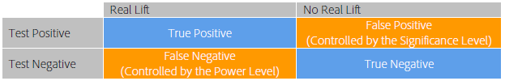

# A/B テストを実行すべき期間はどのくらいですか？

成功 [!UICONTROL A/B テスト] アクティビティ [!DNL Adobe Target] コンバージョン率を向上させるには、十分な訪問者数（サンプルサイズ）が必要です。 A/B テストを実行する期間をどの程度把握していますか？ この記事には、 [!UICONTROL 自動配分] アクティビティと [!UICONTROL Adobe Target] サンプルサイズ計算ツールを使用すると、アクティビティで目標を達成するのに十分な訪問者がいることを確認できます。

アクティビティの最初の数日でオファーの 1 つのパフォーマンスが他に比べてずっと優れている、または劣っている場合、アクティビティを停止したくなります。ただし、観測結果の数が少ない場合、コンバージョン率は少ない訪問者数の平均なので、まったく偶然にプラスまたはマイナスの上昇が観測される可能性が高いです。アクティビティでより多くのデータポイントを収集するに従って、コンバージョン率は真の長期的な値に近づきます。

>[!IMPORTANT]
>
>アクティビティを早めに停止すると、A/B テストの実行時に陥る可能性のある、10 件の重大な落とし穴の 1 つになります。 詳しくは、 [一般的な A/B テストの落とし穴 10 件と回避方法](/help/main/c-activities/t-test-ab/common-ab-testing-pitfalls.md#concept_578A7947C9554868B30F12DFF9E3F8E3).

[!DNL Adobe Target] には、アクティビティにコンバージョン目標を達成するのに十分なサンプルサイズがあることを確認するためのツールが用意されています。自動配分。

## 自動配分 {#auto-allocate}

An [自動配分](/help/main/c-activities/automated-traffic-allocation/automated-traffic-allocation.md) 「アクティビティ」は、2 つ以上のエクスペリエンスの中から勝者を特定する A/B テストの一種です。 自動配分テストでは、自動的に勝者に配分するトラフィックを増やしてコンバージョンを増やしますが、その間もテストによる学習は続けられます。

標準的な A/B テストには、固有のコストがあります。各エクスペリエンスのパフォーマンスを測定するためにトラフィックを費やす必要があり、分析を通じて勝者エクスペリエンスを見つけ出す必要があります。トラフィックの配分は、一部のエクスペリエンスが他よりもパフォーマンスに優れているとわかった後でも、固定されたままです。また、サンプルサイズの計算が複雑で、アクティビティは、勝者に対して働きかけられるようになる前に全コースを実行する必要があります。また、特定された勝者が真の勝者でない可能性もあります。

解決策は次のとおりです。 [!UICONTROL 自動配分]. [!UICONTROL 自動配分は、このコストおよび勝者エクスペリエンスの判別のオーバーヘッドを削減します。][!UICONTROL 自動配分では、すべてのエクスペリエンスの目標指標パフォーマンスを監視し、パフォーマンスの高いエクスペリエンスに、パフォーマンスの高さに応じて多くの新規参加者を送ります。]他のエクスペリエンスを調査するのに十分なトラフィックが予約されます。アクティビティがまだ実行中でも、結果に対するアクティビティのメリットを確認できます。最適化は、学習と並行しておこなわれます。

[!UICONTROL 自動配分は、アクティビティが終了して勝者が決まるまで待たずに、訪問者を徐々に勝者エクスペリエンスに近づけます。]成功していないエクスペリエンスに送られたアクティビティ参加者は勝者エクスペリエンスの可能性を示しているので、より迅速に上昇するメリットが得られます。

[!UICONTROL 自動配分]機能を使用すると、[!DNL Adobe Target] は、アクティビティが十分な信頼性のあるコンバージョンの最低数に達するまで、アクティビティのページの最上部に「まだ勝者がありません」ということを示すバッジを表示します。[!DNL Target]次に、 は、アクティビティのページの上部にバッジを表示して、勝者エクスペリエンスを宣言します。

詳しくは、 [自動配分の概要](/help/main/c-activities/automated-traffic-allocation/automated-traffic-allocation.md).

## Adobe [!DNL Target] サンプルサイズ計算ツール {#section_6B8725BD704C4AFE939EF2A6B6E834E6}

マニュアルを使用する場合 [!UICONTROL A/B テスト] ではなくアクティビティ [!UICONTROL 自動配分]、 [!DNL Target] サンプルサイズ計算ツールを使用すると、テストを成功させるために必要なサンプルサイズを判断できます。 手動の A/B テストは固定水平線テストなので、計算ツールが役立ちます。 計算ツールを使用した [!UICONTROL 自動配分] アクティビティはオプションです。 [!UICONTROL 自動配分] が勝者を宣言します。 計算ツールを使用すると、必要なサンプルサイズを大まかに推定できます。 計算ツールの使い方について詳しくは、以降の節を参照してください。

A/B テストを設定する前に、Adobe Targetにアクセスします [サンプルサイズ計算ツール](https://experienceleague.adobe.com/tools/calculator/testcalculator.html?lang=ja).

結果を評価する前にアクティビティを実行する必要がある時間を確立するために、A/B テストを実行する前に適切なサンプルサイズ（訪問者数）を決定することが重要です。 統計的有意性が達成されるまでアクティビティを監視するだけで、信頼区間が大幅に過小評価され、テストの信頼性が低下します。 この場合、統計的に有意な結果が検出された時点でテストは停止して、勝者が宣言されます。ただし、結果が統計的に有意でない場合は、テストの続行が許可されます。この方法では、前向きな結果に大きく偏向して偽陽性率が高くなるので、テストの有効有意水準にゆがみが生じます。

これにより、多くの偽陽性が生じ、予測された上昇率を最終的には提供しないオファーが実装されます。 上昇率の低さ自体は満足のいかない結果ですが、さらに深刻な結果は、上昇率を正確に予測できないことが、実際のテストにおける組織の信頼を損なうことです。

この記事では、サンプルサイズを決定するときにバランスを取る必要がある要因について説明し、十分なサンプルサイズを見積もるために使用するスプレッドシート計算表を紹介します。A/B テストを開始する前にサンプルサイズ計算ツール（上記のリンクを参照）を使用してサンプルサイズを計算すると、統計標準に準拠した高品質な A/B テストを常に実行できます。

A/B テストを定義する 5 つのユーザー定義パラメーターがあります。これらのパラメーターは関連しているので、4 つが定まると、5 つ目のパラメーターを計算できます。

* 統計的有意性
* 統計的検出力
* 最小信頼検出可能上昇率
* ベースラインコンバージョン率
* 訪問者数

A/B テストの場合、統計的有意性、統計的検出力、最小信頼検出可能上昇率およびベースラインコンバージョン率は、アナリストが設定し、必要な訪問者数は、これらの数字から計算されます。この記事では、これらの要素について説明し、特定のテストでこれらの指標を決定する方法のガイドラインを示します。

下の図に、A/B テストの考えられる 4 つの結果を示します。

偽陽性または偽陰性はないのが望ましいです。ただし、統計的テストで偽陽性がゼロになることを保証することはできません。 観察傾向が基本的なコンバージョン率を表していない可能性は常にあります。例えば、コインの表や裏が裏が裏に出る可能性が高いかどうかを調べるテストでは、正しいコインを使用しても、偶然に 10 個のトスに 10 個の頭を付けることができます。 統計的有意性と統計的検出力によって、偽陽性率と偽陰性率を定量化して、特定のテストでこれらの率を適度なレベルに維持することができます。

### 統計的有意性 {#section_8230FB9C6D1241D8B1786B72B379C3CD}

テストの有意水準は、実際には違いがない場合に、2 つの異なるオファー間のコンバージョン率に大きな違いがあるとテストが報告する可能性を決定します。 この状況は、偽陽性または I 型エラーと呼ばれます。 有意水準は、ユーザーが指定したしきい値で、偽陽性の許容値と、テストに含める必要のある訪問者数との間のトレードオフです。

A/B テストでは、当初、どちらのオファーもコンバージョン率は同じであると想定します。その後、この想定に基づいて観察結果の確率が計算されます。この確率（p 値）が、事前に定義されたしきい値（有意水準）より小さい場合、 [!DNL Target] 最初の仮定（両方のオファーのコンバージョン率が同じ）が正しくないと結論付けます。 したがって、A と B のコンバージョン率は、所定の有意水準では統計的に異なります。

A/B テストで一般的に使用される有意水準は 5％です。これは、信頼水準 95％（信頼水準＝100％ - 有意水準）に相当します。信頼水準 95％とは、毎回のテストでオファー間に違いがない場合でも、統計的に有意な上昇率が 5％の確率で見つかるという意味です。

信頼水準の一般的な解釈を下の表にまとめます。

| 信頼水準 | 解釈 |
|--- |--- |
| &lt; 90％ | コンバージョン率に違いがあるとする証拠がない。 |
| 90 ～ 95％ | コンバージョン率に違いがあるとする薄弱な証拠。 |
| 95 ～ 99％ | コンバージョン率に違いがあるとする中程度の証拠。 |
| 99 ～ 99.9％ | コンバージョン率に違いがあるとする強力な証拠。 |
| +99.9％ | コンバージョン率に違いがあるとするきわめて強力な証拠。 |

常に 95％以上の信頼水準を使用することをお勧めします。

テストで偽陽性がほとんど生じないように、可能な限り最高の信頼水準を使用することが望ましいです。 ただし、信頼水準が高くなると、それだけ必要となる訪問者数が増え、テストの実施に要する時間も長くなります。また、信頼水準が高くなると、統計的検出力が低下します。

### 統計的検出力 {#section_1169C27F8E4643719D38FB9D6EBEB535}

A/B テストの統計的検出力は、ある特定の規模におけるコンバージョン率の実際の違いを検出する確率です。コンバージョンイベントのランダム性（確率性）のため、2 つのオファー間で実際にはコンバージョン率に違いあっても、統計的に有意な違いは観察されない（単なる偶然と見なされる）可能性があります。このシナリオは、偽陰性またはタイプ II エラーと呼ばれます。

統計的有意性とは対照的に、A/B テストをおこなうために統計的検出力の決定は必要ないので、統計的検出力は一般的には無視されます。ただし、統計的検出力を無視すると、サンプルサイズが非常に小さいので、異なるオファーのコンバージョン率に存在する実際の違いがテストで検出されない可能性が大幅に高まります。その結果、テストで偽陽性が大量に発生します。

高い統計的検出力を使用することで、実際のコンバージョン率の違いを識別する可能性を高くして、偽陰性をほとんど発生させないことが望ましいです。ただし、ある特定の上昇率の検出の統計的検出力を高めるには、より多くの訪問者数が必要で、テストの実施に要する時間が長くなります。

統計的検出力のために一般的に使用される値は 80％です。これは、テストで最小信頼検出可能上昇率と同等の違いが検出される可能性が 80％であるという意味です。テストでは、より低い上昇率を検出する確率が下がり、より高い上昇率を検出する確率が上がります。

### 最小信頼検出可能上昇率 {#section_6101367EE9634C298410BBC2148E33A9}

上昇率が低くても実装する価値はあるので、ほとんどの組織は、コンバージョン率のわずかな違いでも検出することを望んでいます。ただし、A/B テストで低い上昇率を検出する確率が高い場合は、テストに含める必要がある訪問者の数が非常に多くなります。 この理由は、コンバージョン率の違いが小さい場合、両方のコンバージョン率を高い精度で推定して違いを特定する必要があるので、多くの訪問者が必要になるからです。 したがって、低い上昇率を検出することと、テストの実施に要する時間が長くなることとの間のトレードオフを考慮したビジネス要件によって、最小信頼検出可能上昇率を決定する必要があります。

例えば、2 つのオファー（A と B）の真のコンバージョン率がそれぞれ 10％と 15％であるとします。これらのオファーがそれぞれ 100 人の訪問者に示される場合、コンバージョンの確率的な性質のため、95％の確率で、オファー A については 4 ～ 16％の範囲のコンバージョン率が、オファー B については 8 ～ 22％の範囲のコンバージョン率が観察されます。これらの範囲は、統計学的には信頼区間と呼ばれます。これらは、コンバージョン率の見積もり精度の信頼性を表します。サンプルサイズが大きくなれば（訪問者数が多くなれば）、コンバージョン率の見積もりの精度に対する信頼性は高くなります。

下の図は、これらの確率分布を示しています。

2 つの範囲間で重複する部分が大きいので、このテストによって、コンバージョン率が異なるかどうかを判定することはできません。したがって、この 100 人の訪問者を含むテストでは、2 つのオファーを区別できません。ただし、Target が各オファーを 5,000 人の訪問者に公開している場合、95%の確率で、観測されたコンバージョン率がそれぞれ 9%から 11%、14%から 16%の範囲で低下します。

この場合、テストが誤った結論に達する可能性は低いので、5,000 人の訪問者を含むテストでは、2 つのオファーを区別できます。 この 5,000 人の訪問者を含むテストの信頼区間は約 +/-1％です。これは、このテストでは約 1％の違いを検出できるという意味です。したがって、例えば、これらのオファーの真のコンバージョン率が 10％と 15％ではなく、10％と 10.5％の場合は、さらに多くの訪問者が必要になります。

### ベースラインコンバージョン率 {#section_39380C9CA3C649B6BE6E1F8A06178B05}

ベースラインコンバージョン率は、制御オファー（オファー A）のコンバージョン率です。一般に、以前の経験に基づくオファーのコンバージョンレベルは正しく判断できます。それが当てはまらない場合、例えば、新しい種類のオファーまたはクリエイティブの場合は、テストを 1 日ぐらいかけておこなって、サンプルサイズの計算に使用できるベースラインコンバージョン率の大まかな見積もりを得ることができます。

### 訪問者数 {#section_19009F165505429E95291E6976E498DD}

テストを長時間実行する機会費用と偽陽性や偽陰性のリスクとのバランスを取るのは難しい場合があります。判断を誤ることは望ましくありませんが、テスト基準が厳密すぎて麻痺してしまうことも望ましくありません。

一般的なガイドラインとして、信頼水準 95％と統計的検出力 80％をお勧めします。

サンプルサイズ計算ツール（前述のリンク参照）を使用すると、統計的有意性（推奨値 95％）と統計的検出力（推奨値 80％）を決定できます。すべてのオファー全体を対象としたベースラインコンバージョン率と毎日のトラフィックを入力すると、テストの指定された統計的検出力と同等の確率で上昇率 1％、2％、5％、10％、15％および 20％を検出するために必要な訪問者の数が出力されます。また、このスプレッドシートには、最小信頼検出可能上昇率のカスタム値を入力することもできます。さらに、ユーザーが入力したトラフィックレベルに基づいてテストをおこなうために必要な週数も出力されます。必要な週数は、結果に影響する曜日効果を避けるために直近の一週間に切り上げられます。

テストによって確実に識別できる最小上昇率と、必要な訪問者数との間にトレードオフがあります。下の図は、ベースライン（制御）コンバージョン率 5％に対して有効で、訪問者数の増加に対する顕著な収穫逓減を示しています。確実に検出できる最小上昇率は、最初に少数の訪問者を追加すると著しく向上しますが、テストを向上させるために徐々に訪問者数が増えていきます。この図は、テストの実施に要する時間（必要な訪問者数と、サイトのトラフィックによって決定される）と、テストで確実に検出できる最小上昇率との間の適当なトレードオフを見つけるのに役立ちます。

この例では、100 件のテスト中 80 件のテストで上昇率 5％（代替オファーのコンバージョン率（100％+5％）*5％ = 5.25％に相当）を検出できることが適切と判断できるので、各オファーのサンプルサイズとして 100,000 人の訪問者が必要です。このサイトには 1 日あたり 20,000 人の訪問者があり、2 つのオファーをテストする場合、代替オファーが制御オファーよりも統計的に有意に優れているかどうかを判断するには、テストを 2*100,000/20,000 = 10 日間実行できる必要があります。

前にも説明しましたが、必要な時間は常に直近の一週間に切り上げて、曜日効果を避けることをお勧めします。したがって、この例では、結果を見積もる前にテストは 2 週間実行されます。

### 訪問あたりの利益指標 {#section_C704C0861C9B4641AB02E911648D2DC2}

訪問あたりの利益（RPV）は、それぞれ独自の分散を持つ注文あたりの利益とコンバージョン率の積なので（RPV = 利益/訪問者数 =（注文あたりの利益 * 注文数）/訪問者数 = 注文あたりの利益 *（訪問者数 * CTR）/訪問者数 = 注文あたりの利益 * CTR）、RPV を指標として使用するときは、分散の追加ソースが追加されます。コンバージョン率の分散は、数学モデルを使用して直接推定できますが、注文あたりの売上高の分散は、アクティビティに固有です。 したがって、過去のアクティビティからこの相違に関する知識を使用するか、A/B テストを数日間実行して売上高の相違を見積もります。 平方偏差は、CSV ダウンロードファイルにある「合計販売額」、「合計販売額の 2 乗」、「訪問者数」の値から計算されます。 このテストが完了したら、スプレッドシートを使用して、テストの完了に必要な時間を計算します。

サンプルサイズ計算ツール（上記のリンクを参照）は、RPV 指標の設定に役立ちます。計算ツールを開くと、「 」というラベルの付いたタブが表示されます [!UICONTROL RPV 指標]. RPV バージョンの計算ツールを使用する場合は、次の情報が必要になります。

* 制御オファーへの訪問者数
* 制御オファーの合計利益

   極端な注文のフィルターが選択されていることを確認します。

* 制御オファーの利益の平方和

   極端な注文のフィルターが有効になっていることを確認します。

一般に、RPV を指標として使用する場合、同じレベルの測定された上昇率に対して同じレベルの統計的信頼性を達成するには、20～30%長い時間が必要です。 これは、RPV にはコンバージョンごとの異なる注文サイズの分散が加えられているからです。 これは、真のコンバージョン率と RPV のどちらを最終的なビジネス決定の基にするかを指標として選択する場合に考慮する必要があります。

## 複数オファーの比較の調整 {#section_1474113764224D0B85472D8B023CCA15}

2 つのオファーを比較するたびに、偽陽性（コンバージョン率に違いがない場合でも、統計的に有意な違いを観察すること）が発生する可能性は有意水準と同じです。例えば、A／B／C／D／E の 5 つのオファーがあり、A が制御オファーの場合、 つの比較（制御オファーと B、制御オファーと C、制御オファーと D および制御オファーと E）がおこなわれ、信頼水準が 95％でも偽陽性の確率は 18.5％になります（Pr（少なくとも 1 つの偽陽性）= 1 - Pr（偽陽性なし）= 1 - 0.954 = 18.5％）。偽陽性は、代替オファーよりも優れていると報告される制御オファー、または制御オファーよりも優れていると報告される代替オファーのいずれかとして定義されるコンテキスト（実際は両方のオファーに違いはない）にあります。

## まとめ {#section_AEA2427B90AE4E9395C7FF4F9C5CA066}

を使用する [!UICONTROL 自動配分] アクティビティ [!DNL Target] では、2 つ以上のエクスペリエンスの中から勝者を特定し、自動的にその勝者に配分するトラフィックを増やすことでコンバージョンを促進します。その間もテストによる学習は続けられます。 [!UICONTROL 自動配分を使用すると、推測による作業を排除して、コンバージョン目標を簡単に達成できます。]

この記事で紹介するサンプルサイズ計算ツール（上記のリンク）を使用して、テストが提案された時間をテストに費やすことで、特定のテストに適した偽陽性と偽陰性率に準拠した高品質の A/B テストを常に実行できます。 その結果、テストは首尾一貫したものとなり、最適な上昇率を確実に検出することができます。
