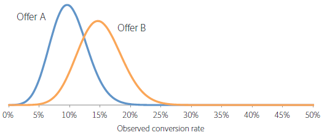

# A/B テストを実行すべき期間はどのくらいですか？

[!DNL Adobe Target] で [!UICONTROL A/B Test] アクティビティを成功させるには、コンバージョン率を向上させるために十分な訪問者（サンプルサイズ）が必要です。 A/B テストの実行時間を知る方法 この記事には、[!UICONTROL Auto-Allocate] アクティビティと、目標を達成するのに十分な数の訪問者がアクティビティに含まれていることを確認するのに役立つ、[!UICONTROL Adobe Target] サンプルサイズ計算ツールに関する情報が含まれています。

アクティビティの最初の数日間に、オファーの 1 つが他のオファーよりも良く機能した場合、または悪く機能した場合は、アクティビティを停止したくなります。 ただし、観測結果の数が少ない場合、コンバージョン率は少ない訪問者数の平均なので、まったく偶然にプラスまたはマイナスの上昇が観測される可能性が高いです。アクティビティでより多くのデータポイントを収集するに従って、コンバージョン率は真の長期的な値に近づきます。

>[!IMPORTANT]
>
>アクティビティを早めに停止することは、A/B テストを実行する際に陥る可能性のある 10 個の重要な落とし穴の 1 つです。 詳しくは、[A/B テストによくある 10 の落とし穴とその回避方法 ](/help/main/c-activities/t-test-ab/common-ab-testing-pitfalls.md#concept_578A7947C9554868B30F12DFF9E3F8E3) を参照してください。

[!DNL Adobe Target] には、コンバージョン目標を達成するのに十分な大きさのサンプルサイズ（自動配分）をアクティビティで確保するのに役立つツールが用意されています。

## 自動配分 {#auto-allocate}

[ 自動配分 ](/help/main/c-activities/automated-traffic-allocation/automated-traffic-allocation.md) アクティビティは、2 つ以上のエクスペリエンスのうちの勝者を識別する A/B テストの一種です。 [!UICONTROL Auto-Allocate] テストでは、より多くのトラフィックを自動的に勝者に再割り当てしてコンバージョンを増やしながら、テストの実行と学習を継続します。

標準的な A/B テストには、固有のコストがあります。各エクスペリエンスのパフォーマンスを測定するためにトラフィックを費やす必要があり、分析を通じて勝者エクスペリエンスを見つけ出す必要があります。トラフィックの配分は、一部のエクスペリエンスが他よりもパフォーマンスに優れているとわかった後でも、固定されたままです。また、サンプルサイズの計算が複雑で、アクティビティは、勝者に対して働きかけられるようになる前に全コースを実行する必要があります。そして、識別された勝者が真の勝者ではない可能性がまだあります。

解決策は [!UICONTROL Auto-Allocate] です。 [!UICONTROL Auto-Allocate] れにより、勝者エクスペリエンスを決定するためのコストとオーバーヘッドが削減されます。 [!UICONTROL Auto-Allocate] は、すべてのエクスペリエンスの目標指標のパフォーマンスを監視し、パフォーマンスの高いエクスペリエンスに対して、より多くの新しいエントリを比例して送信します。 他のエクスペリエンスを調査するのに十分なトラフィックが予約されます。アクティビティの実行中でも、結果にアクティビティのメリットがあることがわかります。最適化は学習と並行して行われます。

[!UICONTROL Auto-Allocate] では、アクティビティが終了して勝者を決定するまで待つのを要求するのではなく、徐々に勝者エクスペリエンスに向かって訪問者を移動させます。 成功していないエクスペリエンスに送られたアクティビティ参加者は勝者エクスペリエンスの可能性を示しているので、より迅速に上昇するメリットが得られます。

[!UICONTROL Auto-Allocate] を使用すると、[!DNL Target] は、アクティビティが十分な信頼性のあるコンバージョンの最低数に達するまで、アクティビティのページの最上部に「まだ勝者がありません」ということを示すバッジを表示します。 次に、[!DNL Target] クティビティのページの上部にバッジを表示して、勝者エクスペリエンスを宣言します。

詳しくは、[ 自動配分の概要 ](/help/main/c-activities/automated-traffic-allocation/automated-traffic-allocation.md) を参照してください。

## Adobe[!DNL Target] サンプルサイズ計算ツール {#section_6B8725BD704C4AFE939EF2A6B6E834E6}

[!UICONTROL Auto-Allocate] ではなく手動の [!UICONTROL A/B Test] アクティビティを使用することを選択した場合、[!DNL Target] サンプルサイズ計算ツールを使用すると、テストを成功させるために必要なサンプルサイズを判断できます。 手動の A/B テストは固定水平線テストであるため、計算ツールが役立つ。 [!UICONTROL Auto-Allocate] が勝者を宣言するので、[!UICONTROL Auto-Allocate] アクティビティに電卓を使用することはオプションです。 計算ツールを使用すると、必要なサンプルサイズを概算できます。 計算ツールの使い方について詳しくは、以降の節を参照してください。

A/B テストを設定する前に、[!DNL Adobe Target][ サンプルサイズ計算ツール ](https://experienceleague.adobe.com/tools/calculator/testcalculator.html?lang=ja) にアクセスします。

A/B テストを実行する前に適切なサンプルサイズ（訪問者数）を決定し、結果を評価する前にアクティビティを実行する時間を確立することが重要です。 統計的優位差が達成されるまでアクティビティを監視するだけで、信頼区間が大幅に過小評価され、テストの信頼性が低下します。 この結果の直感は、統計的に有意な結果が検出された場合、テストが停止され、勝者が宣言されることです。 ただし、結果が統計的に有意でない場合、テストは続行できます。 この方法では、前向きな結果に大きく偏向して偽陽性率が高くなるので、テストの有効有意水準にゆがみが生じます。

この手順では、多くの偽陽性が発生する可能性があり、最終的に予測された上昇率を実現しないオファーの実装につながります。 上昇率の低さそのものは不満足な結果ですが、さらに深刻な結果として、上昇率を正確に予測できないことが、実際のテストにおける組織の信頼を損なうことになります。

今回は、サンプルサイズを決める際にバランスを取る必要のある要素を解説し、適切なサンプルサイズを推定するための計算機を紹介します。 A/B テストが開始される前に、サンプルサイズ計算ツール（上記のリンク）を使用してサンプルサイズを計算することで、統計的標準に準拠する高品質の A/B テストを常に実行できます。

A/B テストを定義する 5 つのユーザー定義パラメーターがあります。これらのパラメーターは関連しているので、4 つが定まると、5 つ目のパラメーターを計算できます。

* 統計的有意性
* 統計的検出力
* 最小信頼検出可能上昇率
* ベースラインコンバージョン率
* 訪問者数

>[!IMPORTANT]
>
>正確な結果を得るには、ページを再読み込みしてから、パラメーター番号を変更する必要があります。 パラメータ番号を変更するたびに、この手順を繰り返します。

A/B テストの場合、統計的有意性、統計的検出力、最小信頼検出可能上昇率およびベースラインコンバージョン率は、アナリストが設定し、必要な訪問者数は、これらの数字から計算されます。この記事では、これらの要素について説明し、特定のテストでこれらの指標を決定する方法に関するガイドラインを示します。

下の図に、A/B テストの考えられる 4 つの結果を示します。

偽陽性または偽陰性はないのが望ましいです。ただし、偽陽性がゼロの場合に統計的テストを実施しても保証はありません。 観察傾向が基本的なコンバージョン率を表していない可能性は常にあります。例えば、コインのフリップの頭や尾がより可能性が高いかどうかを確認するためのテストでは、公正なコインであっても、偶然に 10 のトースに 10 の頭を得ることができます。 統計的有意性と統計的検出力によって、偽陽性率と偽陰性率を定量化して、特定のテストでこれらの率を適度なレベルに維持することができます。

### 統計的有意性 {#section_8230FB9C6D1241D8B1786B72B379C3CD}

テストの有意性レベルは、実際には実際には違いがない場合に、テストが 2 つの異なるオファー間でコンバージョン率の有意な違いをレポートする可能性を決定します。 この状況は、偽陽性または Type I エラーと呼ばれます。 有意水準とは、ユーザーが指定するしきい値であり、偽陽性の許容値と、テストに含める必要がある訪問者の数とのトレードオフです。

A/B テストでは、当初、どちらのオファーもコンバージョン率は同じであると想定します。その後、この想定に基づいて観察結果の確率が計算されます。この確率（p 値）が事前に定義されたしきい値（有意水準）よりも小さい場 [!DNL Target]、両方のオファーのコンバージョン率が同じであるという初期仮定は間違っていると結論付けます。 したがって、A と B のコンバージョン率は、所与の有意水準では統計的に異なる。

A/B テストで一般的に使用される有意水準は 5％です。これは、信頼水準 95％（信頼水準＝100％ - 有意水準）に相当します。信頼水準 95％とは、毎回のテストでオファー間に違いがない場合でも、統計的に有意な上昇率が 5％の確率で見つかるという意味です。

信頼水準の一般的な解釈を下の表にまとめます。

| 信頼水準 | 解釈 |
|--- |--- |
| &lt; 90％ | コンバージョン率に違いがあるとする証拠がない。 |
| 90 ～ 95％ | コンバージョン率に違いがあるとする薄弱な証拠。 |
| 95 ～ 99％ | コンバージョン率に違いがあるとする中程度の証拠。 |
| 99 ～ 99.9％ | コンバージョン率に違いがあるとする強力な証拠。 |
| +99.9％ | コンバージョン率に違いがあるとするきわめて強力な証拠。 |

常に 95％以上の信頼水準を使用することをお勧めします。

テストで偽陽性が少なくなるように、可能な限り高い信頼性レベルを使用することをお勧めします。 ただし、信頼水準が高くなると、それだけ必要となる訪問者数が増え、テストの実施に要する時間も長くなります。また、信頼水準が高くなると、統計的検出力が低下します。

### 統計的検出力 {#section_1169C27F8E4643719D38FB9D6EBEB535}

A/B テストの統計的検出力は、ある特定の規模におけるコンバージョン率の実際の違いを検出する確率です。コンバージョンイベントはランダム（確率的）に発生するので、2 つのオファーの間ではコンバージョン率に実際の違いがあるにもかかわらず、偶然にも統計的に有意な違いが観察されない場合があります。 このシナリオは、偽陰性または Type II エラーと呼ばれます。

統計的有意性とは対照的に、A/B テストをおこなうために統計的検出力の決定は必要ないので、統計的検出力は一般的には無視されます。ただし、統計的な検出力を無視すると、サンプルサイズが小さすぎるので、テストで異なるオファーのコンバージョン率間の実際の違いが検出されない可能性が非常に高くなります。 このような状況では、テストは偽陽性が大部分を占めます。

高い統計的検出力を使用することで、実際のコンバージョン率の違いを識別する可能性を高くして、偽陰性をほとんど発生させないことが望ましいです。ただし、特定の上昇率を検出する統計的な能力を高めるために必要な訪問者の数が多くなるため、テストに要する時間が長くなります。

統計的検出力のために一般的に使用される値は 80％です。これは、テストで最小信頼検出可能上昇率と同等の違いが検出される可能性が 80％であるという意味です。テストでは、より低い上昇率を検出する確率が下がり、より高い上昇率を検出する確率が上がります。

### 最小信頼検出可能上昇率 {#section_6101367EE9634C298410BBC2148E33A9}

上昇率が低くても実装する価値はあるので、ほとんどの組織は、コンバージョン率のわずかな違いでも検出することを望んでいます。ただし、A/B テストで小さな上昇率を検出する確率を高くしたい場合、テストに含める必要がある訪問者の数は非常に多くなります。 その理由は、コンバージョン率の差が小さい場合、両方のコンバージョン率を高い精度で推定して差を特定する必要があり、多くの訪問者が必要となるからです。 したがって、低い上昇率を検出することと、テストの実施に要する時間が長くなることとの間のトレードオフを考慮したビジネス要件によって、最小信頼検出可能上昇率を決定する必要があります。

例えば、2 つのオファー（A と B）の真のコンバージョン率がそれぞれ 10％と 15％であるとします。これらのオファーがそれぞれ 100 人の訪問者に示される場合、コンバージョンの確率的な性質のため、95％の確率で、オファー A については 4 ～ 16％の範囲のコンバージョン率が、オファー B については 8 ～ 22％の範囲のコンバージョン率が観察されます。これらの範囲は、統計学的には信頼区間と呼ばれます。これらは、コンバージョン率の見積もり精度の信頼性を表します。サンプルサイズが大きくなれば（訪問者数が多くなれば）、コンバージョン率の見積もりの精度に対する信頼性は高くなります。

下の図は、これらの確率分布を示しています。

2 つの範囲間で重複する部分が大きいので、このテストによって、コンバージョン率が異なるかどうかを判定することはできません。したがって、この 100 人の訪問者を含むテストでは、2 つのオファーを区別できません。ただし、[!DNL Target] が各 5,000 人の訪問者にオファーを公開した場合、観測されたコンバージョン率がそれぞれ 9% から 11%、14% から 16% の範囲に低下する可能性は 95% です。

この場合、テストが誤った結論になる可能性は低いので、5,000 人の訪問者を含むテストでは、2 つのオファーを区別できます。 5,000 人の訪問者を使用したテストでは、+/-1% の信頼区間があります。 この結果、約 1% の差が検出できました。 したがって、例えば、これらのオファーの真のコンバージョン率が 10％と 15％ではなく、10％と 10.5％の場合は、さらに多くの訪問者が必要になります。

### ベースラインコンバージョン率 {#section_39380C9CA3C649B6BE6E1F8A06178B05}

ベースラインコンバージョン率は、制御オファー（オファー A）のコンバージョン率です。多くの場合、経験に基づいたオファーのコンバージョンレベルは理にかなっています。 それが当てはまらない場合、例えば、新しい種類のオファーまたはクリエイティブの場合は、テストを 1 日ぐらいかけておこなって、サンプルサイズの計算に使用できるベースラインコンバージョン率の大まかな見積もりを得ることができます。

### 訪問者数 {#section_19009F165505429E95291E6976E498DD}

テストを長時間実行する機会費用と偽陽性や偽陰性のリスクとのバランスを取るのは難しい場合があります。明らかに、間違った決定を下したくはないが、過度に厳格または厳格なテスト基準によって麻痺することは望ましくない。

一般的なガイドラインとして、信頼水準 95％と統計的検出力 80％をお勧めします。

サンプルサイズ計算ツール（前述のリンク参照）を使用すると、統計的有意性（推奨値 95％）と統計的検出力（推奨値 80％）を決定できます。すべてのオファー全体を対象としたベースラインコンバージョン率と毎日のトラフィックを入力すると、テストの指定された統計的検出力と同等の確率で上昇率 1％、2％、5％、10％、15％および 20％を検出するために必要な訪問者の数が出力されます。また、スプレッドシートでは、ユーザーがカスタムの最小確実に検出可能な上昇率を入力できます。 さらに、ユーザーが入力したトラフィックレベルに基づいてテストをおこなうために必要な週数も出力されます。必要な週数は、結果に影響を与える曜日の影響を避けるために、最も近い整数に切り上げられます。

テストによって確実に識別できる最小上昇率と、必要な訪問者数との間にトレードオフがあります。下の図は、ベースライン（制御）コンバージョン率 5％に対して有効で、訪問者数の増加に対する顕著な収穫逓減を示しています。確実に検出できる最小上昇率は、最初に少数の訪問者を追加すると著しく向上しますが、テストを向上させるために徐々に訪問者数が増えていきます。この図は、テストの実施に要する時間（必要な訪問者数と、サイトのトラフィックによって決定される）と、テストで確実に検出できる最小上昇率との間の適当なトレードオフを見つけるのに役立ちます。

この例では、100 個のテストのうち 80 個で 5% （の代替オファーのコンバージョン率（100%+5%） &#42;5% = 5.25%）の上昇率を検出できることは適切なので、各オファーに 100,000 人の訪問者のサンプルサイズが必要です。 サイトに 1 日あたり 2 万人の訪問者があり、2 つのオファーをテストする場合、代替オファーがコントロールオファーよりも統計的に著しく優れているかどうかを判断する前に、テストを 2&#42;100,000/20,000 = 10 日間実行できるようにする必要があります。

前にも説明しましたが、必要な時間は常に直近の一週間に切り上げて、曜日効果を避けることをお勧めします。したがって、この例では、結果を見積もる前にテストは 2 週間実行されます。

### 訪問あたりの利益指標 {#section_C704C0861C9B4641AB02E911648D2DC2}

訪問あたりの収益（RPV）を指標として使用する場合、RPV は 1 注文あたりの収益とコンバージョン率の積（RPV =収益/#visitors = （注文あたりの収益 &#42; #orders）/#訪問者=注文あたりの収益 &#42; （#visitors &#42; CTR）/#visitors =注文あたりの収益 &#42; CTR）であるため、差異の追加ソースが追加されます。 コンバージョン率の差異は、数学モデルを使用して直接予測できますが、注文あたりの売上高の差異はアクティビティに固有です。 したがって、過去のアクティビティに対するこの差異の知識を使用するか、A/B テストを数日間実行して売上高の差異を見積もります。 差異は、CSV ダウンロード ファイルにある Sum of Sales、Sum of Sales Squared、および Number of Visitors の値から計算されます。 これが確立されたら、スプレッドシートを使用してテストの完了に必要な時間を計算します。

サンプルサイズ計算ツール（上記のリンクを参照）は、RPV 指標の設定に役立ちます。電卓を開くと、[!UICONTROL RPV Metric] というラベルの付いたタブが表示されます。 RPV バージョンの計算ツールを使用する場合は、次の情報が必要になります。

* 制御オファーへの訪問者数
* 制御オファーの合計利益

  極端な注文フィルターが選択されていることを確認します。

* 制御オファーの利益の平方和

  極端な注文フィルターがオンになっていることを確認します。

一般に、RPV を指標として使用するには、同じ測定上昇率で同じレベルの統計的信頼性を得るために 20～30% 長い時間が必要です。 これは、RPV では、コンバージョンごとに異なる注文サイズの分散が追加されるからです。 最終的なビジネス上の決定のベースとなる指標としてストレートコンバージョン率と RPV のどちらを選択するかは、このことを考慮する必要があります。

## 複数のオファーを比較するための修正 {#section_1474113764224D0B85472D8B023CCA15}

2 つのオファーを比較するたびに、偽陽性（コンバージョン率に違いがない場合でも、統計的に有意な違いを観察すること）が発生する可能性は有意水準と同じです。例えば、A／B／C／D／E の 5 つのオファーがあり、A が制御オファーの場合、 つの比較（制御オファーと B、制御オファーと C、制御オファーと D および制御オファーと E）がおこなわれ、信頼水準が 95％でも偽陽性の確率は 18.5％になります（Pr（少なくとも 1 つの偽陽性）= 1 - Pr（偽陽性なし）= 1 - 0.954 = 18.5％）。偽陽性は、代替オファーよりも優れていると報告される制御オファー、または制御オファーよりも優れていると報告される代替オファーのいずれかとして定義されるコンテキスト（実際は両方のオファーに違いはない）にあります。

## まとめ {#section_AEA2427B90AE4E9395C7FF4F9C5CA066}

[!DNL Target] は、[!UICONTROL Auto-Allocate] アクティビティを使用して、複数のエクスペリエンスの中から勝者を特定し、より多くのトラフィックをその勝者に自動的に再配分してコンバージョンを増やします。その間もテストによる学習は続けられます。 [!UICONTROL Auto-Allocate] を使用すると、推測の手間を省きながら、コンバージョン目標を簡単に達成できます。

この記事で紹介したサンプルサイズ計算ツール（上記のリンク）を使用し、提案された時間内にテストを実行することで、特定のテストに適していると判断した偽陽性と偽陰性の割合に準拠する高品質の A/B テストを常に行うことができます。 その結果、テストは首尾一貫したものとなり、最適な上昇率を確実に検出することができます。
