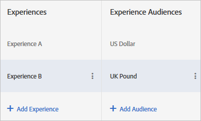

# A/B テストの複数のエクスペリエンスオーディエンス

[!DNL Adobe Target]個のA/B アクティビティで、同じエクスペリエンスのバージョンを異なるオーディエンスにターゲティングできます。 [!UICONTROL Visual Experience Composer] （VEC）またはフォームベースのExperience Composerで、1つのエクスペリエンスに複数のオーディエンスを設定できます。

訪問者は、プロファイルの変更に応じてエクスペリエンスオーディエンスを切り替えることができます。 訪問者は、アクティビティの有効期間について同じエクスペリエンスに留まっているわけではありません。

例えば、サイトがページや製品を通して一貫性のあるデザインを使用していて、同じエクスペリエンスを複数のオーディエンスに使用したい場合（ブラウザーの言語が異なる訪問者など）、エクスペリエンスのバージョンを複数設定することができます。 例えば、英語と日本語の訪問者に同じエクスペリエンスを提示し、テキストだけを訪問者の言語に置き換えることがあります。 エクスペリエンスのデータを言語に関係なく収集すれば、レポートは、バージョンのパフォーマンスではなくエクスペリエンスのパフォーマンスを示すことになります。

エクスペリエンスのバージョンを設定する機能がなければ、（この用例では）それぞれの言語に異なるテストを設定し、結果を手動で集計して、両言語で提供した単一のエクスペリエンスがどのようなパフォーマンスを示したかを推定しなければなりません。 そのため、結果が不正確になります。 テストによっては、訪問者がランダム化されるため、こういった計算が役に立たないこともあります。

1 つのエクスペリエンスから複数のバージョンを作成することで、手動の計算をしたり前提条件を立てたりしなくても、より正確な情報を入手できます。

## シナリオ

一般的なバナーではなく、地域をターゲットにしたバナーという2つのエクスペリエンスをテストしています。 地域ごとにバナーを変える必要がありますが、全体的なテストは、地域ターゲティングが一般的なコンテンツを表示するよりも優れているかどうかを判断することです。 地域ごとに個別のエクスペリエンスを設定する場合は、一般的なバナーと比較して、ジオターゲティングが成功目標を達成するのに役立つかどうかを測定するのではなく、実際には、各地域のパフォーマンスを比較して測定します。

この場合、必要なのはエクスペリエンスの地域固有のバージョンなので、位置情報をターゲットにしたエクスペリエンスを、位置情報をターゲットにしないコントロールに対してテストすることができます。

1. [通常通りに A/B アクティビティを作成](/help/main/c-activities/t-test-ab/t-test-create-ab/test-create-ab.md)します。

   複数のバージョンを持つエクスペリエンスを設定する際に、次の手順のようにして各バージョンのオーディエンスを選択します。

1. エクスペリエンスを選択し、**[!UICONTROL Configure]** > **[!UICONTROL Audiences]** > **[!UICONTROL Multiple Audiences]**&#x200B;をクリックします。

   

1. 「**[!UICONTROL オーディエンスを追加]**」をクリックし、最初にターゲットにするオーディエンスを選択します。 各オーディエンスについて繰り返します。

   

   オーディエンスがまだ存在しない場合は、「[オーディエンスを作成](/help/main/c-target/c-audiences/create-audience.md#task_E18BD77A9A8F4ED0AC50569F94556558)」をクリックして設定します。

   訪問者が 2 つ以上のオーディエンスにあてはまる場合は、すべてのオーディエンスのコンテンツが戻され、そのリストの中で最後のものが実際にページにレンダリングされます。

1. 続けてアクティビティを設定します。

## ベストプラクティス

* 相互排他的なオーディエンスを選択。 VECでアクティビティが作成された場合、訪問者が複数のオーディエンスと一致すると、各オーディエンスのコンテンツが返され、最後にリストされたオーディエンスのコンテンツがページに表示されます。
* ダイアグラムで定義されたアクティビティエントリオーディエンスは、エクスペリエンスオーディエンスと AND の条件で組み合わされます。 アクティビティに入るためには、訪問者はアクティビティのオーディエンスとエクスペリエンスオーディエンスのうちの 1 つにあてはまらなければなりません。
* レポートのセグメントとして、同じオーディエンスを追加します。 これにより、エクスペリエンス AとBの高レベルでのテスト結果を確認できます。また、エクスペリエンス AとBの低レベルでのテスト結果は、「ブラウザーの長さja_JP」に限定されます。 これは、[!DNL Analytics] ベースのレポートではなく、[!DNL Target] ベースのレポートでのみ機能します。
