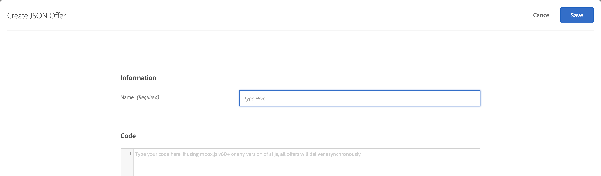
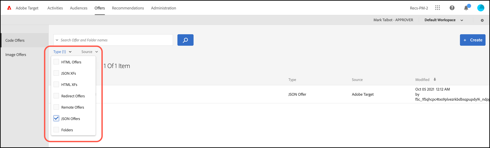

# JSON オファーの作成

[!DNL Adobe Target]の[!UICONTROL &#x200B; オファーライブラリ &#x200B;]でJSON オファーを作成し、[!UICONTROL &#x200B; フォームベースのExperience Composer]で使用します。

JSON オファーをフォームベースのアクティビティで使用すると、SPA フレームワークまたはサーバーサイド統合で使用するためにJSON形式でオファーを送信するために[!DNL Target]決定が必要なユースケースを有効にできます。

## JSONの考慮事項

JSON オファーを使用する際は次の点を考慮してください。

* JSON オファーは現在、[!UICONTROL A/B テスト &#x200B;]、[!UICONTROL Automated Personalization] （AP）、[!UICONTROL &#x200B; エクスペリエンスのターゲット設定] （XT）アクティビティでのみ使用できます。
* JSON オファーは、[&#x200B; フォームベースのアクティビティ &#x200B;](/help/main/c-experiences/form-experience-composer.md)でのみ使用できます。
* JSON オファーは、[Server Side APIとMobile Node.js、Java、.NET、およびPython SDK](https://experienceleague.adobe.com/docs/target-dev/developer/server-side/server-side-overview.html?lang=ja){target=_blank}を使用している場合に直接取得できます。
* ブラウザーでは、JSON オファーは、`setJson` アクションを使用してアクションをフィルタリングすることにより、at.js 1.2.3 （以降）および[getOffer （） &#x200B;](https://experienceleague.adobe.com/docs/target-dev/developer/client-side/at-js-implementation/functions-overview/adobe-target-getoffer.html){target=_blank}を使用してのみ取得できます。
* JSON オファーは、文字列ではなくネイティブの JSON オブジェクトとして配信されます。 これらのオブジェクトを利用する際に、オブジェクトを文字列として処理し、JSON オブジェクトに変換する必要はなくなりました。
* JSON オファーはビジュアルオファーではないので、他のオファー（HTML オファーなど）とは異なり自動的に適用されることはありません。 開発者は、[getOffer （） &#x200B;](https://experienceleague.adobe.com/docs/target-dev/developer/client-side/at-js-implementation/functions-overview/adobe-target-getoffer.html){target=_blank}を使用してオファーを明示的に取得するコードを記述する必要があります。

## JSON オファーの作成 {#section_BB9C72D59DEA4EFB97A906AE7569AD7A}

1. 「**[!UICONTROL オファー]**」 > 「**[!UICONTROL コードオファー]**」をクリックします。

   

1. **[!UICONTROL 作成]**／**[!UICONTROL JSON オファー]**&#x200B;をクリックします。

   

1. オファー名を入力します。
1. 「**[!UICONTROL コード]**」ボックスに JSON コードを入力するか貼り付けます。
1. 「**[!UICONTROL 保存]**」をクリックします。

## JSONの例 {#section_A54F7BB2B55D4B7ABCD5002E0C72D8C9}

JSON オファーは、[&#x200B; フォームベースのExperience Composer](/help/main/c-experiences/form-experience-composer.md)を使用して作成されたアクティビティでのみサポートされます。 現在、JSON オファーを使用できる唯一の方法は、ダイレクト API/SDK呼び出しです。

次に例を示します。

```json
adobe.target.getOffer({ 
  mbox: "some-mbox", 
  success: function(actions) { 
    console.log('Success', actions); 
  }, 
  error: function(status, error) { 
    console.log('Error', status, error); 
  } 
});
```

success コールバックに渡すアクションは、オブジェクトの配列です。 次のコンテンツを含む単一の JSON オファーがあるとします。

```json
{ 
  "demo": {"a": 1, "b": 2} 
}
```

アクション配列には、次の構造があります。

```json
[ 
 { 
   action: "setJson", 
   content: [{ 
     "demo": {"a": 1, "b": 2} 
   }] 
 }  
]
```

JSON オファーを抽出するには、アクションを繰り返し、`setJson` アクションを使用してアクションを見つけ、コンテンツ配列を繰り返します。

## ユースケース {#section_85B07907B51A43239C8E3498EF58B1E5}

次の JSON オファーが Web ページに配信されるとします。

```json
{ 
    "_id": "5a65d24d8fafc966921e9169", 
    "index": 0, 
    "guid": "7c006504-c6f7-468d-a46f-f72531ea454c", 
    "isActive": true, 
    "balance": "$2,075.06", 
    "picture": "https://placehold.it/32x32", 
    "tags": [ 
      "esse", 
      "commodo", 
      "excepteur"
    ], 
    "friends": [ 
      { 
        "id": 0, 
        "name": "Carla Lyons" 
      }, 
      { 
        "id": 1, 
        "name": "Ollie Mooney" 
      } 
    ], 
    "greeting": "Hello, Stephenson Fernandez! You have 4 unread messages.", 
    "favoriteFruit": "strawberry" 
} 
  
```

次のコードは、「greeting」属性にアクセスする方法を示しています。

```json
adobe.target.getOffer({   
  "mbox": "name_of_mbox", 
  "params": {}, 
  "success": function(offer) {           
        console.log(offer[0].content[0].greeting); 
  },   
  "error": function(status, error) {           
      console.log('Error', status, error); 
  } 
});
```

## Real-time CDP プロファイル属性を使用したJSON オファーの例

Real-time CDP プロファイル属性は、[!DNL Target]と共有して、HTMLおよびJSON オファーで使用できます。

詳しくは、[Real-time CDP プロファイル属性を [!DNL Target]](/help/main/c-integrating-target-with-mac/integrating-with-rtcdp.md#rtcdp-profile-attributes)と共有するを参照してください。

## JSON オファータイプによるオファーのフィルタリング {#section_52533555BCE6420C8A95EB4EB8907BDE}

**[!UICONTROL Type]** ドロップダウンリストをクリックし、**[!UICONTROL JSON]** チェックボックスを選択することで、[!UICONTROL Offers] ライブラリをJSON オファータイプでフィルタリングできます。


