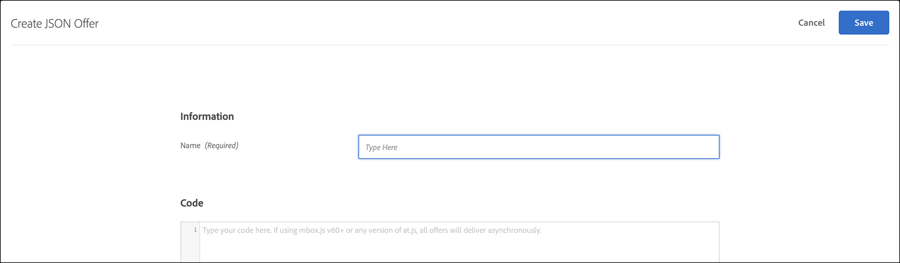

# JSON オファーの作成

での JSON オファーの作成 [!UICONTROL Offer Library] 。対象： [!DNL Adobe Target] で使用する [!UICONTROL Form-Based Experience Composer].

JSON オファーはフォームベースのアクティビティで使用することができ、以下のようなユースケースに対応できます [!DNL Target] SPA フレームワークまたはサーバーサイド統合で使用するために、JSON 形式でオファーを送信するには、決定が必要です。

## JSON の考慮事項

JSON オファーを使用する際は次の点を考慮してください。

* JSON オファーは現在、次の場合にのみ使用できます [!UICONTROL A/B Test]、Automated Personalization（AP）および [!UICONTROL Experience Targeting] （XT） アクティビティ。
* JSON オファーは次で使用できます [フォームベースのアクティビティ](/help/main/c-experiences/form-experience-composer.md) のみ。
* JSON オファーは、 [サーバーサイド API と Mobile Node.js、Java、.NET、Python SDK](https://experienceleague.adobe.com/docs/target-dev/developer/server-side/server-side-overview.html?lang=ja){target=_blank}.
* ブラウザーでは、JSON オファーは、at.js 1.2.3 （またはそれ以降）経由でのみ、を使用して取得できます [getOffer （）](https://experienceleague.adobe.com/docs/target-dev/developer/client-side/at-js-implementation/functions-overview/adobe-target-getoffer.html){target=_blank} を使用してアクションをフィルタリングする `setJson` アクション。
* JSON オファーは、文字列ではなくネイティブの JSON オブジェクトとして配信されます。これらのオブジェクトを利用する際に、オブジェクトを文字列として処理し、JSON オブジェクトに変換する必要はなくなりました。
* JSON オファーはビジュアルオファーではないので、他のオファー（HTML オファーなど）とは異なり自動的に適用されることはありません。開発者は、を使用してオファーを明示的に取得するコードを記述する必要があります。 [getOffer （）](https://experienceleague.adobe.com/docs/target-dev/developer/client-side/at-js-implementation/functions-overview/adobe-target-getoffer.html){target=_blank}.

## JSON オファーの作成 {#section_BB9C72D59DEA4EFB97A906AE7569AD7A}

1. クリック **[!UICONTROL Offers]** > **[!UICONTROL Code Offers]**.

   

1. クリック **[!UICONTROL Create]** > **[!UICONTROL JSON Offer]**.

   

1. オファー名を入力します。
1. に JSON コードを入力または貼り付けます **[!UICONTROL Code]** ボックス。
1. **[!UICONTROL Save]** をクリックします。

## JSON の例 {#section_A54F7BB2B55D4B7ABCD5002E0C72D8C9}

JSON オファーは、を使用して作成されたアクティビティでのみサポートされます [フォームベースの Experience Composer](/help/main/c-experiences/form-experience-composer.md). 現在、JSON オファーを使用できる唯一の方法は、直接の API/SDK 呼び出しを介することです。

次に例を示します。

```json
adobe.target.getOffer({ 
  mbox: "some-mbox", 
  success: function(actions) { 
    console.log('Success', actions); 
  }, 
  error: function(status, error) { 
    console.log('Error', status, error); 
  } 
});
```

success コールバックに渡すアクションは、オブジェクトの配列です。次のコンテンツを含む単一の JSON オファーがあるとします。

```json
{ 
  "demo": {"a": 1, "b": 2} 
}
```

アクション配列の構造は次のとおりです。

```json
[ 
 { 
   action: "setJson", 
   content: [{ 
     "demo": {"a": 1, "b": 2} 
   }] 
 }  
]
```

JSON オファーを抽出するには、アクションを反復処理し、 `setJson` 次に、コンテンツ配列を反復処理します。

## ユースケース {#section_85B07907B51A43239C8E3498EF58B1E5}

次の JSON オファーが Web ページに配信されるとします。

```json
{ 
    "_id": "5a65d24d8fafc966921e9169", 
    "index": 0, 
    "guid": "7c006504-c6f7-468d-a46f-f72531ea454c", 
    "isActive": true, 
    "balance": "$2,075.06", 
    "picture": "https://placehold.it/32x32", 
    "tags": [ 
      "esse", 
      "commodo", 
      "excepteur"
    ], 
    "friends": [ 
      { 
        "id": 0, 
        "name": "Carla Lyons" 
      }, 
      { 
        "id": 1, 
        "name": "Ollie Mooney" 
      } 
    ], 
    "greeting": "Hello, Stephenson Fernandez! You have 4 unread messages.", 
    "favoriteFruit": "strawberry" 
} 
  
```

次のコードは、「greeting」属性にアクセスする方法を示しています。

```json
adobe.target.getOffer({   
  "mbox": "name_of_mbox", 
  "params": {}, 
  "success": function(offer) {           
        console.log(offer[0].content[0].greeting); 
  },   
  "error": function(status, error) {           
      console.log('Error', status, error); 
  } 
});
```

## Real-time CDP プロファイル属性を使用した JSON オファーの例

Real-time CDP プロファイル属性は、と共有できます [!DNL Target] HTMLオファーと JSON オファーで使用します。

詳しくは、を参照してください [Real-time CDP プロファイル属性のとの共有 [!DNL Target]](/help/main/c-integrating-target-with-mac/integrating-with-rtcdp.md#rtcdp-profile-attributes).

## JSON オファータイプによるオファーのフィルタリング {#section_52533555BCE6420C8A95EB4EB8907BDE}

次をフィルタリングできます [!UICONTROL Offers] 「」をクリックし、JSON オファータイプ別にライブラリ化します。 **[!UICONTROL Type]** ドロップダウンリストを選択し、 **[!UICONTROL JSON]** チェックボックス。


