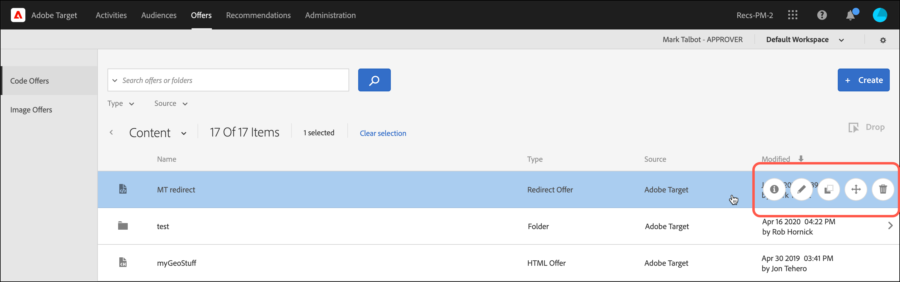

# オファー

の使用 [!UICONTROL Offers] のライブラリ [!DNL Adobe Target] を使用して、コードオファーと画像オファーのコンテンツを管理します。

>[!NOTE]
>
>この記事には、の更新に関する情報が含まれています [!DNL Target] 現在ベータ版プログラムに含まれているユーザーインターフェイス。 この [!DNL Adobe Target] チームは、多くの場合、一部のお客様に対して、テストやフィードバックの目的で新機能を有効にします。 テスト期間が完了すると、今後、これらの機能はすべての顧客に対して有効になります [!DNL Target Standard/Premium] のリリースとリリースは、リリースノートで発表されました。

1. クリック **[!UICONTROL Offers]** をクリックしてライブラリを開きます。

   ライブラリには、[!DNL Target Standard/Premium]、[!DNL Target Classic]、[!DNL Adobe Experience Manager]（AEM）、[!DNL Adobe Mobile Services]（AMS）および API で設定されたオファーが含まれています。[!DNL Target Classic] またはその他のソリューションで作成されたオファーは [!DNL Target Standard/Premium] で編集可能です。

   この [!UICONTROL Offers] ページの右側に 2 つのタブがあります。 [!UICONTROL Code Offers] および [!UICONTROL Image Offers] タイプ別にオファーを表示できます。

   

1. （任意） **[!UICONTROL Type]** タイプでオファーをフィルタリングするためのドロップダウンリスト（HTMLオファー、 [エクスペリエンスフラグメント](/help/main/c-experiences/c-manage-content/aem-experience-fragments.md), [リダイレクトオファー](/help/main/c-experiences/c-manage-content/offer-redirect.md), [リモートオファー](/help/main/c-experiences/c-manage-content/about-remote-offers.md), [JSON オファー](/help/main/c-experiences/c-manage-content/create-json-offer.md)、および [フォルダー](/help/main/c-experiences/c-manage-content/create-content-folder.md)）に設定します。

   

1. （任意） **[!UICONTROL Source]** ソース（Adobe Target、Adobe Target Classic、Adobe Experience Manager）別にオファーをフィルタリングするドロップダウンリスト。

1. （オプション）で目的のオファーまたはフォルダーにカーソルを合わせて、追加のタスクを実行します。 [!UICONTROL Code Offers] タブをクリックしてから、目的のアイコンをクリックします。

   

   オプションは以下のとおりです。

   * を表示します（詳しくは、 [オファー定義の表示](#section_6B059DD121434E6292CAB393507D010E) 下）
   * 編集
   * コピー
   * 移動（例えば、1 つ以上の項目を 1 つのフォルダーに移動するには、 **[!UICONTROL Move]** アイコンをクリックします。目的の項目を選択し、 **[!UICONTROL Drop]**.）
   * 削除

   権限によっては、一部のオプションのアイコンが表示されない場合があります。 例えば、次を含むユーザー [!UICONTROL Observer] 権限にはを使用する権限がありません [!UICONTROL Copy] オプション。

   オファーおよびフォルダーに対して実行できるタスクについて詳しくは、を参照してください。 [アセットライブラリ内のコンテンツの操作](/help/main/c-experiences/c-manage-content/assets-working.md).

1. （オプション）で目的の画像オファーまたはフォルダーにカーソルを合わせて、追加のタスクを実行します [!UICONTROL Image Offers] タブをクリックしてから、目的のアイコンをクリックします。

   

   オプションは以下のとおりです。

   * 選択
   * ダウンロード
   * プロパティを表示
   * 編集
   * 注釈
   * コピー

   オファーおよびフォルダーに対して実行できるタスクについて詳しくは、を参照してください。 [アセットライブラリ内のコンテンツの操作](/help/main/c-experiences/c-manage-content/assets-working.md).

   >[!NOTE]
   >
   >画像オファーはの一部ではありません [Enterprise ユーザーの権限](/help/main/administrating-target/c-user-management/property-channel/property-channel.md) モデル。

## オファー定義の表示 {#section_6B059DD121434E6292CAB393507D010E}

のポップアップカードにオファー定義の詳細を表示できます [!UICONTROL Offers] オファーを開かないライブラリ。

例えば、HTMLオファーに対して次に示すオファー定義カードには、 [!UICONTROL Content] リストに追加したら、情報アイコンをクリックします。

以下の情報が表示されます。

* 名前
* ソース
* タイプ
* オファー ID
* オファーパス
* 最終変更日

「」をクリックします [!UICONTROL Offer Usage] タブをクリックして、各オファーの定義ポップアップカードでコードオファーを参照するアクティビティを表示します。 この機能は画像オファーには適用されません。これにより、オファーの編集中に他のアクティビティに影響が及ぶことを防止できます。次の情報が含まれます [!UICONTROL Live Activities] および [!UICONTROL Inactive Activities].

以下に示すリダイレクトオファーのオファー定義カードの場合：

以下の情報が表示されます。

* 名前
* ソース
* タイプ
* オファー ID
* オファーパス
* 最終変更日
* リダイレクト URL
* すべての URL パラメーターを含める（オンまたはオフ）
* mbox セッション ID を渡す（オンまたはオフ）

以下に示すリモートオファーのオファー定義カードの場合：

以下の情報が表示されます。

* 名前
* ソース
* タイプ
* オファー ID
* オファーパス
* 最終変更日
* リダイレクト URL のタイプ
* 絶対 URL または相対 URL

## トレーニングビデオ：コンテンツリポジトリ 

このビデオでは、オファーの管理について説明します。

* [Experience Cloud アセットライブラリ](https://experienceleague.adobe.com/docs/core-services/interface/assets/creative-cloud.html)と Target コンテンツライブラリの間の接続
* カスタム HTML オファー
* Visual Experience Composer のカスタム HTML オファー

>[!VIDEO](https://video.tv.adobe.com/v/17387)
