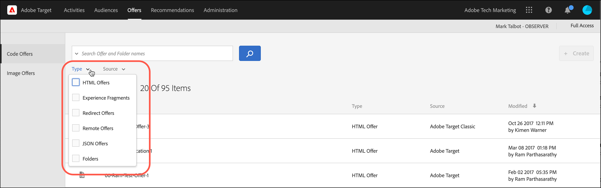
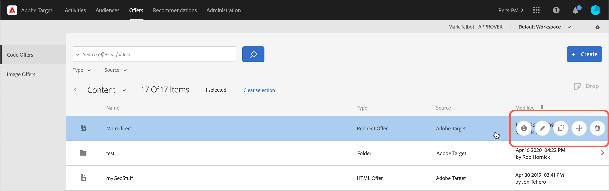
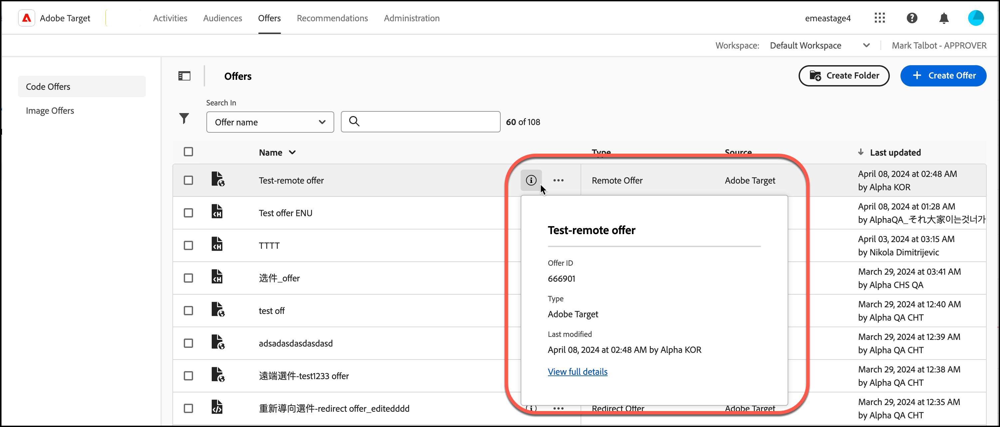

# オファー

コード オファーと画像オファーのコンテンツを管理するには、[!DNL Adobe Target]の[!UICONTROL  オファー] ライブラリを使用します。

1. **[!UICONTROL オファー]**&#x200B;をクリックして、ライブラリを開きます。

   ライブラリには、[!DNL Target Standard/Premium]、[!DNL Target Classic]、[!DNL Adobe Experience Manager]（AEM）、[!DNL Adobe Mobile Services]（AMS）および API で設定されたオファーが含まれています。 [!DNL Target Classic] またはその他のソリューションで作成されたオファーは [!DNL Target Standard/Premium] で編集可能です。

   [!UICONTROL  オファー] ページには、右側に2つのタブがあります。[!UICONTROL  コードオファー]と[!UICONTROL 画像オファー] タイプ別にオファーを表示できます。

   

1. （オプション）「**[!UICONTROL タイプ]**」ドロップダウンリストをクリックして、オファーをタイプ別にフィルタリングします（HTML オファー、[ エクスペリエンスフラグメント ](/help/main/c-experiences/c-manage-content/aem-experience-fragments.md)、[ リダイレクトオファー](/help/main/c-experiences/c-manage-content/offer-redirect.md)、[ リモートオファー](/help/main/c-experiences/c-manage-content/about-remote-offers.md)、[JSON オファー](/help/main/c-experiences/c-manage-content/create-json-offer.md)、および[ フォルダー](/help/main/c-experiences/c-manage-content/create-content-folder.md)）。

   

1. （オプション）「**[!UICONTROL Source]**」ドロップダウンリストをクリックして、オファーをソース別にフィルタリングします（Adobe Target、Adobe Target Classic、Adobe Experience Manager）。

1. （オプション）「[!UICONTROL  コードオファー]」タブの目的のオファーまたはフォルダーにカーソルを合わせ、目的のアイコンをクリックして、追加のタスクを実行します。

   

   オプションは以下のとおりです。

   * 表示（詳細については、以下の「[ オファー定義の表示](#section_6B059DD121434E6292CAB393507D010E)」を参照してください）。
   * 編集
   * コピー
   * 移動（例えば、1つ以上のアイテムをフォルダーに移動するには、目的のアイテムの&#x200B;**[!UICONTROL 移動]** アイコンをクリックし、目的のフォルダーをクリックしてから、**[!UICONTROL ドロップ]**&#x200B;をクリックします）。
   * 削除

   権限によっては、すべてのオプションにアイコンが表示されない場合があります。 例えば、[!UICONTROL Observer]権限を持つユーザーには、[!UICONTROL Copy] オプションを使用する権限がありません。

   オファーとフォルダーで実行できるタスクについて詳しくは、[ アセットライブラリでのコンテンツの操作](/help/main/c-experiences/c-manage-content/assets-working.md)を参照してください。

1. （オプション）「[!UICONTROL 画像オファー]」タブの目的の画像オファーまたはフォルダーにカーソルを合わせ、目的のアイコンをクリックして、追加のタスクを実行します。

   

   オプションは以下のとおりです。

   * 選択
   * ダウンロード
   * プロパティを表示
   * 編集
   * 注釈
   * コピー

   オファーとフォルダーで実行できるタスクについて詳しくは、[ アセットライブラリでのコンテンツの操作](/help/main/c-experiences/c-manage-content/assets-working.md)を参照してください。

   >[!NOTE]
   >
   >画像オファーは、[ エンタープライズユーザー権限](/help/main/administrating-target/c-user-management/property-channel/property-channel.md) モデルの一部ではありません。

## オファー定義の表示 {#section_6B059DD121434E6292CAB393507D010E}

オファーを開かずに、[!UICONTROL Offers] ライブラリのポップアップカードでオファー定義の詳細を表示できます。

例えば、HTML オファーの次のオファー定義カードにアクセスするには、情報アイコンをクリックします。

以下の情報が表示されます。

* 名前
* オファー ID
* タイプ
* 最終変更日

「[!UICONTROL 詳細を表示]」リンクをクリックして、オファーコンテンツと、コードオファーを参照するアクティビティを表示します。 これにより、オファーの編集中に他のアクティビティに影響が及ぶことを防止できます。 情報には、[!UICONTROL  ライブアクティビティ ]と[!UICONTROL 非アクティブアクティビティ ]が含まれます。

各カードで利用できる情報は、オファータイプによって異なります。HTML オファー、[ エクスペリエンスフラグメント ](/help/main/c-experiences/c-manage-content/aem-experience-fragments.md)、[ リダイレクトオファー](/help/main/c-experiences/c-manage-content/offer-redirect.md)、[ リモートオファー](/help/main/c-experiences/c-manage-content/about-remote-offers.md)、または[JSON オファー](/help/main/c-experiences/c-manage-content/create-json-offer.md)。

オファーの詳細機能は、画像オファーには適用されません。

<!--

## Training video: The Content Repository 

This video includes information about managing offers.

* Connection between the [Experience Cloud Asset Library](https://experienceleague.adobe.com/docs/core-services/interface/assets/creative-cloud.html) and the Target Content Library 
* Custom HTML Offers 
* Custom HTML Offer in the [!UICONTROL Visual Experience Composer]

>[!VIDEO](https://video.tv.adobe.com/v/17387)

-->
