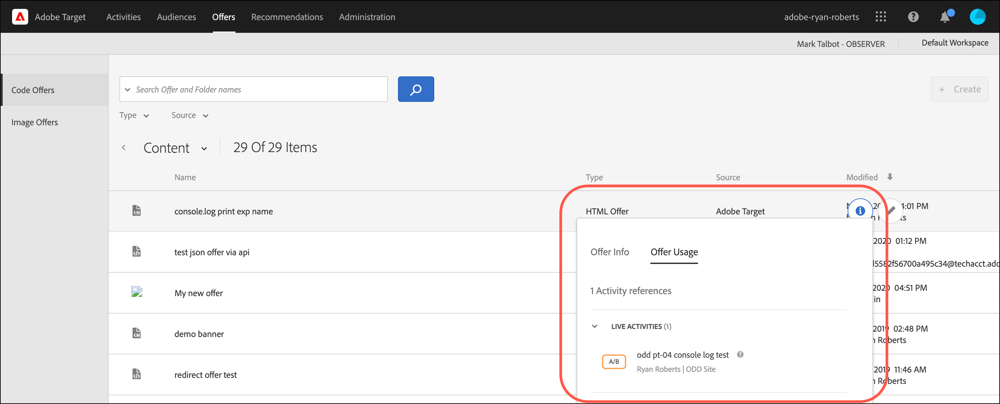
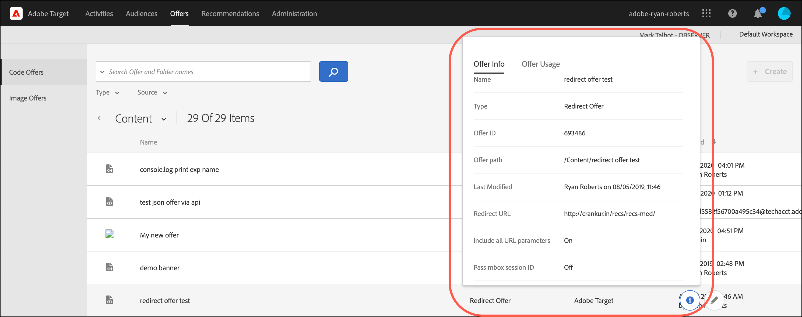
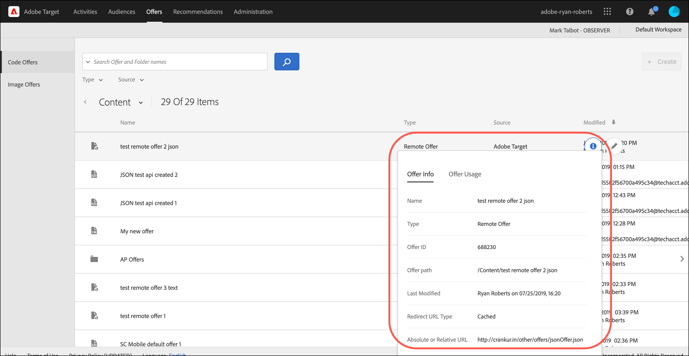

# オファー

以下を使用： [!UICONTROL オファー] ライブラリ [!DNL Adobe Target] コードオファーおよび画像オファーコンテンツを管理します。

1. **[!UICONTROL オファー]**&#x200B;をクリックして、ライブラリを開きます。

   ライブラリには、[!DNL Target Standard/Premium]、[!DNL Target Classic]、[!DNL Adobe Experience Manager]（AEM）、[!DNL Adobe Mobile Services]（AMS）および API で設定されたオファーが含まれています。[!DNL Target Classic] またはその他のソリューションで作成されたオファーは [!DNL Target Standard/Premium] で編集可能です。

   この [!UICONTROL オファー] ページには、右側に 2 つのタブがあります。 [!UICONTROL コードオファー] および [!UICONTROL 画像オファー] を使用して、タイプ別にオファーを表示できます。

   

1. （オプション） **[!UICONTROL タイプ]** タイプ別にオファーをフィルターするドロップダウンリスト (HTMLオファー、 [エクスペリエンスフラグメント](/help/main/c-experiences/c-manage-content/aem-experience-fragments.md), [リダイレクトオファー](/help/main/c-experiences/c-manage-content/offer-redirect.md), [リモートオファー](/help/main/c-experiences/c-manage-content/about-remote-offers.md), [JSON オファー](/help/main/c-experiences/c-manage-content/create-json-offer.md)、および [フォルダー](/help/main/c-experiences/c-manage-content/create-content-folder.md)) をクリックします。

   

1. （オプション） **[!UICONTROL ソース]** ドロップダウンリストを使用して、ソース (Adobe Target、Adobe Target Classic、Adobe Experience Manager) 別にオファーをフィルタリングできます。

1. （オプション）オファーまたはフォルダーの上にマウスポインターを置いて、追加のタスクを実行します。 [!UICONTROL コードオファー] 」タブをクリックし、目的のアイコンをクリックします。

   

   オプションは以下のとおりです。

   * 表示 ( 詳しくは、 [オファー定義の表示](#section_6B059DD121434E6292CAB393507D010E) 下 )
   * 編集
   * コピー
   * 移動 ( 例えば、1 つ以上の項目をフォルダーに移動するには、 **[!UICONTROL 移動]** 目的の項目のアイコンをクリックし、目的のフォルダーをクリックしてから、 **[!UICONTROL ドロップ]**.)
   * 削除

   権限によっては、すべてのオプションに対するアイコンが表示されない場合があります。 例えば、 [!UICONTROL 監視者] 権限には、 [!UICONTROL コピー] オプション。

   オファーおよびフォルダーで実行できるタスクについて詳しくは、 [アセットライブラリ内のコンテンツの操作](/help/main/c-experiences/c-manage-content/assets-working.md).

1. （オプション）追加のタスクを実行するには、 [!UICONTROL 画像オファー] 」タブをクリックし、目的のアイコンをクリックします。

   

   オプションは以下のとおりです。

   * Select
   * ダウンロード
   * プロパティを表示
   * 編集
   * 注釈
   * コピー

   オファーおよびフォルダーで実行できるタスクについて詳しくは、 [アセットライブラリ内のコンテンツの操作](/help/main/c-experiences/c-manage-content/assets-working.md).

## オファー定義の表示 {#section_6B059DD121434E6292CAB393507D010E}

オファー定義の詳細は、 [!UICONTROL オファー] ライブラリに含める必要はありません。

例えば、次に示すHTMLオファー定義カードは、 [!UICONTROL コンテンツ] リストを開き、情報アイコンをクリックします。

以下の情報が表示されます。

* 名前
* ソース
* タイプ
* オファー ID
* オファーパス
* 最終変更日

「[!UICONTROL オファーの使用状況]」タブをクリックし、各オファー定義のポップアップカードのコードオファーを参照しているアクティビティを表示します。この機能は画像オファーには適用されません。これにより、オファーの編集中に他のアクティビティに影響が及ぶことを防止できます。次の情報が含まれます。 [!UICONTROL ライブアクティビティ] および [!UICONTROL 非アクティブなアクティビティ].

以下に示すリダイレクトオファーのオファー定義カードの場合：

以下の情報が表示されます。

* 名前
* ソース
* タイプ
* オファー ID
* オファーパス
* 最終変更日
* リダイレクト URL
* すべての URL パラメーターを含める（オンまたはオフ）
* mbox セッション ID を渡す（オンまたはオフ）

以下に示すリモートオファーのオファー定義カードの場合：

以下の情報が表示されます。

* 名前
* ソース
* タイプ
* オファー ID
* オファーパス
* 最終変更日
* リダイレクト URL のタイプ
* 絶対 URL または相対 URL

## トレーニングビデオ：コンテンツリポジトリ

このビデオでは、オファーの管理について説明します。

* [Experience Cloud アセットライブラリ](https://experienceleague.adobe.com/docs/core-services/interface/assets/creative-cloud.html)と Target コンテンツライブラリの間の接続
* カスタム HTML オファー
* Visual Experience Composer のカスタム HTML オファー

>[!VIDEO](https://video.tv.adobe.com/v/17387)
