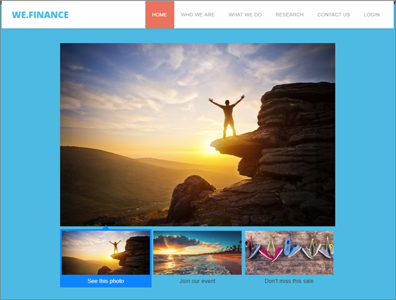
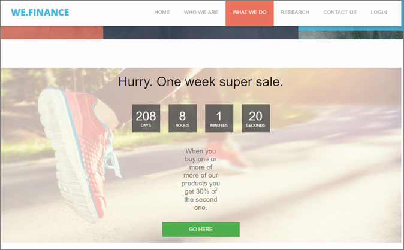
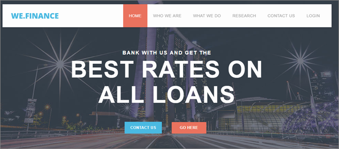
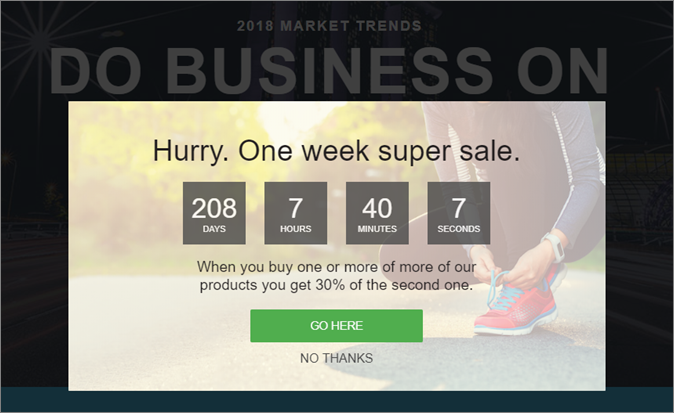
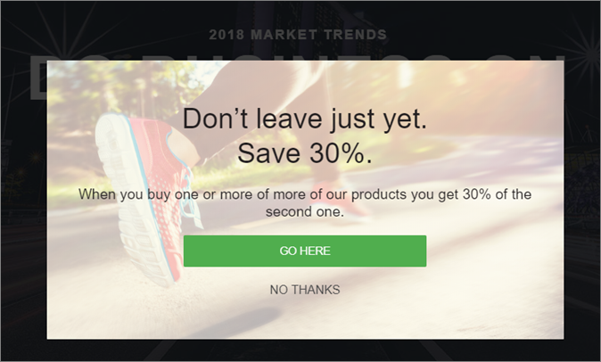
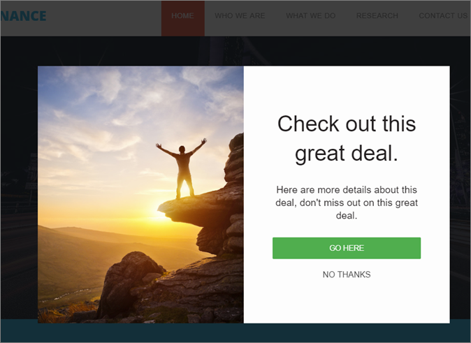

# エクスペリエンステンプレート

カスタムコードで使用する[!DNL Adobe Target] エクスペリエンステンプレートに関する情報。[!DNL Target] エクスペリエンステンプレートは、マーケターの一般的なユースケースを実行するために使用される、設定可能な入力を含む事前にコード化されたサンプルです。

これらのエクスペリエンステンプレートは、VEC またはフォームベースの Experience Composer を通じて一般的な使用例を実行するための出発点として開発者およびマーケティング担当者に無償で提供されます。

現在、次のテンプレートが Adobe Experience Cloud GitHub で提供されています。[Target-Experience-Templates](https://github.com/Adobe-Marketing-Cloud/target-experience-templates) を参照してください。

## サムネール付きバナーカルーセル {#section_BEEE51D47CC44A478264BBF3FEC70DAE}

[サムネール付きバナーカルーセルエクスペリエンステンプレート](https://github.com/Adobe-Marketing-Cloud/target-experience-templates/tree/master/banner-carousel-thumbnails)は、回転式カルーセルで、ホームページやランディングページなど、大ボリュームのエントリページでよく使用されます。 このカルーセルの画像は自動的には切り替わらず、主画像の下にある小さな画像をクリックすることで直接操作できます。

## バナーカルーセル {#section_725D4C0C4FCD41FA92BCFC910A216E2A}

[バナーカルーセルエクスペリエンステンプレート](https://github.com/Adobe-Marketing-Cloud/target-experience-templates/tree/master/banner-carousel)は、回転式カルーセルで、ホームページやランディングページなど、大ボリュームのエントリページでよく使用されます。 このカルーセルの画像は自動的には切り替わらず、左右の矢印をクリックすることで直接操作できます。

## バナーカウントダウン {#section_ED9501FE096C4CD7B6D9933E0322B4AD}

[バナーカウントダウンエクスペリエンステンプレート](https://github.com/Adobe-Marketing-Cloud/target-experience-templates/tree/master/banner-countdown)は、中央にカウントダウンが配置された大きなバナーで、ホームページやランディングページなど、大ボリュームのエントリページでよく使用されます。

## ボタンビルダー {#section_DBDD1C9A9F294FB6BABBC04B4454E59B}

[ボタンビルダーエクスペリエンステンプレート](https://github.com/Adobe-Marketing-Cloud/target-experience-templates/tree/master/button)は、テキストのコールトゥアクションを含む小さなボタンです。 ボタンは設定可能で、ページ上の任意の場所に配置することにより、新しいコールトゥアクションを追加したり、既存のボタンを設定可能な別のボタンに置き換えたりすることができます。

## カウントダウン付きライトボックス {#section_E1177C52F1294EA5AC48312727CD3DF4}

[カウントダウン付きライトボックスエクスペリエンステンプレート](https://github.com/Adobe-Marketing-Cloud/target-experience-templates/tree/master/lightbox-countdown)は、中央にカウントダウンが配置されたライトボックスオーバーレイポップアップで、ホームページやランディングページなど、大ボリュームのエントリページでよく使用されます。

## ページを離れようとしているユーザー向けのポップアップ付きライトボックス {#section_E624C867E4CD4F2294CFC7917EFAEBD7}

[ページを閉じようとしているユーザー向けのポップアップ付きライトボックスエクスペリエンステンプレート](https://github.com/Adobe-Marketing-Cloud/target-experience-templates/tree/master/lightbox-exit-intent)は、訪問者が（画面の右上にマウスを移動して）ページを閉じようとしたときにトリガーされるライトボックスオーバーレイポップアップで、ページが閉じられる前に関心を引きたい Web プロパティにデプロイできます。

## ライトボックス {#section_EF4FBA08CE55407CAFB334340C6C1577}

[ ライトボックスエクスペリエンステンプレート ](https://github.com/Adobe-Marketing-Cloud/target-experience-templates)は、遅延を組み込んだライトボックスオーバーレイポップアップで、ホームページやランディングページ、またはその他の大量のエントリーページで一般的に使用されます。

## リボン {#section_CCBB656265F140AEA1B200409D719000}

[リボンエクスペリエンステンプレート](https://github.com/Adobe-Marketing-Cloud/target-experience-templates/tree/master/ribbon)は、Web ページの最上部に挿入される 100％幅のリボンで、通常は、期間限定セール、送料無料キャンペーン、安全や天気に関する情報など、重要なお知らせを発表する目的に使用されます。

