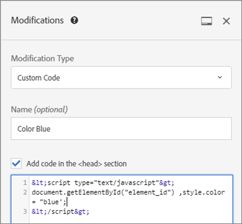

# 変更

次に関する情報： [!UICONTROL 変更] ページ内 [!DNL Adobe Target] ページに対する変更を表示し、さらに変更（CSS セレクター、mbox、カスタムコード）を追加できます。

この [!UICONTROL 変更] ページには、Visual Experience Composer(VEC) でページに対しておこなわれたすべての変更が表示され、ページの各要素をクリックして追加の変更を加えることができます。 [アクションの選択](/help/main/c-experiences/c-visual-experience-composer/viztarget-options.md#reference_3BD1BEEAFA584A749ED2D08F14732E81). おこなった各変更は、「[!UICONTROL 変更]」リストに別個のアクションまたは要素として表示されます。さらに、CSS セレクター、mbox、カスタムコードなどのタイプの変更を加えることもできます。

## 変更の概要 {#section_EE27E7572AA74397BBDED563B2B3D509}

[!UICONTROL 変更]ページには、VEC でページに対しておこなったすべての変更が表示されます。おこなった各変更は、「[!UICONTROL 変更]」リストに別個のアクションまたは要素として表示されます。


変更ページを使用すると、VEC を使用してコンテンツの配信方法を設定するときに Target で選択されるセレクターに少し変更を加えることができます。コンテンツまたは HTML 属性を変更できます。コードを編集して、mbox 内に HTML オファーと同等のものを作成することもできます。

変更ページを使用すると、次のことをおこなえます。

* Visual Experience Composer でおこなったアクションの表示。

   

* 既存のアクションの編集。目的の変更の上にマウスポインターを置いて、**[!UICONTROL 編集]**&#x200B;アイコンをクリックします。

   

   変更を加えます。

   

* 既存のアクションの削除. 目的の変更の上にマウスポインターを置いて、**[!UICONTROL 削除]**&#x200B;アイコンをクリックします。

   

* 新しい変更の追加。「**[!UICONTROL 変更を追加]**」または + アイコンをクリックし、以下に示すように変更を指定します。

   

   変更が 1 つ作成されたら、Target には、パネルの下部にある「変更を追加」ボタンの代わりに、変更パネルの上部に + アイコンが表示されることに注意してください。

* 変更パネルを Target UI の側辺に沿って垂直に、または下部へ水平にドッキングします。[!UICONTROL ドック]アイコンをクリックして、2 つの設定の間の切り替えをおこないます。

   

   次の図に、画面の下部にドッキングされた変更パネルを示します。

   

## 変更の追加 {#section_C7ABCD5731A048CB8F90EDC31A32EDF9}

1. 選択したエクスペリエンスの [!UICONTROL 変更] ページを表示するには、VECで **[!UICONTROL 、変更]**&lt;/>アイコンをクリックします。

   

   >[!NOTE]
   >
   >フォームベースの Experience Composer で変更パネルを開くには、HTMLオ ファーを作成または編集します。詳しくは、[フォームベースの Experience Composer](/help/main/c-experiences/form-experience-composer.md#task_FAC842A6535045B68B4C1AD3E657E56E) を参照してください。

   [!UICONTROL 変更]ページが開き、左側のビジュアルモードと右側の変更パネルに画面が分割されます。[!UICONTROL ドック]アイコンをクリックして、変更パネルを Target UI の側辺に沿って垂直に、または下部へ水平にドッキングします。次の図のエクスペリエンス A は、これまで変更されたことがありません。

   

   エクスペリエンス B については、これまでの変更が右側の]変更[!UICONTROL パネルに表示されます。

   

1. 変更を追加するには：

   * エクスペリエンスにこれまで変更がない場合は、右側の&#x200B;**[!UICONTROL 変更]**&#x200B;パネルの下部にある「[!UICONTROL 変更を追加]」ボタンをクリックします。
   * エクスペリエンスに以前の変更がある場合は、右側の]変更[!UICONTROL パネルの上部にある + アイコンをクリックします。

   次のような変更パネルが表示されます。

   

1. 「**[!UICONTROL 変更タイプ]**」ドロップダウンリストで、目的のタイプを選択します。

   | 変更タイプ | 詳細 |
   |--- |--- |
   | CSS セレクター | CSS 要素セレクターボックスで、変更する CSS 要素を指定し、アクションタイプ（「コンテンツを設定」または「属性を設定」）を選択して、必要な情報と目的のコンテンツを入力します。 |
   | mbox | mbox 名と目的のコンテンツを指定します。<p>**注意**:at.js 2 を使用するページでは、VEC で mbox はサポートされなくなりました。**。<p>回避策として：<ul><li>at.js 2.*x*&#x200B;をクリックし、mbox の変更の代わりに CSS セレクターの変更を追加して、mbox が使用していたセレクターにコンテンツを追加します。 </li><li>フォームベースのアクティビティの使用 (mbox と at.js 1.*x* と at.js 2.*x*) をクリックします。</li><li>at.js 1.*x* （VEC 内）</li></ul> |
   | カスタムコード | オプションの名前を指定し、「[!UICONTROL セクションに`<HEAD>` コードを追加]」チェックボックスを必要に応じて選択または選択解除して、カスタムコードを追加します。<p>「[!UICONTROL セクションに`<HEAD>` コードを追加]」を選択した場合、カスタムコードは `<head>` セクションに追加され、本文またはページの読み込みイベントを待たずに実行されます。`<script>` および  `<style>` の要素のみを追加します。`<div>` タグなどの要素を追加すると、残りの `<head>` 要素が `<body>` に表示される場合があります。at.js を使用している場合、すべてのオファーは非同期的に配信されます。<p> 「[!UICONTROL セクションに`<HEAD>` コードを追加]」の選択を解除した場合、カスタムコードは `<body>` タグの直後に実行されます。すべてのコードを 1 つの `<div>` 内にラップして、DOM 構造を保持します。at.js を使用している場合、すべてのオファーは非同期的に配信されます。<p>のHTML `<BODY>` 次を含む `<SCRIPT>` および `<DIV>`を、 `<DIV>` が `<BODY>` および `<SCRIPT>` が次の中で実行されます： `<HEAD>`. また、 `<SCRIPT>` を読み込み、外部ファイルを `<HEAD>`.<p>**注意**：スクリプトは、非同期で実行されます。つまり、例えば `document.write` や類似のスクリプトメソッドは使用できません。<p>カスタムコードでは、非ビジュアルインターフェイスを使用して、VEC、フォームベースの Experience Composer、HTML オファーエディター内でアクションを表示および編集したり、新規で追加したりできます。パネルでは、エクスペリエンスのコードを見ながら、複雑なエクスペリエンスの構築、既存のエクスペリエンスの調整、問題のトラブルシューティングをおこなうことができます。<p>カスタムコードは、HTML、JavaScript および CSS の使用に慣れた上級ユーザー向けの機能です。コードビューでは、コードを変更して微調整したり、セレクターの問題を修正したりできます。新しいカスタムコードおよびアクションを追加することもできます。カスタムコードを複数追加し、オプションでそれぞれのカスタムコードに名前を付けることができます。<p>**注意**：カスタムコードは、現在、A/B テストおよびエクスペリエンスのターゲット設定（XT）のアクティビティでのみ利用できます。オーバーレイの場合とリダイレクトオファーが適用されている場合、カスタムコードは無効になります。<p>カスタムコードでは、次のような操作をおこなうことができます。<ul><li>ページ上部で実行するカスタムの JavaScript、HTML または CSS の追加</li><li>変更後に VEC によって生成されるコードの表示または編集</li><li>セレクターに対する HTML コンテンツの設定（CSS セレクターのみ）</li><li>HTML 要素に対する属性の設定</li><li>リージョナル mbox に配信するオファーコンテンツの追加</li><li>DOM 準備完了時の置き換え（jQuery 使用）</li><li>DOM 準備完了時の置き換え（jQuery 不使用）（Internet Explorer 8 は非対応）</li><li>DOM ポーリングでの置き換え（「elementOnLoad」プラグイン使用）</li><li>カスタムリダイレクト</li></ul>カスタムコードには次の特長があります。<ul><li>わかりやすさを考慮した行番号</li><li>HTML オファーの構文の誤りを防ぐのに役立つ構文情報</li><li>複数のカスタムコードを作成し、オプションでそれぞれに名前を指定できる機能複数のカスタムコードを作成すると、今後のデバッグが容易になります。例えば、複数の変更をおこなう単一のカスタムコードを作成するのではなく、変更ごとに別個のカスタムコードを作成し、それぞれにわかりやすい名前を付けることができます。別個のカスタムコードにすることで、変更がモジュール化され、扱いやすくなります。アクティビティで複数のカスタムコードを実行する場合は、作成した順に実行されるとは限らないことに注意してください。</li></ul>変更パネルは、ビジュアルモードとコードモードの画面に分割されます。両方のモードが同期された状態になります。ビジュアルモードで変更をおこなうと、コードビューの対応する行が変更されます。同様に、コードビューで変更を確定するたびに、ビジュアルエクスペリエンスに変更が表示されます。コードビューで任意の行をクリックすると、ビジュアルページで対応する要素が選択されます。<p>カスタムコードでは、HTML、スクリプトおよびスタイルをサポートしています。有効な HTML コードまたはスクリプトを追加または編集できます。 |

1. 必要に応じて、さらに変更を加えます。

## カスタムコードの使用例 {#section_26CB3360097D400FB02E20AE5FDBA352}

**[!UICONTROL カスタムコード]**&#x200B;パネルには、ページ読み込みの開始時に実行されるコードが含まれています。

`<head>` タグ内の JavaScript コードを実行できます。`<body>` タグが DOM に表示されるのを待たずに、コードが実行されます。

後続のビジュアルアクションのセレクターは、このタブで追加される HTML 要素に依存します。

カスタムコードパネルは、通常、ページの上部に JavaScript または CSS を追加するために使用されます。



「**[!UICONTROL カスタムコード]**」タブを使用して、次のことをおこなうことができます。

* JavaScript のインラインでの使用、または外部 JavaScript ファイルへのリンク

   例えば、要素の色を変更するには、次のように入力します。

   ```javascript
   <script type="text/javascript"> 
   document.getElementById("element_id").style.color = "blue"; 
   </script> 
   ```

* インラインでのスタイルの設定、または外部スタイルシートへのリンク

   例えば、オーバーレイ要素のクラスを定義するには、次のように入力します。

   ```html
   <style> 
   .overlay 
   { position: absolute; top:0; left: 0; right: 0; bottom: 0; background: red; } 
   </style> 
   ```

* HTML スニペットを追加して新しい要素を定義

   例えば、上で定義した CSS クラスを使用してオーバーレイ `<div>` を作成するには、次の HTML スニペットを使用します。

   ```html
   <div class="overlay"></div>
   ```

* DOM 準備完了時の置き換え（jQuery 使用）

次の JQuery の使用例では、顧客の Web サイトで jQuery がページ上で使用可能であると仮定しています ( [!DNL Target] オファーを実行します。

```javascript
<style>#default_content {visibility:hidden;}</style> 
<script> 
jQuery( document ).ready(function() { 
    jQuery("#default_content").html( "<span style='color:red'>Hello <strong>Again</strong></span>" ); 
    jQuery("#default_content").css("visibility","visible"); 
}); 
</script> 
```

* DOM 準備完了時の置き換え（jQuery 不使用）（Internet Explorer 8 は非対応）

   ```javascript
   <style>#default_content {visibility:hidden;}</style> 
   <script> 
   document.addEventListener("DOMContentLoaded", function(event) {  
       document.getElementById("default_content").innerHTML = "<span style='color:red'>Hello <strong>Again</strong></span>"; 
       document.getElementById("default_content").style.visibility="visible"; 
   }); 
   </script> 
   ```

* 既存のパラメーター、`s_tnt` パラメーター（Analytics への従来の統合）、リファラーパラメーターおよび mbox セッションを渡すカスタムのリダイレクト

   ```javascript
   <style type="text/css">body{display:none!important;}</style> 
   <script type="text/javascript"> 
    var qs='';window.location.search?qs=window.location.search+'&':qs='?'; 
    window.location.replace('//www.mywebsite.com/'+qs+'s_tnt=${campaign.id}:${campaign.recipe.id}:${campaign.recipe.trafficType}&s_tntref='+encodeURIComponent(document.referrer)+'&mboxSession='+mboxFactoryDefault.getSessionId().getId()+''+window.location.hash+''); 
   </script> 
   ```

* カスタムコードで使用する Adobe Target エクスペリエンステンプレートを追加します。Target エクスペリエンステンプレートは、マーケティング担当者向けの一般的な使用例を実行するための設定可能な入力を備えたコーディング済みのサンプルです。これらのエクスペリエンステンプレートは、VEC またはフォームベースの Experience Composer を通じて一般的な使用例を実行するための出発点として開発者およびマーケティング担当者に無償で提供されます。使用例には、ライトボックス、カルーセル、カウントダウンなどがあります。

   詳しくは、[エクスペリエンステンプレート](/help/main/c-experiences/c-visual-experience-composer/c-vec-code-editor/experience-templates.md#concept_109BBD7EABC04DD39E6B7B1687786652)を参照してください。

## カスタムコードのベストプラクティス {#section_10DFFD9FB92A43C1BB444A45E0272B28}

**カスタムコードは、必ず 1 つの要素にまとめます。**

例：

```html
<div id="custom-code"> 
// My Code goes here 
</div>
```

変更が必要な場合は、このコンテナ内でおこないます。

カスタムコードが不要になった場合は、コンテナを空のままにし、削除しないようにします。コンテナを残しておくことで、他のエクスペリエンスの変更時にそのまま変更をおこなうことができます。

**コードエディターでのページに対する変更では、要素 ID「CDQID」を使用しないでください。**

Target では、Target で変更されたページ上の要素に対して値「CDQID」の新しい要素 ID を適用します。この ID は Target によって適用されるものなので、コードエディターでの変更や調整においてこの値を使用しないでください。

**カスタムコードスクリプトでは、document.write アクションを実行しないでください。**

スクリプトは、非同期で実行されます。`document.write` アクションは、非同期で実行されると、多くの場合ページ上の誤った場所に配置されます。カスタムコードで作成されたスクリプトで `document.write` を使用することはお勧めしません。

**要素を作成して変更した場合は、元の要素を削除しないでください。**

変更をおこなうたびに、変更パネルに新しい要素が作成されます。2 つ目の操作では、要素 1 を変更しているので、要素 1 を削除すると、2 つ目の操作で変更する対象となる要素がなくなるので、変更が動作しなくなります。詳しくは、以下の「トラブルシューティング」を参照してください。

**同じ URL をターゲットとする 2 つのアクティビティに対してカスタムコード機能を使用する場合は、注意が必要です。**

同じ URL をターゲットとする 2 つのアクティビティに対してカスタムコード機能を使用する場合、両方のアクティビティからページに対して JavaScript が挿入されます。Target は、配信されるコンテンツの順序を自動的に判断します。コードが、配置に依存しないようにしてください。コード内で競合が発生しないようにする必要があります。

## トラブルシューティング カスタムコード {#section_6C965CBC31C348D7AA5B57B63DAB9E7F}

**ページの構造上の変更によってアクションを適用できなかったことを示す警告が表示されました。これはどういう意味ですか？** 

このメッセージは、アクティビティが最後に保存されてから、ページの構造が変更されたことを示します。

参照モードを使用して存在しないセレクターにアクセスしている可能性がります。警告メッセージに示されているように、コンテンツが想定どおりに表示されるようにするために、各エクスペリエンスを削除してから作成し直すことをお勧めします。


***要素を削除すると、「このアクションを削除すると、後続のアクションに影響する場合があります」という警告が表示されます。これはどういう意味ですか？*** 

例えば、次の 2 つの操作をおこなったとします。

* クラスに要素 1 を追加
* 要素 1 の HTML を編集

変更をおこなうたびに、変更パネルに新しい要素が作成されます。2 つ目の操作では、要素 1 を変更しているので、要素 1 を削除すると、2 つ目の操作で変更する対象となる要素がなくなるので、変更が動作しなくなります。

つまり、テキストを持つ要素を追加し、別の操作でその要素を異なるテキストに編集した場合、変更パネルには、両方の操作が別々の要素として表示されます。要素を編集した場合は、作成した元の要素を変更した新しい要素が作成され、その新しい要素に編集したテキストが設定されます。その後、元の要素を削除すると、編集されたテキストは、編集された要素を見付けることができないので、表示されません。2 つ目の要素は要素のリストには引き続き含まれていますが、変更元の要素が存在しなくなっているので、ページ上での効果がなくなります。

***スクリプトで `document.write` を使用して作成した要素が、期待した場所に表示されません。*** 

スクリプトは、非同期で実行されます。`document.write` アクションは、非同期で実行されると、多くの場合ページ上の誤った場所に配置されます。アドビでは、カスタムコードで作成するスクリプト内で `document.write` を使用しないことをお勧めします。

***入力した JavaScript がカスタムコードでエラーになります。*** 

有効な JavaScript でないインライン JavaScript は、カスタムコードでエラーになります。

 ***カスタムコードの変更を取り消すことはできません。*** 

現在、変更パネルとカスタムコードでの編集操作および削除操作については、取り消しはサポートされていません。これらのいずれかの操作を取り消すと、VEC のエクスペリエンスの表示が、カスタムコードに表示されている実際のアクションと食い違っているように見える場合があります。ただし、カスタムコード内のアクションは正しい状態で、配信には影響はありません。これは、UI の問題です。エクスペリエンスを更新するには、保存してから再度開くか、または次のステップに移動して戻ります。これらのいずれかの操作をおこなうと、エクスペリエンスが再読み込みされ、期待どおりに表示されて、変更パネルのアクションとの整合性が保たれます。

**Internet Explorer 8 でカスタムコードが期待どおりの結果を返さない**

Target は、IE 8 をサポートしていません。
