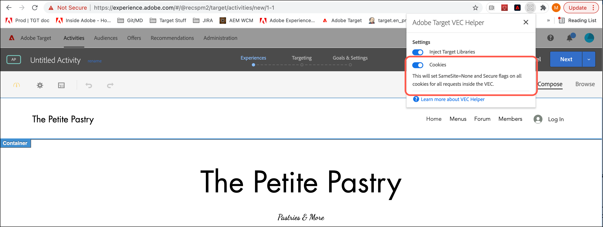

# に関連する問題のトラブルシューティング [!UICONTROL Visual Experience Composer] および [!UICONTROL 拡張 Experience Composer]

表示の問題や、 [!DNL Adobe Target] [!UICONTROL Visual Experience Composer] (VEC) および [!UICONTROL 拡張 Experience Composer] (EEC) を使用します。

## Google Chrome の SameSite cookie 実施ポリシーは、VEC および EEC にどのような影響を与えますか？ {#samesite}

次の Chrome リリースを使用する際の VEC と EEC に影響する変更点に注意してください。

>[!NOTE]
>
>次の変更は、以下に示す 3 つの更新すべてに影響します。
>
> * ウィル *not* サイトのパスワードで保護されたページに対して VEC Helper 拡張機能をインストールして有効にしないで、VEC を使用できます。 サイトのログイン Cookie はサードパーティ Cookie と見なされ、参照モードで VEC エディター内でログインリクエストと共に送信されることはありません。 唯一の例外は、サイトのログイン Cookie に `SameSite=None` および `Secure` 属性セット。


**Chrome 94（2021 年 9 月 22 日）**:Chrome 94 リリース（2021 年 9 月 22 日）に予定されている差し迫った変更により、次の変更が Chrome 94 以降のブラウザーバージョンを使用しているすべてのユーザーに影響します。

* コマンドラインフラグ `--disable-features=SameSiteByDefaultCookies,CookiesWithoutSameSiteMustBeSecure` が削除されます。

**Chrome 91（2021 年 5 月 26 日）**:Chrome 91 リリース（2021 年 5 月 26 日）用に実装された変更点では、次の変更は Chrome 91 以降のブラウザーバージョンを使用するすべてのユーザーに影響します。

* フラグ `#same-site-by-default-cookies` および `#cookies-without-same-site-must-be-secure` ～から取り除かれた `chrome://flags`. この動作は、デフォルトで有効になりました。

**Chrome 80（2020 年 8 月）**:2020 年 8 月に実装された変更により、Chrome 80 以降のブラウザーバージョンを持つすべてのユーザーは、次のようになります。

* ウィル *not* ダウンロードできる [!DNL Target] ライブラリを編集中（まだサイトにない場合） ダウンロード呼び出しは、セキュリティで保護された [!DNL Adobe] ドメインに含まれず、未認証として拒否されます。
* EEC は以下を実行します。 *not* が機能するのは、cookie に対して SameSite 属性を設定できないためです `adobemc.com domain`. この属性がない場合、ブラウザーはこれらの Cookie を拒否し、EEC が失敗します。

### ブロックされている Cookie の特定

SameSite cookie の実施ポリシーが原因でブロックされた cookie を判断するには、Chrome の開発者ツールを使用します。

1. Chrome で VEC を表示した状態で開発者ツールにアクセスするには、 **[!UICONTROL 省略記号]** Chrome の右上隅にあるアイコン > **[!UICONTROL その他のツール]** > **[!UICONTROL 開発者ツール]**.
1. 次をクリック： **[!UICONTROL ネットワーク]** タブをクリックして、ブロックされている cookie を探します。

   >[!NOTE]
   >
   >以下を使用： **[!UICONTROL Cookie をブロック済み]** チェックボックスをオンにして、ブロックされた cookie を検索しやすくします。

   次の図は、ブロックされた Cookie を示しています。

   

### [!DNL Adobe Target] VEC ヘルパー拡張機能

バージョン 0.7.1 以降、 [!DNL Adobe Target] VEC ヘルパーブラウザー拡張機能は、 `SameSite=None` および `Secure` 拡張機能 UI で「Cookies」切り替えがオンになっている場合に、VEC 内で編集された Web ページからの応答に関するすべての cookie の属性。



### 代替手段と回避策

VEC と EEC が引き続き期待どおりに動作するようにするには、次のいずれかのオプションを使用します。

* 更新されたをダウンロードして使用 [VEC ヘルパー拡張機能](https://chrome.google.com/webstore/detail/adobe-target-vec-helper/ggjpideecfnbipkacplkhhaflkdjagak?hl=en).
* Mozilla Firefox ブラウザを使用します。 Firefox は、このポリシーをまだ適用していません。
* 2021 年 9 月 21 日までコマンドラインからGoogle Chrome を実行するには、次のフラグを使用します。 9 月 22 日以降、ログインや cookie の同意のポップアップなど、cookie を必要とする機能は VEC では機能しなくなります。 Chrome 94 に更新した場合、 `SameSite=none` および `Secure` を Web サイト上でクリックします。

   ```
   --disable-features=SameSiteByDefaultCookies,CookiesWithoutSameSiteMustBeSecure
   ```

## 実行 [!DNL Target] 複数レベルの iframe をサポートしますか？

[!DNL Target] は、複数レベルの iframe をサポートしていません。Web サイトが子 iframe を持つ iframe を読み込むと、at.js は親 iframe とのみやり取りします。 [!DNL Target] ライブラリは子 iframe とやり取りしません。

回避策として、子 iframe の URL を持つエクスペリエンスにページを追加できます。

## ページを編集しようとすると、ページではなく、スピナーが表示されます。（VEC と EEC） {#section_313001039F79446DB28C70D932AF5F58}

この状況は、URL に#文字が含まれている場合に発生する可能性があります。 この問題を修正するには、Visual Experience Composer を「参照」モードに切り替えて、その後「構成」モードに戻します。スピナーの表示が消えて、ページが読み込まれます。

## コンテンツセキュリティポリシー (CSP) ヘッダーにより、 [!DNL Target] ライブラリを Web サイト上で参照できます。 （VEC と EEC） {#section_89A30C7A213D43BFA0822E66B482B803}

Web サイトの CSP ヘッダーによって Target ライブラリがブロックされることにより、Web サイトは読み込まれるものの編集できない場合は、Target ライブラリがブロックされないようにします。

>[!NOTE]
>
>以下の情報に加えて、Google Chrome 用 [Adobe Target VEC ヘルパーブラウザー拡張機能](/help/main/c-experiences/c-visual-experience-composer/r-troubleshoot-composer/vec-helper-browser-extension.md)を使用できます。


次のように、Requestly ルールを設定して CSP ヘッダーを削除することで対処できます。


VEC 内でのリソースの読み込みを妨げているヘッダーに、同様の Requestly ルールを設定できます。

Requestly の場合、ヘッダーを削除する必要があるときは必ず次のいずれかを実行する必要があります。

* VEC で開く URL の URL ルールを追加して、それらの URL についてのみヘッダーが削除されるようにします。
* VEC で編集するときにはルールを有効にし、VEC を使用していないときはルールを無効にします。

## 保存されているアクティビティの再編集時に、VEC または EEC が壊れているように見えたり、初期化されなかったりします。（VEC と EEC） {#section_5AC3BA8F8FBB451EA814F298D0645E54}

Web サイトが、エクスペリエンスの定義後に Visual Experience Composer 外で変更された場合、それよりも前にアクションがおこなわれたセレクターは、アクティビティを再編集で開くときに検出できません。ページは壊れているように表示され、警告は表示されません。

## JavaScript を含む回転バナーなどのコンテンツが VEC または EEC に表示されません。（VEC と EEC） {#section_8B5BE6EB050B42D6A14A054724C41330}

デフォルトでは、Visual Experience Composer は JavaScript 要素をブロックします。Visual Experience Composer の設定で JavaScript を無効にすると、これらの要素を使用できます。セットアップするサイトによっては、それでも一部のアイテムの表示が正しくなかったり表示できなかったりする場合があります。

## ページ内の 1 つの要素を変更すると、複数の要素が変更されます。（VEC と EEC） {#section_309188ACF34942989BE473F63C5710AF}

同じ DOM 要素 ID がページ内の複数の要素に使用されている場合、それらの要素のいずれかを変更するとその ID の要素がすべて変更されます。この現象を予防するには、各ページで ID は 1 回のみ使用するようにしてください。これは、標準のHTMLのベストプラクティスです。 詳しくは、 [ページ修正のシナリオ](/help/main/c-experiences/c-visual-experience-composer/r-troubleshoot-composer/vec-scenarios.md#concept_A458A95F65B4401588016683FB1694DB).

## iFrame バスティングのサイトのエクスペリエンスを編集できない。（VEC と EEC） {#section_9FE266B964314F2EB75604B4D7047200}

この問題は、拡張 Experience Composer を有効にすることで対処できます。クリック **[!UICONTROL 管理]** > **[!UICONTROL Visual Experience Composer]**&#x200B;をクリックし、拡張 Experience Composer を有効にするチェックボックスを選択します。 拡張 Experience Composer は、編集するページの読み込みに、アドビが管理するプロキシを使用します。このプロキシを使用すると、iFrame バスティングサイトでの編集が可能になり、Adobe Targetコードをまだ追加していないサイトやページでの編集が可能になります。 コードが追加されるまで、サイトにアクティビティは配信されません。サイトによっては、拡張 Experience Composer を介して読み込むことができない場合があります。その場合は、このオプションをオフにして、iFrame を介して Visual Experience Composer を読み込むことができます。

>[!NOTE]
>
>ローカルでホストされているページや、ネットワーク外からアクセスできないページは、アドビのプロキシサーバーにアクセスできず、EEC で開くことができません。こうしたページには、ステージング URL、ユーザー受け入れテスト（UAT）URL またはローカルでホストされているページなどがあります。

## mbox/target をまだ実装していないページでテストを設定したい。（VEC と EEC） {#section_DE63BCCB5B124E10A71FA579B582A80A}

上記の「iFrame バスティングのサイトのエクスペリエンスを編集できない」を参照してください。

## 「テキスト／HTML を編集」または「テキスト／HTML を変更」でテキストスタイルの太字および斜体がページで表示されません。これらのスタイル変更を適用すると、テキストが消えることがあります。（VEC と EEC） {#section_7A71D6DF41084C58B34C18701E8774E5}

Visual Experience Composer で A/B またはエクスペリエンスターゲット設定アクティビティに「**[!UICONTROL テキスト／HTML を編集]**」を使用したり、自動パーソナライゼーションまたは多変量分析テストアクティビティに「**[!UICONTROL テキスト／HTML を変更]**」を使用して、テキストに太字や斜体を設定すると、Visual Experience Composer でこれらのスタイルがページに適用できないか、ページからテキストが消えることがあります。これは、リッチテキストエディターがこれらのスタイルを適用する方法が Web サイトのマークアップに影響を与える可能性があるためです。

この問題が発生した場合、次の手順に従ってください。

1. リッチテキストエディターの **[!UICONTROL HTML]** ボタンをクリックして、ソース編集モードに入ります。
1. スタイルテキスト要素を検索します。

   * 太字テキストの場合は、`<strong>`要素を`<b>`に変更します。

   * 斜体の場合は、`<em>`要素を`<i>`に変更します。

## 自動パーソナライゼーションアクティビティで、VEC または EEC の画像のスワップが壊れているように見えます。（VEC と EEC） {#section_88AABFDFE6A3420299B0D508B12A3994}

場所に画像オファーを追加するときは、VEC または EEC の元の画像スペースのフルサイズが利用されます。配信時には、画像が拡大されずそのまま表示されるので、配信には影響しません。
