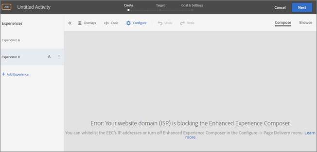

# [!UICONTROL Enhanced Experience Composer] に関連する問題のトラブルシューティング

特定の条件下で、[!DNL Adobe Target] [!UICONTROL Enhanced Experience Composer] （EEC）でディスプレイの問題が発生することがあります。

## EEC は、パブリック IP でアクセスできない内部 QA URL を読み込みません。 {#section_D29E96911D5C401889B5EACE267F13CF}

+++詳細
この問題は、次の IP アドレスを許可リストに加えるすることで解決できます。 これらの IP アドレスは、EEC プロキシに使用される [!DNL Adobe] サーバー用です。 これらの IP アドレスは、アクティビティの編集にのみ必要です。 サイトへの訪問者は、これらの IP アドレスの許可リストに加えるは必要ありません。

IT チームに次の IP アドレスを許可リストに加えるするように依頼してください。

### 米国（va7）

40.70.154.136/29
52.254.106.240/28
52.254.106.160/28
52.254.107.16/28
20.186.185.181
20.22.83.112
20.186.185.227
52.254.106.192/28
52.254.106.0/28
52.254.107.128/28
52.254.107.80/28
52.254.106.176/28
52.254.107.32/28
52.254.105.192/28
52.254.107.64/28
52.254.106.208/28
52.254.107.0/28
52.254.106.224/28
20.14.241.153
20.186.185.239
4.152.211.251
52.254.107.144/28
52.254.106.144/28

### EMEA （nld2）

51.138.17.16/28
51.138.17.48/28
51.138.16.128/28
51.138.17.32/28
51.138.16.240/28
51.138.17.112/28
51.138.16.160/28
51.138.16.208/28
51.138.17.80/28
51.138.17.0/28
51.138.17.96/28
51.138.16.144/28
20.31.145.248
20.126.189.248
51.138.16.224/28
51.138.16.192/28
51.138.12.94
51.138.12.11
51.138.16.176/28
51.138.12.100
51.138.17.64/28
51.138.12.160/28

### APAC （aus）

20.43.104.160/28
20.227.35.177
20.40.188.227
20.43.104.112/28
20.43.104.128/28
20.43.104.144/28
20.40.188.166
20.53.206.128
20.43.104.80/28
20.43.104.16/28
20.43.105.48/28
20.43.104.96/28
20.43.104.48/28
20.40.188.194
20.43.104.32/28
20.40.191.224/28
20.43.105.16/28
20.40.191.96/28
20.43.104.176/28
20.40.191.240/28
20.43.104.64/28
20.43.105.32/28
20.43.104.192/28
20.43.105.0/28
20.43.104.0/28

### 従来の IP アドレス

次の従来の IP アドレスは、追加の通知が届くまで引き続き許可リストに加えるされる必要があります。

34.254.77.200
54.73.207.147
54.229.152.123
3.224.194.242
54.90.51.39
34.228.136.112
54.150.116.11
18.178.142.8
54.199.107.77
99.80.139.221
54.78.56.224
54.247.179.246
54.80.219.243
34.201.235.54
54.196.224.236
35.75.212.45
52.199.184.130
18.180.161.176

[!DNL Target] に次のエラーメッセージが表示される場合があります。

`Error: Your website domain (ISP) is blocking the [!UICONTROL Enhanced Experience Composer]. You can allowlist the [!UICONTROL Enhanced Experience Composer]'s IP addresses or turn off [!UICONTROL Enhanced Experience Composer] in [!UICONTROL Configure] > [!UICONTROL Page Delivery] menu.`

このエラーメッセージが表示される理由と、問題の解決方法は次のとおりです。

* **問題：** Web サイトのドメイン（ISP）が [!UICONTROL Enhanced Experience Composer] をブロックしています。

  **Remedy:** 上記の IP アドレスを許可リストに加えるします。

* **問題：** IP アドレスは許可リストに加えるされていますが、web サイトでは TLS バージョン 1.2 がサポートされていません。[!DNL Target] では現在、デフォルトの設定 1.2 を使用しています。[!DNL Target] 18.4.1 （2018 年 4 月 25 日（PT））より前のデフォルト設定では、TLS 1.0 がサポートされていました。詳しくは、[TLS （Transport Layer Security）暗号化の変更 ](https://experienceleague.adobe.com/docs/target-dev/developer/implementation/tls-transport-layer-security-encryption.html?lang=ja){target=_blank} を参照してください。

  **解決策：** 次の質問を参照してください（[!UICONTROL Enhanced Visual Experience Composer] は、TLS 1.2 を使用するサイト上のセキュリティで保護されたページに読み込まれません）。

+++

## TLS 1.0 を使用しているサイトのセキュリティで保護されているページで、EEC が読み込まれません。（EEC のみ） {#section_C5B31E3D32A844F68E5A8153BD17551F}

+++詳細
上記の「[!UICONTROL Enhanced Visual Experience Composer] は、サイトのセキュリティで保護されたページに読み込まれません」というエラーメッセージが表示される場合があります。 上記の IP アドレスを許可リストに加えるしても、web サイトで TLS バージョン 1.2 がサポートされていない場合。[!DNL Target] では現在、デフォルト設定の 1.2 を使用しています。[!DNL Target] 18.4.1 （2018 年 4 月 25 日（PT））より前のデフォルト設定では、TLS 1.0 がサポートされていました。詳しくは、[TLS （Transport Layer Security）暗号化の変更 ](https://experienceleague.adobe.com/docs/target-dev/developer/implementation/tls-transport-layer-security-encryption.html?lang=ja){target=_blank} を参照してください。

Firefox を使用して、Web サイトの TLS バージョンをチェックする方法は次のとおりです（他のブラウザーでの手順も同様です）。

1. Firefox で対象の Web サイトを開きます。
1. ブラウザーのアドレスバーにある「**[!UICONTROL Show Site Information]**」アイコンをクリックします。

   

1. **[!UICONTROL Show Connection Details]**／**[!UICONTROL More Information]**&#x200B;をクリックします。

   

1. 「技術情報」の下にある TLS バージョンを確認します。

   

1. Web サイトで TLS 1.0 が表示されている場合は、[TLS （Transport Layer Security）暗号化の変更 ](https://experienceleague.adobe.com/docs/target-dev/developer/implementation/tls-transport-layer-security-encryption.html?lang=ja){target=_blank} を参照して、Target の TLS サポートポリシーについて確認してください。 今のところ状況を修正するには（2018 年 9 月 12 日（PT）まで有効） {target=_blank} [ カスタマーケア ](/help/main/cmp-resources-and-contact-information.md#reference_ACA3391A00EF467B87930A450050077C) に問い合わせて、TLS バージョンとドメインの設定を確認します。

+++

## プロキシが有効なサイトを読み込む際に、タイムアウトまたは「アクセスが拒否されました」というエラーが表示されます。（EEC のみ） {#section_60CBB9022DC449F593606C0E6252302D}

+++詳細
お使いの環境でプロキシ IP がブロックされていないことを確認します。

+++
