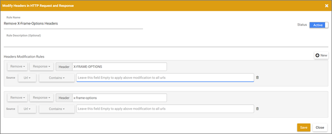

# [!UICONTROL Visual Experience Composer] に関連する問題のトラブルシューティング

特定の条件下で、[!DNL Adobe Target] [!UICONTROL Visual Experience Composer] （VEC）で表示の問題が発生することがあります。

## [!UICONTROL Visual Experience Composer] で web サイトを開いても、[!DNL Target] ライブラリが読み込まれません。 （VEC のみ） {#section_8A7D3F4AD2CC4C3B823EE9432B97E06F}

+++詳細
[!DNL Target] は、[!UICONTROL Visual Experience Composer] で web サイトを開く際に 2 つのパラメーター（`mboxEdit=1` と `mboxDisable=1`）を追加します。

Web サイト（特に単一ページアプリ）で、ページからページに移動する際に（ページを再読み込みせずに）パラメーターをトリミングしたり、実際にパラメーターを削除したりすると、[!DNL Target] の機能が中断し、[!DNL Target] ライブラリは読み込まれません。

この問題を防ぐには、この 2 つのパラメーターをトリミングまたは削除しないように設定します。

+++

## EEC でページが開かないか、読み込みに時間がかかります。VEC でアクティビティやエクスペリエンスの読み込みに時間がかかります。（VEC のみ） {#section_71E7601BE9894E3DA3A7FBBB72B6B0C1}

+++詳細
[!UICONTROL Target] experience コンポーザーのページのパフォーマンスに影響を与える可能性がある問題がいくつかあります。 よくある問題として以下のようなものがあります。

* ページに mbox がない。
* サイトでプロキシブロックを使用している。これにより、どちらのエクスペリエンスコンポーザーでもページを開くことが許可されません。
* サイトがサイト自体を iFrame で開くことを許可していない。

[!UICONTROL Enhanced Experience Composer] で問題が発生した場合は、[!UICONTROL Enhanced Experience Composer] の電源を切り、代わりに [!UICONTROL Visual Experience Composer] を使用してみてください。

[!UICONTROL Enhanced Experience Composer] を無効にするには、**[!UICONTROL Administration]**/**[!UICONTROL Visual Experience Composer]** に移動し、「**[!UICONTROL Enable Enhanced Experience Composer]**」オプションをオフにします。

コンソールに次のエラーメッセージが表示される場合があります。

[!UICONTROL Visual Experience Composer] も [!UICONTROL Enhanced Experience Composer] も機能しない場合は、[!DNL Requestly] （[!DNL Chrome] または [!DNL Firefox]）や Modify Response Headers （Firefox）などのブラウザー拡張機能を使用して、サイトの X-Frames ヘッダーオプションを上書きし、iFrames に読み込んで VEC を有効にします。 ブラウザー拡張機能を使用できない場合は、[ フォームベースの Experience Composer](/help/main/c-experiences/form-experience-composer.md) を使用します。

>[!NOTE]
>
>[!DNL Google Chrome] に、次の情報に加えて [&#128279;](/help/main/c-experiences/c-visual-experience-composer/r-troubleshoot-composer/visual-editing-helper-extension.md) [!DNL Adobe Target] [!UICONTROL Visual Editing Helper] 拡張機能を使用できます。

>[!NOTE]
>
>これらのプラグインは、VEC を編集する場合にのみ使用する必要があります。
>
>[!DNL Requestly] 拡張機能では、ヘッダーを削除する必要がある場合は常に、次のいずれかを実行する必要があります。
>
>* VEC で開く URL の URL ルールを追加して、それらの URL についてのみヘッダーが削除されるようにします。
>
>* VEC で編集するときにはルールを有効にし、VEC を使用していないときはルールを無効にします。
>
>[!UICONTROL Modify Response Header] 拡張機能（[!DNL Firefox]）の場合、URL ルールを追加できないので、次の手順を実行する必要があります。
>
>* VEC で編集するときにはルールを有効にし、VEC を使用していないときはルールを無効にします。

**[!DNL Chrome] または [!DNL Firefox] で [!DNL Requestly] 拡張機能を使用するには：**

1. [!UICONTROL Enhanced Experienced Composer] のスイッチを切りなさい。
1. [!DNL Requestly] ブラウザー拡張機能を [!DNL Chrome] または [!DNL Firefox] にインストールします。
1. 拡張機能を開いて、次を使用するように設定します。
1. 「**[!UICONTROL Modify headers]**」を選択します。
1. 以下を入力します。

   * ルール名
   * 変更ルール

      * **[!UICONTROL Add]** を **[!UICONTROL Remove]** に切り替えます。
      * **[!UICONTROL Request]** を **[!UICONTROL Response]** に切り替えます。
      * ヘッダー名として &quot;X-Frame-Options&quot; と入力します。
      * 前述の手順を繰り返し、ヘッダー名に「x-frame-options」と入力します。

        >[!NOTE]
        >
        >[!DNL Requestly] を介して操作されるヘッダーでは、大文字と小文字が区別されます。

      * **[!UICONTROL Equals]** をソース URL の条件として **[!UICONTROL Contains]** に変更し、VEC に読み込もうとするアクティビティの URL を入力します。

     

1. **[!UICONTROL Save]** をクリックします。

   

   これで、[!UICONTROL Visual Experience Composer] を使用してページをすばやく読み込めるはずです。

**[!UICONTROL Firefox] で [!DNL Modify Response Headers] 拡張機能を使用するには：**

1. [!DNL Firefox] に [!UICONTROL Modify Response Headers] をインストールし、ブラウザーを再起動します。
1. [!DNL Firefox] 拡張機能から、「応答ヘッダーを変更」拡張機能を選択します。
1. **[!UICONTROL Preferences]** をクリックします。
1. [!UICONTROL Action] ドロップダウンから「**[!UICONTROL Filter]**」を選択します。
1. 「[!UICONTROL Header Name]」フィールドに「**[!UICONTROL X-Frame-Options]**」と入力します。
1. 手順 4 と 5 を繰り返して、**[!UICONTROL x-frame-options]** を含むフィルターを追加します。
1. **[!UICONTROL Add]** をクリックします。
1. **[!UICONTROL Start]** をクリックします。

拡張機能を設定したら、[!DNL Target] を開きます。 [!UICONTROL Enhanced Experience Composer] が無効になっている場合でも、ページが [!UICONTROL Visual Experience Composer] に読み込まれるはずです。

+++

## VEC にページが表示されません。（VEC のみ） {#does-not-load}

+++詳細
* VEC との最適な互換性は、最新バージョンの拡張機能 [[!DNL Adobe Experience Cloud] [!UICONTROL Visual Editing Helper extension]](/help/main/c-experiences/c-visual-experience-composer/r-troubleshoot-composer/visual-editing-helper-extension.md) によって保証されます。

  最新バージョンを使用しているかどうかを確認するには、[!UICONTROL Extensions] /に移動 [!UICONTROL Manage Extensions]、「[!UICONTROL Details]」をクリックします。

* [!UICONTROL Visual Experience Composer] では、web ページ上で変更を実行するためにオーサリングライブラリが必要です。 これらのライブラリは at.js ライブラリに埋め込まれ、VEC を使用するたびに [!DNL Adobe] サーバーから拡張機能によってダウンロードされます。

  この拡張機能では、at.js と [!DNL Adobe Experience Platform Web SDK] のどちらがページに既に含まれているかに関係なく、at.js ライブラリをダウンロードします。

  [!UICONTROL Administration] > [!UICONTROL Implementation] セクションで設定した at.js ヘッダーに無効な変更が追加されていないことを確認します。

* Web ページが、iFrame に埋め込まれた場合の読み込みに必須なリクエストをブロックしていないことを確認します。 これには、顧客の web サイト、メタ HTML タグ、x-frame-options ヘッダーに埋め込まれた、frame-ancestors CSP 指令またはカスタム JS コードの使用が含まれます。

* Web ページの JavaScript がオーサリングライブラリに干渉しないことを確認します。 次の予約名を使用したファイルを使用したりインクルードしたりしないでください。

   * `target-vec-helper.js`
   * `target-vec.js`
   * `target.js`
   * `admin.css`
   * `sizzle.js`
   * `mixContentCheck.html`

     さらに、これらのファイル内で定義された変数やイベントを誤って上書きすると、VEC で問題が発生する可能性があります。

* ブラウザーが、セキュリティで保護されているサイトのセキュリティで保護されていないページをブロックしています。

  ブラウザーのアドレスバーにある URL の左側のアイコンをクリックし、「**[!UICONTROL Disable protection on this page]**」をクリックします。

* 入力した URL が無効です。
* Web サイトが VEC への読み込みに失敗した場合や、予期しない動作が発生した場合は、[!DNL Target] で web サイトを読み込む前に、ブラウザーで web サイトの Cookie を受け入れることで解決できる可能性があります。

+++

## [!UICONTROL Browse] モードを使用すると、VEC が壊れているように見えます。 （VEC のみ） {#section_FA2A18E8FD6A4274B2E395DBAA2FB407}

+++詳細
[!UICONTROL Browse] モードを使用している場合、[!DNL Target] ライブラリ（[at.js](https://experienceleague.adobe.com/docs/target-dev/developer/client-side/at-js-implementation/overview.html?lang=ja){target=_blank} または [Adobe Experience Platform Web SDK](https://experienceleague.adobe.com/docs/target-dev/developer/client-side/aep-web-sdk.html?lang=ja){target=_blank}）が実装されていない URL や、フレームバスターヘッダーを含む URL にアクセスすると、VEC が壊れているように見えます。 ブラウザーのセキュリティ上の問題により、移動先の URL[!DNL Target] 正しくアクセスできないか、ページが読み込まれても VEC URL が一貫して更新されません。

この問題は、VEC が `<iframe>` で web ページを読み込むために発生します。 現在のブラウザーのセキュリティメカニズムでは、同じオリジンポリシーが原因で、[!DNL Target] UI が特定のフレームの要素にアクセスできません。 ブラウザーが、`location.href` などの情報を含む、別のオリジンのフレームにアクセスしようとするスクリプトをブロックします。

最適に参照するには、新しい [Visual Editing Helper 拡張機能 ](/help/main/c-experiences/c-visual-experience-composer/r-troubleshoot-composer/visual-editing-helper-extension.md) を使用して、[!DNL Target] ライブラリをページに挿入する必要があります。

+++

## [!UICONTROL Visual Experience Composer] での CSS の競合で発生する問題

+++詳細
エディターで web ページを読み込む際に、表示に影響を与える可能性のある CSS ファイルが存在するかどうかを確認します。 例えば、ページ本文で `overflow: hidden` プロパティを使用すると、スクロールの問題やトリガーのクリックイベントが発生し、オーサリングのメニューが妨げられる可能性があります。

+++
