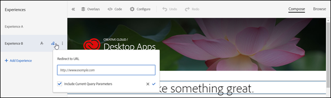

# URL にリダイレクト

訪問者を同じページにコンテンツを表示するのではなく、別のページに送信する場合は、[!DNL Adobe Target] の「[!UICONTROL Redirect to URL]」オプションを使用します。

ページ内でコンテンツの一部を変更するのではなく、まったく異なる 2 つのページをテストすることができます。この場合、A/B テストではページ A とページ B を比較します。デフォルトのページ A を指すエクスペリエンスと、ページ B にリダイレクトするエクスペリエンスの 2 つを使用して A/B テストキャンペーンを設定します。エクスペリエンスのレターラベルをクリックして配置されたエクスペリエンスアクションメニューで、「**[!UICONTROL Redirect to URL]**」を選択し、ページ B の URL を指定します。オファーは、訪問者を別のページにリダイレクトするように設定されます。

リダイレクトオファーでは、JavaScript コードを実行してブラウザーをリダイレクトします。このオファーでは`window.location.replace();`メソッドを使用するので、訪問者のリダイレクト元のページはブラウザー履歴に保存されません。そのため、訪問者はブラウザーの「戻る」ボタンを引き続き使用できます。

リダイレクトオファーには、いくつかの制限があります。

* A4T を使用してアクティビティでリダイレクトオファーを使用する場合、実装が特定の最小要件を満たす必要があります。また、知っておくべき重要な情報があります。詳しくは、[リダイレクトオファー - A4T に関する FAQ](/help/main/c-integrating-target-with-mac/a4t/r-a4t-faq/a4t-faq-redirect-offers.md#concept_21BF213F10E1414A9DCD4A98AF207905) を参照してください。
* フォームベースの Experience Composer を使用する場合、リダイレクトオファーはページの一部である mbox で使用しないでください。リダイレクトオファーは、HTML の`<head>`の一部であるスクリプトタグからのみ使用する必要があります。常に自動作成を使用して、グローバル mbox にリダイレクトオファーを設定する必要があります。

>[!NOTE]
>
>ランディングページのリファラー値を渡す場合、リダイレクトオファーではなく HTML オファーを使用することをお勧めします。

リダイレクトオファーを作成する手順は次のとおりです。

1. エクスペリエンスを作成します。
1. マウスをエクスペリエンスの上に置き、「URL にリダイレクト」アイコン（）をクリックします。

   

1. URL を入力します。
1. 必要に応じて、現在のクエリパラメーターを含めるオプションを選択します。

   このオプションを選択すると、訪問者の URL の ? の後にある要素が、リダイレクト時にリダイレクト URL に追加されます。

   このオプションはデフォルトで選択されています。
1. （オプション）追加のルールを作成します。

   追加のルールは、以下のいずれかに基づいています。

   * URL
   * ドメイン
   * パス
   * ハッシュ（#）フラグメント
   * クエリ
   * mbox パラメーター

   追加のルールは、AND または OR を使用してアクティビティ URL と結合できます。追加したすべてのルールは、AND を使用してお互いに評価されます。

## 既知の問題

* at.js 実装でのアクティビティのリダイレクトは、プレビュー URL がループする原因となる可能性があります（オファーが繰り返し配信されます）。代わりに [QA モード](/help/main/c-activities/c-activity-qa/activity-qa.md) を使用して、プレビューと QA を実行できます。この問題は、実際のオファーの配信には影響しません。（TGT-23019）
