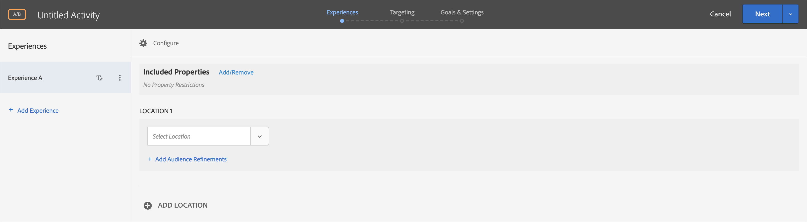
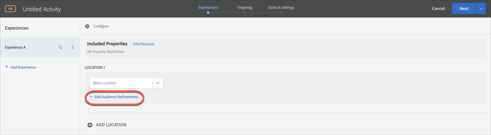

# フォームベースの Experience Composer

[!DNL Adobe Target] [!UICONTROL Form-Based Experience Composer]は、[!UICONTROL Visual Experience Composer] （VEC）が利用できないか、使用に実用的でない場合に、[!UICONTROL A/B Test]、[!UICONTROL Experience Targeting]、[!UICONTROL Automated Personalization]および[!UICONTROL Recommendations] アクティビティで使用するエクスペリエンスを作成するのに役立つ、非ビジュアルエクスペリエンスおよびオファー作成インターフェイスです。 たとえば、フォームベースのAdobe Experience Composerを使用して、電子メール、キオスク端末、音声アシスタントで配信するエクスペリエンスやオファーを作成することができます。

[!UICONTROL Recommendations] アクティビティを作成している場合、エクスペリエンスはありません。 条件およびデザインを選択します。 複数の基準またはデザインを選択すると、[!UICONTROL Target]がエクスペリエンスを自動的に生成します。

1. 「**[!UICONTROL Create Activity]**」をクリックし、作成するアクティビティのタイプを選択します。

   [!UICONTROL Form-Based Experience Composer]は、[!UICONTROL A/B Test]、[!UICONTROL Experience Targeting]、[!UICONTROL Automated Personalization]および[!UICONTROL Recommendations]のアクティビティで利用できます。

1. [!UICONTROL Create Activity] ダイアログボックスから&#x200B;**[!UICONTROL Form]**&#x200B;を選択します。

1. （条件付き）ワークスペースとプロパティを選択します。

1. **[!UICONTROL Next]** をクリックします。

   [!UICONTROL Form-Based Experience Composer]が開きます。

   

   この画面は、[!UICONTROL Recommendations] アクティビティを作成している場合とは異なります。 [!UICONTROL Recommendations]件のアクティビティにはエクスペリエンスが含まれていません。

1. 「[!UICONTROL Untitled Activity]」をクリックして、アクティビティに名前を付けます。
1. 場所を選択します。

   [!UICONTROL Select Location] ボックスをクリックすると、使用可能な場所のリストが表示されます。 いずれかの場所を選択します。

   ここに表示されていない場所を入力することもできます。 これは、mbox がまだページで作成または表示されていない場合に便利です。 場所の名前を入力します。 まだ存在していない場所を入力する場合は、注意が必要です。 mbox の呼び出し時に、スペルや大文字／小文字が一致していないと、アクティビティが配信されません。 手動で入力した場所は、使用可能な場所のリストに保存されます。 次回、手動で入力した場所を選択しようとすると、そのアクティビティの[!UICONTROL Select Location] ドロップダウンリストから使用できるようになります。

   >[!NOTE]
   >
   >アクティビティの作成中に手動で入力した場所を作成しても、新しい場所は自動的に作成されません。 場所の名前は、アクティビティのコンテキストでのみ保存されます。 場所は、コンテンツ配信コールがあるときに作成されます。 作成される場所の後に、利用可能な場所のドロップダウンリストからオーディエンスの作成など、他のアクティビティで使用できるようになります。

1. **[!UICONTROL Add Audience Refinements]**&#x200B;をクリックし、このアクティビティの[ オーディエンス ](/help/main/c-target/target.md#concept_A782F8481A5041EBA75103CB26376522)を1つ以上選択してから、**[!UICONTROL Done]**&#x200B;をクリックします。

   

   [!UICONTROL Form-based Experience Composer]では、絞り込みが完全なオーディエンス機能に置き換えられました。 既存のアクティビティの絞り込みが[ アクティビティのみのオーディエンス ](/help/main/c-target/creating-activity-only-audience.md#concept_A6BADCF530ED4AE1852E677FEBE68483)に移行されました。

1. その場所に表示するコンテンツのタイプを選択します。

   

1. 選択したコンテンツタイプに対して、コンテンツを指定します。

   **HTML オファーの変更：** HTML オファーを選択します。

   **画像オファーの変更：** Target のコンテンツライブラリに保存された画像を選択します。

   また、画像にリンク（クリックスルー、宛先、ランディングなど）を追加することもできます。

   1. [!UICONTROL Change Image Offer] をクリックします。
   1. 目的の画像を選択し、[!UICONTROL Edit Links]をクリックします。
   1. サイトで目的のURLまたはページを指定し、[!UICONTROL Update]をクリックします。

   **JSON オファーの変更：** JSON オファーを選択します。

   **エクスペリエンスフラグメントの変更：** エクスペリエンスフラグメントを選択します。 詳しくは、[ エクスペリエンスフラグメント ](/help/main/c-experiences/c-manage-content/aem-experience-fragments.md)を参照してください。

   **リダイレクト オファーの変更：** リダイレクト オファーを選択します。 詳しくは、[ リダイレクトオファーの作成](/help/main/c-experiences/c-manage-content/offer-redirect.md)を参照してください。

   **リモートオファーの変更：** リモートオファーを選択します。 詳しくは、[ リモートオファーの作成](/help/main/c-experiences/c-manage-content/about-remote-offers.md)を参照してください。

   **HTML オファーを作成:**

   1. 「[!UICONTROL Offers]」をクリックし、「[!UICONTROL Code Offers]」タブを選択します。
   1. [!UICONTROL Create]／[!UICONTROL HTML Offer]をクリックします。
   1. オファー名を入力します。
   1. 「コード」ボックスに HTML コードを入力するか貼り付けます。
   1. [!UICONTROL Save] をクリックします。

   **JSON オファーの作成：**

   1. 「[!UICONTROL Offers]」をクリックし、「[!UICONTROL Code Offers]」タブを選択します。
   1. [!UICONTROL Create]／[!UICONTROL JSON Offer]をクリックします。
   1. オファー名を入力します。
   1. 「コード」ボックスに JSON コードを入力するか貼り付けます。
   1. [!UICONTROL Save] をクリックします。

   **推奨事項を追加：**

   Recommendations アクティビティの場合、「コンテンツ」ドロップダウンに「[!UICONTROL Add Recommendation]」オプションが表示されます。 **[!UICONTROL Add Recommendation]**&#x200B;をクリックし、ページの種類を選択します。 次に、[Recommendations アクティビティを作成する](/help/main/c-recommendations/t-create-recs-activity/create-recs-activity.md)ためにインターフェイスで定義した通常の手順に従います。

   フォームベースの Experience Composer で Recommendations の条件を選択する際には、選択した条件カードへの直接リンクが追加されるようになったので、条件をすばやく容易に編集できます。

   

   Target の 3 つの手順から成るガイド付きワークフローのターゲット設定ページから：

   

   **オファー決定を追加：**

   [!DNL Adobe Journey Optimizer] （AJO）で作成されたオファーを[!DNL Adobe Target] アクティビティに追加し、オファー決定機能を使用して、web サイトまたはモバイルサイトの訪問者に最適な動的なオファーとエクスペリエンスを提示します。 このオプションは、手動の[!UICONTROL A/B Test]および[!UICONTROL Experience Targeting] （XT）アクティビティでのみ使用できます。

   詳しくは、[ オファー決定の使用](/help/main/c-integrating-target-with-mac/ajo/offer-decision.md)を参照してください。

1. （オプション、[!UICONTROL A/B Test]、[!UICONTROL Automated Personalization]、[!UICONTROL Experience Targeting]のアクティビティの場合）追加の場所でこのプロセスを繰り返すには、**[!UICONTROL Add Location]**&#x200B;をクリックし、場所とコンテンツを設定します。
1. 「**[!UICONTROL Next]**」をクリックし、アクティビティの種類に応じて通常どおりアクティビティ作成ステップを完了します。

* [A/B テストの作成](/help/main/c-activities/t-test-ab/t-test-create-ab/test-create-ab.md)
* [エクスペリエンスのターゲット設定アクティビティの作成](/help/main/c-activities/t-experience-target/t-xt-create/xt-create.md#task_D6B3429AC31549E1A70EDF04B3DDC765)
* [レコメンデーションアクティビティの作成](/help/main/c-recommendations/t-create-recs-activity/create-recs-activity.md#task_6874328773C64C44A73F0A130AD3F96F)

## トレーニングビデオ：フォームベースのコンポーザー

このビデオは、フォームベースのコンポーザーのデモを紹介します。

* フォームベースの Experience Composer を使用したアクティビティの作成
* フォームベースの Experience Composer と Visual Experience Composer のどちらを使用するかの理解
* 場所のターゲット設定の調整

>[!VIDEO](https://video.tv.adobe.com/v/17390)
