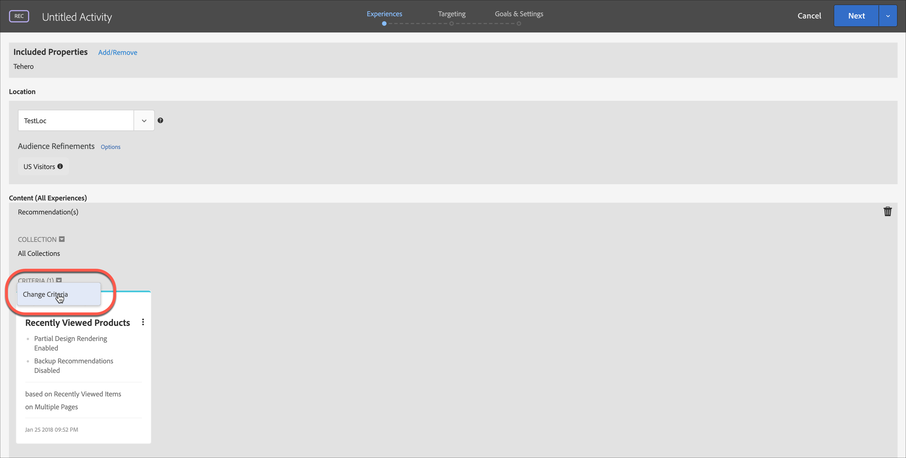
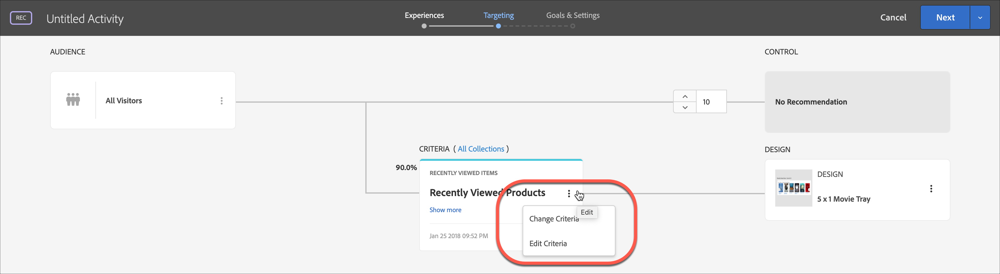

# フォームベースの Experience Composer

この [!DNL Adobe Target] [!UICONTROL フォームベースの Experience Composer] は、非視覚的なエクスペリエンスおよびオファー作成インターフェイスで、で使用するエクスペリエンスを作成するのに役立ちます。 [!UICONTROL A/B テスト], [!UICONTROL エクスペリエンスのターゲット設定], [!UICONTROL Automated Personalization]、および [!UICONTROL Recommendations] アクティビティ [!UICONTROL Visual Experience Composer] (VEC) は使用できず、実用的でもありません。 例えば、フォームベースの Experience Composer を使用して、E メール、キオスク、音声アシスタントでの配信用のエクスペリエンスおよびオファーを作成できます。

以下を作成する場合、 [!UICONTROL Recommendations] アクティビティの作成時に、エクスペリエンスが存在しません。 条件およびデザインを選択します。複数の条件またはデザインを選択する場合、 [!UICONTROL ターゲット] はエクスペリエンスを自動的に生成します。

1. 「**[!UICONTROL アクティビティを作成]**」をクリックして、作成するアクティビティのタイプを選択します。

   この [!UICONTROL フォームベースの Experience Composer] は、次の場所で使用できます： [!UICONTROL A/B テスト], [!UICONTROL エクスペリエンスのターゲット設定], [!UICONTROL Automated Personalization]、および [!UICONTROL Recommendations] アクティビティ。

1. 選択 **[!UICONTROL フォーム]** から [!UICONTROL アクティビティを作成] ダイアログボックス

1. （条件付き）ワークスペースとプロパティを選択します。

1. 「**[!UICONTROL 次へ]**」をクリックします。

   この [!UICONTROL フォームベースの Experience Composer] が開きます。

   

   この画面は、 [!UICONTROL Recommendations] アクティビティ。 [!UICONTROL Recommendations アクティビティには、エクスペリエンスは含まれません。]

1. 「[!UICONTROL 無題のアクティビティ].&quot;
1. 場所を選択します。

   をクリックして、 [!UICONTROL 場所を選択] ボックスに、使用可能な場所のリストが表示されます。 いずれかの場所を選択します。

   ここに表示されていない場所を入力することもできます。これは、mbox がまだページで作成または表示されていない場合に便利です。場所の名前を入力します。まだ存在していない場所を入力する場合は、注意が必要です。mbox の呼び出し時に、スペルや大文字／小文字が一致していないと、アクティビティが配信されません。手動で入力した場所は、使用可能な場所のリストに保存されます。 次に手動で入力した場所を選択しようとすると、 [!UICONTROL 場所を選択] 」ドロップダウンリストから選択できます。

   >[!NOTE]
   >
   >アクティビティの作成中に手動で入力した場所を作成しても、新しい場所は自動的には作成されません。 場所の名前は、アクティビティのコンテキストにのみ保存されます。 場所は、コンテンツ配信呼び出しがあるときに作成されます。 作成する場所の後に、他のアクティビティで使用したり、オーディエンスの作成に使用したりできます。 を選択します。

1. クリック **[!UICONTROL 絞り込み条件を追加]**、1 つ以上を選択 [audience](/help/main/c-target/target.md#concept_A782F8481A5041EBA75103CB26376522) このアクティビティの場合は、 **[!UICONTROL 完了]**.

   

   内 [!UICONTROL フォームベースの Experience Composer]の絞り込み条件は、完全なオーディエンス機能に置き換えられました。 既存のアクティビティの絞り込みが、 [アクティビティのみのオーディエンス](/help/main/c-target/creating-activity-only-audience.md#concept_A6BADCF530ED4AE1852E677FEBE68483).

1. その場所に表示するコンテンツのタイプを選択します。

   

1. 選択したコンテンツタイプに対して、コンテンツを指定します。

   **HTML オファーの変更：** HTML オファーを選択します。

   **画像オファーの変更：** Target のコンテンツライブラリに保存された画像を選択します。

   また、画像にリンク（クリックスルー、宛先、ランディングなど）を追加することもできます。

   1. 「[!UICONTROL 画像オファーの変更]」をクリックします。
   1. 希望する画像を選択してから、「[!UICONTROL リンクの編集]」をクリックします。
   1. 希望する URL またはサイトのページを指定して、「[!UICONTROL 更新]」をクリックします。

   **JSON オファーの変更：** JSON オファーを選択します。

   **エクスペリエンスフラグメントの変更：**&#x200B;エクスペリエンスフラグメントを選択します。詳しくは、 [エクスペリエンスフラグメント](/help/main/c-experiences/c-manage-content/aem-experience-fragments.md).

   **リダイレクトオファーの変更：**&#x200B;リダイレクトオファーを選択します。詳しくは、 [リダイレクトオファーの作成](/help/main/c-experiences/c-manage-content/offer-redirect.md).

   **リモートオファーの変更：**&#x200B;リモートオファーを選択します。詳しくは、 [リモートオファーを作成](/help/main/c-experiences/c-manage-content/about-remote-offers.md).

   **HTML オファーを作成:**

   1. 「[!UICONTROL オファー]」をクリックしてから、「[!UICONTROL コードオファー]」タブを選択します。
   1. [!UICONTROL 作成]／[!UICONTROL HTML オファー]をクリックします。
   1. オファー名を入力します。
   1. 「コード」ボックスに HTML コードを入力するか貼り付けます。
   1. 「[!UICONTROL 保存]」をクリックします。

   **JSON オファーの作成：**

   1. 「[!UICONTROL オファー]」をクリックしてから、「[!UICONTROL コードオファー]」タブを選択します。
   1. [!UICONTROL 作成]／[!UICONTROL JSON オファー]をクリックします。
   1. オファー名を入力します。
   1. 「コード」ボックスに JSON コードを入力するか貼り付けます。
   1. 「[!UICONTROL 保存]」をクリックします。

   **レコメンデーションを追加：**

   Recommendationsアクティビティの場合、コンテンツドロップダウンで [!UICONTROL レコメンデーションを追加] オプション。 「**[!UICONTROL Recommendation を追加]**」をクリックして、ページタイプを選択します。次に、[Recommendations アクティビティを作成する](/help/main/c-recommendations/t-create-recs-activity/create-recs-activity.md)ためにインターフェイスで定義した通常の手順に従います。

   フォームベースの Experience Composer で Recommendations の条件を選択する際には、選択した条件カードへの直接リンクが追加されるようになったので、条件をすばやく容易に編集できます。

   

   Target の 3 つの手順から成るガイド付きワークフローのターゲット設定ページから：

   

   **オファーの決定を追加：**

   で作成したオファーを追加 [!DNL Adobe Journey Optimizer] (AJO) を [!DNL Adobe Target] 「 」アクティビティを使用して、Web サイトまたはモバイルサイトの訪問者に最適な動的なオファーおよびエクスペリエンスをoffer decisioningして提示します。 このオプションは手動で使用できます [!UICONTROL A/B テスト] および [!UICONTROL エクスペリエンスのターゲット設定] (XT) アクティビティのみ。

   詳しくは、 [オファーの決定を使用](/help/main/c-integrating-target-with-mac/ajo/offer-decision.md).

1. （オプション、の場合） [!UICONTROL A/B テスト], [!UICONTROL Automated Personalization]、および [!UICONTROL エクスペリエンスのターゲット設定] アクティビティ ) この処理を他の場所に対して繰り返すには、 **[!UICONTROL 場所を追加]** 場所とコンテンツを設定します。
1. クリック **[!UICONTROL 次へ]**&#x200B;次に、アクティビティタイプに対して、通常どおりアクティビティ作成手順を実行します。

* [A/B テストの作成](/help/main/c-activities/t-test-ab/t-test-create-ab/test-create-ab.md)
* [エクスペリエンスのターゲット設定アクティビティの作成](/help/main/c-activities/t-experience-target/t-xt-create/xt-create.md#task_D6B3429AC31549E1A70EDF04B3DDC765)
* [Recommendations アクティビティの作成](/help/main/c-recommendations/t-create-recs-activity/create-recs-activity.md#task_6874328773C64C44A73F0A130AD3F96F)

## トレーニングビデオ：フォームベースのコンポーザー 

このビデオは、フォームベースのコンポーザーのデモを紹介します。

* フォームベースの Experience Composer を使用したアクティビティの作成
* フォームベースの Experience Composer と Visual Experience Composer のどちらを使用するかの理解
* 場所のターゲット設定の調整

>[!VIDEO](https://video.tv.adobe.com/v/17390)
