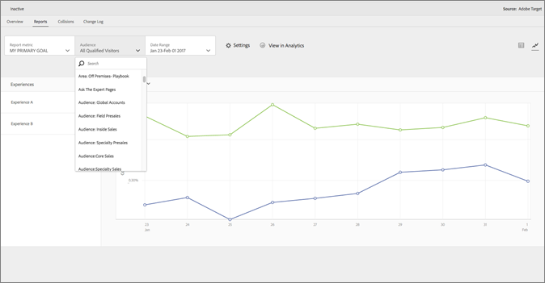

# [!DNL Adobe Target]（A4T）のレポートソースとしての [!DNL Adobe Analytics]

[!DNL Adobe Analytics for Target]（A4T）は、[!DNL Analytics] のコンバージョン指標とオーディエンスセグメントに基づいてアクティビティを作成できるクロスソリューション統合環境です。 A4T 統合では、[!DNL Analytics] レポートを使用して結果を確認できます。 [!DNL Analytics] をアクティビティのレポートソースとして使用しているときは、そのアクティビティのレポート作成とセグメント化はすべて [!DNL Analytics] のデータ収集に基づいて行われます。

## 概要 {#section_92B66069210C40DBA937790E8CC596CF}

[!DNL Analytics] と [!DNL Target] を統合する [!DNL Analytics for Target] では、組織の最適化プログラムに適した強力な分析機能と時間節約ツールを利用できます。

[!DNL Target] で [!DNL Analytics] データを使用するメリットには主に次の 3 つがあります。

* マーケターは、[!DNL Analytics] の成功指標やレポートセグメントを [!DNL Target] のアクティビティレポートにいつでも動的に適用できます。 アクティビティを実行する前にすべての項目を指定する必要はありません。
* 単一のデータソースにより、2 つの異なるシステムのデータを収集した場合に生じる偏差が排除されます。
* 既存の [!DNL Analytics] の実装によって、すべての必要なデータが収集されます。 レポート用のデータを収集する目的のためだけにページに mbox を実装する必要はありません。

[!DNL Analytics] をアクティビティのレポートソースとして使用しているときは、そのアクティビティのレポート作成とセグメント化はすべて [!DNL Analytics] に基づいて行われます。

計算指標を含むすべての[!DNL Analytics]指標は、[!DNL Target]および[!DNL Analytics]の[!UICONTROL Target Activities] レポートで利用できます（1つの例外を除く）。 [!UICONTROL Lift & Confidence]の計算指標はサポートされていません。 同様に、[!DNL Analytics] で利用可能な任意のセグメントも、両方のソリューションに適用できます。 アクティビティの開始後、またはアクティビティが完了した後でも、[!DNL Target] のレポートに指標やオーディエンスを適用できます。

顧客の指標や [!DNL Analytics] のビルトインの計算指標を含む、すべての指標を利用できます。

分類完了後、データが web サイトから収集された約 1 時間後に、これらのレポートでデータが表示されます。 レポート内のすべての指標、セグメントおよび値は、アクティビティを設定したときに選択したレポートスイートから収集されます。

A4T の使用を検討している場合は、次の点に注意してください。

* [!DNL Analytics] を [!DNL Target] のレポートソースとして使用するには、利用者および企業が [!DNL Analytics] と [!DNL Target] の両方にアクセスできる必要があります。 このいずれかのソリューションが必要な場合は、[アカウント担当者にお問い合わせください](/help/main/cmp-resources-and-contact-information.md#concept_34A1CA16F2244D42930BB77846A5ABBB)。
* レポートソースはアクティビティごとに設定されます。 [!DNL Target] はレポートに使用するデータを引き続き収集するので、[!DNL Target] によって収集されたデータをアクティビティのベースにしたい場合は、[!DNL Target] のデータを利用できます。
* どちらか 1 つのレポートソースを選びます。 両方のソースから 1 つのアクティビティのデータを収集することはできません。
* A4T を使用する場合は、アクティビティに使用できる成功指標はすべて [!DNL Analytics] の指標です。 ただし、at.js を使用している場合は目標指標は mbox の呼び出しをベースにすることができます。 例えば、[!DNL Analytics] のクリック追跡コードを実装する代わりに、Target が備えているクリック追跡機能を A4T で使用できます。
* [!DNL Target] UI で A4T アクティビティのレポートを表示すると、[!DNL Analytics] のデータが表示されます。 例えば、[!DNL Target]で[!UICONTROL Visitor]指標を使用する場合、[!DNL Target] [!UICONTROL Visitors]指標ではなく、[!DNL Analytics] [!UICONTROL Visitor]指標を使用しています。これは現在[!UICONTROL Entrants]と呼ばれています。 この違いは、基本的なトラフィック指標（[!UICONTROL Visitors]、[!UICONTROL Visits]、[!UICONTROL Page Views]）とコンバージョン指標にとって特に重要です。
* 既存の [!DNL Target] アクティビティは引き続き [!DNL Target] のデータ収集を使用するので、A4T を有効にしても影響を受けません。
* A4T を使用する場合、使用できる mbox ベースの指標は 1 つだけです。
* [!DNL Target] から [!DNL Analytics] へのサーバー間コールによって、アクティビティとエクスペリエンスの情報が [!DNL Analytics] に送られます。 この統合によって、[!DNL Target] または [!DNL Analytics] に追加のサーバーコールが生じることはありません。

  状況によっては、[!DNL Target] から [!DNL Analytics] への分類が失敗し、[!DNL Analytics] にデータが表示されません。 [Analytics と Target の統合（A4T）のトラブルシューティング](/help/main/c-integrating-target-with-mac/a4t/c-a4t-troubleshooting/a4t-troubleshooting.md)を参照してください。 さらにサポートが必要な場合は、[Client Care にお問い合わせ](/help/main/cmp-resources-and-contact-information.md#concept_34A1CA16F2244D42930BB77846A5ABBB)いただくこともできます。

## A4T の実装

A4T と at.js および [!DNL Adobe Experience Platform Web SDK] の実装の詳細については、[Analytics for [!DNL Target]  の実装](/help/main/c-integrating-target-with-mac/a4t/a4timplementation.md)を参照してください。

## サポートされているアクティビティのタイプ {#section_F487896214BF4803AF78C552EF1669AA}

以下の節には、[!DNL Adobe Experience Platform Web SDK] または at.js を使用した際にサポートされるアクティビティのタイプに関する情報が含まれます。

| アクティビティのタイプ | A4T への対応 | メモ（該当する場合） |
|--- |--- |--- |
| [手動トラフィック分割を使用した A/B アクティビティ](/help/main/c-activities/t-test-ab/test-ab.md) | ○ |  |
| [自動配分を使用した A/B アクティビティ](/help/main/c-activities/automated-traffic-allocation/automated-traffic-allocation.md) | ○ | [自動配分と自動ターゲットアクティビティに対する A4T のサポート](/help/main/c-integrating-target-with-mac/a4t/a4t-at-aa.md)を参照してください。 |
| [自動ターゲットを使用した A/B アクティビティ](/help/main/c-activities/auto-target/auto-target-to-optimize.md) | ○ | 「自動ターゲット」アクティビティに対する A4T のサポートが、[!DNL Platform Web SDK] と at.js の両方でサポートされるようになりました。 |
| [エクスペリエンスのターゲット設定（XT）](/help/main/c-activities/t-experience-target/experience-target.md) | ○ |  |
| [多変量分析テスト（MVT）](/help/main/c-activities/c-multivariate-testing/multivariate-testing.md) | ○ | [!UICONTROL Element Contribution] レポートを取得するには、mbox ベースの目標指標の目標が必要です。 [!UICONTROL Element Contribution] レポートは現在、[!DNL Analytics]指標をサポートしていません。 |
| [Automated Personalization（AP）アクティビティ](/help/main/c-activities/t-automated-personalization/automated-personalization.md) | × |  |
| [レコメンデーションアクティビティ](/help/main/c-recommendations/recommendations.md) | ○ |  |
| [リダイレクトオファーを使用するすべてのアクティビティ](/help/main/c-integrating-target-with-mac/a4t/r-a4t-faq/a4t-faq-redirect-offers.md) | ○ |  |

まだ A4T をサポートしていないアクティビティタイプがあるので、`orderConfirmPage` mbox など、重要なコンバージョン mbox を保持または実装することをお勧めします。

## A4T レポートの例 {#section_F0A43A1CB2F04E8282B909E4D7034361}

[!DNL Target]でA4T レポートを表示するには、**[!UICONTROL Activities]**&#x200B;をクリックし、[!DNL Analytics]をレポートソースとして使用するリストから目的のアクティビティをクリックしてから、**[!UICONTROL Reports]** タブをクリックします。

>[!NOTE]
>
>[!UICONTROL Activities] ページの上部にある[!UICONTROL Reporting Source] ドロップダウンリストを使用して、A4Tを使用するアクティビティのみを表示できます。

レポートの右上にある適切なアイコンをクリックすると、レポートの[!UICONTROL Table View]と[!UICONTROL Graph View]を切り替えることができます。

次の図は、[!UICONTROL Report Metric] ドロップダウンリストに使用可能な[!DNL Analytics]目標の指標が表示されているA4T レポートの[!UICONTROL Graph View]を示しています。

次の図は、[!UICONTROL Audience] ドロップダウンリストに使用可能な[!DNL Analytics] オーディエンスが表示されているA4T レポートの[!UICONTROL Graph View]を示しています。

次の図は、A4T レポートの[!UICONTROL Table View]を示しています。

[!DNL Target]ではなく[!DNL Analytics]でレポートを表示するには、レポートの上部にある&#x200B;**[!UICONTROL View in Analytics]**&#x200B;をクリックします。

## 「Analytics＆Target：分析のベストプラクティス」チュートリアル {#section_3438E6E77A464424B717A4FD333B84B2}

[!DNL Adobe Experience League]が提供する[Analytics &amp; Target：分析のベストプラクティス](https://spark.adobe.com/page/Lo3Spm4oBOvwF/)チュートリアルを開きます。

## トレーニングビデオ：

以下のビデオは、このトピックで説明する概念についてさらに詳しく説明しています。

### Analytics for Adobe Target （A4T） （4:32） 

このビデオでは、最適化プログラムの分析を推進するために [!DNL Target] で [!DNL Analytics] をレポートソースとして使用する方法を説明します。

* A4T とは何かと、使用する理由の説明
* A4T の仕組みの説明
* A4T を使用する前に必要な前提条件の理解

>[!VIDEO](https://video.tv.adobe.com/v/17384)

### Analytics / Adobe Target統合（A4T） （40:33） 

このビデオは、「[Office Hours](/help/main/cmp-resources-and-contact-information.md#concept_58EA30379D3B48C4848BA2A8C464A5B7)」（アドビカスタマーケアチーム主導による取り組みの 1 つ）の録画です。

* 統合を設定し、統合が機能することを検証する方法
* 統合の仕組み
* Analytics での使用に最適なレポートの詳細
* A4T に関するよくある質問への回答

[Adobe AnalyticsとAdobe Targetの連携（A4T）のオフィスアワー](https://helpx.adobe.com/jp/customer-care-office-hours/target/analytics-target-A4T-integration.html)

>[!MORELIKETHIS]
>
>* [Analytics for [!DNL Target]  の実装](/help/main/c-integrating-target-with-mac/a4t/a4timplementation.md)：at.js および Platform Web SDK の実装情報が含まれます。
>* [リダイレクトオファー - A4T FAQ](/help/main/c-integrating-target-with-mac/a4t/r-a4t-faq/a4t-faq-redirect-offers.md)
>* [Adobe Experience Platform Web SDK とは](https://experienceleague.adobe.com/docs/experience-platform/edge/home.html?lang=ja)：Platform Web SDK に関する概要情報が含まれています。
>* [Target の概要](https://experienceleague.adobe.com/docs/experience-platform/edge/personalization/adobe-target/target-overview.html?lang=ja)：[!DNL Target] および [!DNL Platform Web SDK] に固有の情報が含まれます。
