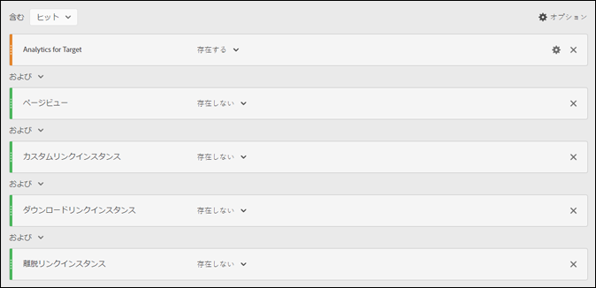

# A4T での訪問と訪問者のカウントの水増しを最小限に抑える

[!DNL Adobe Analytics] を [!DNL Adobe Target]（A4T）のレポートソースとして使用している場合に、水増しされた訪問と訪問者カウントの影響を最小限に抑える方法について説明します。

>[!IMPORTANT]
>2016年11月14日（PT）に、Adobe Analytics では、Target で Analytics レポートを使用（A4T）しているお客様のために、一部のデータの処理方法を変更しました。この変更により、Adobe Target データと Adobe Analytics のデータモデルとの整合性が向上しています。この変更は、A4T をご利用のすべてのお客様にロールアウトされています。具体的には、この変更では、一部の顧客から指摘のあった、Target アクティビティが実行されているときに訪問者カウントが水増しされる問題を解決します。
>
>この変更はさかのぼっては適用されません。履歴レポートに水増しされたカウントが表示され、レポートからそれらのカウントを除外したい場合は、下で説明されているように、仮想レポートスイートを作成できます。
>
>さらに、カウントが水増しされるを最小限に抑えるために、いくつかの JavaScript ライブラリが更新されました。アドビでは、次のライブラリバージョン（またはそれ以降）にアップグレードすることをお勧めします。
>
>* Experience Cloud 訪問者 ID サービス：visitorAPI.js バージョン 2.3.0 以降。
>* Adobe Analytics：appMeasurement.js バージョン 2.1。
>* Adobe Target：at.js バージョン 0.9.6 以降（A4T でリダイレクトオファーを使用している場合はバージョン 1.1.0 を除く）。

## 変更内容 {#section_9CCF45F5D66D48EBA88F3A178B27D986}

[!DNL Adobe Analytics] を使用して [!DNL Target] アクティビティ（A4T と呼ばれます）を測定すると、[!DNL Analytics] により、ページに [!DNL Target] アクティビティがない場合は利用できない追加データが収集されます。[!DNL Target] アクティビティではページの上部にある呼び出しが実行されますが、[!DNL Analytics] では通常、ページの下部にあるデータ収集呼び出しが実行されます。これまでの A4T の実装では、アドビでは、[!DNL Target] アクティビティがアクティブな場合は必ずこの追加データを含めていました。今後、この追加データは、[!DNL Target] タグと [!DNL Analytics] タグの両方が実行された場合にのみ追加されます。

## この変更を行った理由 {#section_92380A4BD69E4B8886692DD27540C92A}

アドビはデータの正確性と品質に自信を持っています。[!DNL Target] タグが実行され、[!DNL Analytics] タグに含まれていない場合、Analytics は、「部分的なデータ」（「未関連付けヒット」とも呼ばれます）を記録します。これらの未関連付けヒットは、[!DNL Analytics] は [!DNL Target] アクティビティがない場合は取得されなくなります。[!DNL Analytics] レポートにこの部分的なデータを含めることで追加情報が得られますが、[!DNL Target] アクティビティが実行されなかった期間の履歴データとの矛盾も生じます。[!DNL Analytics] ユーザーが長期間のトレンドを分析している場合、この状況が原因で問題が起こる可能性があります。[!DNL Analytics] でのデータの一貫性を確保するために、アドビはすべての部分的なデータを除外します。

## 部分的なデータが生じる原因 {#section_C9C906BEAA7D44DAB9D3C03932A2FEB8}

アドビでは、[!DNL Analytics] に高い確率で部分的なデータが発生するお客様に遭遇しました。部分的なデータの割合が高いと、不適切な実装が原因で生じる可能性がありますが、正当な原因もあります。

部分的なデータが生じる原因として特定されているものは次のとおりです。

* **レポートスイート ID（実装）の不一致：**&#x200B;アクティビティの設定中に指定されたレポートスイートが、テストが配信されるページのレポートスイートと一致していません。データは [!DNL Analytics] サーバー上では調整できないので、部分的なデータのように見えます。
* **低速のページ：**[!DNL Target] 呼び出しはページの上部、[!DNL Analytics] 呼び出しは通常、ページの下部にあります。ページの読み込みに時間がかかると、[!DNL Target] 呼び出しが実行されてから [!DNL Analytics] 呼び出しの前に訪問者がページを離れる可能性が高くなります。ページの速度低下は、接続速度が頻繁に低下するモバイル web サイトでは特に問題になります。
* **ページエラー：** JavaScript エラーがある場合や、各タッチポイントが実行されないシナリオ（Experience Cloud ID サービス、Target および Analytics）の場合、部分的なデータが生じます。
* **[!DNL Target] アクティビティのリダイレクトオファー：** A4T を使用してアクティビティでリダイレクトオファーを使用する場合、実装が特定の最小要件を満たす必要があります。また、知っておくべき重要な情報があります。詳しくは、[リダイレクトオファー - A4T に関する FAQ](/help/main/c-integrating-target-with-mac/a4t/r-a4t-faq/a4t-faq-redirect-offers.md#section_FA9384C2AA9D41EDBCE263FFFD1D9B58) を参照してください。
* **古いバージョンのライブラリ：** データをできる限り効率的に送信するために、昨年、JavaScript ライブラリ（[!DNL appMeasurement.js]、`at.js`、および `visitorAPI.js`）にいくつかの改善を加えました。導入に必要な条件について詳しくは、[実装する前に](/help/main/c-integrating-target-with-mac/a4t/before-implement.md#concept_046BC89C03044417A30B63CE34C22543)を参照してください。

## 部分的なデータを減らすためのベストプラクティス {#section_065C38501527451C8058278054A1818D}

部分的なデータの収集を減らすために、次の手順を順番に確認します。

| 手順 | タスク |
| --- | --- |
|  | [!DNL Target] で選択したレポートスイートが、アクティビティが表示されるページと同じであることを確認します。 |
|  | VisitorAPI. js、AppMeasurement.js、at.js ライブラリが A4T 互換バージョンになっていることを確認します。導入に必要な条件について詳しくは、[実装する前に](/help/main/c-integrating-target-with-mac/a4t/before-implement.md)を参照してください。 |
|  | ページを離れるときに [!DNL Target] と [!DNL Analytics] のすべての呼び出しで SDID が設定されることと、それらが一致していることを確認します。 ネットワーク分析やデバッグツールを使用して、`mboxMCSDID` の呼び出しの [!DNL Target] パラメーターが [!DNL Analytics] の呼び出しの SDID パラメーターと一致していることを確認します。 |
|  | サイトで実装ライブラリが正しい順序で読み込まれることを確認します。詳しくは、[Analytics for Target の実装 ](/help/main/c-integrating-target-with-mac/a4t/a4timplementation.md) を参照してください。 |

## 部分的なデータの部分を見るにはどうすればよいですか？ {#section_89B663E2824A4805AB934153508A0F4B}

この情報を [!DNL Analytics] で直接入手することはできませんが、アドビカスタマーケアに連絡して、部分的なデータレポートを取得できます。このレポートは、デバッグを支援するためのものです。

## 部分的なデータを含まない履歴トレンドを表示するにはどうしたらよいですか？ {#section_4C9DED560FAD4428B362DDA2064897C3}

この処理の変更は、リリース日（2016年11月14日（PT））以降のデータにのみ影響します。過去の指標が一致するように調整する場合は、部分的なデータを除外するセグメントを作成することをお勧めします。

この変更に関連する次の情報には、セグメントを定義し、仮想レポートスイートに適用して、このセグメントが常に [!DNL Analytics] ビューに適用されるようにするための手順が含まれています。

ほとんどの状況では、[!DNL Target] ヒットが各ウェブページの [!DNL Analytics] ヒットで結び付けられます。[!DNL Target] および [!DNL Analytics] 呼び出し両方と同じページの [!DNL Analytics] 呼び出しに [!DNL Experience Cloud ID]（MCID） に一貫した SDID がある場合、この関連付けが発生します。大概、[!DNL Target] にも MCID がありますが、訪問者 ID が戻る前に [!DNL Target] への呼び出しが発生した場合でも、このヒットは SDID により関連付けられます。また、[!DNL Target] を呼び出した後、[!DNL Analytics] を呼び出すまで、ユーザーが同じページにとどまる必要もあります。このシナリオは理想的です。

**部分的なデータヒット：** ユーザーは、呼び出しを [!DNL Analytics] 送信するまでに十分な長さのページにとどまり、適切なMCIDが [!DNL Target] あることがあります。このシナリオは、部分的なデータヒットとなります（[!DNL Analytics] ページビューのないヒット）。ユーザーがサイトを再訪し、[!DNL Analytics] コードのあるページを表示すると、再訪問者として適切にカウントされます。ページに [!DNL Analytics] コードしかない場合、これらのヒットは失われてしまいます。このヒットのデータは、一定の指標（訪問数）を水増しし、他の指標（1 訪問あたりのページビュー数、1 訪問あたりの時間など）を下げてしまうため、そういったデータを望まないクライアントもいます。また、ページビューのないヒットも含まれます。ただし、このデータを保持する正当な理由もあります。

部分的なデータヒットを最小限に抑えるには、ページの読み込みを高速化したり、ライブラリの最新バージョンに更新したり、それらのヒットを除外した[仮想レポートスイート](https://experienceleague.adobe.com/docs/analytics/components/virtual-report-suites/vrs-workflow/vrs-create.html?lang=ja)を作成したりします。この手順の詳細については、*Analytics コンポーネントガイド*&#x200B;の[仮想レポートスイートの作成](https://experienceleague.adobe.com/docs/analytics/components/virtual-report-suites/vrs-workflow/vrs-create.html?lang=ja)を参照してください。

次の図では、仮想レポートスイートのセグメント定義を示しています。

仮想レポートスイートを作成するときは、セグメント定義の次の設定を指定します（上の図を参照）。

* **表示：ヒット**
* Analytics for Target：存在する
* および
* ページビュー数：存在しない
* および
* カスタムリンクインスタンス：存在しない
* および
* ダウンロードリンクインスタンス：存在しない
* および
* 離脱リンクインスタンス：存在しない

**親なしヒット：** Analytics が呼び出される前にユーザーがページを離れてしまい、Target が適切な MCID を受け取らないこともありえます。これらのヒットは、Adobe が「親なし」ヒットと呼ぶものです。これらのヒットは、ほとんど戻ってくることのない顧客を表し、訪問数と訪問者数を不適切に水増しします。

こういった「親なし」ヒットを最小限に抑えるには、上で説明しているように、こうしたヒットを除外する[仮想レポートスイート](https://experienceleague.adobe.com/docs/analytics/components/virtual-report-suites/vrs-workflow/vrs-create.html?lang=ja)を作成することができます。

## [!DNL Target] レポートの意味は何ですか？ {#section_AAD354C722BE46D4875507F0FCBA5E36}

この変更が発生すると、[!DNL Adobe] が部分的な受信データを処理しないため、ライブテストの新規訪問者数と訪問回数が減少する場合があります。他の [!DNL Analytics] の指標のコンバージョンおよびヒットは変更されません。
