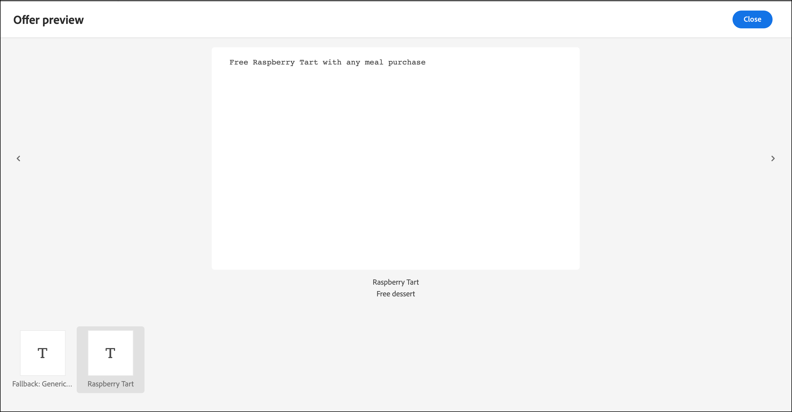

# オファーの決定を使用

用途 [!DNL Adobe Target] と [!DNL Adobe Journey Optimizer] web およびモバイルでの訪問者に対し、次に最適なオファーを決定して配信するためのオファーの決定。

で作成したオファーの決定を追加 [!DNL Adobe Journey Optimizer] から [!DNL Target] アクティビティ（手動） [!UICONTROL A/B テスト] または [!UICONTROL エクスペリエンスのターゲット設定]) を [!UICONTROL Visual Experience Composer] (VEC) または [!UICONTROL フォームベースのコンポーザー] を使用して、パーソナライズされたオファーをインバウンドチャネルで訪問者にテストし配信する [!DNL Target].

詳しくは、 [!DNL Adobe Journey Optimizer] オファーの決定については、 *[!DNL Journey Optimizer]* ドキュメント：

* [Journey Optimizer の概要](https://experienceleague.adobe.com/docs/journey-optimizer/using/get-started/get-started.html)

* [決定管理について](https://experienceleague.adobe.com/docs/journey-optimizer/using/offer-decisioning/get-started-decision/starting-offer-decisioning.html)

## 前提条件

でオファーの決定を使用するには [!DNL Target]に値を入力するには、以下が必要です。

* [!DNL Adobe Target Standard] または [!DNL Adobe Target Premium] を使用して実装 [Adobe Experience Platform Web SDK](https://experienceleague.adobe.com/docs/target-dev/developer/client-side/aep-web-sdk.html){target=_blank}.

   この機能は、 [!DNL Target] at.js またはその他の [!DNL Target] SDK.

* [!DNL Adobe Journey Optimizer Ultimate] (AJO +Offer decisioning) または [!DNL Adobe Experience Platform] そして [!UICONTROL offer decisioning] アプリケーションサービスアドオン。

## 使用例

次に、 [!DNL Target]/[!DNL Adobe Journey Optimizer] のオファー決定を使用する統合 [!DNL Target] アクティビティ：

### スポーツマーチャンダイジング

スポーツリーグのマーケターは、（デスクトップとモバイル Web サイトの両方で）ホームページのコンテンツをパーソナライズする必要がある。 複数のディメンションに基づいてコンテンツをパーソナライズし、関連するフランチャイズ商品を購入するオファーを提示する必要がある場合。 興味の対象：

* 訪問者のお気に入りのチーム
* 最近のアスリート/プレイヤーのアクティビティ（チームの動き、契約の更新、怪我など）

例えば、次の各地域にパーソナライズされたエクスペリエンスを配信するとします。Dortmund、Frankfurt、Bochum と、これらのチームの暗黙で明示的なファンであるユーザー向けのツールです。 指標として、商品サイトへの訪問回数とクリック数を確認します。

次の項目をデザインする： [!UICONTROL A/B テスト] アクティビティ (50/50分割 ) は、デフォルトエクスペリエンスとパーソナライズされたエクスペリエンス（各地域およびチーム向けのオファーを含むオファー決定を含む）の間でおこなわれます。 このアクティビティを使用して、パーソナライズされたエクスペリエンスとコントロールのコンバージョンおよび上昇率を判断します。

### ゲームストリーミングプラットフォーム

ゲーム組織のマーケターは、様々な地域のデスクトップおよびモバイルユーザー向けのゲームストリーミングプラットフォーム用にパーソナライズされたオファーを提供したいと考えています。ドイツ、フランス、メキシコ、ブラジル。 訪問者がこれらの地域の 1 つからデスクトップまたはモバイル Web サイトにアクセスする場合、ローカル言語でのゲームストリーミング用のオファーと、ローカル通貨に対応する価格を提供する必要があります。

In [!DNL Adobe Journey Optimizer]を使用すると、ターゲットとする各地域に対してパーソナライズされたホームページのヒーローオファーを作成し、さらにデフォルトのホームページのヒーローを含むフォールバックオファーを作成できます。 その後、これらのオファーとその実施要件ルールを組み込んだオファーの決定を作成できます。 次に、 [!DNL Target]を使用する場合、 [!DNL Experience Targeting] (XT) アクティビティを作成してオファーの決定をデスクトップまたはモバイル Web サイトに挿入し、パーソナライズされたエクスペリエンスを訪問者に提供します。

## オファーの決定を使用するエクスペリエンスを作成します。

1. 手動の編集中または作成中 [!UICONTROL A/B テスト] または [!UICONTROL エクスペリエンスのターゲット設定] (XT) アクティビティ [!UICONTROL Visual Experience Composer] (VEC)、ページ要素をクリックして [オプションメニュー](/help/main/c-experiences/c-visual-experience-composer/viztarget-options.md).

   

   >[!NOTE]
   >
   >また、 [!UICONTROL オファーの決定] 内 [[!UICONTROL フォームベースの Experience Composer]](/help/main/c-experiences/form-experience-composer.md).

1. クリック **[!UICONTROL 前に挿入]**, **[!UICONTROL 後ろに挿入]**&#x200B;または **[!UICONTROL コンテンツを置換]**&#x200B;を選択し、「 **[!UICONTROL オファーの決定]**.

   この [!UICONTROL オファーの決定] オプションは、編集または作成時に使用できます [手動 [!UICONTROL A/B テスト]](/help/main/c-activities/t-test-ab/test-ab.md#types) または [[!UICONTROL エクスペリエンスのターゲット設定]](/help/main/c-activities/t-experience-target/experience-target.md) (XT) アクティビティのみ。 このオプションは、他のアクティビティタイプでは使用できません。 メニューで使用できるオプションは、選択した要素によって異なります。

   

1. 内 **[!UICONTROL オファーの決定を追加]** ダイアログボックスで、目的のサンドボックスと配置を選択します。

   A [サンドボックス](https://experienceleague.adobe.com/docs/experience-platform/sandbox/ui/overview.html){target=_blank} in the [!DNL Adobe Experience Platform] lets you partition your instance into virtual environments. For example, you might have a production environment and a staging environment. A [placement](https://experienceleague.adobe.com/docs/journey-optimizer/using/offer-decisioning/create-components/creating-placements.html){target=_blank} in [!DNL Adobe Journey Optimizer] を使用すれば、適切なオファーコンテンツを適切な場所に表示できます。

   

1. 目的のオファーの決定を選択し、「 **[!UICONTROL 作成]**.

   

   Web サイトが VEC に表示され、ここで、新しく作成されたオファーの決定を [!UICONTROL 変更] ウィンドウの右側に表示されます。 変更の上にマウスポインターを置いて、 [!UICONTROL プレビュー] アイコンを使用して、オファーの決定を確認します。

   

   オファーに含まれる様々なオファーを調べるには、 [!UICONTROL オファープレビュー] ダイアログボックスに、フォールバックオファーが含まれます。 フォールバックオファーは、訪問者がコレクション内のパーソナライズされたオファーの対象でない場合に表示されるデフォルトオファーです。

   

1. アクティビティの作成を完了するには、 [!UICONTROL ターゲット設定] および [!UICONTROL 目標と設定] 3 ステップのガイドによるワークフローの手順

   >[!IMPORTANT]
   >
   >次の手順で [!DNL Target] アクティビティをパーソナライズする場合は、現在のアクティビティの開始日/終了日が、 [!DNL Adobe Journey Optimizer]. この [!DNL Target] 開始日/終了日が、オファーの決定の開始日/終了日の範囲外 ( デフォルトは [!DNL Target] 訪問者にコンテンツが表示されます。

   

## メモと制限事項

オファーの決定を扱う際は、次の点に注意してください。

* offer decisioningの統合は、で機能します。 [!DNL Target] に基づく実装 [Adobe Experience Platform Web SDK](https://experienceleague.adobe.com/docs/target-dev/developer/client-side/aep-web-sdk.html){target=_blank}. この機能は、 [!DNL Target] at.js またはその他の [!DNL Target] SDK.

* この [!DNL Target]/[!DNL Adobe Journey Optimizer] 統合のサポート [手動 [!UICONTROL A/B テスト]](/help/main/c-activities/t-test-ab/test-ab.md#types) および [[!UICONTROL エクスペリエンスのターゲット設定]](/help/main/c-activities/t-experience-target/experience-target.md) (XT) アクティビティのみ。 この機能は、他のアクティビティタイプでは使用できません。

* 次を使用することはできません： [[!UICONTROL レポートソースとしての Analytics]](/help/main/c-integrating-target-with-mac/a4t/a4t.md) (A4T) を使用します。 選択 [!DNL Target] を [!UICONTROL 目標と設定] アクティビティのオファーの決定を使用する場合は、アクティビティの設定時にページを開きます。

* text/html コンテンツタイプのオファーは、deliveryURL コンテンツ配信をサポートしていません。 deliveryURL は、 [フォームベースの Experience Composer](/help/main/c-experiences/form-experience-composer.md) クライアントがコンテンツの明示的な取得と作成をおこなう場合にのみ使用します。

* [!DNL Target] レポートには、オファーの決定レベルのレポートは含まれません。

* 視覚化 [QA リンク](/help/main/c-activities/c-activity-qa/activity-qa.md) 対象 [!DNL Target] オファーの決定を含むエクスペリエンスは、 [!DNL Adobe Journey Optimizer] を設定する必要があります。
