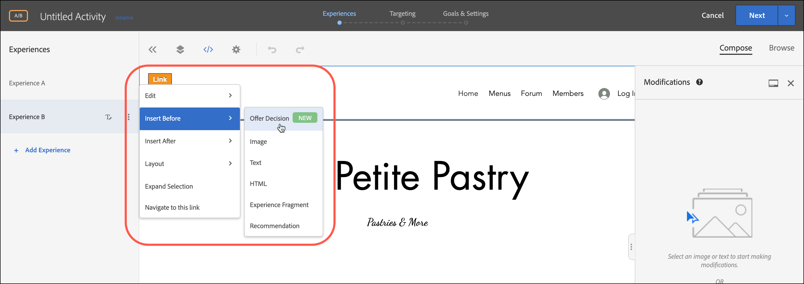

# オファーの決定を使用

[!DNL Adobe Target]と[!DNL Adobe Journey Optimizer]件のオファー決定を使用して、webとモバイル上の訪問者に対する次善のオファーを決定し、配信します。

[!DNL Adobe Journey Optimizer]で作成されたオファー決定を[!DNL Target] アクティビティ （手動[!UICONTROL A/B Test]または[!UICONTROL Experience Targeting]）に追加し、[!UICONTROL Visual Experience Composer] （VEC）または[!UICONTROL Form-Based Composer]のいずれかを使用して、[!DNL Target]を利用したインバウンドチャネルで訪問者にパーソナライズされたオファーをテストして配信します。

[!DNL Adobe Journey Optimizer]とオファーの決定について詳しくは、*[!DNL Journey Optimizer]* ドキュメントの次のトピックを参照してください。

* [Journey Optimizer入門](https://experienceleague.adobe.com/docs/journey-optimizer/using/get-started/get-started.html)

* [意思決定管理について](https://experienceleague.adobe.com/docs/journey-optimizer/using/offer-decisioning/get-started-decision/starting-offer-decisioning.html)

## 前提条件

[!DNL Target]でオファー決定を使用するには、次のものが必要です。

* [!DNL Adobe Target Standard]または[!DNL Adobe Target Premium]が[Adobe Experience Platform Web SDK](https://experienceleague.adobe.com/docs/target-dev/developer/client-side/aep-web-sdk.html?lang=ja){target=_blank}を使用して実装されました。

  at.jsまたはその他の[!DNL Target] SDKを使用して[!DNL Target]を実装する場合、この機能は使用できません。

* [!DNL Adobe Journey Optimizer Ultimate] （AJO + Offer Decisioning）または[!DNL Adobe Experience Platform]と[!UICONTROL Offer Decisioning] application service アドオン。

## 使用例

次の例は、[!DNL Target]/[!DNL Adobe Journey Optimizer]統合を使用して、[!DNL Target] アクティビティでオファー決定を使用する方法の使用例です。

### スポーツマーチャンダイジング

スポーツリーグのマーケターとして、ホームページ（デスクトップとモバイルの両方のweb サイト）でコンテンツをパーソナライズしたいと考えています。 複数のディメンションにもとづいてコンテンツをパーソナライズし、ショッピング関連のフランチャイズ商品にオファーを提示します。 次の項目に関心があります。

* 訪問者のお気に入りチーム
* 最近のアスリート/選手のアクティビティ（チームの移動、契約の更新、怪我など）

例えば、ドルトムント、フランクフルト、ボーフムの各地域と、これらのチームの暗黙的および明示的なファンであるユーザーに対して、パーソナライズされたエクスペリエンスを提供します。 指標として、商品サイトへの訪問数とクリック数を確認します。

デフォルトのエクスペリエンスとパーソナライズされたエクスペリエンスの間で[!UICONTROL A/B Test] アクティビティ（50/50の分割）を設計する必要があります（これには、各地域とチームに対するオファーを含むオファー決定が含まれます）。 このアクティビティを使用して、パーソナライズされたエクスペリエンスと制御のコンバージョンと上昇率を決定します。

### ゲームストリーミングプラットフォーム

ゲーム企業のマーケターは、ドイツ、フランス、メキシコ、ブラジルなど、様々な地域のデスクトップ PCやモバイルユーザー向けに、ゲームストリーミングプラットフォームのパーソナライズされたオファーを提供する必要があります。 訪問者がこれらの地域からデスクトップまたはモバイルのweb サイトにアクセスする場合、現地の言語でゲームストリーミングのオファーと、現地通貨に対応する価格を提供する必要があります。

[!DNL Adobe Journey Optimizer]では、ターゲット地域ごとにパーソナライズされたホームページ ヒーローオファーと、デフォルトのホームページ ヒーローオファーを含むフォールバックオファーを作成できます。 その後、これらのオファーとその適格性ルールを組み込んだオファー決定を作成できます。 次に、[!DNL Target]で、[!DNL Experience Targeting] （XT） アクティビティを作成し、そのオファー決定をデスクトップまたはモバイル web サイトに挿入して、訪問者にパーソナライズされたエクスペリエンスを提供できます。

## オファー決定を使用するエクスペリエンスを作成します。

1. [!UICONTROL Visual Experience Composer] （VEC）で手動[!UICONTROL A/B Test]または[!UICONTROL Experience Targeting] （XT）アクティビティを編集または作成する際に、ページ要素をクリックして[ オプション メニュー](/help/main/c-experiences/c-visual-experience-composer/viztarget-options.md)を表示します。

   Visual Experience Composerの

   >[!NOTE]
   >
   >[[!UICONTROL Form-Based Experience Composer]](/help/main/c-experiences/form-experience-composer.md)で[!UICONTROL Offer Decisions]を使用するエクスペリエンスを作成することもできます。

1. **[!UICONTROL Replace Content]**&#x200B;をクリックしてから、**[!UICONTROL Offer Decision]**&#x200B;をクリックします。

   [!UICONTROL Offer Decision] オプションは、[手動[!UICONTROL A/B Test]](/help/main/c-activities/t-test-ab/test-ab.md#types)または[[!UICONTROL Experience Targeting]](/help/main/c-activities/t-experience-target/experience-target.md) （XT）アクティビティの編集または作成時にのみ使用できます。 このオプションは、他のアクティビティタイプでは使用できません。 メニューで使用できるオプションは、選択した要素によって異なります。

   Visual Experience Composerの

1. VECの右側にある&#x200B;**[!UICONTROL Add Offer Decision]** パネルで、目的のサンドボックスを選択し、「オファー決定。配置を選択」をクリックします。

   [!DNL Adobe Experience Platform]の[ サンドボックス ](https://experienceleague.adobe.com/docs/experience-platform/sandbox/ui/overview.html){target=_blank}を使用すると、インスタンスを仮想環境に分割できます。 たとえば、実稼動環境とステージング環境があるとします。 [!DNL Adobe Journey Optimizer]の[ プレースメント ](https://experienceleague.adobe.com/docs/journey-optimizer/using/offer-decisioning/create-components/creating-placements.html){target=_blank}は、適切なオファーコンテンツを適切な場所に表示するのに役立ちます。

   オファー決定を追加ダイアログボックスの

1. 目的のオファーのプレースメントとオファーの決定を選択し、**[!UICONTROL Add]**&#x200B;をクリックします。

   

   Web サイトがVECに表示され、新しく作成されたオファー決定が[!UICONTROL Modifications] パネルに表示されます。 [!UICONTROL Offer Decision] パネルの下部にある[!UICONTROL Offer Preview]の下にあるオファーをクリックして、オファーの決定を確認できます。

   <!--You can examine the various offers contained in the offer by clicking the appropriate icon at the bottom of the [!UICONTROL Offer Preview] dialog box, including the fallback offer. A fallback offer is the default offer displayed when a visitor is not eligible for any of the personalized offers in the collection.-->

   

1. 3部構成のガイド付きワークフローの[!UICONTROL Targeting]と[!UICONTROL Goals & Settings]の手順を完了して、アクティビティの作成を完了します。

   >[!IMPORTANT]
   >
   >[!DNL Target] アクティビティがパーソナライズされていることを確認するには、現在のアクティビティの開始日/終了日が[!DNL Adobe Journey Optimizer]のオファー決定の開始日/終了日と一致していることを確認してください。 [!DNL Target]の開始日/終了日がオファー決定の開始日/終了日範囲外の場合、デフォルトの[!DNL Target] コンテンツが訪問者に表示されます。

## メモと制限事項

オファーの決定を操作する際には、次の情報を考慮してください。

* Offer Decisioning統合は、[Adobe Experience Platform Web SDK](https://experienceleague.adobe.com/docs/target-dev/developer/client-side/aep-web-sdk.html?lang=ja){target=_blank}に基づいて[!DNL Target]実装で機能します。 この機能は、at.jsまたはその他の[!DNL Target] SDKを使用して[!DNL Target]を実装する場合は使用できません。

* [!DNL Target]/[!DNL Adobe Journey Optimizer]統合では、[手動[!UICONTROL A/B Test]](/help/main/c-activities/t-test-ab/test-ab.md#types)および[[!UICONTROL Experience Targeting]](/help/main/c-activities/t-experience-target/experience-target.md) （XT）アクティビティのみをサポートしています。 この機能は、他のアクティビティタイプでは使用できません。

* アクティビティでオファー決定を使用している場合は、[[!UICONTROL Analytics as the reporting source]](/help/main/c-integrating-target-with-mac/a4t/a4t.md) （A4T）を使用できません。 アクティビティでオファー決定を使用する場合は、アクティビティの設定時に[!UICONTROL Goals and Settings] ページのレポートソースとして[!DNL Target]を選択します。

* text/html コンテンツタイプのオファーは、deliveryURL コンテンツ配信をサポートしていません。 deliveryURLは、[ フォームベースのExperience Composer](/help/main/c-experiences/form-experience-composer.md)を通じてサポートされますが、これは、クライアントがコンテンツの明示的な取得と作成を担当する場合に限られます。

* [!DNL Target] レポートでは、オファー決定レベルのレポートは提供されていません。

* オファー決定を含む[!DNL Target]個のエクスペリエンスの[QA リンク ](/help/main/c-activities/c-activity-qa/activity-qa.md)を視覚化すると、これらのオファー決定の[!DNL Adobe Journey Optimizer]で設定された頻度の上限に影響します。
