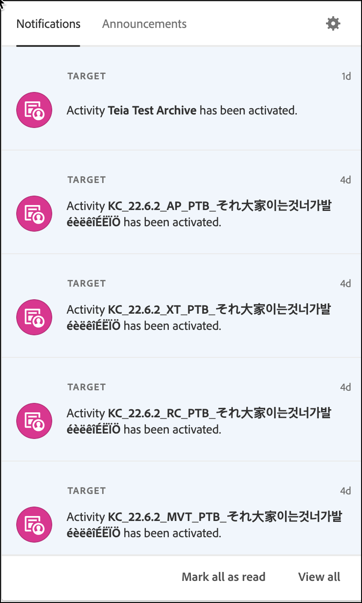

# [!DNL Target] UI について

ユーザーインターフェイスは、[!DNL Adobe Target] を最大限に活用できるよう、論理的かつユーザーにわかりやすい形式で配置されています。以下の概要は、 [!DNL Target] およびには、より詳細な情報と手順を示すリンクが含まれています。

の上部にあるヘッダー [!DNL Target] UI には、ソリューションの様々な機能をナビゲートするのに役立つタブとオプションが含まれています。 組織と [!DNL Adobe Experience Cloud] ソリューション、ヘルプと通知の取得、管理 [!DNL Adobe] プロファイルを作成し、 [!DNL Target].

左側のタブを使用すると、の様々な機能にアクセスできます [!DNL Target]（後で説明します） タブに進める前に、まず、右側のオプションについて説明します。

## 組織

*組織*&#x200B;とは、管理者がグループおよびユーザーを設定し、[!DNL Adobe Experience Cloud] でのシングルサインオンを制御するために使用するエンティティです。組織は、すべての [!DNL Experience Cloud] 製品およびソリューションをまたいだログイン会社のように機能します。ほとんどの場合、組織は、会社名です。ただし、会社は多数の組織を持つことができます。

会社に複数の組織がある場合は、[!UICONTROL 組織]ドロップダウンリストで目的の組織を選択します。

## Apps

アプリ切り替えボタンをクリックすると、自分がアクセス権を持っている [!DNL Adobe Experience Cloud] ソリューションにすばやくアクセスできます。

## ヘルプ

ヘルプアイコンを使用すると、[!DNL Target] をより効果的に使用するために、情報、ビデオ、ブログなどにアクセスできます。サポートチケットを作成したり、サポートの電話番号を検索したり、Twitterで質問をしたり、 [!DNL Target] どのようにして [!DNL Target] チームがやっている。

## 通知とお知らせ

[!UICONTROL 通知]と[!UICONTROL お知らせ]パネルを使用すると、[!DNL Adobe Target] のすべてに関する最新情報を入手できます。アクティブ通知は、 [!DNL Adobe Experience Cloud] ソリューションと [!DNL Target] イベント。 プロアクティブ通知では、停止イベントおよびメンテナンスイベントを警告します。

>[!NOTE]
>
>拡張された [!UICONTROL 通知とお知らせ] このセクションのパネルは、選択に現在適用されています [!DNL Target] のお客様およびは、今後数ヶ月以内にすべてのお客様にロールアウトされます。

ヘッダーのベルアイコンをクリックして、通知を表示します。

パネルには、次の項目のタブが含まれます。 [!UICONTROL 通知] および [!UICONTROL お知らせ].

以下のセクションでは、各タブに関する情報と、通知とお知らせを設定する方法について説明します。

###  通知 

[!DNL Target] イベント通知には、次のものが含まれます。

* **アクティビティ**:手動で、または開始日または終了日に達した場合に、アクティビティが承認または非アクティブ化されたときのすべてのアクティビティタイプに関する通知。 通知には、アクティビティの名前と、アクティビティの概要ページへのリンクが含まれます。

   通知は設定可能で、デフォルトでは、アクティビティのワークスペースの製品管理者、発行者、承認者が [!DNL Target Premium] アカウント。 の場合 [!DNL Target Standard] アカウント、通知は、すべての発行者と承認者が受け取ります。

   通知は、次のサンプルのようにフォーマットされます。

   * `Activity {target.activity.name} has been activated`

   * `Activity {target.activity.name} has been deactivated`

* **プロファイルスクリプト**:手動または [!DNL Target].

   通知は設定可能で、デフォルトでは、製品管理者と承認者が両方の通知を受け取ります [!DNL Target Premium] および [!DNL Target Standard] アカウント。

   通知は、次のサンプルのようにフォーマットされます。

   * `Profile Script {target.profileScript.name} has been activated`
   * `Profile Script {target.profileScript.name} has been deactivated`

* **Recommendationsフィード**:次の場合の通知： [!DNL Recommendations] フィードは、手動または非アクティブ化のいずれかで、 [!DNL Target]. 通知は、 [!DNL Recommendations] フィードに失敗しました。

   通知は設定可能で、デフォルトでは、製品管理者と承認者が [!DNL Target Premium] アカウント。 [!DNL Recommendations] は [!DNL Target Premium] 機能を使用している必要があります。 [!DNL Target Standard].

   通知は、次のサンプルのようにフォーマットされます。

   * `Feed  {target.feed.name} has been activated`
   * `Feed {target.feed.name} has been deactivated`
   * `Feed {target.feed.name} has failed to import from source`

すべての通知を既読としてマークしたり、パネルの下部にすべての通知を表示したりできます。

### 発表

プロアクティブ通知では、停止イベントおよびメンテナンスイベントを警告します。

詳しくは、[Adobe ステータス](https://status.adobe.com/)ページを参照してください。

### 通知とお知らせの設定

通知環境設定を編集するには：

1. 歯車アイコンをクリックし、 **[!UICONTROL 通知]**.
1. の下 **[!UICONTROL ターゲット]**&#x200B;をクリックし、 **[!UICONTROL カスタマイズ]**.
1. 通知を受信するカテゴリを選択または選択解除します。

   * リクエスト：誰かがユーザーに対して、オブジェクトの承認またはオブジェクトへのアクセス権の付与のリクエストを送信したとき。 このカテゴリを購読解除することはできません。
   * 割り当て済み：誰かがあなたにオブジェクトを割り当てたとき。
   * メンション：誰かがコメントであなたに言及したとき。
   * 新しいリリース：アクセス可能な製品またはサービスの新しいリリースが利用可能になったとき。
   * 自分と共有：誰かがあなたとオブジェクトを共有したとき。
   * コンテンツの更新：自分が作成またはフォローしているオブジェクトを誰かが編集、削除、またはコメントしたとき。
   * その他 :

   >[!NOTE]
   >
   >「新しいリリース」と「コンテンツの更新」は、 [!DNL Target]. その他のカテゴリは、他のカテゴリソリューションにAdobeされます。

1. 優先度が高いと見なすカテゴリを選択します。
1. ブラウザーにアラートを表示する通知を選択します。

   これらのアラートは、数秒間、ブラウザーの右上隅に表示されます。 優先度の高いカテゴリ、すべてのカテゴリの表示、すべての通知ポップアップの非表示を選択できます。 また、通知を閉じるまで通知を表示したままにするか、通知期間を設定するかを設定することもできます。

1. 通知 E メールを受信する頻度を選択します。

   * メールを送信しない
   * インスタント通知
   * 日別ダイジェスト
   * 毎週のダイジェスト

## プロファイル

[!DNL Adobe Experience Cloud] の環境設定を編集したり、[!DNL Target] からサインアウトしたりするには、プロファイルのアバターをクリックします。また、[!DNL Adobe] プロファイルにアクセスや編集することもできます。

次に、[!DNL Target] ヘッダーの左側のタブについて説明します。

## アクティビティ

**[!UICONTROL アクティビティ]**&#x200B;リストは、[!DNL Target] を開いたときのデフォルトのビューです。このページからアクティビティを作成し、既存のアクティビティを管理できます。

[!DNL Target]で利用可能なアクティビティの種類に関する詳細、および[!UICONTROL アクティビティ]リストのユーザーインターフェイスに関する詳細は、[アクティビティ](/help/main/c-activities/activities.md)を参照してください。

## オーディエンス

次をクリック： **[!UICONTROL オーディエンス]** タブを使用して、 [!UICONTROL オーディエンス] オーディエンスを作成し、既存のオーディエンスを管理できるリスト。

オーディエンスは、ターゲットアクティビティを表示する、類似アクティビティ参加者のグループです。 オーディエンスは、新規訪問者、再訪問者、中西部からの再訪問者など、同じ特性を持つ人々のグループです。[!UICONTROL オーディエンス]機能を使用すると、様々なコンテンツやエクスペリエンスを特定のオーディエンスにターゲット設定することで、的確なメッセージを最適な対象者にタイミングよく表示し、デジタルマーケティングを最適化できます。訪問者がターゲットオーディエンスに当てはまる場合は、[!DNL Target] により、アクティビティ作成時に定義された条件に基づいて、そのユーザーに表示するエクスペリエンスが決定されます。

[!DNL Target] のオーディエンスタイプに関する詳細および[!UICONTROL オーディエンス]リストのユーザーインターフェイスに関する詳細は、 [オーディエンスの作成](/help/main/c-target/c-audiences/create-audience.md) を参照してください。

## オファー

次をクリック： **[!UICONTROL オファー]** タブを使用して、 [!UICONTROL オファー] エクスペリエンスおよびオファーを作成し、既存のエクスペリエンスおよびオファーを管理できるリスト。

エクスペリエンスは、オファー、画像、テキスト、ボタン、ビデオ、ページ上のこれらの様々な要素の組み合わせ、Web ページ全体、購入ファネルやその他のページの論理的シーケンスを形成するページのセットである可能性があります。また、音声アシスタント応答、カスタマーサービスのスクリプト、自動販売機のパーソナライズされたフレーバーであることもあります。[!DNL Target] アクティビティのエクスペリエンスをテストまたはパーソナライズします。

[!DNL Target] のオファータイプに関する詳細および [!UICONTROL オファー]リストのユーザーインターフェイスに関する詳細は、[オファー](/help/main/c-experiences/c-manage-content/manage-content.md)を参照してください。

## Recommendations

「**[!UICONTROL Recommendations]**」タブをクリックして [!DNL Target Recommendations] にアクセスします。

>[!NOTE]
>
>Recommendations アクティビティは、 [!DNL Target Premium] ソリューションの一部です。[!DNL Target Premium] ライセンスのない [!DNL Target Standard] では利用できません。詳細情報は、*ターゲットの紹介*&#x200B;の [Target Premium](/help/main/c-intro/intro.md#premium) を参照してください。

[!UICONTROL Recommendations] のアクティビティは、以前のユーザーアクティビティまたはその他のアルゴリズムを基にして、顧客が興味を持つ可能性のある製品またはコンテンツを自動的に表示します。Recommendationsは、顧客が知らない関連アイテムを表示するのに役立ちます。

[!DNL Target]の [!UICONTROL Recommendations] に関する詳細および [!UICONTROL Recommendations] のユーザーインターフェイスに関する詳細は、 [Recommendations](/help/main/c-recommendations/recommendations.md) を参照してください。

## 管理

「**[!UICONTROL 管理]**」タブをクリックして、[!UICONTROL 管理]ページにアクセスします。

[!UICONTROL 管理]ページでは、[!DNL Target]（[!UICONTROL Visual Experience Composer]（VEC）、レポート、[!DNL Scene7] の設定、実装、ホスト、環境、応答トークン、ユーザーの設定を含む）を管理できます。

詳細およびユーザーインターフェイスについては、[Target の管理の概要](/help/main/administrating-target/administrating-target.md)を参照してください。
