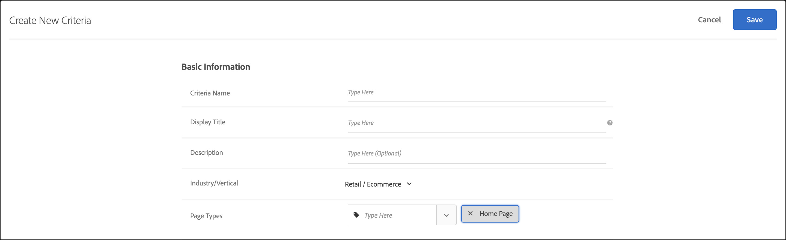

#  条件を作成

の条件 [!UICONTROL Adobe Target] [!UICONTROL Recommendations] コンテンツの制御 [!UICONTROL Recommendations] アクティビティ。 アクティビティに最適なレコメンデーションを表示するために、条件を作成します。これらの条件では、訪問者のアクションを使用して、表示するコンテンツまたは製品を決定します。

次の節では、新しい条件の作成方法について説明します。

## 新しい条件を作成画面へのアクセス

[!UICONTROL 新しい条件を作成]画面を表示するには、複数の方法があります。一部の画面オプションは、画面の表示方法によって異なります。

* の **[!UICONTROL Recommendations]** > **[!UICONTROL 条件]** ライブラリ画面、「 **[!UICONTROL 条件の作成]** > **[!UICONTROL 条件の作成]**. ここで作成した条件は、自動的にすべての [!DNL Recommendations] アクティビティで利用できるようになります。
* を作成する際に、 [!DNL Recommendations] アクティビティ [!UICONTROL Visual Experience Composer] (VEC)、すぐに [!UICONTROL 条件を選択] 画面を表示し、「 [!UICONTROL Recommendationsと置き換える], [!UICONTROL 前にRecommendationsを挿入]または [!UICONTROL 後ろにRecommendationsを挿入]. 次に、使用可能な条件を選択するか、 **[!UICONTROL 条件の作成]**. 新しい条件を作成する場合、他の場合と共に使用するために条件を保存するオプションがあります [!DNL Recommendations] アクティビティ。 詳しくは、 [Recommendationsアクティビティの作成](/help/main/c-recommendations/t-create-recs-activity/create-recs-activity.md).
* [!DNL Recommendations] アクティビティを編集している場合、ページの「 [!UICONTROL レコメンデーションの場所]」ボックスをクリックして、「**[!UICONTROL 条件を変更]**」を選択します。の [!UICONTROL 条件を選択] 画面、クリック **[!UICONTROL 条件の作成]**. 他の [!DNL Recommendations] アクティビティで使用するために新しい条件を保存するオプションがあります。

次の手順では、 [!UICONTROL 新しい条件の作成] 画面を次の最初の方法で表示します。の **[!UICONTROL Recommendations]** > **[!UICONTROL 条件]** ライブラリ画面

1. クリック **[!UICONTROL Recommendations]** > **[!UICONTROL 条件]**.

1. クリック **[!UICONTROL 条件の作成]** > **[!UICONTROL 条件の作成]**.

   

1. 次のセクションで情報を設定します。

## [!UICONTROL 基本情報] {#info}

1. 「**[!UICONTROL 条件名]**」を入力します。

   これは、条件の説明に使用される「内部」名です。例えば、条件を「利幅の高い商品」と呼びたいが、正式に表示されるタイトルにはそれを使いたくないという場合があります。公開されるタイトルを設定するには、次の手順を参照してください。

   

1. この条件を使用するすべての Recommendations 用にページに表示する、公開される「**[!UICONTROL 表示されるタイトル]**」を入力します。

   例えば、この条件を使用してレコメンデーションを表示する際に、「これを表示したひとはこれも表示しています」または「類似の商品」と表示したい場合があります。

1. 条件の簡単な&#x200B;**[!UICONTROL 説明]**&#x200B;を入力します。

   説明は条件の特定に役立ちます。ここに条件の目的に関する情報を含めることもできます。

1. レコメンデーションアクティビティの目標に基づいて、業種を選択します。

   | 業種 | 目標 |
   |--- |--- |
   | 小売／e コマース | 購入をもたらすコンバージョン |
   | リードジェネレーション／B2B／金融サービス | 購入を伴わないコンバージョン |
   | メディア／投稿 | エンゲージメント |

   その他の条件オプションは、選択した業種によって異なります。

1. **[!UICONTROL ページタイプ]**&#x200B;を選択します。

   複数のページタイプを選択できます。

   業種とページタイプをともに使用して、保存した条件を分類し、他の [!DNL Recommendations] アクティビティで簡単に再利用できるようにします。

## [!UICONTROL Recommendations Algorithm] {#rec-algo}

1. を選択します。 **[!UICONTROL アルゴリズムタイプ]** および **[!UICONTROL アルゴリズム]**:

   

   | アルゴリズムタイプ | 使用するタイミング | 利用可能なアルゴリズム |
   | --- | --- | --- |
   | [!UICONTROL 買い物かごベース] | ユーザーの買い物かごの内容に基づいてレコメンデーションをおこないます。 | <ul><li>これらを閲覧した人がそれらを閲覧しました</li><li>これらを閲覧した人が購入したもの</li><li>これらを購入した人が購入したもの</li></ul> |
   | [!UICONTROL 人気度ベース] | サイト全体での品目の全体的な人気度に基づいて、またはユーザーのお気に入りまたは最も多く閲覧されたカテゴリ、ブランド、ジャンルなど内の品目の人気度に基づいてレコメンデーションをおこないます。 | <ul><li>サイト全体で最も多く閲覧された</li><li>カテゴリ別の最も多く閲覧された項目</li><li>品目属性別最も多く閲覧された品目</li><li>サイト全体のトップセラー</li><li>カテゴリ別のトップセラー</li><li>品目属性別トップセラー</li><li>Analytics 指標別の上位</li></ul> |
   | [!UICONTROL 項目ベース] | ユーザーが現在表示している品目や最近表示した品目に類似した品目を見つけることに基づいてレコメンデーションをおこないます。 | <ul><li>これを閲覧した人が他に閲覧したもの</li><li>これを閲覧した人が購入したもの</li><li>これを購入した人が他に購入したもの</li><li>類似の属性を持つ品目</li></ul> |
   | [!UICONTROL ユーザーベース] | ユーザーの行動に基づいてレコメンデーションをおこなう。 | <ul><li>最近表示された項目</li><li>お勧め</li></ul> |
   | [!UICONTROL カスタム条件] | アップロードしたカスタムファイルに基づいてレコメンデーションをおこないます。 | <ul><li>カスタムアルゴリズム</li></ul> |

   >[!NOTE]
   >
   >次を選択した場合、 **[!UICONTROL 項目]**/ **[!UICONTROL 類似の属性を持つメディア]**&#x200B;を選択した場合、 [コンテンツ類似性ルール](#similarity).

1. 必要に応じて、 **項目属性** および **一致させるプロファイル属性**, a **レコメンデーションキー**, **フィルターキー**、または **Analytics 指標** をクリックして、アルゴリズムを設定します。

残りのアルゴリズム設定オプションは、選択したアルゴリズムによって異なります。 アルゴリズムの設定を完了するには、 [!UICONTROL レコメンデーションキー], [!UICONTROL フィルターキー], [!UICONTROL 共同発生基準], [!UICONTROL Analytics 指標]、または [!UICONTROL 項目属性] および [!UICONTROL 一致させるプロファイル属性].

の選択に関する詳細 [!UICONTROL レコメンデーションキー]を参照してください。 [レコメンデーションキーに基づくレコメンデーションの設定](/help/main/c-recommendations/c-algorithms/base-the-recommendation-on-a-recommendation-key.md).

## [!UICONTROL データソース] {#data-source}

1. 目的のを選択します。 **[!UICONTROL 行動データソース]**: [!UICONTROL Adobe Target] または [!UICONTROL Analytics].

   >[!NOTE]
   >
   >この [!UICONTROL 行動データソース] セクションは、実装で [Analytics for Target](/help/main/c-integrating-target-with-mac/a4t/a4t.md) (A4T)。

   

   「[!UICONTROL Analytics]」を選択した場合、目的のレポートスイートを選択します。

   条件が [!DNL Adobe Analytics] 行動データソースを作成した後、条件が使用可能になる時間は、選択されているレポートスイートとルックバックウィンドウが他の条件でも使用されているかどうかに応じて異なります。以下に説明します。

   * **1 回限りのレポートスイート設定**：指定されたデータ範囲のルックバックウィンドウで最初にレポートスイートが使用されると、[!DNL Target Recommendations] は、選択されたレポートスイートの行動データを [!DNL Analytics] から完全にダウンロードするまで 2 ～ 7 日間かかる可能性があります。この期間は、 [!DNL Analytics] システム負荷。
   * **新しい条件または既に使用可能なレポートスイートを使用して編集した条件**：新しい条件を作成したり既存の条件を編集したりする場合、選択されたレポートスイートが選択されたデータ範囲以下のデータ範囲で既に [!DNL Target Recommendations] で使用されていれば、データは即座に使用でき、1 回限りの設定は必要ありません。この場合、または選択されたレポートスイートまたはデータ範囲が変更されずにアルゴリズムの設定が編集されると、12 時間以内にアルゴリズムが実行または再実行されます。
   * **進行中のアルゴリズム実行**：毎日の [!DNL Analytics] から [!DNL Target Recommendations] へのデータフロー。例えば、[!UICONTROL 表示の親和性]レコメンデーションの場合、ユーザーが製品を表示すると、製品表示トラッキングコールがほぼリアルタイムで [!DNL Analytics] に渡されます。[!DNL Analytics] データが翌日早くに [!DNL Target] にプッシュされ、[!DNL Target] が 12 時間以内にアルゴリズムを実行します。

   詳しくは、 [Adobe Analyticsと Target Recommendationsの使用](/help/main/c-recommendations/c-algorithms/use-adobe-analytics-with-recommendations.md).

1. を **[!UICONTROL ルックバックウィンドウ]** を使用して、表示するレコメンデーションを決定する際に使用するユーザーの行動履歴データの範囲を決定します。 このオプションは、類似の属性を持つ品目とカスタムアルゴリズムを除く、すべてのアルゴリズムで使用できます。

   

   サイトのトラフィックが多く、行動が頻繁に変わる場合は、データの範囲を狭めます。[!DNL Recommendations] は、範囲を狭くするほどマーケットやビジネスの変化に反応しやすくなります。例えば、範囲を狭く設定した場合、訪問者が新学期やクリスマスなどの季節の製品の購入を始めると、[!DNL Recommendations] は訪問者の行動の変化を検知して季節に適した品目をレコメンデーションするようになります。

   データ量が多くない場合や、訪問者の行動が頻繁に変化しない場合は、範囲を長くすることもできます。ただし、多くのサイトでは、範囲を狭くするほどレコメンデーションの品質が向上します。

   有効なデータ範囲は、次のとおりです。

   | ルックバックウィンドウオプション | 更新された頻度（ホバー時に表示） | サポートされるアルゴリズム |
   | --- | --- | --- |
   | 6 時間 | アルゴリズムは 3 ～ 6 時間ごとに実行されます | [!UICONTROL 人気度ベース] アルゴリズムを選択したとき [!UICONTROL 行動データソース] が [!DNL Adobe Target] |
   | 1 日 | アルゴリズムは 12 ～ 24 時間ごとに実行されます | [!UICONTROL 人気度ベース] アルゴリズム |
   | 2 日 | アルゴリズムは 12 ～ 24 時間ごとに実行されます | <ul><li>[!UICONTROL 人気度ベース] アルゴリズム</li><li>[!UICONTROL 項目ベース] アルゴリズム</li><li>[!UICONTROL ユーザーベース] アルゴリズム</li><li>[!UICONTROL 買い物かごベース] アルゴリズム</li></ul> |
   | 1 週間 | アルゴリズムは 24 ～ 48 時間ごとに実行されます | <ul><li>[!UICONTROL 人気度ベース] アルゴリズム</li><li>[!UICONTROL 項目ベース] アルゴリズム</li><li>[!UICONTROL ユーザーベース] アルゴリズム</li><li>[!UICONTROL 買い物かごベース] アルゴリズム</li></ul> |
   | 2 週間 | アルゴリズムは 24 ～ 48 時間ごとに実行されます | <ul><li>[!UICONTROL 人気度ベース] アルゴリズム</li><li>[!UICONTROL 項目ベース] アルゴリズム</li><li>すべて [!UICONTROL ユーザーベース] アルゴリズム</li><li>[!UICONTROL 買い物かごベース] アルゴリズム</li></ul> |
   | 1 か月（30 日） | アルゴリズムは 24 ～ 48 時間ごとに実行されます | <ul><li>[!UICONTROL 人気度ベース] アルゴリズム</li><li>[!UICONTROL 項目ベース] アルゴリズム</li><li>[!UICONTROL ユーザーベース] アルゴリズム</li><li>[!UICONTROL 買い物かごベース] アルゴリズム</li></ul> |
   | 2 か月（61 日） | アルゴリズムは 24 ～ 48 時間ごとに実行されます | <ul><li>[!UICONTROL 人気度ベース] アルゴリズム</li><li>[!UICONTROL 項目ベース] アルゴリズム</li><li>[!UICONTROL ユーザーベース] アルゴリズム</li><li>[!UICONTROL 買い物かごベース] アルゴリズム</li></ul> |

## [!UICONTROL コンテンツをバックアップ] {#content}

[!UICONTROL コンテンツをバックアップ] ルールは、レコメンデーション品目の数が満たされない場合の処理を決定します [recommendations デザイン](/help/main/c-recommendations/c-design-overview/design-overview.md). [!DNL Recommendations] の条件によって、デザインが呼び出すよりも少ないレコメンデーションを返すことがあります。例えば、デザインに 4 つの品目のスロットがあり、条件によって 2 つの品目のみがレコメンデーションされる場合、残りのスロットを空のままにし、代替レコメンデーションを使用して余分なスロットを埋めるか、レコメンデーションを表示しないかを選択できます。

1. （オプション） **[!UICONTROL デザインの部分レンダリング]** 「オン」の位置に切り替えます。

   スロットはできるだけ多く埋められますが、デザインテンプレートに残りのスロット用に空白のスペースが含まれる場合があります。 このオプションが無効で、使用可能なすべてのスロットに十分なコンテンツがない場合、レコメンデーションは提供されず、代わりにデフォルトコンテンツが表示されます。

   空のスロットでレコメンデーションを提供したい場合は、このオプションを有効にします。 次の手順で説明するように、サイトの空のスロットに類似したコンテンツや人気の高いコンテンツがいっぱいになった条件に基づいてレコメンデーションスロットにコンテンツを挿入する場合は、代替レコメンデーションを使用します。

1. （オプション） **[!UICONTROL バックアップコンテンツを表示]** 「オン」の位置に切り替えます。

   デザインの残りの空のスロットには、サイト全体から最も多く閲覧された製品をランダムに選択して入力します。

   代替レコメンデーションを使用すると、使用可能なすべてのスロットにレコメンデーションデザインが必ず挿入されます。 次の図に示すように、4 x 1 のデザインがあるとします。

   

   条件によって、2 つの品目のみがレコメンデーションされるとします。 以下を有効にした場合、 [!UICONTROL デザインの部分レンダリング] オプションの場合、最初の 2 つのスロットは満たされますが、残りの 2 つのスロットは空のままです。 ただし、 [!UICONTROL バックアップRecommendationsを表示] オプションの場合、最初の 2 つのスロットは指定した条件に基づいて埋められ、残りの 2 つのスロットは代替レコメンデーションに基づいて埋められます。

   以下の表に、 [!UICONTROL デザインの部分レンダリング] および [!UICONTROL コンテンツをバックアップ] options:

   | デザインの部分レンダリング | コンテンツをバックアップ | 結果 |
   |--- |--- |--- |
   | 無効 | 無効 | 返されたレコメンデーションがデザインで指定されているよりも少ない場合、レコメンデーションデザインはデフォルトコンテンツに置き換えられ、レコメンデーションは表示されません。 |
   | 有効 | 無効 | デザインはレンダリングされますが、返されたレコメンデーションがデザインで指定されているよりも少ない場合、空白スペースが含まれることがあります。 |
   | 有効 | 有効 | 使用可能なデザインの「スロット」に代替レコメンデーションが挿入され、デザインが完全にレンダリングされます。 インクルージョンルールを代替レコメンデーションに適用するとデザインに挿入できなくなるほど適格な代替レコメンデーションの数が制限される場合、デザインは部分的にレンダリングされます。 この基準がレコメンデーションを返さず、インクルージョンルールが代替レコメンデーションをゼロに制限する場合、デザインはデフォルトコンテンツで置き換えられます。 |
   | 無効 | 有効 | 使用可能なデザインの「スロット」に代替レコメンデーションが挿入され、デザインが完全にレンダリングされます。 インクルージョンルールを代替レコメンデーションに適用するとデザインに挿入できなくなるほど適格な代替レコメンデーションの数が制限される場合、デザインはデフォルトコンテンツに置き換えられ、レコメンデーションは表示されません。 |

   詳しくは、 [代替レコメンデーションの使用](/help/main/c-recommendations/c-algorithms/backup-recs.md).

1. （条件付き） **[!UICONTROL バックアップコンテンツを表示]** 前の手順で、 **[!UICONTROL インクルージョンルールを代替レコメンデーションに適用]**.

   インクルージョンルールは、レコメンデーションに含める項目を決定します。 使用できるオプションは、業種によって異なります。

   詳しくは、 [インクルージョンルールの指定](#inclusion) 下

## コンテンツの類似性 {#similarity}

[!UICONTROL コンテンツの類似性ルール]を使い、品目またはメディアの属性に基づいたレコメンデーションをおこないます。

>[!NOTE]
>
>選択した場合 **[!UICONTROL 項目ベース]**/ **[!UICONTROL 類似の属性を持つメディア]** をアルゴリズムのタイプとアルゴリズムとして使用する場合、コンテンツの類似性ルールを設定できます。

コンテンツの類似性では、アイテム属性キーワードを比較し、複数の項目に共通するキーワードの数に基づいてレコメンデーションを作成します。コンテンツの類似性に基づくレコメンデーションでは、過去のデータがなくても質の高い結果が得られます。

コンテンツの類似性によるレコメンデーションの生成は、新しい項目について特に有効です。新しい項目は過去の動作に基づく「*○○を表示した人*」などのロジックを使用したレコメンデーションでは通常は表示されません。また、コンテンツの類似性を使用すると、過去の購入などの履歴データがない新規訪問者に対する便利なレコメンデーションを生成することもできます。

次を選択した場合： **[!UICONTROL 項目ベース]**/ **[!UICONTROL 類似の属性を持つメディア]**&#x200B;の場合は、レコメンデーションを決定する際の特定の項目属性の重要度を増減させるルールを作成できます。 本などの項目については、*ジャンル*、*著者*、*シリーズ*&#x200B;などの属性の重要度を高くして、類似する本を推奨することができます。

コンテンツの類似性ではキーワードを使用して項目を比較しているため、*メッセージ*&#x200B;や&#x200B;*説明*&#x200B;などの一部の属性により比較に「邪魔」が入ることがあります。このような属性については、ルールを作成して無視することができます。

デフォルトでは、すべての属性は「*ベースライン*」に設定されています。この設定を変更しない場合、ルールを作成する必要はありません。

>[!NOTE]
>
>コンテンツ類似性アルゴリズムは、品目間の類似性を計算する際に、ランダムサンプリングを使用する場合があります。 その結果、項目間の類似性の評価は、アルゴリズムの実行間で異なる場合があります。

## インクルージョンルール {#inclusion}

いくつかのオプションを使用して、レコメンデーションに表示する品目を絞り込むことができます。条件やプロモーションの作成時にインクルージョンルールを使用できます。

インクルージョンルールはオプションです。ただし、これらの詳細を設定すると、レコメンデーションに表示される項目をさらに制御できるようになります。詳細を設定するたびに、表示基準をより詳細に絞り込むことができます。

例えば、在庫数が 50 を超えていて、価格が $25～$45 の婦人靴だけを表示するよう選択できます。また、ビジネス上非常に重要な品目が最も表示されやすくなるように各属性に対して重みを付けることもできます。

別の例として、サイトにアクセスした訪問者のうち、特定の都市にいて、特定の学位を取得している訪問者に求人情報を表示できます。

インクルージョンルールのオプションは、業種によって異なります。デフォルトでは、インクルージョンルールは代替レコメンデーションに適用されます。

>[!IMPORTANT]
>
>インクルージョンルールは使用する際に注意が必要です。例えば、会社で、あるブランドが表示されているときに別のブランドをレコメンデーションしないというルールがある場合に、このフィルターは便利です。ただし、この機能には機会費用が伴う場合があります。アクティビティ条件によって通常表示されると考えられる一部の品目を、表示しないように制限することで、上昇率が減少する可能性があります。

インクルージョンルールは、AND で結合されます。品目がレコメンデーションに含まれるためには、すべてのルールを満たす必要があります。

上述の例のように、在庫数が 50 を超えていて、価格が $25～$45 の婦人靴だけを表示するシンプルなインクルージョンルールは、次の手順で作成できます。

1. （条件付き） **[!UICONTROL 最近購入された品目のレコメンデーションを許可しますか？]** 「オン」の位置に切り替えます。

   この設定は、`productPurchasedId` に基づいています。デフォルトの動作では、以前に購入された品目はレコメンドされません。ほとんどの場合、顧客が最近購入した品目を再び推奨することは望ましくありません。カヤックなど、通常 1 回しか購入しない品目を販売する場合に便利です。シャンプーや他の個人用品など、再度購入に戻る品目を繰り返し販売する場合は、このオプションを有効にする必要があります。

1. レコメンデーションする商品の価格帯を設定します。
1. レコメンデーションする商品の最小在庫数を設定します。
1. 特定の基準を満たす場合のみ品目を表示するよう、レコメンデーションを設定します。

   

   一覧にある属性のいずれかが、1 つまたは複数の指定の条件を満たす、あるいは満たさない場合のみ、品目を含めるよう指定できます。

   使用できる評価演算子は、最初のドロップダウンで選択する値によって異なります。複数の品目を指定することができます。この品目は、OR で評価されます。

   複数のルールは、AND で結合できます。

   >[!NOTE]
   >
   >このオプションは、レコメンデーションに表示される品目を限定します。そのレコメンデーションがどのページに表示されるかには影響しません。レコメンデーションを表示する場所を制限するには、Experience Composer でページを選択します。

詳しくは、 [動的および静的インクルージョンルールの使用](/help/main/c-recommendations/c-algorithms/use-dynamic-and-static-inclusion-rules.md).

## 属性の重み付け {#weighting}

複数のルールを追加して、コンテンツカタログに関する重要な情報やメタデータに基づいてアルゴリズムを「微調整」し、特定の項目がより表示されやすくすることができます。

例えば、セール品に対してより大きな重み付けを適用して、より頻繁にレコメンデーションに表示されるようにできます。その結果、非セール品は完全に除外されませんが、表示される頻度は低くなります。複数の重み付け属性を同じアルゴリズムに適用することができ、レコメンデーションの分割したトラフィックについて重み付け属性をテストできます。

1. 値を選択します。

   この値は、利用可能な条件のいずれかに基づいて、より表示される可能性の高くなる品目のタイプを決定します。

1. 評価基準を選択します。

1. キーワードを入力して、ルール属性を完成させます。

   例えば、完全なルールは、「カテゴリには、部分文字列の靴を含む」のようになります。

   

1. ルールに割り当てる重みを選択します。

   オプションの範囲は 0 ～ 100（25 単位の増分）です。

1. 必要に応じて、その他のルールを追加します。

終了したら「**[!UICONTROL 保存]**」をクリックします。

新しい [!UICONTROL Recommendations] アクティビティを作成したり、既存のものを編集したりする場合、「**[!UICONTROL 後で使用するために条件を保存]**」チェックボックスがデフォルトで選択されています。他のアクティビティで条件を使用したくない場合、保存する前にチェックボックスをオフにします。

## トレーニングビデオ：Recommendations (12:33)での条件の作成 

このビデオには、次の情報が含まれています。

* 条件の作成
* 条件のシーケンスの作成
* カスタム条件のアップロード

>[!VIDEO](https://video.tv.adobe.com/v/27694?quality=12)
