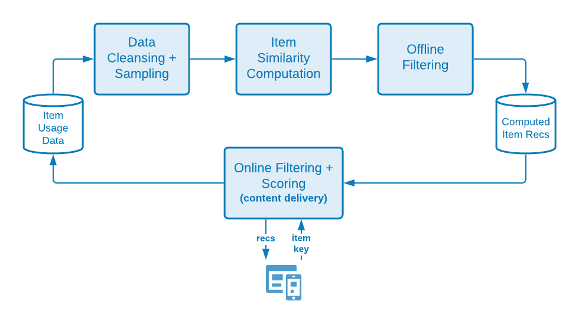
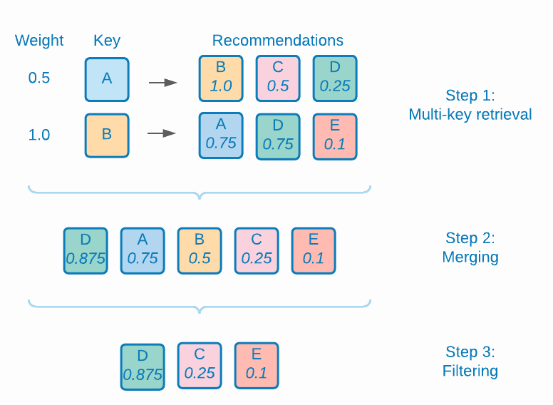

# Target のレコメンデーションアルゴリズムの背後にある科学

モデルのトレーニングのロジックや数学的な詳細、およびモデルの提供プロセスなど、[!DNL Adobe Target Recommendations] で使用されるアルゴリズムの詳細な説明。

モデルトレーニングは、レコメンデーションが [!DNL Adobe Target] 学習アルゴリズムによって生成されるプロセスです。 モデルサービングは、[!DNL Target] がサイト訪問者にレコメンデーションを配信する方法です（コンテンツ配信とも呼ばれます）。

[!DNL Target] には、[!DNL Recommendations] に次の幅広いタイプのアルゴリズムが含まれています。

* **項目ベースのアルゴリズム**:「この項目を閲覧/購入したユーザーがこれらの項目も閲覧/購入した」ロジックに従うアルゴリズムを含めます。 これらのアルゴリズムは、[!UICONTROL Items with Similar Attributes] のアルゴリズムだけでなく、アイテム間協調フィルタリングという包括的な用語の下にグループ化されています。

* **ユーザーベースのアルゴリズム**:[!UICONTROL Recently Viewed] アルゴリズムと [!UICONTROL Recommended for You] アルゴリズムが含まれます。

* **人気度ベースのアルゴリズム**:Web サイト全体で最も多く閲覧された項目や最も購入された項目、またはカテゴリ属性または項目属性で最も多く閲覧された項目や最も購入された項目を返すアルゴリズムを含みます。

* **買い物かごベースのアルゴリズム**:「これらのアイテムを表示/購入したユーザーは、これらのアイテムも表示/購入しました」というロジックを使用して、複数項目ベースのレコメンデーションを含めます。

* **カスタム条件**:[!DNL Target] にアップロードされたカスタムファイルに基づいてお勧めを含めます。

>[!NOTE]
>
>各アルゴリズムタイプと個々のアルゴリズムに関する一般的な情報については、[ レコメンデーションキーに基づくレコメンデーションのベース ](/help/main/c-recommendations/c-algorithms/base-the-recommendation-on-a-recommendation-key.md) を参照してください。

上記のアルゴリズムの多くは、1 つまたは複数のキーが存在することに基づいて決定されます。 これらのキーは、コンテンツ配信時（レコメンデーションが行われた際）に類似の項目を取得するために使用されます。 顧客が指定したキーには、現在ユーザーが表示している項目、最後に表示または購入した項目、最も多く表示した項目、現在のカテゴリ、その訪問者のお気に入りのカテゴリが含まれます。 買い物かごベースやユーザーベースのレコメンデーションなど、その他のアルゴリズムでは、（顧客が設定できない）暗黙のキーを使用します。 詳しくは、レコメンデーションキーに基づくレコメンデーションのベース の **[レコメンデーションキー](/help/main/c-recommendations/c-algorithms/base-the-recommendation-on-a-recommendation-key.md#keys)を参照してください。 ただし、これらのキーは、モデル配信時（コンテンツ配信）にのみ関連します。 ただし、これらのキーは、モデル配信時（コンテンツ配信）にのみ関連します。 これらのキーは、「オフライン」またはモデルトレーニング時間ロジックには影響しません。

次の節では、上記のアルゴリズムタイプとは少し異なる方法でアルゴリズムをグループ化します。 次のグループ化は、モデルトレーニングロジックの類似性に基づいています。

## 品目 – 品目協調フィルタリング

アルゴリズムは次のとおりです。

* [!UICONTROL People Who Viewed This, Viewed That]
* [!UICONTROL People Who Viewed This, Bought That]
* [!UICONTROL People Who Bought This, Bought That]

アイテム アイテム協調フィルタリングの推奨アルゴリズムは、多くのユーザーの行動パターン （協調）を使用して、特定のアイテムに対して役に立つ推奨を提供する（例えば、推奨する可能性のあるアイテムのカタログをフィルタリングする）必要があるという考えに基づいています。 [ 協調フィルタリング ](https://en.wikipedia.org/wiki/Collaborative_filtering) の一般的な傘下に分類されるアルゴリズムは多数ありますが、これらのアルゴリズムは一般的に、行動データソースを入力として使用します。 [!DNL Target Recommendations] では、これらの入力は、ユーザーによる項目のユニークな閲覧と購入です。

「このアイテムを閲覧/購入したユーザーもこれらのアイテムを閲覧/購入したユーザー」アルゴリズムの場合、目標はアイテムのすべてのペア間の類似性（A、B）を計算することです。 特定の項目 A について、上位のレコメンデーションが類似性の高い順に並べられます（A、B）。

そのような類似性の例の 1 つは、項目間の共起です。両方の項目を購入したユーザーの数の単純な数。 直感的ですが、そのような指標は、人気のあるアイテムを推奨することに偏っているという点で素朴です。 例えば、食料品店でパンを購入する人が多い場合、パンはすべての商品との共生が多いですが、必ずしもそれがよいレコメンデーションではありません。 代わりに [!DNL Target] ログ尤度比（LLR）と呼ばれる、より洗練された類似性指標を使用します。 A と B の 2 つのアイテムが共起する確率と共起しない確率が大きく異なる場合、この量は大きくなります。 具体性のために、[!UICONTROL People Who Viewed This, Bought That] アルゴリズムのケースを考えてみましょう。 B が購入された確率が誰かが A を見たかどうかとは無関係に *ない* 場合、LLR の類似性は大きくなります。

例えば、

このログ尤度比の類似性計算の詳細については、[ このPDFでは ](/help/main/c-recommendations/c-algorithms/assets/log-likelihood-ratios-recommendation-algorithms.pdf) 説明しています。

実際のアルゴリズム実装の論理フローを、次の回路図に示します。

これらの手順の詳細は次のとおりです。

* **入力データ**:[Target を実装 ](https://experienceleague.adobe.com/docs/target-dev/developer/recommendations.html?lang=ja){target=_blank} または [Adobe Analytics](/help/main/c-recommendations/c-algorithms/use-adobe-analytics-with-recommendations.md){target=_blank} から収集した訪問者のビューおよび購入の形式の行動データ。

* **モデルトレーニング**:

   * **データクレンジングとサンプリング**:N 日のルックバックを持つアルゴリズムの場合、行動データはまず、その N 日のデータのみを含めるようにフィルタリングされます。 次に、コレクションルールとグローバル除外を適用して、推奨すべきでない項目を削除します。 最後に、1,000 項目を超える項目を操作した訪問者の使用状況データは 1,000 項目のみにサンプリングされます。
   * **項目類似性計算**：これは、すべての候補項目ペア間のログ尤度比類似性と、この類似性スコアによる項目のランキングペアを計算するコア計算ステップです。
   * **オフラインフィルタリング**：最後に、さらに適用できるすべての動的フィルター（動的カテゴリの除外など）が適用されます。 この手順の後、事前に計算されたレコメンデーションはグローバルにキャッシュされ、提供できるようになります。

* **モデルサービング**:Recommendationsのコンテンツは、[!DNL Target] の [ グローバル「Edge」ネットワーク ](/help/main/c-intro/how-target-works.md#concept_0AE2ED8E9DE64288A8B30FCBF1040934) から配信されます。 [!DNL Target] に mbox リクエストが行われ、recommendations コンテンツをページに配信する必要があると判断した場合、Recommendations アルゴリズムに対する適切な [ 項目キー ](/help/main/c-recommendations/c-algorithms/base-the-recommendation-on-a-recommendation-key.md#keys) のリクエストは、リクエストから解析されるか、ユーザープロファイルから検索されます。その後、このリクエストを使用して、前の手順で計算された Recommendations を取得します。 現時点では、適切な [ デザイン ](/help/main/c-recommendations/c-design-overview/create-design.md) がレンダリングされる前に、さらに動的フィルターが適用されます。

## コンテンツの類似性

含まれるアルゴリズム：

* [!UICONTROL Items with Similar Attributes]

このタイプのアルゴリズムでは、名前と説明のテキストが意味的に似ている場合、2 つの項目が関連していると見なされます。 行動データソースを使用する必要がある最もレコメンデーションアルゴリズムとは異なり、コンテンツの類似性アルゴリズムは、製品カタログのメタデータを使用して項目間の類似性を導き出します。 [!DNL Target] のため、行動データが収集されていない（例えば、[!DNL Target] アクティビティの開始時）いわゆる「コールドスタート」シナリオでレコメンデーションを推進できます。

[!DNL Target] のコンテンツ類似性アルゴリズムのモデルサービングおよびコンテンツ配信の側面は、他のアイテムベースのアルゴリズムと同じですが、モデルトレーニングステップは大幅に異なり、次の図に示すように、一連の自然言語処理および前処理ステップが含まれます。 類似性計算の中核は、カタログ内の各項目を表す修正 tf-idf ベクトルのコサイン類似性の使用である。

これらの手順の詳細は次のとおりです。

* **入力データ**: 前述のように、このアルゴリズムは、純粋にカタログデータに基づいています[ カタログフィード、エンティティ API を介して、またはページ上の更新から [!DNL Target]に取り込みます ](https://experienceleague.adobe.com/docs/target-dev/developer/recommendations.html?lang=ja){target=_blank}.

* **モデルトレーニング**:

   * **属性抽出**：通常の静的フィルター、カタログルールおよびグローバル除外を適用した後、このアルゴリズムはエンティティスキーマから関連するテキストフィールドを抽出します。 [!DNL Target] は、エンティティ属性から名前、メッセージ、カテゴリの各フィールドを自動的に使用し、カスタム [ エンティティ属性 ](/help/main/c-recommendations/c-products/entity-attributes.md) から文字列フィールドの抽出を試みます。 このプロセスは、そのフィールドの値の大部分が数値、日付、ブール値として解析可能でないことを確認することで行われます。
   * **ステミングとストップワードの削除**：テキストの類似性を正確に照合するには、アイテムの意味を大幅に変更しない、非常に一般的な「ストップ」単語（「was」、「is」、「and」など）を削除することが賢明です。 同様に、ステミングとは、異なるサフィックスを持つ単語を、同じ意味を持つルートワードに減らすプロセスを指します（例えば、「connect」、「connecting」、「connection」はすべて同じルートワード：「connect」を持ちます）。 [!DNL Target] は Snowball の語幹機を使用します。 [!DNL Target] は、先に自動言語検出を実行し、最大 50 言語のストップワード削除と 18 言語のステミングを行うことができます。
   * **n-gram creation**：前の手順の後、各単語はトークンとして扱われます。 連続した一連のトークンを 1 つのトークンに結合するプロセスを、n-gram creation と呼びます。 [!DNL Target] のアルゴリズムは最大 2 グラムを考慮します。
   * **tf-idf 計算**：次の手順では、項目の説明でトークンの相対的な重要度を反映する tf-idf ベクトルを作成します。 品目 i のトークン/用語 t ごとに、カタログ D に次を含む |D|個の項目、最初に用語頻度 TF （t, i）が計算され（項目 i に用語が表示される回数）、ドキュメントの頻度 DF （t, D）が計算されます。 基本的に、トークンが存在する項目数。 tf-idf のメジャーは

     

     [!DNL Target] では、Apache Spark の *tf-idf* 機能実装を使用しています。この実装は、内部で各トークンを 218 個のトークンのスペースにハッシュ化します。 このステップでは、[criteria](/help/main/c-recommendations/c-algorithms/create-new-algorithm.md#similarity) で指定された設定に基づいて各ベクトルの項の周波数を調整することで、お客様指定のアトリビュートのブーストと埋め込みも適用されます。

   * **項目類似度計算**：最終的な項目類似度計算は、近似コサイン類似度を使用して行われる。 ベクトル tA と tB を持つ *A* と *B* の 2 つの項目の場合、コサイン類似性は次のように定義されます。

     

     すべての N x N 個の項目間の類似性の計算が大幅に複雑になることを避けるために、*tf-idf* ベクトルは最大 500 エントリのみを含むように切り捨てられ、この切り捨てられたベクトル表現を使用して項目間のコサイン類似性が計算されます。 このアプローチは、局所性に敏感なハッシュのような他の近似最近接近接（ANN）技術と比較して、スパース・ベクトル類似性計算に対してよりロバストであることを証明する。

   * **モデルサービング**：このプロセスは、前の節で説明した項目別の協調フィルタリング手法と同じです。

## 複数キーの推奨事項

アルゴリズムは次のとおりです。

* 買い物かごベースの推奨事項
* [!UICONTROL Recommended For You]

レコメンデーションアルゴリズムの [!DNL Target] のスイートに対する最新の追加は、[!UICONTROL Recommended For You] と一連の買い物かごベースのレコメンデーションアルゴリズムです。 どちらのタイプのアルゴリズムも、協調フィルタリング手法を使用して、個々の項目ベースのレコメンデーションを形成します。 次に、サービス時に、ユーザーの閲覧履歴（[!UICONTROL Recommended For You] の場合）またはユーザーの現在の買い物かご（買い物かごベースのレコメンデーションの場合）にある複数の項目を使用して、これらの項目ベースのレコメンデーションを取得します。その後、この項目が結合されて、レコメンデーションの最終的なリストが形成されます。 パーソナライズされたレコメンデーションアルゴリズムには、様々な種類があります。 複数キーアルゴリズムを選択した場合は、訪問者の閲覧履歴が記録されるとレコメンデーションがすぐに使用可能になり、最新の訪問者行動に対応するようにレコメンデーションが更新されます。

これらのアルゴリズムは、「項目ベースのレコメンデーション」の節で説明した基本的な協調フィルタリング手法に基づいて構築されますが、アイテム間の最適な類似性指標を決定するためのハイパーパラメーターのチューニングも組み込まれています。 アルゴリズムは、各ユーザーの行動データを時系列的に分割し、ユーザーが後で閲覧または購入する項目の予測を試みつつ、以前のデータに基づいてレコメンデーションモデルをトレーニングします。 次に、最適な [ 平均精度 ] （https://en.wikipedia.org/wiki/Evaluation_measures_(information_retrieval)）を生成する類似性指標が選択されます。

次の図に、モデルのトレーニングとスコアリングの手順のロジックを示します。

これらの手順の詳細は次のとおりです。

* **入力データ**：これは、品目協調フィルタリング （CF） メソッドと同じです。 [!UICONTROL Both Recommended For You] および買い物かごベースのアルゴリズムはどちらも、[ Target の実装時](https://experienceleague.adobe.com/docs/target-dev/developer/recommendations.html?lang=ja){target=_blank} または [Adobe Analytics から収集されたユーザーの閲覧および購入の形式](/help/main/c-recommendations/c-algorithms/use-adobe-analytics-with-recommendations.md){target=_blank} で行動データを使用します。

* **モデルトレーニング**:

   * **データクレンジングとサンプリング**：これも協調フィルタリング方法の場合と同じです。ルックバックウィンドウを適用して行動データを適切な日付範囲でフィルタリングし、その後にカタログルールを適用してグローバル除外します。 1,000 を超えるアイテムを操作した訪問者は、最新の 1,000 の使用のみを考慮します。
   * **テスト分割のトレーニング**：各ユーザーの使用状況を時系列的に分割し、最初の 80% をトレーニングデータに割り当て、残りの 20% をテストデータに割り当てます。
   * **項目類似性モデルのトレーニング**：コアアイテムの類似性計算は、候補アイテムのベクトルの作成方法が [!UICONTROL Recommended For You]と買い物かごベースのアルゴリズムで異なります。 [!UICONTROL Recommended For You] の場合、アイテム・ベクトルには次元 NUsers があり、各エントリはそのアイテムのユーザーに対する暗黙の評価の合計を表します。アイテムの購入には、アイテムのビューの 2 倍の重みが与えられます。 買い物かごベースのレコメンデーションの場合、項目ベクトルにはバイナリエントリがあります。セッション内動作のみを考慮する場合は、すべてのセッションに新しいエントリがあります。 それ以外の場合は、すべての訪問者に対してこの項目ベクトルにエントリが存在します。

  トレーニングステップでは、複数のタイプのベクトル類似度、LLR 類似度（[ ここでは ](/help/main/c-recommendations/c-algorithms/assets/log-likelihood-ratios-recommendation-algorithms.pdf)）、コサイン類似度（事前に定義）、正規化された L2 類似度（次のように定義）を計算します。

  

   * **項目類似性モデル評価**：モデル評価は、前の手順で生成された推奨事項を受け取り、テストデータセットを予測することで行われます。 オンラインスコアリングフェーズは、テストデータセット内の各ユーザーの項目使用を時系列に並べ替え、次に後続のビューと購入を予測しようとして、項目の順序付きサブセットに対して 100 のレコメンデーションを行うことで模倣されます。 情報検索指標 [ 平均精度 ] （https://en.wikipedia.org/wiki/Evaluation_measures_(information_retrieval)）を使用して、これらのレコメンデーションの品質を評価します。 この指標は、レコメンデーションの順序を考慮し、ランキングシステムの重要なプロパティであるレコメンデーションのリスト内の上位の関連項目を優先します。
   * **モデル選択**：オフライン評価後、平均精度が最も高いモデルが選択され、そのモデルに対して計算されたすべての個々の項目項目のレコメンデーションが選択されます。
   * **オフラインフィルタリング**：モデルトレーニングの最後のステージは、適用可能な動的フィルターの適用です。 この手順の後、事前に計算されたレコメンデーションはグローバルにキャッシュされ、提供できるようになります。

* **モデルサービング**：レコメンデーションの提供に、取得する単一のキーを指定し、その後ビジネスルールを適用する必要がある以前のアルゴリズムとは異なり、[!UICONTROL Recommended for You] および買い物かごベースのアルゴリズムでは、より複雑なランタイムプロセスが使用されます。

   * **複数キーの取得と結合**：買い物かごベースのお勧めの場合は、買い物かごで渡された最大 10 個の項目が取得用のキーと見なされ、それぞれからのお勧めが等しく重み付けられます。 [!UICONTROL Recommended for You] えば、最大 5 つのユニークな閲覧済み項目と最後 5 つのユニークな購入項目が検索のキーと見なされ、購入項目から生じるレコメンデーションは、閲覧済み項目から生じるレコメンデーションの 2 倍の重み付けされます。 レコメンデーションを結合する際に、レコメンデーションの複数の個別リストに項目が表示される場合、その重み付けされた類似性スコアが追加されます。 このステージのレコメンデーションの最後のリストは、重み付けを変更したレコメンデーションの結合リストで、降順にランク付けされます。
   * **フィルタリング**：次に、以前に表示した項目や購入した項目の削除などのフィルタリングルールのほか、他の動的なビジネスルールが適用されます。

次の画像に、これらのプロセスを示します。ここでは、訪問者が項目 A を表示し、項目 B を購入しています。個々のレコメンデーションは、各項目ラベルの下に表示されるオフラインの類似性スコアを使用して取得されます。 取得後、推奨事項は重み付けされた類似性スコアの合計と結合されます。 最後に、以前に表示および購入した項目を除外する必要があると顧客が指定したシナリオでは、フィルタリングステップにより、レコメンデーションのリストから項目 A と項目 B が削除されます。

## 人気度ベース

アルゴリズムは次のとおりです。

* [!UICONTROL Most Viewed Across the Site]
* [!UICONTROL Most Viewed by Category]
* [!UICONTROL Most Viewed by Item Attribute]
* [!UICONTROL Top Sellers Across the Site]
* [!UICONTROL Top Sellers by Category]
* [!UICONTROL Top Sellers by Item Attribute]

[!DNL Target] は、最も表示された項目と、web サイト全体で、または項目属性またはカテゴリ別に分類された売れ筋上位の項目の両方に対して、人気度ベースのアルゴリズムを提供します。 人気度ベースのアルゴリズムでは、特定の期間内に項目が表示または購入されたセッション数に基づいて項目がランク付けされます。

これらのアルゴリズムはすべて、アイテムが表示および購入されたセッションの合計数が時間単位と日単位の両方で記録される、集計された行動データを組み合わせたものです。 次に、個々のアルゴリズムは、顧客が設定したルックバックウィンドウで最も多く閲覧された項目や最も購入された項目を見つけます。

個々のアルゴリズムのニュアンスは次のとおりです。

* [!UICONTROL Most Viewed Across the Site] と [!UICONTROL Top Sellers Across the Site] は、これらの項目がそれぞれ表示または購入されたセッションの合計数に基づいて項目をランク付けします。 出力されるのは、推奨される項目の単一（キーレス）リストです。
* カテゴリ/項目属性別の最も多くの閲覧済み/トップセラーは、これらの項目が表示または購入されたセッションの合計数で項目が並べ替えられ、項目カテゴリまたは特定の項目属性別にグループ化されたレコメンデーションです。 出力は、カテゴリの値または項目属性の値をキーにした、推奨項目のリストです。

## 最近表示された項目

「最近閲覧された」レコメンデーションアルゴリズムにより、レコメンデーションのセッション内パーソナライゼーションが可能になります。 このアルゴリズムでは、オフラインの「モデルトレーニング」は必要ありません。 代わりに、[!DNL Target] は一意の [ 訪問者プロファイル ](/help/main/c-target/c-visitor-profile/visitor-profile.md) を使用して、特定のセッションで表示された項目のリストを常に管理し、これらの項目を Recommendations アクティビティに表示できます。 これにより、レコメンデーションと次のページのパーソナライゼーションをリアルタイムで更新できます。

## カスタム条件

カスタム条件を使用すると、顧客は [ 独自のレコメンデーションを  [!DNL Target]](/help/main/c-recommendations/c-algorithms/recommendations-csv.md) にアップロードでき、重要な柔軟性が得られ、「独自モデルの導入」機能が可能になります。 カスタム条件は、レコメンデーションの「オフライントレーニング」の部分を置き換え [!UICONTROL Item-Based] ものですが、オンラインコンテンツ配信フェーズでは項目ベースのレコメンデーションアルゴリズムと同様に動作します。つまり、レコメンデーションの取得に単一のキーを使用し、ビジネスルール/フィルターが適用されます。
