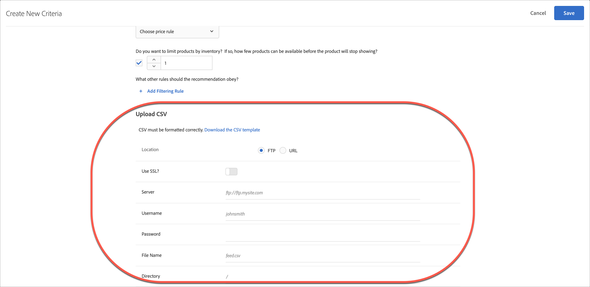

# カスタム条件のアップロード

CSV ファイルをアップロードして、[!DNL Adobe Target]でレコメンデーションをカスタマイズします。

[!UICONTROL 新しい条件を作成]画面を表示するには、複数の方法があります。 一部の画面オプションは、画面の表示方法によって異なります。

* **[!UICONTROL Recommendations]** > **[!UICONTROL Criteria]** ライブラリ画面で、**[!UICONTROL 条件の作成]** > **[!UICONTROL 条件の作成]**&#x200B;をクリックします。 ここで作成した条件は、自動的にすべての [!DNL Recommendations] アクティビティで利用できるようになります。
* [!UICONTROL Visual Experience Composer] （VEC）を使用して[!DNL Recommendations] アクティビティを作成する場合、ページ上の要素を選択し、[!UICONTROL 推奨事項と置換]、[!UICONTROL 推奨事項の挿入]または[!UICONTROL 推奨事項の挿入]をクリックすると、すぐに[!UICONTROL 条件の選択画面]に移動します。 次に、使用可能な条件を選択するか、**[!UICONTROL 条件を作成]**&#x200B;をクリックします。 新しい条件を作成した場合は、他の[!DNL Recommendations] アクティビティで使用するために条件を保存できます。 詳しくは、[Recommendations アクティビティの作成](/help/main/c-recommendations/t-create-recs-activity/create-recs-activity.md)を参照してください。
* [!DNL Recommendations] アクティビティを編集する場合は、ページの[!UICONTROL おすすめの場所] ボックスをクリックし、**[!UICONTROL 条件の変更]**&#x200B;を選択します。 [!UICONTROL 条件を選択]画面で、**[!UICONTROL 条件を作成]**&#x200B;をクリックします。 新しい条件を保存して、他の[!DNL Recommendations] アクティビティで使用できます。

次の手順では、最初の方法（**[!UICONTROL Recommendations]** > **[!UICONTROL Criteria]** ライブラリ画面）を使用して、[!UICONTROL 新規条件を作成]画面にアクセスすることを前提としています。

1. **[!UICONTROL Recommendations]** > **[!UICONTROL Criteria]**&#x200B;をクリックします。

1. 「**[!UICONTROL 条件を作成]**」をクリックします。

1. 「[基本情報](/help/main/c-recommendations/c-algorithms/create-new-algorithm.md#info)」セクションに情報を入力します。

   1. 「**[!UICONTROL アルゴリズムを選択]** タイプ」ドロップダウンリストから、「**[!UICONTROL カスタム条件]**」を選択します。

   1. 「**[!UICONTROL アルゴリズム]**」ドロップダウンリストから、「**[!UICONTROL カスタムアルゴリズム]**」を選択します。

      >[!NOTE]
      >
      >上記の手順により、[!UICONTROL 新規条件の作成] ダイアログボックスの下部に「[!UICONTROL CSV]をアップロード」セクションが表示されます。

1. （条件付き）「[ コンテンツをバックアップ ](/help/main/c-recommendations/c-algorithms/create-new-algorithm.md#content)」セクションに情報を入力します。

1. （条件付き）「[包含ルール ](/help/main/c-recommendations/c-algorithms/create-new-algorithm.md#inclusion)」セクションに情報を入力します。

1. 「**[!UICONTROL CSVをアップロード]**」セクションで、CSV ファイルの&#x200B;**[!UICONTROL 場所]**&#x200B;を選択します。

   

   アップロードを成功させるには、CSV ファイルが正しくフォーマットされている必要があります。 「**[!UICONTROL CSV テンプレートのダウンロード]**」をクリックして、正しくフォーマットされた CSV ファイルをダウンロードします。

   次の 2 つの場所のオプションがあります。

   * **FTP:** FTP サーバーからCSV ファイルをアップロードするには、**[!UICONTROL FTP]**&#x200B;を選択し、必要な情報を入力します。 FTPS プロトコルを使用してCSV ファイルを安全に転送するSSLを使用できます。
   * **URL:** CSV ファイルをURLからアップロードするには、**[!UICONTROL URL]**&#x200B;を選択し、フィード URLを入力します。

1. 「**[!UICONTROL 保存]**」をクリックします。

## 注意点

* カスタム条件エンティティ（行）は、最大 1,000 のレコメンデーション品目（列）を含むことができます。

* カスタム条件の更新は、デフォルトでは「累積的」です。 既存のキーと値のペアが、CSV アップロードファイルで指定した新しいキーと値のペアで上書きされます。 CSV アップロードで指定されたキーを持たない既存のキーと値のペアは、引き続き配信でき、CSV ファイルの一部として最後にアップロードされてから31日以内に期限切れになります。

  クライアントケアに連絡して、次回の CSV アップロードに含まれていない既存の結果を破棄できるようにします。 この設定が有効になっている場合、カスタム CSV フィード ファイルに存在するキーのみが配信できます。 この設定は、すべてのカスタム条件に適用されます。

* カスタム条件フィードは 24 時間ごとに更新されます。

  カスタム条件のアップロードと同期のステータスは、[!UICONTROL Recommendations] > [!UICONTROL Criteria] ページの各条件カードの下部に表示されます。 カスタム条件を編集する際に、[!UICONTROL 編集] ダイアログボックスにステータスを表示することもできます。

* エラーのないアップロードのフローは、[!UICONTROL  スケジュール済み] > [!UICONTROL  フィードファイルのダウンロード ] > [!UICONTROL  インポート ] > [!UICONTROL 成功]である必要があります。

* [!DNL Target]がアップロードに問題が発生した場合に表示される可能性のあるエラーメッセージは次のとおりです。

  | エラーメッセージ | 詳細 |
  |--- |--- |
  | 不明なエラー | 技術的な内部エラーを示します。 |
  | 解析エラー | フィードファイルの形式に問題がある可能性があります。 ファイル形式を修正し、アルゴリズムを再保存して、ファイルのダウンロードプロセスを再開します。 |
  | サーバーが見つかりません | インターネット上で認識可能な IP またはホスト名を指定します。 |
  | 資格情報エラー | サーバーでアクティブなアカウントの有効なユーザー名とパスワードを指定します。 |
  | ディレクトリが見つかりません | サーバーに存在するディレクトリを指定します。 |
  | ファイルが見つかりません | サーバー上の指定したディレクトリに存在するファイルの名前を指定します。 |

## トレーニングビデオ：Recommendationsで条件を作成する（12:33） 

このビデオには、次の情報が含まれています（カスタム条件のアップロードの詳細は11:43から始まります）。

* 条件の作成
* 条件のシーケンスの作成
* カスタム条件のアップロード

>[!VIDEO](https://video.tv.adobe.com/v/27694?quality=12)
