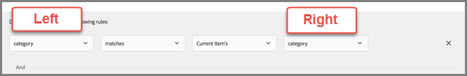

# 動的および静的インクルージョンルールの使用

条件およびプロモーションのインクルージョンルールを [!DNL Adobe Target] で作成し、動的または静的フィルタールールを追加してレコメンデーションの結果を向上させる方法について説明します。

条件とプロモーションでは、インクルージョンルールを作成、使用する方法は類似しています。使用例やサンプルも同様です。この節では、条件とプロモーションの両方と、インクルージョンルールの使用について説明します。

## フィルタールールを条件に追加する {#section_CD0D74B8D3BE4A75A78C36CF24A8C57F}

[&#x200B; 条件の作成 &#x200B;](/help/main/c-recommendations/c-algorithms/create-new-algorithm.md#task_8A9CB465F28D44899F69F38AD27352FE) 中に、[**[!UICONTROL Add Filtering Rule]**] の [**[!UICONTROL Inclusion Rules]**] をクリックします。

利用できるオプションは、選択した業種とレコメンデーションキーによって変わります。

## フィルタールールをプロモーションに追加する {#section_D59AFB62E2EE423086281CF5D18B1076}

[&#x200B; プロモーションの作成 &#x200B;](/help/main/c-recommendations/t-create-recs-activity/adding-promotions.md#task_CC5BD28C364742218C1ACAF0D45E0E14) 中に、「**[!UICONTROL Promote by Attribute]**」を選択し、「**[!UICONTROL Add Filtering Rule]**」をクリックします。

## フィルターのタイプ {#section_0125F1ED10A84C0EB45325122460EBCD}

次の項では、条件と販促の両方に対する [!UICONTROL Dynamic Filtering] と [!UICONTROL Filter by Value] のフィルタ・オプションのタイプをリストします。

### 動的フィルタリング

動的インクルージョンルールは、静的インクルージョンルールよりも強力で、より良い結果とエンゲージメントを生み出します。 次の点に留意してください。

* 動的包含ルールは、ユーザーのプロファイルパラメーターまたは mbox 呼び出しで属性を照合することにより、レコメンデーションを提供します。

  例えば、「一番人気のある条件」のレコメンデーションを作成できます。 返されたレコメンデーションのセットから、レコメンデーションが表示されているページにユーザーがアクセスする際に渡された属性に対して、（リアルタイムで）レコメンデーションを除外できます。

* コレクションを使用する代わりに、静的ルールを使用して、レコメンデーションに含める項目を制限します。

* 必要な数の動的インクルージョンルールを作成できます。 インクルージョンルールは AND 演算子で結合します。品目がレコメンデーションに含まれるためには、すべてのルールを満たす必要があります。

動的フィルタリングには次のオプションを使用できます。

| 動的フィルターオプション | 詳細 |
| --- | --- |
| [エンティティ属性のマッチング](/help/main/c-recommendations/c-algorithms/entity-attribute-matching.md) | ユーザーがやり取りした特定の項目に、可能性のあるレコメンデーション項目のプールを比較することで、動的にフィルタリングします。  訪問者のお気に入りのブランドなど、訪問者にアピールする可能性が最も高いレコメンデーションを表示する場合は、[!UICONTROL Entity Attribute Matching] を使用します。 |
| [プロファイル属性のマッチング](/help/main/c-recommendations/c-algorithms/profile-attribute-matching.md) | ユーザーのプロファイルの値に対して項目（エンティティ）を比較することで動的にフィルタリングします。  サイズやお気に入りのブランドなど、訪問者のプロファイルに保存されている値に一致するお勧めを表示する場合は、[!UICONTROL Profile Attribute Matching] を使用します。 |
| [パラメーターのマッチング](/help/main/c-recommendations/c-algorithms/parameter-matching.md) | リクエスト（API または mbox）の値に対して項目（エンティティ）を比較することで動的にフィルタリングします。  ページパラメーターまたは訪問者のパラメーターに一致するコンテンツ（デバイスのサイズや位置情報など）をレコメンデーションするには、[!UICONTROL Parameter Matching] を使用します。 |

### 値でフィルター

値によるフィルタリングには、次のオプションを使用できます。

| 値によるフィルターオプション | 詳細 |
| --- | --- |
| [静的フィルター](/help/main/c-recommendations/c-algorithms/static-value.md) | フィルターする 1 つ以上の静的値を手動で入力します。 |

## 使用可能な演算子 {#operators}

動的な条件とプロモーションは、静的な条件とプロモーションよりもはるかに強力で、より良い結果とエンゲージメントを生み出します。

次の例では、マーケティング活動で動的なプロモーションと除外を使用する方法に関する一般的なアイデアを提供します。

| 演算子 | 例 |
| --- | --- |
| Equals  （エンティティ属性のマッチング、プロファイル属性のマッチング、パラメーターのマッチング、静的フィルターで使用可能） | 動的プロモーションの「次に等しい」演算子を使用すると、訪問者が web サイト上の項目（製品、記事、ムービーなど）を表示している際に、次の場所から他の項目を昇格させることができます。<ul><li>同じブランド</li><li>同じカテゴリ</li><li>同じカテゴリーとハウスブランドから</li><li>同じ店舗</li></ul> |
| 等しくない   （エンティティ属性のマッチング、プロファイル属性のマッチング、パラメーターのマッチング、静的フィルターで使用可能） | 動的プロモーションで「次と等しくない」演算子を使用すると、訪問者が web サイト上の項目（製品、記事、映画など）を表示している際に、次から他の項目を昇格させることができます。<ul><li>別のテレビシリーズ</li><li>異なるジャンル</li><li>別の製品シリーズ</li><li>別のスタイル ID</li></ul> |
| 部分文字列を含まない   （エンティティ属性マッチング、プロファイル属性マッチング、パラメーターマッチング、静的フィルターで使用可能） | 「部分文字列を含まない」演算子を使用すると、訪問者が web サイト上の項目（製品など）を表示している際に、次のような他の項目を昇格させることができます。<ul><li>タイトルに宣誓の言葉は含まれていません</li></ul> |
| 次で始まる   （エンティティ属性のマッチング、プロファイル属性のマッチング、パラメーターのマッチング、静的フィルターで使用可能） | 「次で始まる」演算子を使用すると、訪問者が web サイト上の項目（製品など）を表示しているときに、次のような他の項目を昇格させることができます。<ul><li>商品名がiPhoneで始まる</li></ul> |
| 次で終わる   （エンティティ属性マッチング、プロファイル属性マッチング、パラメーターマッチング、静的フィルターで使用可能） | 「次で終わる」演算子を使用すると、訪問者が web サイト上の項目（製品など）を表示している際に、次のような他の項目を昇格させることができます。<ul><li>コンテンツが英語を示す EN で終わる</li></ul> |
| 次よりも大きいか等しい   （エンティティ属性のマッチング、プロファイル属性のマッチング、パラメーターのマッチング、静的フィルターで使用可能） | 「次よりも大きいまたは等しい」演算子を使用すると、訪問者が web サイト上の項目（製品など）を表示している際に、次のような他の項目を昇格させることができます。<ul><li>コストは同じか、またはより高価</li></ul> |
| 次の値以下である   （エンティティ属性のマッチング、プロファイル属性のマッチング、パラメーターのマッチング、静的フィルターで使用可能） | 「次よりも小さいか等しい」演算子を使用すると、訪問者が web サイト上の項目（製品など）を表示している際に、次のような他の項目を昇格させることができます。<ul><li>同じか、またはより安い</li><li>より安価な項目を除外</li></ul> |
| Is Between  （エンティティ属性のマッチング、プロファイル属性のマッチング、パラメーターのマッチングで利用可能） | 動的プロモーションの「次の範囲内」オペレーターを使用すると、訪問者が web サイト上の項目（製品、記事、映画など）を表示しているときに、次のような他の項目をプロモーションできます。<ul><li>より高価</li><li>低コスト</li><li>コスト +または – 30%</li><li>同じシーズンの後半のエピソード</li><li>シリーズ内の以前の本</li></ul> |
| リストに含まれる   （プロファイル属性のマッチングおよびパラメーターのマッチングで使用可能） | プロファイル属性のマッチングで「リストに含まれる」演算子を使用すると、訪問者が web サイト上の項目（製品、記事、ムービーなど）を表示している際に、次に該当する他の項目を昇格させることができます。<ul><li>訪問者の地域で利用可能</li></ul>**例**：訪問者の地域で使用可能な項目のみをレコメンデーションする場合。  フィルタールールは次のようになります。 `availableGeographies list contains an item in user.currentGeography` **注意**：この演算子を使用する場合、ルールの [&#x200B; 右側 &#x200B;](#caveats) にリストが必要です。 |
| リストに含まれない   （プロファイル属性のマッチングおよびパラメーターのマッチングで使用可能） | プロファイル属性のマッチングで「リストに含まれない」演算子を使用すると、訪問者が web サイト上の項目（製品、記事、ムービーなど）を表示する際に、次に該当する他の項目を除外できます。<ul><li>訪問者が閲覧した最後の 10 項目のリスト</li></ul></ul>**例**：訪問者が最近表示し、興味を示していない項目を昇格させたくない。  フィルタールールは次のようになります。 `id is not contained in list user.lastViewedItems` **注意**：この演算子を使用する場合、ルールの [&#x200B; 右側 &#x200B;](#caveats) にリストが必要です。 |
| リストに項目が含まれます   （エンティティ属性のマッチング、プロファイル属性のマッチング、パラメーターのマッチングで使用可能）。 | プロファイル属性のマッチングで「リストに項目を含む」演算子を使用すると、訪問者が web サイト上の項目（スポーツイベントやコンサートなど）を表示している際に、次に該当する他の項目を昇格させることができます。<ul><li>訪問者のお気に入りのチームの 1 つに関連付けられる</li></ul>**例**：訪問者のお気に入りのチームの 1 つに関連付けられているゲームをレコメンデーションします。  フィルタールールは次のようになります。 ` teamsPlaying list contains an item in user.favoriteTeams` **注意**：この演算子を使用する場合、ルールの [&#x200B; 両側 &#x200B;](#caveats) にリストが必要です。 |
| リストに項目が含まれていません   （エンティティ属性のマッチング、プロファイル属性のマッチング、パラメーターのマッチングで利用可能）。 | 訪問者が web サイト上の項目（製品、記事、ムービーなど）を表示しているときに、パラメーター属性のマッチングで「リストに項目が含まれていません」演算子を使用すると、次に該当するその他の項目を除外できます。<ul><li>禁止されているタイプのリストに含まれる</li></ul>**例**：大人の訪問者が利用できる項目（タバコやアルコールなど）を除外します。  フィルタールールは次のようになります。 `itemType is not contained in list mbox.prohibitedTypes` **注意**：この演算子を使用する場合、ルールの [&#x200B; 両側 &#x200B;](#caveats) にリストが必要です。 |
| リストには、  にあるすべての項目が含まれます（エンティティ属性のマッチング、プロファイル属性のマッチング、パラメーターのマッチングで利用可能）。 | プロファイル属性のマッチングで「リストにすべての項目が含まれる」演算子を使用すると、訪問者が web サイト上の項目（ジョブ投稿やレシピなど）を表示している際に、次のような他の項目を昇格させることができます。<ul><li>一連のスキルを含める</li><li>必要な成分のセットを含める</li></ul>**例 1**：訪問者が一連のスキル（Java、C++およびHTML）を持っているとします。 カタログの項目は、必要なスキルを持つジョブ（Java およびHTML）です。 ジョブを訪問者にレコメンデーションする前に、訪問者のプロファイルに必要なすべてのスキルが含まれていることを確認する必要があります。  フィルタリングルールは次のようになります。 `profile.jobSeekerSkills contains all items in entity.requiredSkills` **例 2**：ユーザーがパントリーの食材のリストを持っているとします。 レシピには必要な成分のリストがあります。 訪問者にレシピをレコメンデーションする前に、訪問者のプロファイルに必要な成分がすべて含まれていることを確認する必要があります。  フィルタールールは次のようになります。 `profile.ingredientsInPantry contains all items in recipe.ingredientsRequired` **注意**：この演算子を使用する場合、ルールの [&#x200B; 両側 &#x200B;](#caveats) にリストが必要です。 |
| リストに、必ずしもすべての項目が含まれているわけではない   （エンティティ属性のマッチング、プロファイル属性のマッチング、パラメーターのマッチングで利用可能）。 | エンティティ属性のマッチングで「リストにすべての項目が含まれていません」演算子を使用すると、訪問者が web サイト上の項目（スポーツイベントやコンサートなど）を表示している際に、次のような他の項目を昇格させることができます。<ul><li>チームのセットを含めない</li></ul>**例**：スポーツイベントに 2 つのチームが含まれるとします。 訪問者のプロファイルは、この訪問者がこれらのチームのゲームを見たくないことを示しています。 これらのチームがプレイしている場合は、ゲームをレコメンデーションしないようにする必要があります。  フィルタールールは次のようになります。 `profile.leastfavoriteTeams does not contain all items in entity.teamsPlaying` **注意**：この演算子を使用する場合、ルールの [&#x200B; 両側 &#x200B;](#caveats) にリストが必要です。 |

## エンティティ属性のマッチング、プロファイル属性のマッチングおよびパラメーターのマッチングでフィルタリングする際の空の値の処理 {#section_7D30E04116DB47BEA6FF840A3424A4C8}

終了条件およびプロモーションで [!UICONTROL Entity Attribute Matching]、[!UICONTROL Profile Attribute Matching]、[!UICONTROL Parameter Matching] でフィルタリングする際に空の値を処理するオプションをいくつか選択できます。

以前は、値が空の場合は何も結果が返されませんでした。次の図のように、「*x* が空の場合」ドロップダウンリストを使用することで、条件に空の値があった場合に実行する処理を選択できます。

目的のアクションを選択するには、歯車アイコン（）にマウスポインターを置いて、目的のアクションを選択します。

| アクション | 利用できるマッチング | 詳細 |
|--- |--- |--- |
| [!UICONTROL Ignore this filtering rule] | [!UICONTROL Profile Attribute Matching] および [!UICONTROL Parameter Matching] | [!UICONTROL Profile Attribute Matching] と [!UICONTROL Parameter Matching] のデフォルト設定は、このアクションです。 このオプションではルールを無視するよう指定します。例えば、3 つのフィルタールールがあり、3 つ目のルールでは何も値が返されなかった場合は、何も結果を返さないのではなく、値が空だった 3 つ目のルールのみを無視できます。 |
| [!UICONTROL Do not show any results for this criteria]  （条件のみ） | [!UICONTROL Entity Attribute Matching]、[!UICONTROL Profile Attribute Matching] および [!UICONTROL Parameter Matching] | [!UICONTROL Entity Attribute Matching] のデフォルト設定はこのアクションです。  このアクションは、このオプションを追加す [!DNL Target] 前の空の値の処理方法です。この条件に対する結果は表示されません。 |
| [!UICONTROL Do not promote any items  （プロモーションのみ） &#x200B;] | [!UICONTROL Entity Attribute Matching]、[!UICONTROL Profile Attribute Matching] および [!UICONTROL Parameter Matching] | [!UICONTROL Entity Attribute Matching] のデフォルト設定はこのアクションです。  このアクションは、このオプションを追加す [!DNL Target] 前の空の値の処理方法です。この条件に対する結果は表示されません。 |
| [!UICONTROL Use a static value] | [!UICONTROL Entity Attribute Matching]、[!UICONTROL Profile Attribute Matching] および [!UICONTROL Parameter Matching] | 値が空だった場合に静的値を使用するよう設定できます。 |

## 注意事項 {#caveats}

>[!IMPORTANT]
>
>データタイプが異なる属性に対して「次に等しい」および「等しくない」演算子を使用した動的な条件またはプロモーションでは、実行時に互換性がない可能性があります。左側に定義済みの属性またはカスタム属性がある場合は、右側に [!UICONTROL Value]、[!UICONTROL Margin]、[!UICONTROL Inventory]、[!UICONTROL Environment] の値を適切に使用します。

以下の表に、効果的なルールと実行時に互換性のない可能性のあるルールを示します。

| 互換性のあるルール | 潜在的に互換性のないルール |
|--- |--- |
| value - is between - 90% and 110% of current item&#39;s - salesValue | salesValue - is between - 90% and 110% of current item&#39;s - value |
| value - is between - 90% and 110% of current item&#39;s - value | clearancePrice - is between - 90% and 110% of current item&#39;s - margin |
| margin - is between - 90% and 110% of current item&#39;s - margin | storeInventory - equals - current item&#39;s - inventory |
| inventory - equals - current item&#39;s - inventory |  |
