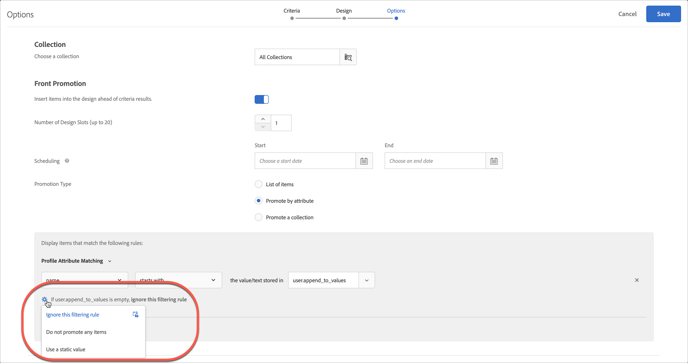
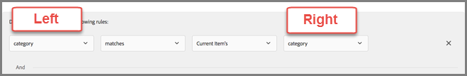

# 動的および静的インクルージョンルールの使用

[!DNL Adobe Target]で条件とプロモーションの包含ルールを作成し、動的または静的フィルタールールを追加して、レコメンデーションの結果を向上させます。

条件とプロモーションでは、インクルージョンルールを作成、使用する方法は類似しています。使用例やサンプルも同様です。 このセクションでは、基準とプロモーションの両方と、包含ルールの使用について説明します。

## 条件とプロモーションへのフィルタールールの追加 {#section_CD0D74B8D3BE4A75A78C36CF24A8C57F}

詳しくは以下のセクションで説明されています。

### 条件にフィルタールールを追加

1. [条件の作成](/help/main/c-recommendations/c-algorithms/create-new-algorithm.md#task_8A9CB465F28D44899F69F38AD27352FE) （**[!UICONTROL Recommendations] > [!UICONTROL Criteria] > [!UICONTROL 条件の作成] > [!UICONTROL 条件の作成]**）中、**[!UICONTROL 包含ルール]**&#x200B;の下の&#x200B;**[!UICONTROL フィルタリングルールを追加]**&#x200B;をクリックします。

   

1. 「他のルールに従うレコメンデーション」ボックスの&#x200B;**静的フィルター** ドロップダウンリストをクリックし、[!UICONTROL 静的フィルター] ドロップダウンリストから目的のオプションを選択します。

   

   利用できるオプションは、選択した業種とレコメンデーションキーによって変わります。

### プロモーションへのフィルタールールの追加

1. [&#x200B; プロモーションの作成中](/help/main/c-recommendations/t-create-recs-activity/adding-promotions.md#task_CC5BD28C364742218C1ACAF0D45E0E14)、**[!UICONTROL 属性によるプロモーション]**&#x200B;を選択し、**[!UICONTROL フィルタリングルールの追加]**&#x200B;をクリックします。

## フィルターのタイプ {#section_0125F1ED10A84C0EB45325122460EBCD}

次の節では、条件とプロモーションの両方について、[!UICONTROL 動的フィルタリング &#x200B;]および[!UICONTROL 値によるフィルタリング &#x200B;]のフィルタリングオプションのタイプを示します。

### 動的フィルタリング

動的な包含ルールは、静的な包含ルールよりも強力で、より優れた結果とエンゲージメントをもたらします。 次の点に留意してください。

* 動的インクルージョンルールは、ユーザーのプロファイルパラメーターまたはmbox呼び出しの属性に一致させることで、レコメンデーションを提供します。

  例えば、「最も人気のある基準」レコメンデーションを作成できます。 返されるレコメンデーションのセットから、ユーザーがレコメンデーションが表示されるページにアクセスしたときに渡された属性に対して、レコメンデーションをリアルタイムでフィルタリングできます。

* 静的ルールを使用して、レコメンデーションに含めるアイテムを制限します（コレクションを使用する代わりに）。

* 必要な数の動的インクルージョンルールを作成できます。 インクルージョンルールは AND 演算子で結合します。 品目がレコメンデーションに含まれるためには、すべてのルールを満たす必要があります。

動的フィルタリングでは、次のオプションを使用できます。

| 動的フィルターオプション | 詳細 |
| --- | --- |
| [[!UICONTROL エンティティ属性のマッチング]](/help/main/c-recommendations/c-algorithms/entity-attribute-matching.md) | 潜在的なレコメンデーション項目のプールを、ユーザーが操作した特定の項目と比較して、動的にフィルタリングします。
訪問者のお気に入りのブランドなど、訪問者にアピールする可能性が最も高いレコメンデーションを表示する場合は、[!UICONTROL &#x200B; エンティティ属性マッチング &#x200B;]を使用します。 |
| [[!UICONTROL プロファイル属性のマッチング]](/help/main/c-recommendations/c-algorithms/profile-attribute-matching.md) | ユーザーのプロファイルの値に対して項目（エンティティ）を比較して、動的にフィルタリングします。
サイズやお気に入りのブランドなど、訪問者のプロファイルに保存されている値に一致する推奨事項を表示する場合は、[!UICONTROL &#x200B; プロファイル属性の一致]を使用します。 |
| [[!UICONTROL パラメーターのマッチング]](/help/main/c-recommendations/c-algorithms/parameter-matching.md) | アイテム（エンティティ）をリクエスト（APIまたはmbox）の値と比較して、動的にフィルタリングします。
[!UICONTROL &#x200B; パラメーターマッチング &#x200B;]を使用して、ページパラメーターや訪問者のパラメーター（デバイスのサイズや位置情報など）に一致するコンテンツをレコメンドします。 |

### 値でフィルター

値によるフィルタリングには、次のオプションを使用できます。

| 値によるフィルタリング オプション | 詳細 |
| --- | --- |
| [[!UICONTROL 静的フィルター]](/help/main/c-recommendations/c-algorithms/static-value.md) | フィルターする1つ以上の静的値を手動で入力します。 |

## 使用可能な演算子 {#operators}

動的な基準とプロモーションは、静的な基準とプロモーションよりもはるかに強力で、より優れた結果とエンゲージメントをもたらします。

次の例では、マーケティング施策で動的なプロモーションと除外を使用する方法について、一般的な考え方を示します。

>[!NOTE]
>
>「リスト」では、エンティティとプロファイル属性の両方を配列として保存する必要があります。 コンマ区切りのリストは機能しません。

| 演算子 | 例 |
| --- | --- |
| [!UICONTROL が]のいずれかに等しい
（[!UICONTROL &#x200B; エンティティ属性の一致]、[!UICONTROL &#x200B; プロファイル属性の一致]、[!UICONTROL &#x200B; パラメーターの一致]、および[!UICONTROL 静的フィルター]で使用可能）。 | 動的なプロモーションで「次と等しい」演算子を使用すると、訪問者がweb サイト上のアイテム（製品、記事、映画など）を表示しているときに、次の場所から他のアイテムをプロモーションできます。<ul><li>同じブランド</li><li>同じカテゴリ</li><li>同じカテゴリのANDをハウスブランドから</li><li>同じ店舗</li></ul> |
| [!UICONTROL は]と等しくありません
（[!UICONTROL &#x200B; エンティティ属性の一致]、[!UICONTROL &#x200B; プロファイル属性の一致]、[!UICONTROL &#x200B; パラメーターの一致]、および[!UICONTROL 静的フィルター]で使用可能）。 | 動的プロモーションで「[!UICONTROL 」演算子を使用すると、訪問者がweb サイト上の項目（製品、記事、映画など）を表示する際に、次の場所から他の項目をプロモーションできます。]<ul><li>別のテレビシリーズ</li><li>別のジャンル</li><li>異なる製品シリーズ</li><li>別のスタイル ID</li></ul> |
| [!UICONTROL が]以上である
（[!UICONTROL &#x200B; エンティティ属性の一致]、[!UICONTROL &#x200B; プロファイル属性の一致]、[!UICONTROL &#x200B; パラメーターの一致]、および[!UICONTROL 静的フィルター]で使用可能）。 | 「[!UICONTROL は]」演算子と同等またはそれ以上です。訪問者がweb サイト上の項目（製品など）を表示している場合、次のような項目を宣伝できます。<ul><li>同じ値段か、より高額か</li></ul> |
| [!UICONTROL が]のいずれか以下である
（[!UICONTROL &#x200B; エンティティ属性の一致]、[!UICONTROL &#x200B; プロファイル属性の一致]、[!UICONTROL &#x200B; パラメーターの一致]、および[!UICONTROL 静的フィルター]で使用可能）。 | 「[!UICONTROL はof]」演算子と同等以下である場合、訪問者がweb サイト上の項目（製品など）を表示しているときに、次のような項目を宣伝できます。<ul><li>同じ値段か、安い値段です</li><li>価格の安い商品を除外</li></ul> |
| [!UICONTROL には]のいずれかが含まれます（[!UICONTROL &#x200B; エンティティ属性の一致]、[!UICONTROL &#x200B; プロファイル属性の一致]、[!UICONTROL &#x200B; パラメーターの一致]、および[!UICONTROL 静的フィルター]で使用可能）。 | 「[!UICONTROL &#x200B; contains any of]」演算子を使用すると、訪問者がweb サイト上の項目（製品など）を表示しているときに、次の項目を含む他の項目を宣伝できます。<ul><li>タイトルに同じブランドが含まれています</li></ul> |
| [!UICONTROL 次のいずれかを含まない]
（[!UICONTROL &#x200B; エンティティ属性の一致]、[!UICONTROL &#x200B; プロファイル属性の一致]、[!UICONTROL &#x200B; パラメーターの一致]、および[!UICONTROL 静的フィルター]で使用可能）。 | 「どの項目も含まない」演算子を使用すると、訪問者がweb サイト上の項目（製品など）を表示する際に、次のような項目を宣伝できます。<ul><li>タイトルに誓いの言葉が含まれていません</li></ul> |
| [!UICONTROL いずれかの]で始まる
（[!UICONTROL &#x200B; エンティティ属性の一致]、[!UICONTROL &#x200B; プロファイル属性の一致]、[!UICONTROL &#x200B; パラメーターの一致]、および[!UICONTROL 静的フィルター]で使用可能）。 | 「[!UICONTROL はof]」演算子で始まります。訪問者がweb サイト上の項目（製品など）を表示しているときに、次のような項目を宣伝できます。<ul><li>IPhoneで始まる製品名</li></ul> |
| [!UICONTROL は]のいずれかで終わります
（[!UICONTROL &#x200B; エンティティ属性の一致]、[!UICONTROL &#x200B; プロファイル属性の一致]、[!UICONTROL &#x200B; パラメーターの一致]、および[!UICONTROL 静的フィルター]で使用可能）。 | 「[!UICONTROL はof]」演算子で終わります。訪問者がweb サイト上の項目（製品など）を表示しているときに、次のような項目を宣伝できます。<ul><li>コンテンツは英語を示すENで終わります</li></ul> |
| [!UICONTROL は]の間です
（[!UICONTROL &#x200B; エンティティ属性の一致]、[!UICONTROL &#x200B; プロファイル属性の一致]、[!UICONTROL &#x200B; パラメーターの一致]で使用可能）。 | 動的なプロモーションで「i[!UICONTROL s between]」演算子を使用すると、訪問者がweb サイト上のアイテム（製品、記事、映画など）を表示しているときに、次のような他のアイテムをプロモーションできます。<ul><li>コストの増大</li><li>コストの削減</li><li>コストのプラスまたはマイナス 30%</li><li>同じシーズンの後のエピソード</li><li>シリーズの前作</li></ul> |
| [!UICONTROL &#x200B; リストに]の項目が含まれています
（[!UICONTROL &#x200B; プロファイル属性の一致]および[!UICONTROL &#x200B; パラメーターの一致]で使用可能）。 | 「[!UICONTROL &#x200B; リストに]」演算子が含まれているプロファイル属性が一致する場合、訪問者がweb サイト上の項目（製品、記事、映画など）を表示しているときに、次のような項目を宣伝できます。<ul><li>訪問者の地域で利用可能</li></ul>**例**：訪問者の地理的エリアでのみ利用可能なアイテムをレコメンドする場合。
フィルタールールは次のようになります。
`availableGeographies list contains an item in user.currentGeography`
**注意**：この演算子を使用する場合、ルールの[右側](#caveats)にリストが必要です。 |
| [!UICONTROL &#x200B; リストに]の項目が含まれていません
（[!UICONTROL &#x200B; プロファイル属性の一致]および[!UICONTROL &#x200B; パラメーターの一致]で使用可能）。 | 「[!UICONTROL &#x200B; リスト」にプロファイル属性の一致で「]」演算子の項目が含まれていない場合、訪問者がweb サイト上の項目（製品、記事、映画など）を表示しているときに、次の項目を除外できます。<ul><li>訪問者が最後に閲覧した10項目のリスト</li></ul></ul>**例**：訪問者が最近閲覧し、興味を示していない項目を宣伝しない。
フィルタールールは次のようになります。
`id is not contained in list user.lastViewedItems`
**注意**：この演算子を使用する場合、ルールの[右側](#caveats)にリストが必要です。 |
| [!UICONTROL &#x200B; リストに]の項目が含まれています
（[!UICONTROL &#x200B; エンティティ属性の一致]、[!UICONTROL &#x200B; プロファイル属性の一致]、[!UICONTROL &#x200B; パラメーターの一致]で使用可能）。 | 「[!UICONTROL &#x200B; リストに]」演算子が含まれているプロファイル属性が一致する場合、訪問者がweb サイト上の項目（スポーツイベントやコンサートなど）を表示しているときに、次のような項目を宣伝できます。<ul><li>訪問者のお気に入りのチームのひとつに関連し</li></ul>**例**：訪問者のお気に入りのチームのいずれかに関連付けられているゲームをレコメンドする場合。
フィルタールールは次のようになります。
` teamsPlaying list contains an item in user.favoriteTeams`
**注意**：この演算子を使用する場合、ルールの[両側](#caveats)にリストが必要です。 |
| [!UICONTROL &#x200B; リストに]の項目が含まれていません
（[!UICONTROL &#x200B; エンティティ属性の一致]、[!UICONTROL &#x200B; プロファイル属性の一致]、[!UICONTROL &#x200B; パラメーターの一致]で使用可能）。 | 「[!UICONTROL &#x200B; リストに]」演算子の項目がパラメーター属性の一致に含まれていない場合、訪問者がweb サイト上の項目（製品、記事、映画など）を表示しているときに、次の項目を除外できます。<ul><li>禁止されているタイプのリストに含まれています</li></ul>**例**：タバコやアルコールなど、大人の訪問者が利用できるアイテムを除外する。
フィルタールールは次のようになります。
`itemType is not contained in list mbox.prohibitedTypes`
**注意**：この演算子を使用する場合、ルールの[両側](#caveats)にリストが必要です。 |
| [!UICONTROL &#x200B; リストには、]のすべての項目が含まれています
（[!UICONTROL &#x200B; エンティティ属性の一致]、[!UICONTROL &#x200B; プロファイル属性の一致]、[!UICONTROL &#x200B; パラメーターの一致]で使用可能）。 | 「[!UICONTROL &#x200B; リストに]」演算子の項目がプロファイル属性の一致に含まれていない場合、訪問者がweb サイト上の項目（求人投稿やレシピなど）を表示しているときに、次のような項目を宣伝できます。<ul><li>一連のスキルを含める</li><li>必要な成分のセットを含めます</li></ul>**例1**：訪問者が一連のスキル（Java、C++、HTML）を持っているとします。 カタログ内の項目は、必要なスキル（JavaおよびHTML）を持つジョブです。 訪問者に仕事を推薦する前に、訪問者のプロファイルに必要なスキルがすべて含まれていることを確認する必要があります。
フィルタールールは次のようになります。
`profile.jobSeekerSkills contains all items in entity.requiredSkills`
**例2**：ユーザーがパントリーの材料のリストを持っているとします。 レシピには必要な成分のリストがあります。 訪問者にレシピを推奨する前に、訪問者のプロファイルに必要な材料がすべて含まれていることを確認する必要があります。
フィルタールールは次のようになります。
`profile.ingredientsInPantry contains all items in recipe.ingredientsRequired`
**注意**：この演算子を使用する場合、ルールの[両側](#caveats)にリストが必要です。 |
| [!UICONTROL &#x200B; リストには、]内のすべての項目が含まれていません
（[!UICONTROL &#x200B; エンティティ属性の一致]、[!UICONTROL &#x200B; プロファイル属性の一致]、[!UICONTROL &#x200B; パラメーターの一致]で使用可能）。 | 「[!UICONTROL &#x200B; リスト」を使用すると、エンティティ属性の一致で「]」演算子のすべての項目が含まれるわけではありません。訪問者がweb サイト上の項目（スポーツイベントやコンサートなど）を表示している場合、次のような項目を宣伝できます。<ul><li>グループを含まない</li></ul>**例**: スポーツイベントに2つのチームが含まれているとします。 訪問者のプロファイルは、この訪問者がこれらのチームのゲームを表示したくないことを示します。 これらのチームがプレイしている場合は、ゲームをお勧めしません。
フィルタールールは次のようになります。
`profile.leastfavoriteTeams does not contain all items in entity.teamsPlaying`
**注意**：この演算子を使用する場合、ルールの[両側](#caveats)にリストが必要です。 |

## [!UICONTROL &#x200B; エンティティ属性の一致]、[!UICONTROL &#x200B; プロファイル属性の一致]、[!UICONTROL &#x200B; パラメーターの一致]でフィルタリングする場合の空の値の処理 {#section_7D30E04116DB47BEA6FF840A3424A4C8}

終了条件とプロモーションについて、[!UICONTROL &#x200B; エンティティ属性の一致]、[!UICONTROL &#x200B; プロファイル属性の一致]、[!UICONTROL &#x200B; パラメーターの一致]でフィルタリングする場合、空の値を処理する複数のオプションを選択できます。

以前は、値が空の場合は何も結果が返されませんでした。 次の図のように、「*x* が空の場合」ドロップダウンリストを使用することで、条件に空の値があった場合に実行する処理を選択できます。

目的のアクションを選択するには、歯車アイコン（）にカーソルを合わせ、目的のアクションを選択します。

| アクション | 利用できるマッチング | 詳細 |
|--- |--- |--- |
| [!UICONTROL このフィルタリングルールを無視] | [!UICONTROL &#x200B; プロファイル属性が一致]と[!UICONTROL &#x200B; パラメーターが一致]しました | このアクションは、[!UICONTROL &#x200B; プロファイル属性の一致]および[!UICONTROL &#x200B; パラメーターの一致]の既定値です。
このオプションではルールを無視するよう指定します。 例えば、3 つのフィルタールールがあり、3 つ目のルールでは何も値が返されなかった場合は、何も結果を返さないのではなく、値が空だった 3 つ目のルールのみを無視できます。 |
| [!UICONTROL この条件の結果を表示しません]
（基準のみ） | [!UICONTROL &#x200B; エンティティ属性の一致]、[!UICONTROL &#x200B; プロファイル属性の一致]、および[!UICONTROL &#x200B; パラメーターの一致] | このアクションは、[!UICONTROL &#x200B; エンティティ属性の一致]の既定値です。
このアクションは、このオプションを追加する前に[!DNL Target]が空の値を処理した方法です。この条件には結果は表示されません。 |
| [!UICONTROL 項目を昇格しない
（プロモーションのみ） &#x200B;] | [!UICONTROL &#x200B; エンティティ属性の一致]、[!UICONTROL &#x200B; プロファイル属性の一致]、および[!UICONTROL &#x200B; パラメーターの一致] | このアクションは、[!UICONTROL &#x200B; エンティティ属性の一致]の既定値です。
このアクションは、このオプションを追加する前に[!DNL Target]が空の値を処理した方法です。この条件には結果は表示されません。 |
| [!UICONTROL 静的な値を使用] | [!UICONTROL &#x200B; エンティティ属性の一致]、[!UICONTROL &#x200B; プロファイル属性の一致]、および[!UICONTROL &#x200B; パラメーターの一致] | 値が空だった場合に静的値を使用するよう設定できます。 |

## 注意事項 {#caveats}

>[!IMPORTANT]
>
>データタイプが異なる属性に対して「次に等しい」および「等しくない」演算子を使用した動的な条件またはプロモーションでは、実行時に互換性がない可能性があります。 左側に定義済みの属性またはカスタム属性がある場合は、右側に[!UICONTROL Value]、[!UICONTROL Margin]、[!UICONTROL Inventory]、[!UICONTROL Environment]の値を適切に使用します。

以下の表に、効果的なルールと実行時に互換性のない可能性のあるルールを示します。

| 互換性のあるルール | 互換性のない可能性のあるルール |
|--- |--- |
| value - is between - 90% and 110% of current item&#39;s - salesValue | salesValue - is between - 90% and 110% of current item&#39;s - value |
| value - is between - 90% and 110% of current item&#39;s - value | clearancePrice - is between - 90% and 110% of current item&#39;s - margin |
| margin - is between - 90% and 110% of current item&#39;s - margin | storeInventory - equals - current item&#39;s - inventory |
| inventory - equals - current item&#39;s - inventory |  |
