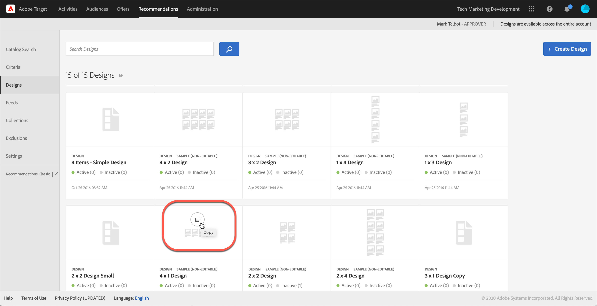
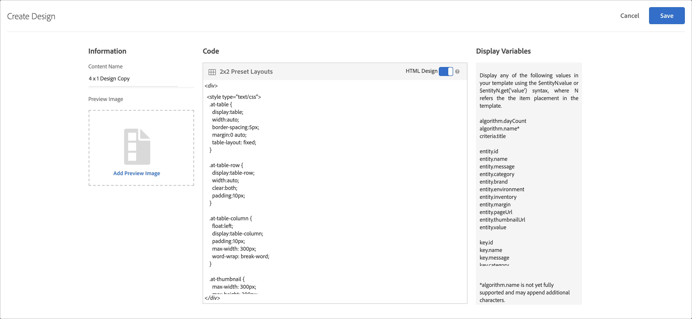
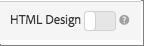
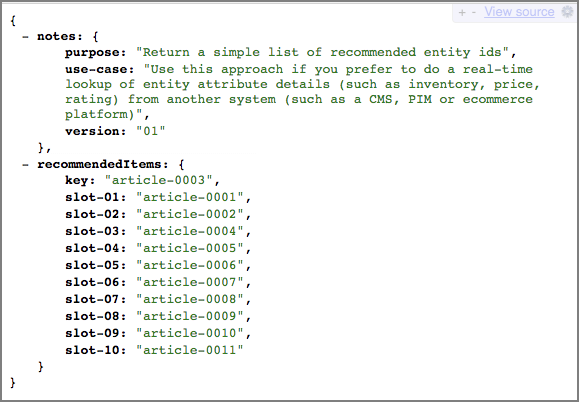

# デザインの作成

デザインによって、レコメンデーションがページに表示される方法が定義されます。

デフォルトデザインを使用するか、カスタムデザインを作成することで、[!UICONTROL Recommendations] デザインを作成できます。 **[!UICONTROL Recommendations > Designs]**&#x200B;画面には、デフォルトのデザインカードと、アカウントで作成されたデザインの両方が表示されます。

デザインを操作する際は、次の情報を考慮してください。

* デフォルトデザインを使用してレコメンデーションデザインを作成したり、カスタムデザインを作成したりできます。
* デフォルトデザインを編集または削除することはできません。
* カスタムデザインを編集、コピー、または削除できます。
* デフォルトデザインに基づいてデザインを作成するには、まずデザインをコピーしてから、そのコピーを編集する必要があります。

次の図は、デフォルトの1 x 4 デザインを示しています。


次の図は、カスタムデザインを示しています。


アクティビティ作成プロセス中に、Visual Experience Composer （VEC）内またはアクティビティ作成以外のデザインライブラリからデザインを作成できます。 次のセクションでは、ライブラリからデザインを作成することを前提としていますが、手順は似ています。

## デザインを作成

デフォルトデザインに基づいてデザインを作成することも、カスタムデザインを作成することもできます。

### デフォルトデザインに基づくデザインの作成

1. **[!UICONTROL Recommendations]** > **[!UICONTROL Designs]**&#x200B;をクリックして、[!UICONTROL Designs] ライブラリを表示します。

   

1. 作成するデザインのカードにマウスを合わせ、**[!UICONTROL Copy]** アイコンをクリックします。

   

   [!UICONTROL Create Design] ダイアログボックスが表示されます。

   

1. **[!UICONTROL Information]** パネルで、**[!UICONTROL Content Name]**&#x200B;とオプションのプレビュー画像を追加して、デザインカードに表示します。

   デフォルトのデザインを使用すると、**[!UICONTROL Content Name]** フィールドにデザイン名と「コピー」が表示されます。 名前は編集できます。 デザインカードに表示する画像を選択することもできます。

1. （条件付き）必要に応じて、デザイン **[!UICONTROL Code]**&#x200B;を編集します。

   レコメンデーションデザインは、オープンソースの[!DNL Velocity] デザイン言語を使用します。 [!DNL Velocity]に関する情報は、[https://velocity.apache.org](https://velocity.apache.org)および[で見つけることができます。 [!DNL Velocity]](/help/main/c-recommendations/c-design-overview/customizing-a-template.md)を使用してデザインをカスタマイズします。

   デザインは HTML または HTML 以外にすることができます。 デフォルトでは、HTML デザインは`<div>` タグでラップされ、Web環境でのクリックトラッキングが可能になります。 HTML 以外のデザインは、Web 環境ではない環境用のもので、クリック追跡ができません。 HTML以外のコードを使用するには、[!UICONTROL HTML Design] トグルを「オフ」の位置にスライドさせます。

   >[!NOTE]
   >
   >デザインで参照できるエンティティの最大数は、ハードコーディングの場合もループの場合も 99 です。

1. **[!UICONTROL Save]** をクリックします。

### カスタムデザインの作成

1. **[!UICONTROL Recommendations]** > **[!UICONTROL Designs]**&#x200B;をクリックして、[!UICONTROL Designs] ライブラリを表示します。

1. **[!UICONTROL Create Design]** をクリックします。

   新しいカスタムデザインを既存のデザインに基にする場合は、目的のデザインにマウスを合わせ、[!UICONTROL Copy] アイコンをクリックします。 次に、コピーを編集して、新しいカスタムデザインを作成します。

1. **[!UICONTROL Content Name]**&#x200B;とオプションのプレビュー画像を追加します。

1. （条件付き）必要に応じて、デザイン **[!UICONTROL Code]**&#x200B;を編集します。

   詳しくは、上記の手順4の情報を参照してください。

1. **[!UICONTROL Save]** をクリックします。

## デザインの編集、コピー、削除

デフォルトデザインは編集またはコピーできません。デフォルトデザインのみコピーできます。

[!UICONTROL Design] ライブラリ内の目的のデザインにカーソルを合わせ、適切なアイコン（「編集」、「コピー」、「削除」など）をクリックします。

デザインの

既存のデザインをコピーして複製したデザインを作成し、変更することができます。 このプロセスにより、より少ない労力で同様のデザインを作成できます。

デザインはアカウント全体で利用できます。 デザインを削除する前に、他のアカウントでの使用を検討します。 削除されたデザインは復元できません。

## JSON の例 {#section_75BFB2537CFF4FBD9B560F59EB32C8DD}

次の例は、フォームベースのエディターを使用してアクティビティを設定する際に、JSON応答を返す方法を示しています。

1. デザインライブラリ内またはフォームベースのワークフロー内からデザインを作成します。 [!UICONTROL Visual Experience Composer] （VEC） ワークフロー内でデザインを作成しようとすると、クリック トラッキング用に`<div>`にラップされたHTML デザイン以外は作成できません。

1. 「HTML デザイン」オプションがオフになっていることを確認します。

   

1. 次のコードは、デザインにペーストできる内容の例です。

   ```javascript
       #* 
       * "Return a simple list of recommended entity ids"   
       *#
   
       {   
         "notes":{   
         "purpose": "Return a simple list of recommended entity ids",   
         "use-case": "Use this approach if you prefer to do a real-time lookup of entity attribute details (such as inventory, price, rating) from another system (such as a CMS, PIM or ecommerce platform)",   
         "version": "01"   
         },   
         "recommendedItems": {   
           "key": "$key.id",   
           "slot-01": "$entity1.id",   
           "slot-02": "$entity2.id",   
           "slot-03": "$entity3.id",   
           "slot-04": "$entity4.id",   
           "slot-05": "$entity5.id",   
           "slot-06": "$entity6.id",   
           "slot-07": "$entity7.id",   
           "slot-08": "$entity8.id",   
           "slot-09": "$entity9.id",   
           "slot-10": "$entity10.id"   
         }   
       }  
   ```

1. このデザインを使用するフォームベースの[!DNL Recommendations] アクティビティを設定します。

   1. **[!UICONTROL Activities]** ページに移動します。
   1. **[!UICONTROL Create Activity]**／**[!UICONTROL Recommendations]**&#x200B;をクリックします。
   1. **[!UICONTROL Choose Experience Composer]**&#x200B;で「**[!UICONTROL Form]**」を選択し、「**[!UICONTROL Next]**」をクリックします。
   1. 「場所」で &quot;Sample_Recs_Response&quot; というテキストを入力します。
   1. **[!UICONTROL Default Content]**&#x200B;で下向き矢印をクリックし、**[!UICONTROL Add Recommendation]**&#x200B;をクリックします。
   1. 「ページタイプ」を選択します。 これにより、次の画面の最初のフィルタリングが決まります。
   1. 条件カードを選択し、**[!UICONTROL Next]**&#x200B;をクリックします。
   1. 前の手順で作成したデザインを選択し、**[!UICONTROL Next]**&#x200B;をクリックします。
   1. 設定プロセスを完了します。
   1. **[!UICONTROL Inactive]**&#x200B;の横にある右向き矢印をクリックし、**[!UICONTROL Activate]**&#x200B;を選択します。

1. アクティビティを設定してアクティブ化したら、クリーンな JSON 応答を返すサンプルのリクエストを設定できます。

   アクティビティを保存してから、[!DNL Target]は、選択した条件設定をサポートするモデルを構築する必要があります。 さまざまな要因によっては、このプロセスに時間がかかることもあります。 モデルの構築が完了すると結果が表示されます。

   次に例を示します。

   ```
   https://[YOUR_CLIENT_CODE].tt.omtrdc.net/m2/YOUR_CLIENT_CODE/ubox/raw?mbox=[YOUR_MBOX_NAME]&mboxContentType=text/html&mboxXDomain=disabled&entity.id=[ENTITY_ID]&mboxHost=rawbox_sample&at_property=[AT_PROPERTY_TOKEN]&mboxNoRedirect=true&mboxPC=1234-4321&mboxSession=9876-7000
   ```

   where

   | パラメーター | 値 |
   |--- |--- |
   | `[YOUR_CLIENT_CODE]` | Target クライアントコード（/help/target/products.html#recsSettings/Recommendations API トークン/クライアントコードで利用可能）。 |
   | `[YOUR_MBOX_NAME]` | フォームベースのレコメンデーションの「場所」セクション（この場合はSample_Recs_Response）で選択した名前。 |
   | `[ENTITY_ID` | カタログ内の項目の `entity.id` です。 |
   | `[AT_PROPERTY_TOKEN]` | （オプション）アクティビティの設定時にプロパティ（Enterprise 権限の一部）を選択した場合は追加します。 |

アルゴリズムを実行して結果が得られたら、応答は次のようになります。

{width="575px"}

## 追加のJSON オブジェクトのヒントとテクニック {#section_C305673C68944749969DB239E3221DC2}

次の構文でデザインを設定することで、シンプルなコンマ区切りの項目リストを返すこともできます。

```
entity1.id, $entity2.id, $entity3.id, $entity4.id, $entity5.id, 
```

応答でその他の情報を送信することもできます。 次のコードファイルはより複雑なサンプルで、エンティティ ID と関連するスロット（順序）以外に様々な情報を返します。 このデザインの例では、アクティビティの詳細、ターゲットプロファイルの詳細（該当する場合）、返された項目に関連するその他`entity.attributes`も返します。

```javascript
    {   
     "adobeRecommendations": {   
      "notes": {   
       "purpose": "Return a list of entity ids with their associated entity.attributes",   
       "use-case": "Use this approach to avoid looking up attribute details after receiving a response from Target",   
       "version": "01"   
      },   
      "recommendedItems": {   
       "slot-01": "$entity1.id",   
       "slot-02": "$entity2.id",   
       "slot-03": "$entity3.id",   
       "slot-04": "$entity4.id",   
       "slot-05": "$entity5.id",   
       "slot-06": "$entity6.id",   
       "slot-07": "$entity7.id",   
       "slot-08": "$entity8.id",   
       "slot-09": "$entity9.id",   
       "slot-10": "$entity10.id"   
      },   
      "activityDetails": {   
       "mbox.name": "email-mbox",   
       "campaign.name": "\${campaign.name}",   
       "campaign.id": "\${campaign.id}",   
       "campaign.recipe.name": "\${campaign.recipe.name}",   
       "campaign.recipe.id": "\${campaign.recipe.id}",   
       "offer.name": "\${offer.name}",   
       "offer.id": "\${offer.id}",   
       "criteria.title": "$criteria.title",   
       "algorithm.name": "$algorithm.name",   
       "algorithm.dayCount": "$algorithm.dayCount"   
      },   
      "visitorProfile": {   
       "profile.favorite-category": "\${profile.favorite-category}",   
       "profile.test": "\${profile.test}",   
       "user.endpoint.lastPurchasedEntity": "\${user.endpoint.lastPurchasedEntity}",   
       "user.endpoint.lastViewedEntity": "\${user.endpoint.lastViewedEntity}",   
       "user.endpoint.mostViewedEntity": "\${user.endpoint.mostViewedEntity}",   
       "user.endpoint.categoryAffinity": "\${user.endpoint.categoryAffinity}",   
       "profile.geolocation.city": "\${profile.geolocation.city}",   
       "profile.geolocation.dma": "\${profile.geolocation.dma}",   
       "profile.geolocation.state": "\${profile.geolocation.state}",   
       "profile.geolocation.country": "\${profile.geolocation.country}",   
       "profile.sessionCount": "\${profile.sessionCount}",   
       "profile.averageDaysBetweenVisits": "\${profile.averageDaysBetweenVisits}",   
       "profile.browserTime": "\${profile.browserTime}",   
       "user.activeActivities": "\${user.activeActivities}",   
       "user.pcId": "\${user.pcId}",   
       "user.isFirstSession": "\${user.isFirstSession}",   
       "user.isNewSession": "\${user.isNewSession}",   
       "user.header": "\${user.header}",   
       "user.parameter": "\${user.parameter}"   
      },   
      "recKey": {   
       "recKeyDetails": {   
        "id": "$key.id",   
        "name": "$key.name",   
        "category": "$key.category",   
        "pageUrl": "$key.pageUrl",   
        "thumbnailUrl": "$key.thumbnailUrl"   
       }   
      },   
      "recDetailedResults": {   
       "recEntity1Details": {   
        "id": "$entity1.id",   
        "name": "$entity1.name",   
        "category": "$entity1.category",   
        "pageUrl": "$entity1.pageUrl",   
        "thumbnailUrl": "$entity1.thumbnailUrl"   
       },   
       "recEntity2Details": {   
        "id": "$entity2.id",   
        "name": "$entity2.name",   
        "category": "$entity2.category",   
        "pageUrl": "$entity2.pageUrl",   
        "thumbnailUrl": "$entity2.thumbnailUrl"   
       },   
       "recEntity3Details": {   
        "id": "$entity3.id",   
        "name": "$entity3.name",   
        "category": "$entity3.category",   
        "pageUrl": "$entity3.pageUrl",   
        "thumbnailUrl": "$entity3.thumbnailUrl"   
       },   
       "recEntity4Details": {   
        "id": "$entity4.id",   
        "name": "$entity4.name",   
        "category": "$entity4.category",   
        "pageUrl": "$entity4.pageUrl",   
        "thumbnailUrl": "$entity4.thumbnailUrl"   
       },   
       "recEntity5Details": {   
        "id": "$entity5.id",   
        "name": "$entity5.name",   
        "category": "$entity5.category",   
        "pageUrl": "$entity5.pageUrl",   
        "thumbnailUrl": "$entity5.thumbnailUrl"   
       },   
       "recEntity6Details": {   
        "id": "$entity6.id",   
        "name": "$entity6.name",   
        "category": "$entity6.category",   
        "pageUrl": "$entity6.pageUrl",   
        "thumbnailUrl": "$entity6.thumbnailUrl"   
       },   
       "recEntity7Details": {   
        "id": "$entity7.id",   
        "name": "$entity7.name",   
        "category": "$entity7.category",   
        "pageUrl": "$entity7.pageUrl",   
        "thumbnailUrl": "$entity7.thumbnailUrl"   
       },   
       "recEntity8Details": {   
        "id": "$entity8.id",   
        "name": "$entity8.name",   
        "category": "$entity8.category",   
        "pageUrl": "$entity8.pageUrl",   
        "thumbnailUrl": "$entity8.thumbnailUrl"   
       },   
       "recEntity9Details": {   
        "id": "$entity9.id",   
        "name": "$entity9.name",   
        "category": "$entity9.category",   
        "pageUrl": "$entity9.pageUrl",   
        "thumbnailUrl": "$entity9.thumbnailUrl"   
       },   
       "recEntity10Details": {   
        "id": "$entity10.id",   
        "name": "$entity10.name",   
        "category": "$entity10.category",   
        "pageUrl": "$entity10.pageUrl",   
        "thumbnailUrl": "$entity10.thumbnailUrl"   
       }   
      }   
     }   
    }  
```

## トレーニングビデオ：Recommendations （3:20）でカスタムデザインを作成する

このビデオには、次の情報が含まれています。

* カスタムデザインの作成
* デザインで表示変数を参照する方法について説明します

>[!VIDEO](https://video.tv.adobe.com/v/27687)
