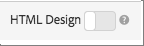

# デザインの作成

デザインによって、レコメンデーションがページに表示される方法が定義されます。

デフォルトのデザインを使用するか、カスタムデザインを作成することで、[!UICONTROL Recommendations] しいデザインを作成できます。 **[!UICONTROL Recommendations > Designs]** 画面には、デフォルトのデザインカードと、お使いのアカウントで作成されたデザインの両方が表示されます。

デザインを使用する際は、次の点に留意してください。

* デフォルトのデザインを使用して Recommendations デザインを作成したり、カスタムデザインを作成したりできます。
* デフォルトデザインを編集または削除することはできません。
* カスタムデザインを編集、コピー、削除できます。
* 既定のデザインに基づいてデザインを作成するには、まずデザインをコピーし、次にそのコピーを編集する必要があります。

次の図は、デフォルトの 1 x 4 のデザインを示しています。


次の図は、カスタムデザインを示しています。


アクティビティの作成プロセス中に、[!UICONTROL Visual Experience Composer] （VEC）内から、またはアクティビティ作成外部のデザインライブラリからデザインを作成できます。 以下のセクションでは、ライブラリからデザインを作成することを前提としていますが、手順は似ています。

## デザインの作成

デフォルトのデザインに基づいてデザインを作成することも、カスタムデザインを作成することもできます。

### デフォルトデザインに基づくデザインの作成

1. **[!UICONTROL Recommendations]** > **[!UICONTROL Designs]** をクリックして、[!UICONTROL Designs] ライブラリを表示します。


1. 作成するデザインの「その他のアクション」アイコン ）をクリックし、「**[!UICONTROL Copy]**」をクリックします。

   [!UICONTROL Create Design] ダイアログボックスが表示されます。

1. デザイン カードに表示する **[!UICONTROL &#x200B; Name]** とオプションのプレビュー画像を入力します。

   デフォルトのデザインを使用する場合は、デザイン名と「コピー」が「**[!UICONTROL Content Name]**」フィールドに表示されます。 名前は編集できます。また、デザインカードに表示する画像を選択することもできます。

1. （条件付き）必要に応じてデザイン **[!UICONTROL Code]** を編集します。

   レコメンデーションデザインには、オープンソースの Velocity デザイン言語が使用されています。Velocity について詳しくは、[https://velocity.apache.org](https://velocity.apache.org) および [Velocity を使用したデザインのカスタマイズ ](/help/main/c-recommendations/c-design-overview/customizing-a-template.md) を参照してください。

   デザインは HTML または HTML 以外にすることができます。デフォルトでは、HTML デザインは、web 環境でのクリックの追跡を可能にするために `<div>` タグでラップされます。 HTML以外のデザインは、クリックの追跡が不可能な web 以外の環境向けです。 [!UICONTROL HTML Design] トグルを「オフ」の位置にスライドさせて、HTML以外のコードを使用します。

   >[!NOTE]
   >
   >デザインで参照できるエンティティの最大数は、ハードコーディングの場合もループの場合も 99 です。

1. **[!UICONTROL Create]** をクリックします。

### カスタムデザインの作成

1. **[!UICONTROL Recommendations]** > **[!UICONTROL Designs]** をクリックして、[!UICONTROL Designs] ライブラリを表示します。

1. **[!UICONTROL Create Design]** をクリックします。

   既存のデザインを基に新しいカスタムデザインを作成する場合は、作成するデザインの [!UICONTROL More Actions] のアイコン（）をクリックし、「[!UICONTROL Copy]」をクリックします。 その後、コピーを編集して新しいカスタムデザインを作成できます。

1. **[!UICONTROL Name]** とオプションのプレビュー画像を追加します。

1. （条件付き）必要に応じてデザイン **[!UICONTROL Code]** を編集します。

   詳しくは、上記の手順 4 の情報を参照してください。

1. **[!UICONTROL Create]** をクリックします。

## デザインの編集、コピー、削除

デフォルトデザインは編集またはコピーできないことに注意してください。コピーできるのは、デフォルトデザインのみです。

編集または削除するデザインの [!UICONTROL More Actions] アイコン ）をクリックし、適切なアイコン（[!UICONTROL Edit]、[!UICONTROL Copy]、[!UICONTROL Delete]）をクリックします。

既存のデザインをコピーして複製デザインを作成し、修正することができます。 このプロセスにより、少ない労力で同様のデザインを作成できます。

デザインは、アカウント全体で利用できることに注意してください。 デザインを削除する前に、アカウント間での使用状況を考慮してください。 削除したデザインは復元できません。

## JSON の例 {#section_75BFB2537CFF4FBD9B560F59EB32C8DD}

次の例は、[ フォームベースのエディター ](/help/main/c-experiences/form-experience-composer.md) を使用してアクティビティを設定する際に JSON 応答を返す方法を示しています。

1. [!UICONTROL Design library] 内またはフォームベースのワークフロー内からデザインを作成します。 [!UICONTROL Visual Experience Composer] （VEC）ワークフロー内でデザインを作成しようとすると、クリックの追跡のために `<div>` でラップされたHTML デザイン以外は作成できません。

1. 「HTML デザイン」オプションがオフになっていることを確認します。

   

1. 次のコードは、デザインに貼り付けることができる内容の例です。

   ```javascript
       #* 
       * "Return a simple list of recommended entity ids"   
       *#
   
       {   
         "notes":{   
         "purpose": "Return a simple list of recommended entity ids",   
         "use-case": "Use this approach if you prefer to do a real-time lookup of entity attribute details (such as inventory, price, rating) from another system (such as a CMS, PIM or ecommerce platform)",   
         "version": "01"   
         },   
         "recommendedItems": {   
           "key": "$key.id",   
           "slot-01": "$entity1.id",   
           "slot-02": "$entity2.id",   
           "slot-03": "$entity3.id",   
           "slot-04": "$entity4.id",   
           "slot-05": "$entity5.id",   
           "slot-06": "$entity6.id",   
           "slot-07": "$entity7.id",   
           "slot-08": "$entity8.id",   
           "slot-09": "$entity9.id",   
           "slot-10": "$entity10.id"   
         }   
       }  
   ```

1. このデザインを使用するフォームベースの [!DNL Recommendations] アクティビティを設定します。

   1. **[!UICONTROL Activities]** ページに移動します。
   1. **[!UICONTROL Create Activity]**／**[!UICONTROL Recommendations]**&#x200B;をクリックします。
   1. 「**[!UICONTROL Choose Experience Composer]**」で「**[!UICONTROL Form]**」を選択し、「**[!UICONTROL Next]**」をクリックします。
   1. 「場所」で &quot;Sample_Recs_Response&quot; というテキストを入力します。
   1. [**[!UICONTROL Default Content]**] の下の下向き矢印をクリックし、[**[!UICONTROL Add Recommendation]**] をクリックします。
   1. 「ページタイプ」を選択します。これにより、次の画面の最初のフィルタリングが決まります。
   1. 条件カードを選択し、「**[!UICONTROL Next]**」をクリックします。
   1. 前の手順で作成したデザインを選択し、「**[!UICONTROL Next]**」をクリックします。
   1. 設定プロセスを完了します。
   1. 「**[!UICONTROL Inactive]**」の横の右矢印をクリックし、「**[!UICONTROL Activate]**」を選択します。

1. アクティビティを設定してアクティブ化したら、クリーンな JSON 応答を返すサンプルのリクエストを設定できます。

   アクティビティを保存した時点から、選択 [!DNL Target] た条件設定をサポートするモデルを作成する必要があります。 多くの要因により、このプロセスには時間がかかる場合があります。 モデルの構築が完了すると結果が表示されます。

   次に例を示します。

   ```
   https://[YOUR_CLIENT_CODE].tt.omtrdc.net/m2/YOUR_CLIENT_CODE/ubox/raw?mbox=[YOUR_MBOX_NAME]&mboxContentType=text/html&mboxXDomain=disabled&entity.id=[ENTITY_ID]&mboxHost=rawbox_sample&at_property=[AT_PROPERTY_TOKEN]&mboxNoRedirect=true&mboxPC=1234-4321&mboxSession=9876-7000
   ```

   where

   | パラメーター | 値 |
   |--- |--- |
   | `[YOUR_CLIENT_CODE]` | Target クライアントコード（/help/target/products.html#recsSettings/Recommendations API トークン/クライアントコードで使用可能）。 |
   | `[YOUR_MBOX_NAME]` | フォームベースの Recommendations の「場所」セクションで選択した名前（この場合は Sample_Recs_Response）。 |
   | `[ENTITY_ID` | カタログ内の項目の `entity.id` です。 |
   | `[AT_PROPERTY_TOKEN]` | （オプション）アクティビティの設定時にプロパティ（Enterprise 権限の一部）を選択した場合は追加します。 |

アルゴリズムを実行して結果が得られたら、応答は次のようになります。

{width="575px"}

## その他の JSON オブジェクトのヒントとテクニック {#section_C305673C68944749969DB239E3221DC2}

また、次の構文でデザインを設定することで、単純なコンマ区切りの項目のリストを送り返すこともできます。

```
entity1.id, $entity2.id, $entity3.id, $entity4.id, $entity5.id, 
```

応答でその他の情報を送信することもできます。次のコードファイルはより複雑なサンプルで、エンティティ ID と関連するスロット（順序）以外に様々な情報を返します。また、このデザインサンプルでは、アクティビティの詳細、[!UICONTROL Target Profile] の詳細（該当する場合）、および返される項目に関連付けられたその他の `entity.attributes` も返されます。

```javascript
    {   
     "adobeRecommendations": {   
      "notes": {   
       "purpose": "Return a list of entity ids with their associated entity.attributes",   
       "use-case": "Use this approach to avoid looking up attribute details after receiving a response from Target",   
       "version": "01"   
      },   
      "recommendedItems": {   
       "slot-01": "$entity1.id",   
       "slot-02": "$entity2.id",   
       "slot-03": "$entity3.id",   
       "slot-04": "$entity4.id",   
       "slot-05": "$entity5.id",   
       "slot-06": "$entity6.id",   
       "slot-07": "$entity7.id",   
       "slot-08": "$entity8.id",   
       "slot-09": "$entity9.id",   
       "slot-10": "$entity10.id"   
      },   
      "activityDetails": {   
       "mbox.name": "email-mbox",   
       "campaign.name": "\${campaign.name}",   
       "campaign.id": "\${campaign.id}",   
       "campaign.recipe.name": "\${campaign.recipe.name}",   
       "campaign.recipe.id": "\${campaign.recipe.id}",   
       "offer.name": "\${offer.name}",   
       "offer.id": "\${offer.id}",   
       "criteria.title": "$criteria.title",   
       "algorithm.name": "$algorithm.name",   
       "algorithm.dayCount": "$algorithm.dayCount"   
      },   
      "visitorProfile": {   
       "profile.favorite-category": "\${profile.favorite-category}",   
       "profile.test": "\${profile.test}",   
       "user.endpoint.lastPurchasedEntity": "\${user.endpoint.lastPurchasedEntity}",   
       "user.endpoint.lastViewedEntity": "\${user.endpoint.lastViewedEntity}",   
       "user.endpoint.mostViewedEntity": "\${user.endpoint.mostViewedEntity}",   
       "user.endpoint.categoryAffinity": "\${user.endpoint.categoryAffinity}",   
       "profile.geolocation.city": "\${profile.geolocation.city}",   
       "profile.geolocation.dma": "\${profile.geolocation.dma}",   
       "profile.geolocation.state": "\${profile.geolocation.state}",   
       "profile.geolocation.country": "\${profile.geolocation.country}",   
       "profile.sessionCount": "\${profile.sessionCount}",   
       "profile.averageDaysBetweenVisits": "\${profile.averageDaysBetweenVisits}",   
       "profile.browserTime": "\${profile.browserTime}",   
       "user.activeActivities": "\${user.activeActivities}",   
       "user.pcId": "\${user.pcId}",   
       "user.isFirstSession": "\${user.isFirstSession}",   
       "user.isNewSession": "\${user.isNewSession}",   
       "user.header": "\${user.header}",   
       "user.parameter": "\${user.parameter}"   
      },   
      "recKey": {   
       "recKeyDetails": {   
        "id": "$key.id",   
        "name": "$key.name",   
        "category": "$key.category",   
        "pageUrl": "$key.pageUrl",   
        "thumbnailUrl": "$key.thumbnailUrl"   
       }   
      },   
      "recDetailedResults": {   
       "recEntity1Details": {   
        "id": "$entity1.id",   
        "name": "$entity1.name",   
        "category": "$entity1.category",   
        "pageUrl": "$entity1.pageUrl",   
        "thumbnailUrl": "$entity1.thumbnailUrl"   
       },   
       "recEntity2Details": {   
        "id": "$entity2.id",   
        "name": "$entity2.name",   
        "category": "$entity2.category",   
        "pageUrl": "$entity2.pageUrl",   
        "thumbnailUrl": "$entity2.thumbnailUrl"   
       },   
       "recEntity3Details": {   
        "id": "$entity3.id",   
        "name": "$entity3.name",   
        "category": "$entity3.category",   
        "pageUrl": "$entity3.pageUrl",   
        "thumbnailUrl": "$entity3.thumbnailUrl"   
       },   
       "recEntity4Details": {   
        "id": "$entity4.id",   
        "name": "$entity4.name",   
        "category": "$entity4.category",   
        "pageUrl": "$entity4.pageUrl",   
        "thumbnailUrl": "$entity4.thumbnailUrl"   
       },   
       "recEntity5Details": {   
        "id": "$entity5.id",   
        "name": "$entity5.name",   
        "category": "$entity5.category",   
        "pageUrl": "$entity5.pageUrl",   
        "thumbnailUrl": "$entity5.thumbnailUrl"   
       },   
       "recEntity6Details": {   
        "id": "$entity6.id",   
        "name": "$entity6.name",   
        "category": "$entity6.category",   
        "pageUrl": "$entity6.pageUrl",   
        "thumbnailUrl": "$entity6.thumbnailUrl"   
       },   
       "recEntity7Details": {   
        "id": "$entity7.id",   
        "name": "$entity7.name",   
        "category": "$entity7.category",   
        "pageUrl": "$entity7.pageUrl",   
        "thumbnailUrl": "$entity7.thumbnailUrl"   
       },   
       "recEntity8Details": {   
        "id": "$entity8.id",   
        "name": "$entity8.name",   
        "category": "$entity8.category",   
        "pageUrl": "$entity8.pageUrl",   
        "thumbnailUrl": "$entity8.thumbnailUrl"   
       },   
       "recEntity9Details": {   
        "id": "$entity9.id",   
        "name": "$entity9.name",   
        "category": "$entity9.category",   
        "pageUrl": "$entity9.pageUrl",   
        "thumbnailUrl": "$entity9.thumbnailUrl"   
       },   
       "recEntity10Details": {   
        "id": "$entity10.id",   
        "name": "$entity10.name",   
        "category": "$entity10.category",   
        "pageUrl": "$entity10.pageUrl",   
        "thumbnailUrl": "$entity10.thumbnailUrl"   
       }   
      }   
     }   
    }  
```

## トレーニングビデオ：Recommendations でカスタムデザインを作成（3:20） 

このビデオには、次の情報が含まれています。

* カスタムデザインの作成
* デザインで表示変数を参照する方法を理解する

>[!VIDEO](https://video.tv.adobe.com/v/27687)
