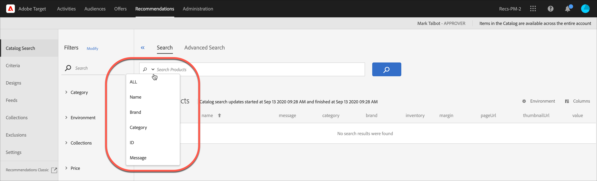

# カタログ検索

[!DNL Adobe Recommendations]の[!UICONTROL  カタログ検索] ページは、カタログ内の商品またはコンテンツを検索するのに役立ちます。 このページで実行できる最も基本的なタスクは、項目を検索することです。 さらに、環境の変更、検索結果のコレクションまたは除外への保存、フィルターファセットの追加、テーブルの列の変更、新しい検索ファセットの追加などを行うことができます。

カタログは、製品セット（エンティティ）全体を表します。 カタログには多数のコレクションを含めることができるため、商品を論理バケットで整理できます。

## カタログ検索へのアクセス

[!UICONTROL  カタログ検索] ページにアクセスするには、**[!UICONTROL 推奨事項]** > **[!UICONTROL カタログ検索]**&#x200B;をクリックします。

## 項目の検索

シンプルな検索または高度な検索を使用して、カタログ内の項目を検索できます。

### シンプルな検索の実行

1. 「**[!UICONTROL 製品を検索]**」フィールドに検索語句を入力します。

1. （オプション）検索フィールドの下向き矢印をクリックすると表示されるオプションメニューから検索オプションを選択して、検索を絞り込むことができます。

   

   次の検索オプションがあります。

   * ALL - OR ロジックを使用して、他のすべての検索条件を検索します。
   * 名前
   * ブランド
   * カテゴリ
   * ID
   * メッセージ

1. 検索結果の項目をスクロールして、サムネールやその他の商品情報を表示できるようになりました。

   次の図は、「すべて」オプションを使用した「自転車」の結果を示しています。

   

   「製品」のとなりに表示されている数字は、指定された環境での有効数の中で検索語句に一致した製品の数です。

   自動入力機能を使用できることに注意してください。 次の図では、「bik」と入力すると、「bike」という単語を含むすべての製品が返されます。

   

   >[!NOTE]
   >
   >数値を使用してカスタム属性に対してカタログ検索を実行すると、カスタム属性は数値ではなく文字列型とみなされます。
   >
   >現在、属性のタイプを変更できる機能はありません。 変更をおこなうには、[顧客のイシューを開く](/help/main/cmp-resources-and-contact-information.md#reference_ACA3391A00EF467B87930A450050077C)、タイプを文字列から数値に変更する必要がある属性を参照します。

1. フィルターを使用して、目的の商品を見つけることもできます。 次の例では、[!UICONTROL  コレクション ] ファセットを展開し、「自転車ツール」を選択すると、カタログ内のすべての自転車ツールが表示されます。

   

1. 「チェーン」などの検索語を入力して、結果リストをさらに検索できます。

   

### 高度な検索を実行 {#advanced-search}

[!UICONTROL 詳細検索]を使用して、検索結果をさらに絞り込んだり、検索結果を[ コレクション ](/help/main/c-recommendations/c-products/collections.md)または[除外](/help/main/c-recommendations/c-products/exclusions.md)として保存したりできます。

1. 「**[!UICONTROL 詳細検索]**」リンクをクリックします。

   

1. ドロップダウンリストを使用して、検索のパラメーター、演算子、値を指定します。

1. （オプション）「**[!UICONTROL ルールを追加]**」をクリックして、検索ルールを追加します。

   追加の各検索ルールは、AND演算子と結合されます。

1. 「**[!UICONTROL 検索]**」をクリックします。

1. （オプション）「**[!UICONTROL 別名で保存]**」をクリックしてから、**[!UICONTROL コレクション]**&#x200B;または&#x200B;**[!UICONTROL 除外]**」をクリックします。

   

   詳細については、以下の「[高度な検索に基づいてコレクションまたは除外を作成する](#save-as)」を参照してください。

## 項目の詳細を表示する

ID、名前、メッセージ、カテゴリなどの個々の項目の詳細を表示できます。

1. 検索結果の項目をクリックすると、その詳細が表示されます。

   

## カタログから項目を削除する

1. 検索結果の項目をクリックすると、その詳細が表示されます。

1. 「**[!UICONTROL カタログから削除]**」をクリックします。

1. 項目を削除することを確認します。

そのアイテムに関するすべての情報は、カタログのインデックスから削除されます。 アイテムがカタログに含まれるのは、データフィードでアイテムが再度追加された場合のみです。 削除された項目は、フィードから個別に削除する必要があります。

## カタログを更新する

カタログのインデックスは、最初のフィードをアップロードしたときに自動的に作成され、[指定されたスケジュール ](/help/main/c-recommendations/c-products/feeds.md#steps)に従って更新されます。

カタログは、フィードファイル、API または mbox の更新を介して更新を受け取ると、自動的に更新されます。 更新は、通常、1 時間で完了します。 更新が進行中の場合、最も新しく更新を開始した時間が表示されます。 更新が進行中でない場合、最も新しく更新を開始および終了した時間が表示されます。

## 詳細検索に基づいたコレクションまたは除外の作成 {#save-as}

[!UICONTROL  カタログ検索] ページ （[!UICONTROL Recommendations] > [!UICONTROL  カタログ検索] > [!UICONTROL 高度な検索]）の[!UICONTROL 高度な検索]を使用して、[ コレクション ](/help/main/c-recommendations/c-products/collections.md)または[exclusions](/help/main/c-recommendations/c-products/exclusions.md)を作成できます。

1. [詳細検索](#advanced-search)を実行します。

1. **[!UICONTROL 別名で保存]**&#x200B;をクリックしてから、**[!UICONTROL コレクション]**&#x200B;または&#x200B;**[!UICONTROL 除外]**&#x200B;をクリックします。

   

   >[!IMPORTANT]
   >
   >[!UICONTROL 詳細検索]機能では大文字と小文字が区別されませんが、配信時に返される商品は、大文字と小文字が区別される検索に基づいています。 この違いが混乱を招くこともあります。 [!UICONTROL 詳細検索]機能を使用して結果に基づいてコレクションまたは除外を作成する場合は、大文字と小文字を区別するようにしてください。 例えば、最初に「Holiday」と検索すると、「Holiday」または「holiday」を含む結果が返されます。 その後、「holiday」を含む商品を返すことを目的としたカタログを作成すると、「holiday」を含む商品のみが返されます。 「Holiday」を含む商品は返されません。 除外も同様に処理されます。

## 環境の変更

[環境](/help/main/administrating-target/environments.md)を使用すると、サイトとプリプロダクション環境を整理して、管理を容易にし、レポートを分離できます。

1. 「環境」リンクをクリックします。

   

1. 目的の環境を選択します。

## カタログ検索ページ（フィルターと列）の変更

現在のセッションの[!UICONTROL  カタログ検索] ページで使用可能なフィルターと列を一時的に変更できます。

### フィルターを変更

[!UICONTROL  カタログ検索] ページに追加のフィルターファセットを追加できます。

1. **[!UICONTROL フィルター]** パネルで、**[!UICONTROL 変更]**&#x200B;をクリックします。

   

1. 目的の検索ファセット（ID、名前、メッセージなど）を選択し、**[!UICONTROL 保存]**&#x200B;をクリックします。

   

追加のフィルターファセットは、現在のセッションでのみ使用できます。

### 列を変更

[!UICONTROL  カタログ検索] ページで、アクティブな列を一時的に変更できます。

1. 「**[!UICONTROL 列]**」リンクをクリックします。

   

1. （条件付き）アクティブな列の順序を並べ替えるには、**[!UICONTROL アクティブな列]** セクションの列を目的の順序でドラッグ&amp;ドロップします。

1. （条件付き）必要に応じて、項目を&#x200B;**[!UICONTROL アクティブな列]**&#x200B;から&#x200B;**[!UICONTROL 非アクティブな列]** （またはその逆）にドラッグ&amp;ドロップします。

   アクティブなセクションから非アクティブなセクションに移動する列の横にある削除アイコン（x）をクリックすることもできます。

変更は現在のセッションにのみ適用されます。
