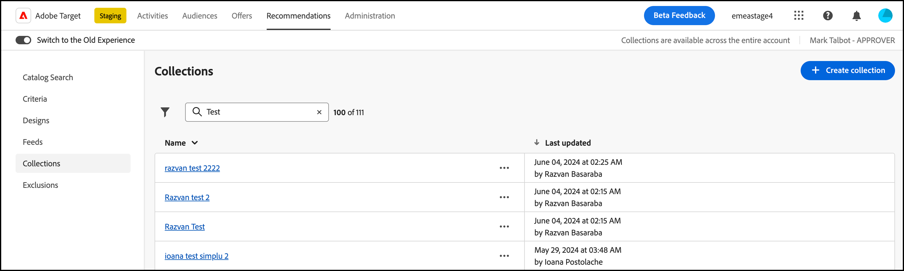

# コレクション

コレクションは、レコメンデーションの対象となる製品または項目のセットです。 コレクションを定義するには、そのコレクションの一部となる項目が満たす必要がある条件を指定します。

一般的に、コレクションは、単一の製品コレクションなどの同一または関連する品目のセットです。ただし、どのような品目でも、ビジネス上で適切なカテゴリにグループ化できます。例えば、ある価格帯の製品、ある地域で特に関心が高いと思われる色や品目などです。

コレクションは、製品や論理的な格納場所を整理するために使用できます。例えば、ある地域で使用できる項目があり、別の地域では使用できない項目がある場合、訪問者の地域で使用できない項目を除外するコレクションを作成できます。 また、コレクションを使用すると、季節的な品目やビジネスに適した任意の整理パラメーターによる整理をおこなえます。

[バックアップの推奨事項](/help/main/c-recommendations/c-algorithms/backup-recs.md) レコメンデーション内の各条件に対して生成された場合も、このコレクションを使用するので、コレクション内の項目のみがバックアップレコメンデーションに含まれます。 コレクションを使用すると、ある位置での表示に適切な商品だけを、確実に表示させることができます。

コレクションは、各条件が実行されるたびに、再構築または更新されます。

品目をコレクションにグループ分けし、各カタログに個別のレコメンデーションを作成できます。

包含条件を使用するとコレクションと同様のことができますが、包含条件はアクティビティを作成する都度設定する必要があります。コレクションを使用すると、一連の項目を 1 回だけ作成し、適切な場合は、もう一度設定しなくてもいつでも使用できます。

を作成または編集する場合 [!DNL Recommendations] アクティビティの場合、コレクション名がの横に表示されます [!UICONTROL Criteria] アクティビティ図のラベル。

>[!NOTE]
>
>を使用する場合、コレクションは適用されません [!UICONTROL Recently Viewed Items] レコメンデーションキー。

## コレクションの作成 {#task_1256DFF6842141FCAADD9E1428EF7F08}

コレクションを作成して、レコメンデーションに表示する製品またはコンテンツを整理します。

1. クリック **[!UICONTROL Recommendations]** > **[!UICONTROL Collections]** 既存のコレクションのリストを表示します。

   

   この [!UICONTROL Collections] 既存のコレクションのリストが表示されます。 新しいコレクションを作成するには、 [!UICONTROL Create Collection] ボタン。 目的のコレクションの横にある省略記号アイコンをクリックしたあと目的のオプションをクリックすると、既存のコレクションを編集、コピー、削除することもできます。

   で各コレクションに対して報告された「項目数」 [!UICONTROL Collections] リスト表示は、設定されたデフォルトのRecommendations内で、そのコレクションのルールに一致する商品の数です [ホスト グループ](/help/main/administrating-target/hosts.md) （環境）。 参照： [設定](https://experienceleague.adobe.com/docs/target-dev/developer/recommendations.html){target=_blank} デフォルトのホストグループを変更する

1. **[!UICONTROL Create Collection]** をクリックします。

   

1. A を入力 **[!UICONTROL Name]** をコレクションに追加します。

   オプションのを入力することもできます **[!UICONTROL Description]**.

1. （条件付き）を選択 [0.9511122](/help/main/administrating-target/environments.md) から **[!UICONTROL Environment]** コレクションを作成（または更新）する際にフィルタリングし、その環境のコレクションのコンテンツをプレビューします。 デフォルトでは、デフォルトのホストグループの結果が表示されます。

1. コレクションの構築に使用するルールを設定します。

   例えば、リスト内の product ID、category、margin などのパラメーターに関するコレクションを作成できます。

   ルールを追加し、複数のパラメーターを使用して、コレクションを定義することができます。複数のルールを AND 演算子で結合します。 コレクションが適用されるには、指定したすべてのルールに合致する必要があります。

1. **[!UICONTROL Create]** をクリックします。

## を使用したコレクションの作成 [!UICONTROL Advanced Search]

を使用してコレクションを作成することもできます。 [!UICONTROL Advanced Search] 日 [カタログ検索](/help/main/c-recommendations/c-products/catalog-search.md#save-as) ページ （[!UICONTROL Recommendations] > [!UICONTROL Catalog Search] > [!UICONTROL Advanced Search]）に設定します。

例えば、「id > 次を含む」を使用して検索を作成した後、 [!UICONTROL Save As] > [!UICONTROL Collection].

>[!IMPORTANT]
>
>この [!UICONTROL Advanced Search] 機能では大文字と小文字が区別されません。ただし、配信時に返される製品は大文字と小文字を区別した検索に基づいています。 この違いが混乱を招くこともあります。を使用して結果に基づいてコレクションを作成する場合は、大文字と小文字を区別するようにしてください [!UICONTROL Advanced Search] 機能。 例えば、最初に「Holiday」と検索すると、「Holiday」または「holiday」を含む結果が返されます。その後、「holiday」を含む商品を返すことを目的としたカタログを作成すると、「holiday」を含む商品のみが返されます。「Holiday」を含む商品は返されません。

## コレクションの編集、コピー、削除

「」をクリックします **省略記号** アイコン リスト内の目的のコレクションの横にある、適切なアイコン（編集、コピー、削除）をクリックします。

既存のコレクションをコピーして重複するコレクションを作成し、後で変更できます。 これにより、少ない労力で同様のコレクションを作成できます。

コレクションは、アカウント全体で利用できることに注意してください。 コレクションを削除する前に、このことを考慮してください。 削除したコレクションは復元できません。

## でのコレクションの使用 [!DNL Recommendations] activity

1. 上記のいずれかの方法を使用して、コレクションを作成します。

1. クリック **[!UICONTROL Activities]** および [新しいRecommendationsの作成](/help/main/c-recommendations/t-create-recs-activity/create-recs-activity.md) アクティビティするか、既存のアクティビティを編集します。

1. 条件およびデザインを選択した後、 [!UICONTROL Options] ページが表示され、目的のコレクションを選択します。

   

1. （条件付き）既存のコレクション設定を変更するには、 **[!UICONTROL Experiences]** ページ（3 つのパートから成るガイド付きワークフローのステップ 2）、レコメンデーションを配置した場所をクリックし、をクリックします **[!UICONTROL Change Collection]**&#x200B;を選択してから、目的のコレクションを選択します。

   

## トレーニングビデオ：Recommendationsでコレクションと除外を作成（7:05） 

このビデオには、次の情報が含まれています。

* コレクションの作成
* 除外の作成

>[!VIDEO](https://video.tv.adobe.com/v/27689)