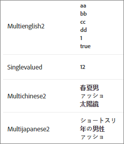

#  カスタムエンティティの属性

単一値および複数値のカスタムエンティティ属性を [!DNL Adobe Target Recommendations] ：カタログ内の項目に関する追加情報を定義します。

## 制限 {#limits}

最大 100 個のカスタムエンティティ属性を使用して、カタログの項目に関する追加情報を定義することができます。例えば、`entity.genre` という名前のカスタム属性を作成して、書籍や映画を定義できます。また、チケット業者はイベントが開催される施設の属性を作成して、スポーツイベントでの来訪チームやコンサートの前座など第 2 のパフォーマーを追加することができます。

単一値のカスタムエンティティの属性の最大長は、15,000 文字（英語やその他のラテン文字のアルファベットなどの 1 バイトおよび 2 バイトの UTF-8 でエンコードされた言語の場合）、または 10,000 文字（中国語、日本語、韓国語などの 3 バイトの UTF-8 エンコード言語の場合）です。

複数値のカスタムエンティティ属性には、500 個以下の値を含めることができます。個々の値はそれぞれ 100 文字以内に制限されています。すべての値の文字数の合計は、単一値のカスタムエンティティ属性の最大値に準拠している必要があります（上記を参照）。

## カスタムエンティティの属性値 {#section_313331A9F8194A89B5EDD89363018651}

カスタムエンティティ属性には、単一値または複数値を設定できます。エンティティ属性値は製品表示で表示されます。



単一値のカスタムエンティティ属性は、単一値の定義済みエンティティ属性と同じように構成されます。

`entity.genre=genre1`

複数値のカスタムエンティティ属性は、有効な JSON 配列として送信する必要があります。

`entity.genre=[“genre1”, “genre2”]`

[!DNL Recommendations] で使用できる有効な JSON 配列の例を以下に示します。

* `["AB","BC"]` すべての値が文字列
* `[1,2]` すべての値が数値

>[!NOTE]
>
>[!DNL Recommendations] では複数値のエンティティ属性で値の種類を混在させることはできません。例えば、`["AB",1,true, [1,2,3]]` は有効な JSON 配列ではありますが、値の種類（文字列、数値、ブール値、オブジェクト）が混在しているので、[!DNL Recommendations] では使用できません。

カスタム属性は、有効な JSON 配列として送信されると、カタログ内のすべての製品について複数値の属性として扱われます。

>[!NOTE]
>
>属性を複数値から単一値に変更するには、カタログを削除して、修正後の製品データをアップロードする必要があります。カタログを削除しても、製品 ID に関連付けられた履歴データは削除されません。詳細については、『*Adobe Recommendations Classic*』ドキュメントの「[システムからすべての項目を削除](/help/main/assets/adobe-recommendations-classic.pdf)」を参照してください。

**制限事項**：

* 事前定義されたエンティティの属性名はカスタムエンティティの属性に使用できません。（[エンティティ属性](/help/main/c-recommendations/c-products/entity-attributes.md#reference_3BCC1383FB3F44F4A2120BB36270387F)を参照。）
* 属性 `entity.environment` はシステムによって予約されており、カスタムエンティティの属性には使用できません。`entity.environment`、フィードまたは API を使用して `targetPageParams` を渡そうとしても無視されます。
* 配列には単一値が含まれている必要があります。値の種類が混在する配列（`["AB",1,true]`）は使用できません。
* 複数値の属性で入れ子になっている JSON 配列（`[10,12,[1,2,3]]`）は単一値の属性として扱われます。

## 複数値の属性の実装 {#section_80FEFE49E8AF415D99B739AA3CBA2A14}

複数値のカスタムエンティティ属性は、フィード (CSV)、 `targetPageParams`、および製品をアップロードする Delivery API です。 新しい値によって現在の値は置き換えられます。新しい値が現在の値の後には追加されることはありません。空の配列（[]）は値なしと見なされます。

二重引用符は、エスケープする必要があります。例えば、`"[""test"", ""value""]"` は CSV で使用できる有効な JSON 配列です。

最大 500 個の値を、複数値の属性に含めることができます。

### targetPageParams の使用

次の例は、`targetPageParams`

```javascript
function targetPageParams() { 
  return { 
    'entity.id':                   '123', 
    'entity.categoryId':            '["A", "A:B", "A:B:C", "A:B:C:D"]',        
    'entity.MultiValueAttribute':   '["X", "Y", "Z"]', 
    'entity.event.detailsOnly':     'true', 
    'excludedIds":                  '[123, 3232, 2323, 4344]', 
    'orderId":                      '123456', 
    'orderTotal":                   '195.32', 
    'productPurchaseId":            '[001,002,003]' 
  }; 
}
```

### CSV の使用

CSV ファイルの管理は、テキストエディターで生データの形式でおこなうか、スプレッドシートソフトウェアを利用します。

この生データの CSV は次のような形式です。


このカタログはスプレッドシートでは次のようになります。


スプレッドシートソフトウェアは、.csv 形式に変換する際に、セルの内容に二重引用符を追加します。これにより、セル内のコンマが列区切り記号として認識されることを防ぎます。また、複数値のカスタム属性に含めた JSON 文字列値の前後にも二重引用符が追加されます。このため、生データのファイルを直接編集することはお勧めできません。次に例を示します。

* スプレッドシート：`["1","2","3"]`
* 生データ：`"[""1"",""2"",""3""]"`

生のカタログ CSV ファイルを直接編集する場合は注意してください。

### API の使用

複数値の属性を渡すには、Delivery API を mbox パラメーターで、エスケープされた JSON 配列を含む文字列値として使用します。

```javascript
"execute": {
    "mboxes": [
      {
        "index": 0,
        "name": "first-mbox",
        "parameters": {
          "entity.id": "32323",
          "entity.categoryId": "My Category",
          "entity.MultiValueAttribute": "[\"X\", \"Y\", \"Z\"]"
        }
      }
    ]
  }
```

詳しくは、 [Adobe Recommendations API ドキュメント](https://developer.adobe.com/target/implement/recommendations/){target=_blank} を参照してください。

## 複数値の属性で演算子を使用 {#section_83C2288A805242D9A02EBC4F07DEE945}

アルゴリズムインクルージョンルール、カタログルール、エクスクルージョンルールで複数値のカスタム属性に演算子を適用する場合、リストの値のうち少なくとも 1 つが演算を通過する場合（ブール演算子 OR **）、結果は true ** になります。

次の例では、ルールは「`message contains abc`」です。

* 例 1：`entity.genre = ["ab", "bc", "de"]`。結果は false になります。どの値にも `abc` は含まれていません。
* 例 2：`entity.genre = ["abcde","de","ef"]`。結果は true になります。1 つの値に `abc` が含まれています。

否定演算子の場合、すべての属性値が通過する必要があります（ブール演算子 *AND*）。例えば、演算子が`notEquals` の場合、いずれかの値が一致する場合結果は *false* になります。

アルゴリズムインクルージョンルール、カタログルールおよび除外ルールでの演算子の動作については、以降の節を参照してください。

### 次と等しい

いずれかの属性が入力値と等しい場合、結果は true になります。

例：`genre equals abc`

* 例 1：`entity.genre = ["ab", "bc", "de"]`。結果は false になります。どの値も `abc` に等しくありません。
* 例 2：`entity.genre = ["abc", "de", "ef"]`。結果は true になります。1 つの値が `abc` に等しいです。
* 例 3: `entity.genre = ["abcde", "de", "ef"]`. 結果は false になります。`abc` がリストのどの要素にも等しくありません。

### 次と等しくない

どの属性値も入力値と等しくない場合、結果は true です。

例：`genre not equals abc`

* 例 1：`entity.genre = ["ab", "bc", "de"]`。結果は true となります。どの値も `abc` に等しくありません。
* 例 2：`entity.genre = ["abc", "de", "ef"]`。値は false となります。1 つの値が `abc` と等しいです。
* 例 3: `entity.genre = ["abcde", "de", "ef"]`. 値は true となります。`abc` がリストのどの値にも等しくありません。

### 次を含む

属性値のいずれかが入力値を含むものであれば、結果は true になります。

例：`genre contains abc`

* 例 1：`entity.genre = ["ab", "bc", "de"]`。結果は false になります。どの値にも `abc` は含まれていません。
* 例 2：`entity.genre = ["abcde", "de", "ef"]`。結果は true になります。1 つの値に `abc` が含まれています。

### 次を含まない

属性値のいずれにも入力値が含まれていない場合、結果は true になります。

例：`genre does not contain abc`

* 例 1：`entity.genre = ["ab", "bc", "de"]`。結果は true になります。どの値にも `abc` が含まれていません。
* 例 2：`entity.genre = ["abcde", "de", "ef"]`。このルールは false になります。1 つの値に `abc` が含まれています。

### 次の語句で始まる

属性値のいずれかが入力値で始まっている場合、結果は true になります。

例：`genre starts with abc`

* 例 1：`entity.genre = ["ab", "bc", "de"]`。結果は false になります。どの値も `abc` で始まっていません。
* 例 2：`entity.genre = ["abcde", "de", "ef"]`。結果は true になります。1つの値が `abc` で始まっています。
* 例 3: `entity.genre = ["ab", "de", "abc"]`. 結果は true になります。1つの値が `abc` （リストの最初の要素である必要はありません）で始まっています。

### 次の語句で終わる

属性値のいずれかが入力値で終わっている場合、結果は true になります。

例：`genre ends with abc`

* 例 1：`entity.genre = ["ab", "bc", "de"]`。結果は false となります。どの値も `abc` で終わっていません。
* 例 2：`entity.genre = ["deabc", "de", "ef"]`。結果は true になります。1 つの値が `abc` で終わっています。

### 次よりも大きいか等しい（数値のみ）

属性値は倍精度に変換されます。変換できない属性は、ルールの実行中はスキップされます。

処理の後、属性値のいずれかが入力値以上であれば結果は true になります。

例：`price greater than or equal to 100`

* 例 1：`entity.price = ["10", "20", "45"]`。結果は false になります。どの値も 100 以上ではありません。「`de`」は倍精度に変換できないためスキップされています。
* 例 2：`entity.price = ["100", "101", "90", "80"]`。結果は true になります。2 つの値が 100 以上です。

### 次よりも小さいか等しい（数値のみ）

属性値は倍精度に変換されます。変換できない属性は、ルールの実行中はスキップされます。

処理の後、属性値のいずれかが入力値以下であれば結果は true になります。

例：`price less than or equal to 100`

* 例 1：`entity.price = ["101", "200", "141"]`。結果は false になります。どの値も 100 以下ではありません。「`de`」は倍精度に変換できないためスキップされています。
* 例 2：`entity.price = ["100", "101", "90", "80"]`。結果は true になります。2 つの値が 100 以下です。

### 動的に一致（項目ベースのアルゴリズムの場合のみ）

属性値のいずれかが入力値と一致する場合に結果は true になります。

例：`genre matches abc`

* 例 1：`entity.genre = ["ab", "bc", "de"]`。結果は false になります。どの値も `abc` と一致しません。
* 例 2：`entity.genre = ["abc", "de", "ef"]`。結果は true になります。1つの値が `abc` と一致します。

### 動的に一致しない（項目ベースのアルゴリズムでのみ使用可能）

属性値のいずれかが入力値と一致する場合、結果は false になります。

例：`genre does not match abc`

* 例 1：`entity.genre = ["ab", "bc", "de"]`。結果は true になります。どの値も `abc` と一致しません。
* 例 2：`entity.genre = ["abc", "de", "ef"]`。このルールは false になります。1 つの値が `abc` と一致します。

### 動的な範囲にある（項目ベースのアルゴリズムでのみ使用可能、数値のみ）

数値の属性値のいずれかが指定された範囲にある場合、結果は true になります。

例：`price dynamically ranges in 80% to 120% of 100`

* 例 1：`entity.price = ["101", "200", "125"]`。結果は true になります。`101` が 100 の 80％～120％の範囲にあります。「`de`」は倍精度に変換できないためスキップされています。
* 例 2：`entity.price = ["130", "191", "60", "75"]`。結果は false になります。どの値も 100 の 80％～120％の範囲にありません。

>[!NOTE]
>
>*倍精度*&#x200B;は Java のデータ型です。数値が必要な演算子の場合、倍精度に変換すると、数値以外の値は結果の判定から除外されます。

## デザインの複数値の属性 {#section_F672E4F6E1D44B3196B7ADE89334ED4A}

複数値の属性は、設計で参照される場合、コンマ区切りのリストとして表示されます。

例：

設計で `entity.genre=["genre1","genre2"]` が `$entity<N>.genre` として参照されている場合、結果は「`genre1, genre2`」になります。

## 関連トピック：

* [エンティティの属性](/help/main/c-recommendations/c-products/entity-attributes.md#reference_3BCC1383FB3F44F4A2120BB36270387F)
