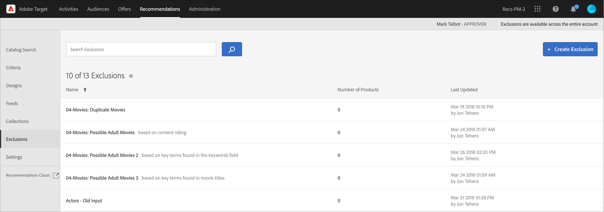

# 除外

[!DNL Adobe Target Recommendations]に除外を作成して、製品またはコンテンツが訪問者に推奨されないようにします。 除外とは、訪問者に推奨すべきではない製品やコンテンツのサブセットのことです。

除外は、アカウント全体で使用できます。 [!UICONTROL Recommendations] アクティビティを作成する際に、エクスペリエンスごとに特定のコレクションを指定するコレクションとは異なり、除外はアカウントのすべてのアクティビティに適用されます。 アクティビティの作成中に除外グループを割り当てるオプションはありません。

除外の使用例には、次のようなものがあります。

* 廃止された製品
* 秋/冬のカタログは、オンラインで存在する必要がある唯一のカタログです。 夏のカタログの商品は購入できなくなりました。
* ほとんどのページ/スクリーンで推奨できない可能性のあるアイテム（アダルト製品、NC-17映画など）
* 不完全なメタデータフィールドを含む製品（サムネール、価格、その他の重要なメタデータが不足している）
* 推奨すべきではない製品（SKUがシステム内に存在し、購入可能な商品ではない、またはQA チームが実際に何かを注文せずに購入をシミュレートするための偽のSKUである可能性など）

>[!IMPORTANT]
>
>除外ルールは、すべての環境にグローバルに適用されます。
>
>静的および動的な除外ルールは、マーケティングに役立つ便利な機能です。 詳細な情報、例、および使用例については、[動的および静的インクルージョンルールの使用](/help/main/c-recommendations/c-algorithms/use-dynamic-and-static-inclusion-rules.md#concept_4CB5C0FA705D4E449BD0B37B3D987F9F)を参照してください。

## 除外の作成

1. **[!UICONTROL Recommendations]** > **[!UICONTROL Exclusions]**&#x200B;をクリックして、既存の除外のリストを表示します。

   

   [!UICONTROL Exclusions] リストビューで各除外について報告された「項目数」は、設定されたデフォルトのRecommendations [&#x200B; ホストグループ &#x200B;](/help/main/administrating-target/hosts.md) （環境）内の、その除外のルールに一致する製品の数です。 デフォルトのホストグループを変更するには、[設定](https://experienceleague.adobe.com/docs/target-dev/developer/recommendations.html?lang=ja){target=_blank}を参照してください。

1. 「**[!UICONTROL 除外を作成]**」をクリックします。

1. （条件付き）除外を作成（または更新）する際に、**[!UICONTROL 環境]** フィルターから環境を選択して、その環境内の除外の内容をプレビューします。 デフォルトでは、デフォルトのホストグループの結果が表示されます。

   

1. 除外&#x200B;**[!UICONTROL 名前]**&#x200B;を入力し、オプションの説明を入力します。

1. ルールビルダーを使用して除外を作成します。

   ルールリストでパラメーターを選択して、オペレーターを選択してから、1 つ以上の値を入力して製品を特定します。 複数の値はコンマで区切ります。

1. 「**[!UICONTROL 保存]**」をクリックします。

## 詳細検索を使用した除外の作成

また、[&#x200B; カタログ検索](/help/main/c-recommendations/c-products/catalog-search.md#save-as) ページ （[!UICONTROL おすすめ] > [!UICONTROL &#x200B; カタログ検索] > [!UICONTROL 高度な検索]）の[!UICONTROL 高度な検索]を使用して除外を作成することもできます。

「ID／次を含む」などを使用した検索を作成したら、[!UICONTROL 名前を付けて保存]／[!UICONTROL 除外]をクリックします。

>[!IMPORTANT]
>
>[!UICONTROL 詳細検索]機能では大文字と小文字が区別されませんが、配信時に返される商品は、大文字と小文字が区別される検索に基づいています。 この違いが混乱を招くこともあります。 詳細検索機能による結果を基にして除外を作成する際は、大文字と小文字の区別を考慮してください。 例えば、最初に「Holiday」と検索すると、「Holiday」または「holiday」を含む結果が返されます。 その後、「holiday」を含む商品を除外することを目的とした除外を作成すると、「holiday」を含む商品のみが除外されます。 「Holiday」を含む商品は除外されません。

## 除外の編集、コピー、削除

リスト内の目的の除外にカーソルを合わせ、編集、コピー、削除の適切なアイコンをクリックします。

除外のアイコンに

既存の除外をコピーして重複した除外を作成し、変更することができます。 これにより、より少ない労力で同様の除外を作成できます。

除外は、アカウント全体で使用できます。 除外を削除する前に、このことを考慮してください。 削除された除外は復元できません。

## トレーニングビデオ：レコメンデーションでコレクションと除外を作成する（7:05） 

このビデオには、次の情報が含まれています。

* コレクションの作成
* 除外の作成

>[!VIDEO](https://video.tv.adobe.com/v/27689)
