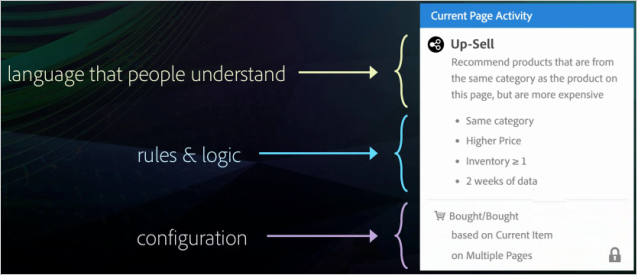

# Recommendations Classicと[!DNL Target] PremiumのRecommendations アクティビティの比較

レコメンデーション Classic と Target Premium のレコメンデーションアクティビティのどちらを使用するかを選択する際に役立つ情報です。

>[!NOTE]
>
>レコメンデーションアクティビティは、[!DNL Target Premium] ソリューションの一部です。 [!DNL Target Premium] ライセンスのない [!DNL Target Standard] では利用できません。

従来の [!DNL Recommendations] 製品では、ページでデータコレクション mbox を作成し、ページの特定の位置に表示 mbox を追加することによってレコメンデーションを表示しました。 [!DNL Recommendations] の [!DNL Target Premium] アクティビティでは、訪問者情報を収集して、製品やコンテンツをレコメンデーションしたい場所に mbox を作成せずに、ページの任意の場所でレコメンデーションを作成できます。 ページのヘッダーで簡単な JavaScript を参照することで、ページの任意の場所でレコメンデーションを有効にできます。 この JavaScript 参照を使用して、[!DNL Target] キーや `entity.id` キーなどのキーをグローバル `entity.categoryId` mbox に渡すことができます。

[!DNL Recommendations Classic] は、[!DNL Experience Cloud] UI で自身のカードとして表示されます。 [!DNL Recommendations] アクティビティは、[!DNL Target Premium] ワークフロー内で有効です。

[!DNL Recommendations Classic] の使用時は、[!DNL Recommendations] mbox を [!DNL Target Recommendations] で引き続き使用することができます。 また、mbox をそのまま保持し、ヘッダーで JavaScript コードを使用して、ページ上の他の要素に対する [!DNL Target] 機能をアクティブにすることにより、Classic と [!DNL Recommendations] の両方のアプローチを組み合わせることもできます。 ただし、 [!DNL Recommendations Classic] のユーザーが [!DNL Target] の機能をフルに活用するためには、古い mbox を削除して、[!DNL Target Recommendations] のみを利用することをお勧めします。

[!DNL Target] の [!DNL Recommendations] アクティビティは、主に次の点で [!DNL Recommendations Classic] より強化されています。

## オファーとしてのレコメンデーション

[!UICONTROL A/B Test] （[!UICONTROL Auto-Allocate]と[!UICONTROL Auto-Target]を含む）および[!UICONTROL Experience Targeting] （XT）アクティビティ内にレコメンデーションを含めることができます。

この機能により、次のようなことがおこなえるようになります。

* 同じアクティビティ内のレコメンデーションと非レコメンデーションのコンテンツをテストおよびターゲット設定します。
* 複数のレコメンデーションの順序など、レコメンデーションのページ配置を簡単に試行します。
* [!UICONTROL Auto-Allocate] を使用して、トラフィックをパフォーマンスの高いレコメンデーションエクスペリエンスに自動的にプッシュします。
* [!UICONTROL Auto-Target]を使用して、プロファイルに基づいて、カスタマイズされたレコメンデーション エクスペリエンスに訪問者を動的に割り当てます。

開始するには、[!UICONTROL Visual Experience Composer]を使用して[!UICONTROL A/B Test]または[!UICONTROL Experience Targeting] アクティビティを作成し、[!UICONTROL Insert Before]、[!UICONTROL Insert After]または[!UICONTROL Replace With] アクションを使用して、エクスペリエンスに推奨事項を追加します。

詳しくは、[オファーとしてのレコメンデーション](/help/main/c-recommendations/recommendations-as-an-offer.md)をご覧ください。

## 条件 {#section_117709846DAA404580EBE879FFCBD9BA}

[!DNL Target Recommendations] には、事前にパッケージ化された一連のルールや設定を含む条件ライブラリが含まれています。 [!DNL Recommendations Classic] では、フォームへの入力や大量のルール一覧からの選択によって、各レコメンデーションを手動で構築していました。 今は、事前に設定された条件セットから選択するだけで、[!DNL Recommendations] アクティビティを作成できるようになっています。 現在もカスタムのレコメンデーションを作成することもできますが、条件ライブラリには、プロセスをシンプルにするために事前に構築され、理解できる言語が使用されているたくさんの一般的な設定が含まれています。 こういった事前にパッケージ化された条件は、そのまま使用することも、特別なニーズに合わせてコピーして編集することもできます。

条件は事前に設定されており、業種、ページタイプ、実装によって分類されています。 例えば、小売業界に適用され、製品ページに使用して、特定のカテゴリ（`entity.categoryID` パラメーターで定義されているもの）の製品を表示するための条件を探すことができます。

作成した条件の使用について詳しくは、[条件](/help/main/c-recommendations/c-algorithms/algorithms.md)を参照してください。

## ワークフロー {#section_76B4A26297BF422382DE2C79A2713D3C}

[!DNL Recommendations] のワークフローはシンプルになりました。 複雑なフォームに入力する代わりに、次のような視覚的なワークフローを実行します。

1. 条件を選択します。
1. 事前設定済みの[ デザイン ](/help/main/c-recommendations/c-design-overview/create-design.md#task_CC5BD28C364742218C1ACAF0D45E0E14)を選択します。
1. レコメンデーションの結果をプレビューします。

## プレビュー表示 {#section_639B9E38C9EC4093BF9023EE0F2A15AC}

レコメンデーションを設定した後、ページ上にレコメンデーションを作成してテストをおこなう必要はありません。そのままプレビューして必要な変更をおこなうことができます。 プレビューは、[!DNL Target] の内部でおこなうことができます。

## ターゲティング {#section_93295EA0DBA14210B8518AF4802A459F}

[!DNL Recommendations Classic] には、6 つのターゲティングオプションがありました。 レコメンデーションアクティビティでは、Target の完全なターゲティングオプションを利用できます。 [!DNL Target] または他の [!DNL Adobe Experience Cloud] オーディエンス（[!DNL Audience Manager] や [!DNL Analytics] など）を使用してオーディエンスを定義し、各デザインを表示するアクティビティ参加者の割合と、コントロールを表示する割合を選択します。

## レポート {#section_25C2FCCE4BC1488496C517C0470B5CD6}

[!DNL Target] の [!DNL Recommendations] では、[!DNL Target] や [!DNL Experience Cloud] の機能を活用する強化されたレポートを利用できます。 [!DNL Recommendations] を使用しない場合と比較した上昇分を単に表示するのではなく、[!DNL Recommendations] アクティビティの完全な情報を表示できます。

