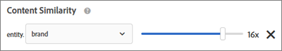

# Recommendations FAQ

[!DNL Adobe Target] [!DNL Recommendations] アクティビティに関するよくある質問（FAQ）のリストです。

## 数値を使用してカスタム属性を検索すると、[!UICONTROL カタログ検索]で正しい結果が表示されないのはなぜですか？

数値を使用してカスタム属性に対してカタログ検索を実行すると、カスタム属性は数値ではなく文字列型とみなされます。

現在、顧客によって属性のタイプを変更できる機能はありません。変更をおこなうには、[顧客のイシューを開く](/help/main/cmp-resources-and-contact-information.md#reference_ACA3391A00EF467B87930A450050077C)、タイプを文字列から数値に変更する必要がある属性を参照します。

## カタログの項目を更新してサイトに反映されるまで、どれくらいかかりますか？

時間枠と結果は、項目の更新方法によって異なります。

| ソース | 詳細 |
| --- | --- |
| mbox または API を使用して更新された項目属性 | <ul><li>Recommendations は 15 分以内に更新されます。</li><li>アップデートが利用可能になるまでは、既存のレコメンデーションと項目属性が表示されます。</li><li>カタログ検索は、カタログインデックス（3～8 時間）の後に更新されます。</li></ul> |
| フィードを使用して更新された項目属性 | <ul><li>レコメンデーションは、フィードの取り込み（2～8 時間）後に更新されます。</li><li>アップデートが利用可能になるまでは、既存のレコメンデーションと項目属性が表示されます。</li><li>カタログ検索は、フィードの取り込み（2〜8 時間）後、および後続のカタログインデックス（3〜8 時間）後に更新されます。 カタログ検索は合計 5～16 時間以内に更新されます。</li></ul> |
| [!DNL Target] UI または API を使用してカタログから削除された項目 | <ul><li>Recommendations は 15 分以内に更新されます。</li><li>アップデートが利用可能になるまでは、既存のレコメンデーションと項目属性が表示されます。</li><li>カタログ検索は、カタログインデックス（3～8 時間）の後に更新されます。</li></ul> |
| mbox または API を使用してカタログに追加された項目 | <ul><li>レコメンデーションはアルゴリズムの実行後に更新されます。 アルゴリズムの実行は、1〜2 日のアルゴリズムでは 12 時間ごとに、7 日以上のアルゴリズムでは 24 時間ごとにスケジュールされます。</li><li>追加された項目がリクエストされたキーでない場合は、アップデートが利用可能になるまで、既存のレコメンデーション表示されます。</li><li>追加された項目がリクエストされたキーの場合は、アップデートが利用可能になるまで、バックアップのレコメンデーションが表示されます。</li><li>カタログ検索は、カタログインデックス（3～8 時間）の後に更新されます。</li></ul> |
| フィードを使用してカタログに追加された項目 | <ul><li>レコメンデーションは、フィードが取り込まれた（2～8 時間）後に更新されます。 後続のアルゴリズムの実行は、1〜2 日のアルゴリズムでは 12 時間ごとに、7 日以上のアルゴリズムでは 24 時間ごとにスケジュールされます。 レコメンデーションは合計 2～32 時間以内に更新されます。</li><li>追加された項目がリクエストされたキーでない場合は、アップデートが利用可能になるまで、既存のレコメンデーション表示されます。</li><li>追加された項目がリクエストされたキーの場合は、アップデートが利用可能になるまで、バックアップのレコメンデーションが表示されます。</li><li>フィードの取り込み（2～8 時間）後、およびカタログインデックス（3～8 時間）後に、カタログ検索が更新されます。 カタログ検索は合計 5～16 時間以内に更新されます。</li></ul> |

フィードファイルをインポートした後、または API や mbox を使用してエンティティのアップデートを受け取った後、以下の変更が 60 分以内に反映されます。

* 以前に除外した項目を現在は含める必要がある場合、その項目は次回のアルゴリズム実行時（12～24 時間）に含められます。

  こうした状況が発生するのは、[!DNL Target] がオンラインとオフラインの両方で除外を適用するからです。 項目を新たに除外すると、オンラインでの除外はすばやく適用されます。 項目を新しく含めると、オンラインでの除外はすぐになくなりますが、オフラインでの除外は次のアルゴリズムが実行されるまでなくなりません。

* 以前に項目が含まれていたが、現在は除外する必要がある場合、その項目は、フィードソースに応じて上記の「項目属性が更新されました...」タイムラインに従って除外されます（mbox または API を使用する場合は 15 分、フィードを使用する場合は 12〜24 時間）。

以下の変更は、次のアルゴリズムの実行が発生するまで反映されません（12 ～ 24 時間以内）。

* アクティビティに使用される収集ルールで使用される項目属性。
* アクティビティに関連付けられた属性またはコレクションに基づいたプロモーションで使用される項目属性。
* トップセラーまたは最も多く閲覧されたアルゴリズムの「現在のカテゴリ」または「お気に入りのカテゴリ」に項目が表示される項目カテゴリ。
* 変更された属性がアルゴリズムのカスタムキーとして使用されるカスタム属性である場合の、推奨項目のランキング。
* レコメンデーションロジックが「類似属性のアイテム」で、「コンテンツの類似性」重み付け係数が使用されている場合、または「属性の重み付け」係数が使用されている場合の、変更された属性に基づいた推奨項目のランキング。

>[!NOTE]
>
>フィードファイルは、そのステータスが「項目の読み込み」から「検索インデックスの更新を準備中」に変更される際に読み込まれるとみなされます。更新がカタログ検索ユーザーインターフェイスに反映されるまで、60 分以上かかることがあります。フィードステータスが「更新完了」に変更されると、カタログ検索は最新の状態になります。カタログ検索がまだ最新でない場合でも、サイトには上記のタイムフレームの更新が反映されます。 最新のカタログ検索インデックスの更新時間は、カタログ検索ページに表示されます。

## [!UICONTROL Recommendations] のアクティビティ、オファー、プロモーションまたは条件の設定変更がサイトに反映されるまで、どのくらい時間がかかりますか？

* プロモーション設定の変更は、オンサイトに反映されるまでに最大 5 時間かかる場合があります。
* 他の条件設定に対する変更は、次のアルゴリズムが実行されるまで反映されない場合があります。

   * 一部の条件設定（「動的インクルージョンルールの追加」など）は、即座に反映されます。
   * その他の条件設定（「動的インクルージョンルールの削除」、ルックバックウィンドウの変更など）は、次のアルゴリズムが実行されるまで組み込むことができません。
   * これらの変更によってアルゴリズムの実行がトリガーされますが、完了するまでに最大 24 時間かかる場合があります。 アルゴリズムも 12〜24 時間ごとにスケジュールどおりに実行されます。

## ユーザーの行動（製品 A をクリックして製品 B を購入するなど）がレコメンデーションに反映されるまでにかかる時間 *その* ユーザーが受け取る？

* 現在閲覧／購入されている製品／コンテンツは、同じページビュー／[!DNL Target] コンテンツリクエストでユーザーが受け取るレコメンデーションに影響を与えます。
* 「最後に閲覧した製品」、「最も多く閲覧された製品」、全体的な閲覧/購入履歴などの過去のユーザー行動は、そのリクエストで更新され、ユーザーが次のページビューで受け取るレコメンデーションに影響します。[!DNL Target] コンテンツリクエスト。 例えば、「最近表示された項目」や「お勧め」アルゴリズムは、製品の表示/購入ごとに更新され、後続のコンテンツリクエストに反映されます。

## ユーザーの行動（製品 A をクリックして製品 B を購入するなど）がレコメンデーションに反映されるまでにかかる時間 *その他* ユーザーが受け取るもの？

集計中のユーザの行動は、12～24 時間ごとに実行されるアルゴリズムごとに、オフラインアルゴリズム処理に組み込まれます。

## 特殊文字によって配列が壊れてしまう場合はどうすればよいですか？  {#section_D27214116EE443638A60887C7D1C534E}

JavaScript のエスケープ値を使用してください。引用符（&quot;）を使用すると、配列が壊れる恐れがあります。エスケープ値を使用したコードスニペットの例を次に示します。

```
#set($String='') 
#set($escaper=$String.class.forName('org.apache.commons.lang.StringEscapeUtils')) 
<script type="text/javascript"> 
console.log("$escaper.escapeJavaScript($entity1.name)") 
console.log("$escaper.escapeJavaScript($entity2.name)") 
console.log('$escaper.escapeJavaScript($entity3.name)') 
names.push("$escaper.escapeJavaScript($entity4.name)") 
</script>
```

## Recommendations アクティビティの作成時に、カスタム条件を含むすべての条件を選択できないのはなぜですか？ {#section_B2265AC8B8A94E0298D495A05C5D817F}

選択できる条件は現在のカテゴリに基づきます。レコメンデーションオファーを作成する際、アルゴリズムピッカーにはカテゴリ ID に基づいた条件が表示されます。

この条件を適用する場所にカテゴリ ID が含まれていない場合、一部の条件がアルゴリズムピッカーに表示されません。

mbox におけるカテゴリ ID の格納場所を使用する場合は、適用可能なすべての条件が条件ピッカーに表示されます。

[!DNL Target] には、 [非互換の条件をフィルター](https://experienceleague.adobe.com/docs/target-dev/developer/recommendations.html){target=_blank} 設定を使用して、アルゴリズムピッカーのインテリジェントフィルタリングを制御します。

>[!NOTE]
>
>この設定は、[!UICONTROL Visual Experience Composer]（VEC）で作成されたアクティビティのみに適用されます。この設定は、フォームベースの Experience Composer で作成されたアクティビティには適用されません（[!DNL Target] には場所のコンテキストがありません）。

[!UICONTROL 非互換の条件をフィルター]設定にアクセスするには、[!UICONTROL Recommendations]／[!UICONTROL 設定]をクリックします。


[!UICONTROL 非互換の条件をフィルター]設定が有効になっていない場合、 [!DNL Target]では、アルゴリズムピッカーに表示されるアルゴリズムのフィルタリングはおこなわれず、すべてのアルゴリズムが表示されます。

「[!UICONTROL 非互換の条件をフィルター]」設定が有効になっている場合、VEC アクティビティでは、 [!DNL Target] が選択した場所から entityId とカテゴリ ID を読み取り、`currentItem|currentCategory` に基づいてアルゴリズムを表示します（それぞれの値が該当の場所に存在している場合）。 そのためデフォルトでは、選択した場所で互換性のあるアルゴリズムのみがアルゴリズムピッカーに表示されます。

[!UICONTROL 非互換の条件をフィルター]設定が有効になっている場合でも、条件の選択時に「[!UICONTROL 互換性あり]」チェックボックスをオフにすると、互換性のないアルゴリズムを表示できます。


[!DNL Target] で「[!UICONTROL 互換性あり]」チェックボックスが表示されない特殊なケースは次のとおりです。

* entityId とカテゴリ ID の両方が場所に存在しており、フィルタリング対象がない。
* [!DNL mbox.js] のバージョン 55 以前を使用している。
* ページで mbox 呼び出しが実行されていない(!config.isAutoCreateGlobalMbox &amp;&amp; !config.isRegionalMbox)。
* [!DNL Target] のパラメーターが定義されていません。

## Recommendations のコレクションがゼロ（0）になった場合はどうすればよいですか？ {#section_E2DB2FE67CF24EEC81412BFF3FA6385D}

以前はゼロではなかったコレクションがゼロになった場合の対処法は次のとおりです。

* コレクションを再保存し、数値が更新されるかどうかを確認します。再保存すると、コレクションは、そのコレクションを使用するすべてのアルゴリズムを再実行します。
* 適切な環境にいるか確認します。確認のため、[!DNL /target/products.html#recsSettings] に移動してください（以下を参照）。

  

* インデックスが最新か確認します。移動： [!DNL /target/products.html#productSearch] また、何時間前にインデックスが作成されたかを確認します（例：「3 時間前にインデックス作成」）。 必要に応じてインデックスを更新できます。
* エンティティがコレクションのルールに一致しなくなる変更をフィードまたはデータレイヤーに加えていないか確認します。大文字と小文字が一致しているかチェックしてください（大文字と小文字は区別されます）。
* フィードが適切に実行されているか確認します。FTP ディレクトリ、パスワードなどを変更したユーザーはいますか？
* [!DNL Target] は、（顧客のページやアプリで）配信の更新をできるだけ早くおこなうようにします。 一方で、 [!DNL Target] はマーケターの UI に何らかの表示をする必要もあります。[!DNL Target] では、UI の更新が同期されるのを待つために、配信の更新を遅延させません。[mboxTrace](/help/main/c-activities/c-troubleshooting-activities/content-trouble.md) を使用すると、リクエスト受信時のシステムの状況を確認できます。

## 一般的な属性の重み付けと、コンテンツの類似性用の属性の重み付けには、どのような違いがありますか？  {#section_FCD96598CBB44B16A4C6C084649928FF}

属性の重み付けには、「標準の属性の重み付け」と「コンテンツの類似性用の属性の重み付け」の 2 種類があります。

「標準の属性の重み付け」は、コンテンツの類似性を含むほぼすべての条件タイプに適用されます。このタイプの重み付けでは、特定の属性値により多くの重みが適用されます。次の例では、出力レコメンデーションで、Nike 製品の重みが大きくなります。


「コンテンツの類似性属性の重み付け」は、コンテンツの類似性条件にのみ適用されます。

このタイプの重み付けは、より動的で、現在の「レコメンデーションキー」（現在表示されている品目）に基づいています。 次の例（ブランド x 16）では、訪問者が Nike スニーカーを表示していた場合、その訪問者は、競合他社のスニーカーよりも、他の Nike 製品（必ずしもスニーカーだけではなく）をレコメンデーションする可能性が高くなります。 Adidas のスニーカーを閲覧していた訪問者には、Adidas の製品がレコメンデーションされる可能性が高くなります。



## [!DNL Target] でレコメンデーションを表示できないことがあるのはなぜですか？ {#section_DB3F40673AED42228E407C05437D99E9}

[!DNL Target] では、利用できるレコメンデーションが少ないことが原因で、レコメンデーションを表示できないことがあります。

条件ごとに生成される値の数は、デザインで指定したエンティティ数の 3 倍になります。ランタイムフィルタリング（在庫、mbox 属性のマッチングなど）が、3 倍の値が生成された後に適用されるので、値の数が提供時に 3 倍未満になることもあります。これを軽減するためには、他のエンティティを非表示にして、デザインのエンティティ数を増やします。

次の JavaScript は、デザインの始めで利用可能で、リクエストされるエンティティの数を増やすことができます。この例では、リクエストされたエンティティの数は 30（3 x 10）になります。

```
#foreach($entity in $entities) 
 #if( $foreach.count > 10 ) 
  #break 
 #end 
 #set ($foo = $entity.id) 
#end 
```

## 商品を挿入／更新する API の呼び出しのサイズ制限は何ですか？フィードではなく API を 1 回呼び出すことで、5 万件の商品の更新をおこなうことは可能ですか？ {#section_434FE1F187B7436AA39B7C14C7895168}

[!DNL Target] にはアプリケーションレベルで 50 MB の投稿制限があります。ただしこれは、`application/x-www-form-urlencoded` コンテンツタイプヘッダーを渡す場合のみです。

1 回の呼び出しで 5 万件の商品の送信を試みることは可能です。失敗した場合には、いくつかのバッチに分けてください。システム負荷によってタイムアウトとなってしまう可能性を減らすため、アドビでは、呼び出しを 5,000 または 10,000 製品バッチに分けることをお勧めします。

## Recommendations の条件、プロモーション、またはテンプレートテストルールを作成する際に、mbox 名を指定する必要はありますか？  {#section_FFA42ABCC5954B48A46526E32A3A88A2}

mbox パラメーターに基づいて Recommendations の条件、プロモーション、またはテンプレートテストルールを作成する際に、`mboxParameter` で `mboxName` の入力が求められなくなりました。mbox 名はオプションになりました。この変更により、複数の mbox のパラメーターを使用することや、まだエッジで記録されていないパラメーターを参照することができます。

目的のパラメーターを選択するには：

* 条件、プロモーション、またはテンプレートのテストルールを作成する際に、リストからパラメーター名を選択します。目的のパラメーター名の最初の文字の入力を開始するか、目的のパラメーター名（フルネーム）を入力します。
* mbox 名は覚えているが、パラメーター名は覚えていないという場合は、チェックボックスを使用して、目的のパラメーターを渡す既知の mbox に関してフィルタリングをおこないます。

いずれの方法でも、mbox とパラメーターの間にリンクはありません。条件、プロモーション、またはテンプレートのテストルールは、そのパラメータを渡すすべての mbox でパラメーターに基づいて機能します。

既存の条件、プロモーション、またはテンプレートテストルールを編集する場合は、作成時に指定された mbox 名と共にフィルタリング条件が表示されます。

## 新しいオーディエンスを定義した後に従来の Recommendations アクティビティを保存できないのはなぜですか？ {#section_1E47C40B1FE7479BAC3EE0F50CE7C2C4}

オーディエンスに一意の名前が付けられていることを確認してください。オーディエンスに既存のオーディエンスと同じ名前を付けた場合、従来の Recommendations アクティビティ（2016 年 10 月より前に作成された Recommendations アクティビティ）を保存することはできません。

## フィードのアップロードに使用する CSV ファイルのサイズ上限を教えてください。 {#section_20F1AF4839A447B9889B246D6E873538}

フィードのアップロードに使用する CSV ファイルの行数とサイズに上限はありません。ただし、ベストプラクティスとして、アドビでは、ファイルのアップロード中にエラーが発生しないよう、CSV ファイルのサイズは 1 GB までに制限することをお勧めします。ファイルサイズが 1 GB を超える場合は、複数のフィードファイルに分割することをお勧めします。カスタム属性列の最大数は 100 で、カスタム属性は 4,096 文字までに制限されています。必要な列の長さに関するその他の制限は、[[!DNL Target]  の制限ページ ](/help/main/r-troubleshooting-target/target-limits.md#reference_BEFE60C3AAA442FF94D4EBFB9D3CC9B1)で確認できます。

## エンティティを動的に除外できますか。 {#exclude}

クエリ文字列で、レコメンデーションから除外したいエンティティのエンティティ ID を渡すことができます。例えば、既に買い物かごにある項目は除外した方がよいでしょう。

除外機能を有効にするには、`excludedIds` mbox パラメーターを使用します。このパラメーターは、コンマ区切りのエンティティ ID のリストを指定します。例： `mboxCreate(..., "excludedIds=1,2,3,4,5")`値は、レコメンデーションのリクエスト時に送信されます。

除外は、現在の [!DNL Target] 呼び出しに対してのみ実行されます。 `excludedIds` 値を再び渡さない限り、以降の [!DNL Target] 呼び出しで項目が除外されることはありません。 すべてのページのレコメンデーションから買い物かご内の項目を除外するには、引き続き各ページで `excludedIds` 値を渡します。

>[!NOTE]
>
>除外されるエンティティが多すぎる場合、レコメンデーションテンプレートを満たすのに十分なエンティティがないかのような動作になります。

`entityIds` を除外するには、オファーコンテンツの URL に `&excludes=${mbox.excludedIds}`トークンを追加します。コンテンツ URL が除外されると、必要なパラメーターが、現在の mbox リクエストパラメーターを使用して代用されます。

デフォルトでは、この機能は新しく作成されたレコメンデーションで有効になります。既存のレコメンデーションで、エンティティの動的な除外をサポートするには、保存する必要があります。

## Recommendations のコンテンツトレースで返される NO_CONTENT 応答は何を意味しますか？

リクエストされたアルゴリズムとキーの組み合わせでレコメンデーションを使用できない場合、NO_CONTENT が返されます。一般的に、この状況は、アルゴリズムでバックアップが無効になっているのに加え、次の 1 つ以上が当てはまる場合に発生します。

* 結果の準備がまだ整っていない。

  この状況は通常、新しく作成したアクティビティを最初に保存するとき、またはアクティビティで使用するコレクション、条件、プロモーションに設定の変更が加えられた後に発生します。

* 結果の準備は整っているが、リクエストされたアルゴリズムとキーの組み合わせに対し、最も近いエッジサーバーではまだキャッシュされていない。

  リクエストがキャッシュ処理を開始するので、この問題は、数ページをリロードした後や、数分後に解決する必要があります。

* 結果の準備は整っているが、指定されたキー値には使用できない。

  この状況は、通常、最新のアルゴリズムの実行にカタログに追加された項目のレコメンデーションをリクエストしたときに発生し、次のアルゴリズムの実行後に解決されます。

* テンプレートの部分レンダリングが無効になっているため、テンプレートに入力するのに十分な結果が得られない。

  この状況は通常、考えられる結果から多くの項目を積極的にフィルタリングする動的なインクルージョンルールがある場合に発生します。状況を回避するには、バックアップを有効にしてインクルージョンルールをバックアップに適用しない、または積極的でないフィルタリング条件を使用して順次条件を使用します。

## 最近閲覧した項目に基づくレコメンデーションは、1 人の訪問者に対して複数のデバイスにわたって保持されますか？ {#persist-across-devices}

訪問者がセッションを開始すると、セッション ID は単一のエッジマシンに関連付けられ、一時的なプロファイルキャッシュがこのエッジマシンに保存されます。 同じセッションからの後続のリクエストでは、最近閲覧された項目を含め、このプロファイルキャッシュを読み取ります。

セッションが終了すると（通常は、アクティビティがない状態が 30 分続いた後に期限切れになると）、最近閲覧された項目を含むセッション状態は、同じ地理的エッジにあるより永続的なプロファイルストレージに保持されます。

新しいセッションが同じ Marketing Cloud ID（MCID）、Experience Cloud ID（ECID）または CustomerID/mbox3rdPartyId を通じて顧客プロファイルにリンクされている限り、異なるデバイスからの後続のセッションは、最近閲覧された項目にアクセスできます。

訪問者が同時に 2 つのアクティブなセッションを持っている場合、デバイスがセッション ID を共有するように強制されない限り、一方のデバイスで最近閲覧された項目によって、もう一方のデバイスで最近閲覧された項目が更新されることはありません。 この問題には潜在的な回避策がありますが、[!DNL Target] では、複数のデバイス間でのセッション ID の共有を直接サポートしていません。 この ID 共有は、顧客自身で管理する必要があります。

この動作は、訪問者があるデバイスでアクティブになった数分後に別のデバイスでアクティブになった場合でも発生します。 最初のデバイスのセッションは 30 分間有効で、プロファイル状態が永続的な状態に書き込まれて処理されるまで、最大 5 分の遅延が発生する可能性があります。 この動作をテストするときは、セッションの有効期限が切れ、プロファイルが保存されるまで 35 分間待ちます。

訪問者が同時に 2 つのアクティブなセッションを持っていない場合、セッションが終了している限り、一方のデバイスで最近閲覧された項目によって、もう一方のデバイスで最近閲覧された項目が更新されます。 この動作をテストするときは、セッションの有効期限が切れるまで 35 分間待ちます。

## [!DNL Recommendations Premium] の [!DNL Adobe Recommendations Classic] で作成したアルゴリズムを使用できますか？

[!DNL Recommendations Classic] で作成されたアルゴリズムは、[!DNL Recommendations Premium] ではサポートされていません。 [!DNL Target Premium] ではレガシーアルゴリズムを使用できますが、[!DNL Target Premium] UI でアクティビティを非アクティブ化または削除する際に、アルゴリズムによって同期の問題が発生する可能性があります。この 2 つのソリューションの違いについて詳しくは、 [[!DNL Recommendations Classic] 対比 [!DNL Recommendations] アクティビティ [!DNL Target Premium]](/help/main/c-recommendations/c-recommendations-faq/recommendations-classic-versus-recommendations-activities-target-premium.md).

## 新しい記事またはビデオのみをレコメンデーションするにはどうすればよいですか？ {#recommend-new-articles}

メディアやパブリッシングの一部の顧客は、レコメンデーションされるアイテムに最新の記事またはビデオのみを含めたいと考えています。 例えば、[!DNL Target] の顧客が次のアプローチを使用して、公開後 60 日未満の記事をレコメンデーションしたとしましょう。

1. 記事の公開日を YYMMDDD 形式でカスタムエンティティ属性として渡す。
1. 今日の日付 — 60 日のプロファイルスクリプトを作成します（YYYYMMDD 形式も使用）。
1. `publish date > today's date minus 60 days` となるように、条件に動的インクルージョンフィルターを使用する。

### 公開日をカスタムエンティティ属性として渡します。

| エンティティ属性 | 例 |
| --- | --- |
| issueDate | 2021218 |
| lastViewDate | 2021701 |
| parentCategory | commentary |
| publishDate | 20210113 |
| publishDateDisplay | 2021 年 1 月 13 日（PT） |

### プロファイルスクリプトの設定：


### インクルージョンルールを設定します。


>[!NOTE]
>
>この例は、パラメーターのマッチングを使用し、`priorDate60` 値を mbox パラメーターとして渡すことで実現することもできます。

### を使用する際の既知の問題 [!DNL Recommendations] アクティビティ？

[!UICONTROL Recommendations] アクティビティの既知の問題は次のとおりです。

* [!DNL Target]が getOffer() で JSON オファーを返すと、Recommendations は JSON のタイプで返します。ただし、JSON Recommendations デザインを返すと、Recommendation は HTML のタイプを返します。
* フィードまたは API を介して更新されなくなってから 60 日が経過すると、期限切れのエンティティの有効期限が正確に切れます。ただし、有効期限が切れた後も、期限切れのエンティティはカタログ検索インデックスから削除されません。フィードまたは API を介して削除されたエンティティも、現在はカタログ検索インデックスから削除されていません。（IRI-857）
* A/B およびエクスペリエンスのターゲット設定アクティビティの Recommendations オファーに、Recommendations トレイのプレビューが表示されない（TGT-33426）
* API を使用して作成されたコレクション、除外、条件、デザインは、Target ユーザーインターフェイスには表示されず、API でのみ編集できます。同様に、Target UI でこれらの項目のいずれかを作成し、後で API を使用して編集すると、その変更は Target UI に反映されません。API で編集した項目は、変更が失われるのを防ぐため、引き続き API を使用して編集する必要があります。（TGT-35777）
* API で作成された Recommendations アクティビティはユーザーインターフェイスで確認できますが、API からのみ編集できます。
* 条件リスト（カード）表示に表示されるカスタム条件フィードのステータスは、10 分ごとに更新され、まれに 10 分より古いものが表示される場合があります。カスタム条件の編集ビューに表示されるステータスはリアルタイムで取得され、常に最新の状態になります。（TGT-35896、TGT-36173）
