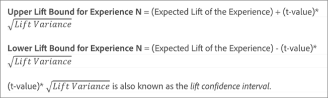
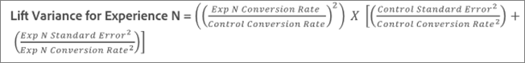
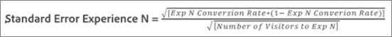
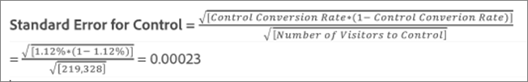
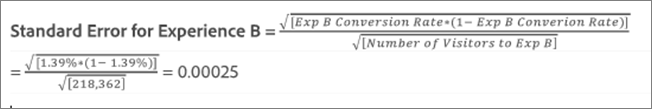
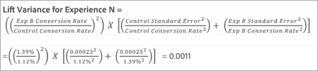
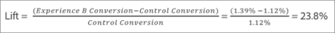
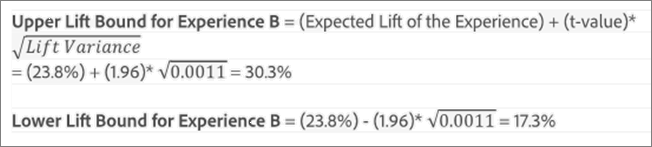

# 平均上昇率、上昇率範囲および信頼区間

レポートには、より正確に勝者を決定するのに役立つ、[!DNL Adobe Target] アクティビティに関連付けられている上昇制限と信頼性レベルを理解するのに役立つ、いくつかのデータポイントと視覚化レベルが含まれています。

>[!NOTE]
>
>この機能は、[!UICONTROL  テーブル ] ビューでレポートを表示する場合にのみ使用できます。 この機能は、Analytics をレポートソースに使用する（A4T）[アクティビティでは利用できません。](/help/main/c-integrating-target-with-mac/a4t/a4t.md#concept_7540C8C04259434AB6EE33B09F47A1DE)。

## データの解釈 {#section_62C0D7E76F3D49A7B3C371C82AEF27D5}

次の図は、[!UICONTROL 上昇率の境界と信頼性レベル ]情報を示しています。

[!DNL Target] レポート UIの上昇率と信頼性に関する情報には、次のものが含まれます。

### 上昇率

数値の大きさと矢印が上昇率の推定値を表しています。 この数値は上昇率の範囲の中間値です。 推定上昇率の矢印は、信頼度が 95％に達するまでは灰色で表示されます。 このしきい値を超えると、矢印の色は赤（マイナス）または緑（プラス）になります。

### リフトの境界

上昇率の 95％信頼区間を表します。 平均上昇率の下に範囲として表示されます。 これらの上昇率の境界の計算方法の例については、以下の[計算の例](#example)を参照してください。

### Boxplot グラフ

[!DNL Target] インターフェイスのboxplot グラフは、問題の成功指標の期待値と95%の信頼区間を表します。 上昇率と上昇率範囲の情報を視覚的に表したものと言えます。

信頼情報の解釈に役立つ重要な方法がいくつかあります。1つは色です。 [!DNL Target]このグラフでは、特定のエクスペリエンスの信頼区間とコントロールの信頼区間の重複が灰色で表示されます。特定のエクスペリエンスの信頼区間の範囲は、コントロールの信頼区間より高い部分は緑、低い部分は赤で表示されます。

箱ひげのバーの長さを見れば、信頼区間の大きさがすぐにわかります。 アクティビティのデータが蓄積されていくと、バーが変化していきます。 信頼区間は平方偏差とサンプルサイズ（訪問者数）から求められます。 平方偏差が小さくサンプルサイズが大きいほど、信頼区間は狭くなります。

### 信頼

表示されるエクスペリエンスまたはオファーの信頼度は、実際に観察された結果よりも&#x200B;_極端でない_&#x200B;結果を得る確率（パーセントで表される）です。_帰無仮説が真である場合_、つまり、そのエクスペリエンスまたはオファーとコントロールのエクスペリエンス/オファーのコンバージョン率に差がない場合。 p値に関しては、表示されるこの信頼性は`1 - p-value`です。 簡単に言えば、信頼性が高いほど、データが、コントロールと非コントロールのオファー/エクスペリエンスが等しいコンバージョン率を持つという仮定との一貫性が低いことを示しています。

## 上昇率の信頼区間の決定方法を理解します {#pdf}

詳しくは、[Lift pdf ファイルの信頼区間](/help/main/assets/confidence_interval_lift.pdf)をダウンロードしてください。

## リフトの境界はどのように計算されますか？ {#section_1D360781D972483693680BE0F07AEAD1}

上昇率範囲は、コントロールエクスペリエンスまたはオファーに対する、特定のエクスペリエンスまたはオファーの上昇率の 95％信頼区間を表します。 簡単に言えば、実際の上昇率は 95％の確率でこの範囲内に収まるという意味になります。

上昇率範囲の計算式は次のとおりです。

上昇率範囲の数値の算出には、他にもいくつかの要素が考慮されます。

* **t値：** 95%の信頼度に対するクリティカル統計は1.96です。 [t値について詳しくは、こちらを参照してください](https://en.wikipedia.org/wiki/T-statistic)。
* **上昇率の平方偏差：**&#x200B;上昇率の平方偏差を求めるためには、エクスペリエンス N の成功指標の標準誤差と、コントロールエクスペリエンスの成功指標の標準誤差が必要です。計算式は次のとおりです（成功指標をコンバージョンとした場合の例です）。

  

* **コンバージョン率／成功指標の標準誤差：**&#x200B;標準誤差の算出方法は、次のように、エクスペリエンス N とコントロールで同じです（成功指標をコンバージョンとした場合の例です）。 詳しくは、[標準誤差の詳細](https://en.wikipedia.org/wiki/Standard_error)を参照してください。

  

  >[!NOTE]
  >
  >売上高成功指標アクティビティの標準エラーは、売上高のサンプル分散に基づいています。

## 計算例 {#example}

2 つのエクスペリエンスで構成されるアクティビティがあり、次のような結果が出たとします。

| エクスペリエンス | 訪問者数 | コンバージョン | コンバージョン率 |
|--- |--- |--- |--- |
| エクスペリエンス A（コントロール） | 219、328 | 2,466 | 1.12％ |
| エクスペリエンス B | 218、362 | 3,040 | 1.39％ |

アドビの計算式を使用し、これらの情報から上昇率範囲を求めることができます。

**エクスペリエンス A の標準誤差（コントロール）**

**エクスペリエンス B の標準誤差**

**エクスペリエンス B の上昇率の平方偏差**

**エクスペリエンス B の上昇率範囲**

エクスペリエンス B の推定上昇率は次のとおりです。

以上の計算から、エクスペリエンス B の上昇率範囲は次のようになります。

>[!NOTE]
>
>上記の数式とレポートに表示される数値を使用して、手動の計算の差異を最小にします。 この差の原因は、手動計算で使用されるページビュー数が丸められていることにあります。 [!DNL Target] レポートに表示される上昇率は、合計エンゲージメント数とエンゲージメント数から取得した正確な数値に基づいています。 エンゲージメントの数値は、パフォーマンスレポート API を介して取得できます。

## リフトの境界が表示されないのはいつですか？ {#section_C5622E1E94684DAD937249B51A9E42CC}

場合によっては、[!DNL Target]は上昇率の境界を表示しません：

* アクティビティの訪問数または訪問者数が 30 に達していない。
* [!UICONTROL 自動割り当て] アクティビティの場合、1つのエクスペリエンスが60%の信頼性に達するまで、上昇率の境界は表示されません。
