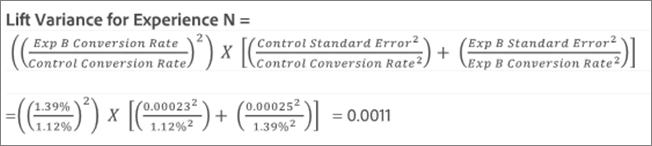
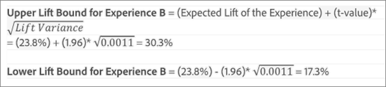

# 平均上昇率、上昇率範囲および信頼区間

レポートには、 [!DNL Adobe Target] アクティビティを参照して、勝者をより正確に決定するのに役立ちます。

>[!NOTE]
>
>この機能は、 [!UICONTROL テーブル] 表示。 この機能は、Analytics をレポートソースに使用する（A4T）[アクティビティでは利用できません。](/help/main/c-integrating-target-with-mac/a4t/a4t.md#concept_7540C8C04259434AB6EE33B09F47A1DE)。

## データの解釈 {#section_62C0D7E76F3D49A7B3C371C82AEF27D5}

次の図にを示します。 [!UICONTROL 上昇率範囲と信頼水準] 情報：

上昇率および信頼性情報 [!DNL Target] レポート UI には以下が含まれます。

### 上昇率

数値の大きさと矢印が上昇率の推定値を表しています。この数値は上昇率の範囲の中間値です。推定上昇率の矢印は、信頼度が 95％に達するまでは灰色で表示されます。このしきい値を超えると、矢印の色は赤（マイナス）または緑（プラス）になります。

### 上昇率範囲

上昇率の 95％信頼区間を表します。平均上昇率の下に範囲として表示されます。詳しくは、 [計算の例](#example) 以下に、これらの上昇率範囲の計算方法の例を示します。

### 箱ひげ図

の箱ひげグラフ [!DNL Target] インターフェイスは、対象の成功指標の期待値と 95%信頼区間を表します。 上昇率と上昇率範囲の情報を視覚的に表したものと言えます。

主な方法はいくつかあります [!DNL Target] は、信頼性情報を解釈するのに役立ちます。その 1 つが色です。 このグラフでは、特定のエクスペリエンスの信頼区間とコントロールの信頼区間の重複が灰色で表示されます。特定のエクスペリエンスの信頼区間の範囲は、コントロールの信頼区間より高い部分は緑、低い部分は赤で表示されます。

箱ひげのバーの長さを見れば、信頼区間の大きさがすぐにわかります。アクティビティのデータが蓄積されていくと、バーが変化していきます。信頼区間は平方偏差とサンプルサイズ（訪問者数）から求められます。平方偏差が小さくサンプルサイズが大きいほど、信頼区間は狭くなります。

### 信頼性

表示されるエクスペリエンスまたはオファーの信頼性は、結果を得る確率（パーセンテージで表されます）です _極端でない_ 実際に観察されるものよりも _null 仮説が true の場合_&#x200B;例えば、そのエクスペリエンスまたはオファーと、コントロールのエクスペリエンス/オファーとの間にコンバージョン率に違いがない場合です。 p 値に関して、この信頼性は次のように表示されます。 `1 - p-value`. 簡単に言うと、信頼性が高いというのは、コントロールと非コントロールのオファー/エクスペリエンスが同じコンバージョン率を持つという前提とデータが一致していないことを示します。

## 上昇率の信頼区間の決定方法を理解します {#pdf}

をダウンロードします。 [上昇率 pdf ファイルの信頼区間](/help/main/assets/confidence_interval_lift.pdf) を参照してください。

## 上昇率範囲はどのように計算されますか？ {#section_1D360781D972483693680BE0F07AEAD1}

上昇率範囲は、コントロールエクスペリエンスまたはオファーに対する、特定のエクスペリエンスまたはオファーの上昇率の 95％信頼区間を表します。簡単に言えば、実際の上昇率は 95％の確率でこの範囲内に収まるという意味になります。

上昇率範囲の計算式は次のとおりです。

上昇率範囲の数値の算出には、他にもいくつかの要素が考慮されます。

* **t- value:** 当社95%信頼水準の重要な統計は1.96です。 [t- values](https://en.wikipedia.org/wiki/T-statistic)の詳細については、を参照してください。
* **上昇率の平方偏差：**&#x200B;上昇率の平方偏差を求めるためには、エクスペリエンス N の成功指標の標準誤差と、コントロールエクスペリエンスの成功指標の標準誤差が必要です。計算式は次のとおりです（成功指標をコンバージョンとした場合の例です）。

   

* **コンバージョン率／成功指標の標準誤差：**&#x200B;標準誤差の算出方法は、次のように、エクスペリエンス N とコントロールで同じです（成功指標をコンバージョンとした場合の例です）。詳しくは、[標準誤差の詳細](https://en.wikipedia.org/wiki/Standard_error)を参照してください。

   

   >[!NOTE]
   >
   >売上高成功指標アクティビティの標準エラーは、売上高のサンプル分散に基づいています。

## 計算の例 {#example}

2 つのエクスペリエンスで構成されるアクティビティがあり、次のような結果が出たとします。

| エクスペリエンス | 訪問者数 | コンバージョン | コンバージョン率 |
|--- |--- |--- |--- |
| エクスペリエンス A（コントロール） | 219、328 | 2,466 | 1.12％ |
| エクスペリエンス B | 218、362 | 3,040 | 1.39％ |

アドビの計算式を使用し、これらの情報から上昇率範囲を求めることができます。

**エクスペリエンス A の標準誤差（コントロール）**

**エクスペリエンス B の標準誤差**

**エクスペリエンス B の上昇率の平方偏差**

**エクスペリエンス B の上昇率範囲**

エクスペリエンス B の推定上昇率は次のとおりです。

以上の計算から、エクスペリエンス B の上昇率範囲は次のようになります。

>[!NOTE]
>
>上記の数式とレポートに表示される数値を使用して、手動の計算の差異を最小にします。この差の原因は、手動計算で使用されるページビュー数が丸められていることにあります。上昇率が [!DNL Target] レポートは、合計エンゲージメント数とエンゲージメント数から得られた正確な数に基づいています。 エンゲージメントの数値は、パフォーマンスレポート API を介して取得できます。

## 上昇率範囲が表示されないのはいつですか？ {#section_C5622E1E94684DAD937249B51A9E42CC}

場合によっては、 [!DNL Target] 上昇率範囲を表示しません：

* アクティビティの訪問数または訪問者数が 30 に達していない。
* の場合 [!UICONTROL 自動配分] アクティビティの場合、1 つのエクスペリエンスが 60%の信頼性に達するまで、上昇率範囲は表示されません。
